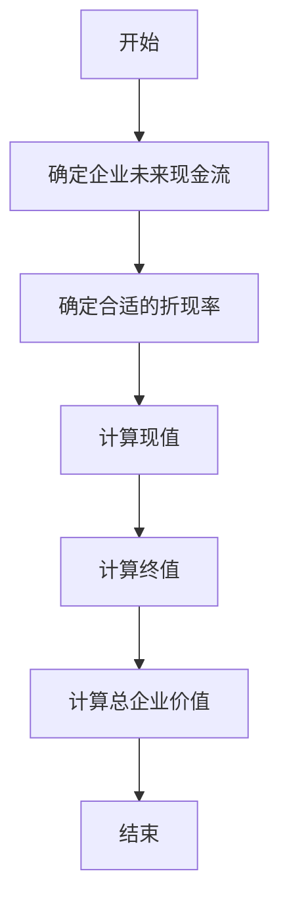
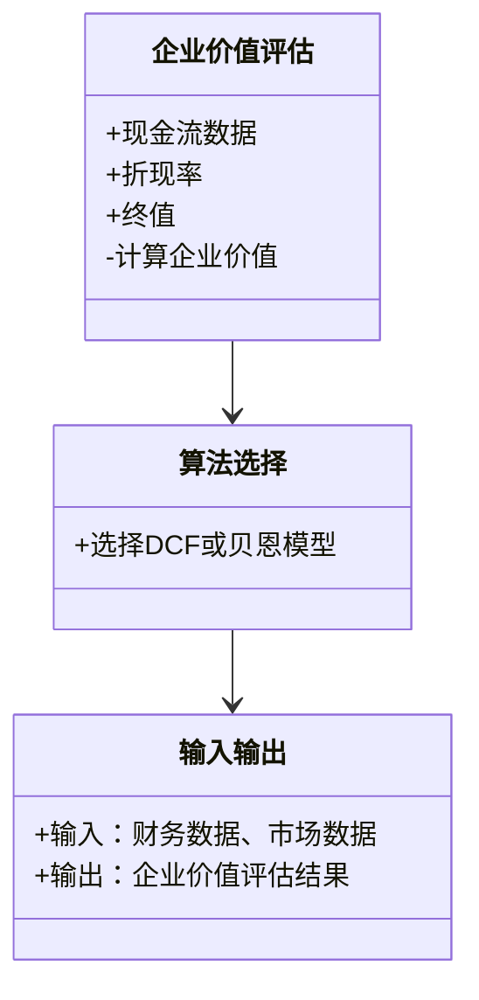
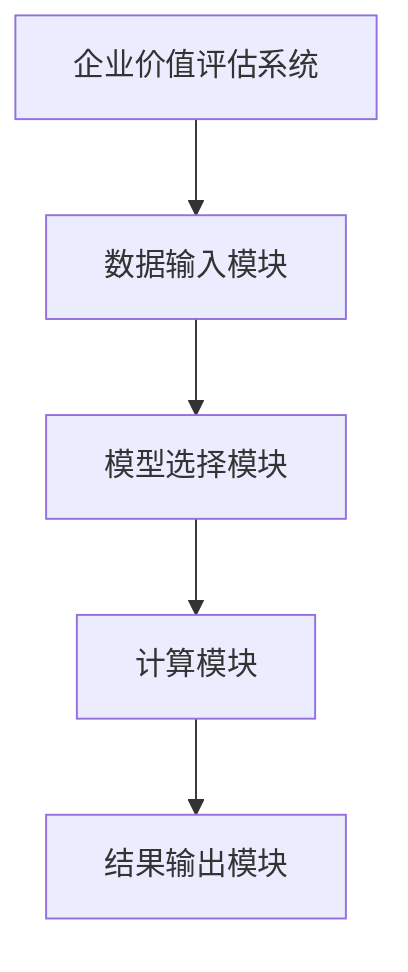
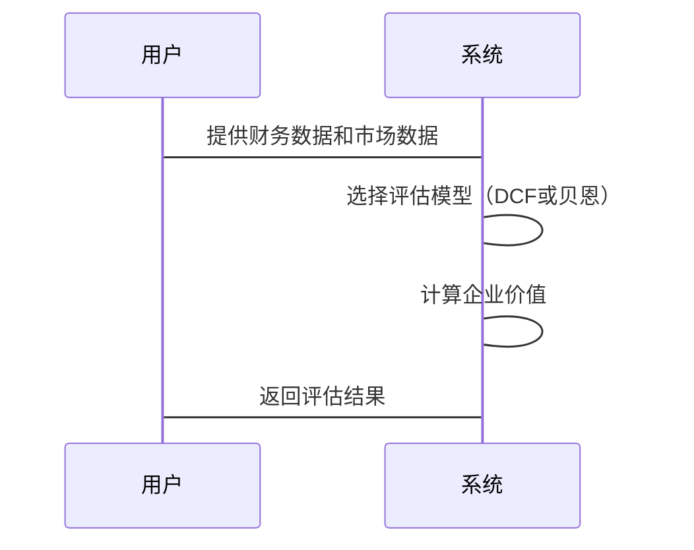

                 


---

# 威廉·贝恩的企业价值提升策略

## 关键词：企业价值，贝恩模型，DCF模型，价值投资，企业评估

## 摘要：威廉·贝恩是全球著名的价值投资者，他的企业价值提升策略基于长期投资和安全边际原则。本文详细分析了贝恩的价值投资理念、企业价值评估模型以及实际应用案例，帮助读者掌握如何通过贝恩的方法提升企业价值。

---

# 引言

在现代商业社会中，企业价值的提升是每个企业家和投资者关注的核心问题。威廉·贝恩作为全球著名的价值投资者，以其独特的投资理念和企业价值评估方法闻名。本文将深入探讨贝恩的企业价值提升策略，结合理论与实践，为读者提供清晰的指导。

---

# 第1章：企业价值的基本概念

## 1.1 企业价值的定义与重要性

### 1.1.1 企业价值的定义

企业价值（Enterprise Value）是指公司整体的经济价值，包括股东权益、债权和少数股东权益等。它反映了企业的整体实力和市场地位。

$$
\text{企业价值} = \text{股权价值} + \text{债务价值} + \text{少数股东权益}
$$

### 1.1.2 企业价值的重要性

企业价值是衡量企业经营状况和投资价值的重要指标，直接影响企业的融资能力、并购活动和股东回报。

### 1.1.3 企业价值的核心要素

企业价值的核心要素包括盈利能力、成长潜力、竞争优势和财务健康状况。

## 1.2 企业价值的衡量标准

### 1.2.1 财务指标分析

常用财务指标包括市盈率（P/E）、市净率（P/B）和股息率等。

### 1.2.2 市场价值评估

市场价值是企业在市场上的公允价值，反映了投资者对企业未来表现的预期。

### 1.2.3 企业价值与股东价值的关系

企业价值是股东价值的基础，股东价值是企业价值的一部分。

## 1.3 企业价值提升的背景与趋势

### 1.3.1 经济环境对企业价值的影响

经济周期、通货膨胀和利率变化都会影响企业价值。

### 1.3.2 技术对企业价值提升的作用

技术创新可以提高企业效率和产品竞争力，从而提升企业价值。

### 1.3.3 企业价值提升的全球趋势

全球化和数字化转型推动了企业价值的提升。

---

# 第2章：威廉·贝恩的价值投资策略

## 2.1 贝恩的投资哲学

### 2.1.1 长期投资与价值发现

贝恩强调长期投资，寻找被市场低估的企业。

### 2.1.2 股东-operator 分析

贝恩分析企业的管理者和股东之间的关系，确保管理层与股东利益一致。

### 2.1.3 安全边际的概念

贝恩强调在投资时留有安全边际，降低投资风险。

## 2.2 贝恩的企业价值评估框架

### 2.2.1 贝恩的企业价值三要素

贝恩认为企业价值由盈利能力、成长潜力和竞争优势决定。

### 2.2.2 贝恩的企业价值评估模型

贝恩模型基于企业的息税前利润和贝恩因子进行估值。

$$
\text{企业价值} = \text{息税前利润} \times \text{贝恩因子}
$$

### 2.2.3 贝恩模型与传统估值方法的对比

贝恩模型更注重企业的基本面和长期潜力。

## 2.3 贝恩的价值投资策略

### 2.3.1 买入并持有策略

贝恩建议长期持有优质企业，避免短期市场波动的影响。

### 2.3.2 优质企业的识别标准

贝恩寻找具有强大竞争优势、稳定盈利和优秀管理团队的企业。

### 2.3.3 贝恩投资策略的优缺点

贝恩策略的优点是风险低、回报稳定；缺点是需要较长的投资周期。

## 2.4 本章小结

---

# 第3章：企业价值评估的数学模型

## 3.1 现金流折现模型（DCF）

### 3.1.1 DCF模型的基本原理

DCF模型通过折现未来现金流来估算企业价值。

### 3.1.2 DCF模型的公式推导

$$
\text{企业价值} = \sum_{t=1}^{n} \frac{CF_t}{(1 + r)^t} + \frac{TV}{(1 + r)^n}
$$

### 3.1.3 DCF模型的步骤



## 3.2 贝恩模型的数学公式

### 3.2.1 贝恩模型的基本公式

$$
\text{企业价值} = \text{息税前利润} \times \text{贝恩因子}
$$

### 3.2.2 贝恩因子的计算方法

贝恩因子基于企业的行业地位、竞争优势和成长潜力。

## 3.3 企业价值评估的算法实现

### 3.3.1 环境安装与工具准备

安装Python和必要的库（如numpy、pandas）。

### 3.3.2 核心代码实现

```python
import numpy as np

def calculate_dcf(cash_flows, discount_rate, terminal_value):
    present_value = 0
    for t, cf in enumerate(cash_flows):
        present_value += cf / (1 + discount_rate) ** t
    total_value = present_value + terminal_value / (1 + discount_rate) ** len(cash_flows)
    return total_value

# 示例数据
cash_flows = [100, 150, 200]
discount_rate = 0.1
terminal_value = 500

value = calculate_dcf(cash_flows, discount_rate, terminal_value)
print(f"企业价值为: {value}")
```

## 3.4 本章小结

---

# 第4章：企业价值评估的系统分析

## 4.1 问题场景介绍

企业价值评估需要考虑多方面的因素，包括财务数据、市场环境和行业竞争。

## 4.2 系统功能设计

### 4.2.1 领域模型设计



## 4.3 系统架构设计

### 4.3.1 系统架构图



## 4.4 系统接口设计

### 4.4.1 输入接口

接收企业的财务数据和市场数据。

### 4.4.2 输出接口

输出企业价值评估结果。

## 4.5 系统交互设计



## 4.6 本章小结

---

# 第5章：项目实战

## 5.1 环境安装与工具准备

安装Python和必要的库。

## 5.2 核心代码实现

```python
import numpy as np

def calculate_bain_value(EBIT, bain_factor):
    return EBIT * bain_factor

# 示例数据
EBIT = 100
bain_factor = 2.5

value = calculate_bain_value(EBIT, bain_factor)
print(f"企业价值为: {value}")
```

## 5.3 代码应用解读与分析

解释代码实现的逻辑和应用场景。

## 5.4 实际案例分析

以具体企业为例，应用贝恩模型进行价值评估。

## 5.5 本章小结

---

# 结论与展望

## 6.1 总结

本文详细介绍了威廉·贝恩的企业价值提升策略，结合理论与实践，帮助读者掌握如何应用这些策略。

## 6.2 最佳实践 tips

- 理解企业的基本面和长期潜力。
- 合理选择评估模型和工具。
- 定期更新和优化评估方法。

## 6.3 未来展望

随着技术的发展，企业价值评估将更加智能化和精准化。

---

# 作者：AI天才研究院 & 禅与计算机程序设计艺术

---

这篇文章详细阐述了威廉·贝恩的企业价值提升策略，结合理论分析和实际案例，为读者提供了全面的指导。

