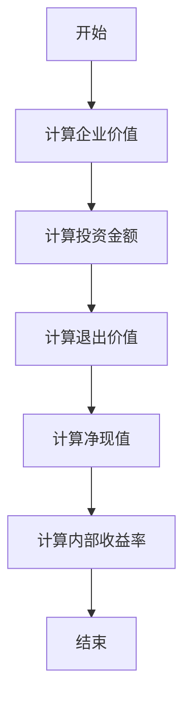
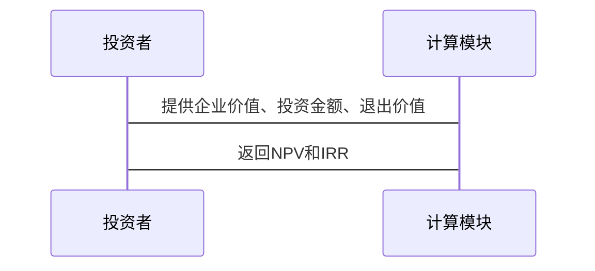

                 


# 《威廉·贝恩的私募股权价值创造模型》

## 关键词：威廉·贝恩、私募股权、价值创造模型、算法原理、系统架构设计、项目实战案例、投资分析

## 摘要：  
本文深入探讨威廉·贝恩提出的私募股权价值创造模型，从背景介绍、核心概念到算法原理、系统架构设计，再到项目实战案例，全面解析该模型的理论基础与实际应用。通过详细分析，揭示模型如何帮助投资者实现价值最大化，并通过具体案例展示其在实际投资中的应用效果。

---

## 第1章: 私募股权与威廉·贝恩模型的背景

### 1.1 私募股权的基本概念  
私募股权（Private Equity，简称PE）是指通过非公开市场投资于未上市公司或上市公司非公开部分的股权，以获取长期资本增值的一种投资方式。其核心目标是通过优化企业管理和战略，实现企业价值的最大化。  

#### 1.1.1 私募股权的定义与特点  
- **定义**：私募股权是一种通过杠杆收购、管理层收购等方式，对未上市公司进行投资，并在一定期限内通过上市、出售等方式退出，以获取资本增值的投资活动。  
- **特点**：  
  - 投资周期长，通常为3-7年。  
  - 风险高，但潜在回报也高。  
  - 投资策略多样，包括成长型投资、重组型投资等。  

#### 1.1.2 私募股权的运作模式  
私募股权的运作模式通常包括以下几个阶段：  
1. **目标筛选**：寻找具有高增长潜力的企业。  
2. **尽职调查**：评估企业的财务状况、管理团队和市场前景。  
3. **投资决策**：决定投资金额和方式。  
4. **价值创造**：通过改善企业运营、重组资产等方式提升企业价值。  
5. **退出策略**：通过IPO、并购等方式退出，实现资本增值。  

#### 1.1.3 威廉·贝恩与私募股权的关联  
威廉·贝恩（William Bain）是全球知名的私募股权专家，其提出的模型为私募股权的价值创造提供了理论基础。贝恩模型的核心在于通过系统的分析和优化，最大化企业的内在价值，从而实现投资收益的最大化。

### 1.2 威廉·贝恩模型的起源  
威廉·贝恩模型是私募股权领域的重要理论之一，其核心思想是通过对企业价值的深入分析，制定最优的投资策略。  

#### 1.2.1 模型提出的历史背景  
私募股权在20世纪80年代开始快速发展，但当时缺乏系统化的价值评估方法。威廉·贝恩的模型应运而生，为私募股权投资者提供了一套科学的价值评估和创造的方法。

#### 1.2.2 模型的核心思想与目标  
- **核心思想**：通过分析企业的核心竞争力、市场地位和财务状况，优化企业的运营和管理，从而提升企业价值。  
- **目标**：实现投资收益的最大化，同时降低投资风险。

#### 1.2.3 模型在私募股权中的应用现状  
贝恩模型已被广泛应用于私募股权的估值、投资决策和价值创造过程中。其方法论为投资者提供了系统的分析框架，帮助他们在复杂的市场环境中做出更明智的投资决策。

---

## 第2章: 威廉·贝恩价值创造模型的核心概念

### 2.1 模型的基本原理  
威廉·贝恩模型基于现代企业价值评估理论，结合私募股权的特殊性，提出了独特的价值创造方法。

#### 2.1.1 模型的理论基础  
- **企业价值公式**：企业价值 = 净资产价值 + 未来现金流的现值。  
- **核心假设**：企业的价值取决于其未来现金流的创造能力和折现率。

#### 2.1.2 模型的核心要素  
- **企业价值**：企业的整体价值，包括股权和债务。  
- **投资金额**：投资者投入的资金。  
- **退出价值**：企业在退出时的估值，通常是通过IPO或并购实现。  

#### 2.1.3 模型的数学表达式  
企业价值可以通过以下公式计算：  
$$ V = \sum_{i=1}^{n} \frac{CF_i}{(1 + r)^i} $$  
其中，$CF_i$ 是第i年的现金流，$r$ 是折现率。

### 2.2 核心概念与联系  
通过ER实体关系图，可以清晰地看到模型中各要素之间的关系。

```mermaid
erDiagram
    actor 投资者 {
        <string> 投资金额
    }
    actor 企业 {
        <string> 企业价值
    }
    actor 退出方 {
        <string> 退出价值
    }
    投资者 --> 企业: 投资
    企业 --> 退出方: 退出
```

---

## 第3章: 模型的算法原理

### 3.1 模型的算法流程  
威廉·贝恩模型的算法流程可以通过以下步骤实现：



### 3.2 算法的数学模型  
- **净现值（NPV）**：  
$$ NPV = \sum_{t=0}^{n} \frac{CF_t}{(1 + r)^t} $$  
- **内部收益率（IRR）**：  
$$ IRR = r \text{ 使得 } NPV = 0 $$  

通过这两个指标，可以评估投资项目的可行性和收益潜力。

---

## 第4章: 模型的系统分析与架构设计

### 4.1 系统功能设计  
为了实现威廉·贝恩模型的系统化应用，需要设计一个完整的系统架构。

#### 4.1.1 系统功能模块划分  
- **输入模块**：接收企业价值、投资金额、退出价值等输入数据。  
- **计算模块**：计算NPV和IRR。  
- **输出模块**：展示计算结果和投资建议。  

#### 4.1.2 系统功能流程图  


### 4.2 系统架构设计  
- **系统架构图**：展示了系统的整体架构，包括输入、计算和输出模块。  


### 4.3 系统接口设计  
- **输入接口**：投资者提供企业价值、投资金额、退出价值。  
- **输出接口**：系统返回NPV和IRR。  

---

## 第5章: 项目实战案例

### 5.1 案例背景介绍  
假设某私募股权基金计划投资一家中型企业，目标是在5年内通过优化管理和资产重组，实现企业价值的提升。

### 5.2 代码实现  
以下是一个简单的Python代码示例，用于计算NPV和IRR：  

```python
def calculate_npv(cash_flows, discount_rate):
    npv = sum(cf / (1 + discount_rate) ** t for t, cf in enumerate(cash_flows))
    return npv

def calculate_irr(cash_flows):
    import numpy as np
    return np.irr(cash_flows)

# 示例数据
cash_flows = [-1000, 300, 400, 500, 600]
discount_rate = 0.1

npv = calculate_npv(cash_flows, discount_rate)
irr = calculate_irr(cash_flows)

print(f"NPV: {npv}")
print(f"IRR: {irr}")
```

### 5.3 案例分析  
通过上述代码，可以计算出投资项目的NPV和IRR。如果NPV为正且IRR高于市场利率，说明该项目具有较高的投资价值。

---

## 第6章: 总结与展望

### 6.1 最佳实践  
- 在进行私募股权投资时，建议投资者结合威廉·贝恩模型和其他分析工具，进行全面的评估和优化。  
- 定期监控企业的财务状况和市场环境，及时调整投资策略。

### 6.2 小结  
威廉·贝恩模型为私募股权的价值创造提供了科学的理论和方法。通过系统的分析和优化，投资者可以更好地实现资本增值。

### 6.3 未来展望  
随着人工智能和大数据技术的发展，威廉·贝恩模型将进一步优化和扩展，为私募股权投资者提供更精准的分析工具。

---

## 作者：AI天才研究院/AI Genius Institute & 禅与计算机程序设计艺术 /Zen And The Art of Computer Programming

