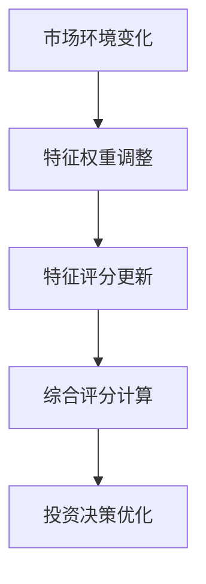

                 


# 威廉欧奈尔的市场领导者特征

> 关键词：威廉欧奈尔，市场领导者，投资特征，市场分析，技术分析，投资策略

> 摘要：威廉欧奈尔的市场领导者特征是投资分析中的经典理论，本文将从其核心概念、数学模型、系统架构、项目实战等多角度进行深度分析，揭示其在现代投资分析中的应用价值。

---

## 第一部分: 威廉·欧奈尔的市场领导者特征概述

### 第1章: 威廉·欧奈尔与市场领导者特征概述

#### 1.1 威廉·欧奈尔的背景与投资理念
威廉·欧奈尔（William O'Neil）是美国著名投资者和投资分析师，他以提出“市场领导者”概念而闻名。欧奈尔的投资理念强调通过分析市场的主导力量来预测和把握投资机会。他的核心思想是：市场领导者是那些能够持续在行业中占据主导地位，并且能够通过自身的竞争优势带动市场增长的企业。

#### 1.2 市场领导者特征的基本概念
市场领导者特征是指那些能够代表市场趋势、具有强大竞争优势、能够在市场中占据主导地位的企业或行业的特征。这些特征包括行业地位、财务表现、管理团队、技术创新等方面。

#### 1.3 市场领导者特征的核心思想
欧奈尔的核心思想是，市场领导者特征不仅能够帮助投资者识别出具有潜力的投资标的，还能帮助投资者在市场波动中找到稳定的投资方向。

---

### 第2章: 市场领导者特征的理论框架

#### 2.1 市场领导者特征的核心要素
市场领导者特征的核心要素包括以下几点：
1. **行业地位**：企业在行业中的市场份额和影响力。
2. **财务表现**：企业的盈利能力、资产负债情况、现金流等。
3. **管理团队**：管理团队的经验、能力和稳定性。
4. **技术创新**：企业在技术上的创新能力和竞争优势。

#### 2.2 市场领导者特征的属性特征对比
通过对比不同特征的属性，可以更清晰地理解市场领导者特征的核心要素。

| 特征维度 | 行业地位 | 财务表现 | 管理团队 | 技术创新 |
|----------|----------|----------|----------|----------|
| 关键指标 | 市场份额 | 净利润   | 团队稳定性 | 技术专利数 |
| 重要性   | 高       | 高       | 高       | 高       |

#### 2.3 市场领导者特征与投资决策的关系
市场领导者特征是投资决策的重要依据。通过分析企业的市场领导者特征，投资者可以更好地判断企业的成长潜力和投资价值。

---

## 第二部分: 市场领导者特征的数学模型与算法

### 第3章: 市场领导者特征的数学模型

#### 3.1 市场领导者特征的综合评分模型
市场领导者特征的综合评分模型可以表示为：

$$ \text{综合评分} = \sum_{i=1}^{n} w_i \cdot f_i $$

其中，\( w_i \) 是特征 \( i \) 的权重，\( f_i \) 是特征 \( i \) 的评分。

#### 3.2 市场领导者特征的动态变化模型
市场领导者特征的动态变化可以通过以下流程图表示：



---

## 第三部分: 市场领导者特征的系统架构与实现

### 第4章: 市场领导者特征分析系统的架构设计

#### 4.1 系统功能设计
市场领导者特征分析系统的功能模块包括：
1. 数据采集模块：采集企业市场数据。
2. 特征分析模块：分析企业的市场领导者特征。
3. 数据可视化模块：将分析结果可视化。
4. 投资决策支持模块：为投资者提供决策支持。

#### 4.2 系统架构设计
系统架构设计包括以下部分：
1. 数据层：存储企业的市场数据。
2. 业务逻辑层：处理数据并计算市场领导者特征。
3. 用户界面层：展示分析结果。

---

## 第四部分: 项目实战与案例分析

### 第5章: 市场领导者特征分析的实战案例

#### 5.1 项目背景
以某科技公司为例，分析其市场领导者特征。

#### 5.2 系统核心代码实现
以下是数据采集模块的实现代码：

```python
import pandas as pd
import requests

def get_market_data(symbol):
    url = f"https://api.example.com/stock/{symbol}"
    response = requests.get(url)
    data = response.json()
    return pd.DataFrame(data)
```

#### 5.3 案例分析
通过分析该科技公司的市场数据，可以得出其市场领导者特征，并为投资者提供投资建议。

---

## 第五部分: 总结与展望

### 6.1 总结
威廉欧奈尔的市场领导者特征为投资者提供了重要的分析工具。通过结合理论、数学模型和系统实现，可以更有效地识别市场领导者。

### 6.2 展望
未来，随着技术的进步，市场领导者特征的分析将更加智能化和自动化。

---

## 作者：AI天才研究院 & 禅与计算机程序设计艺术

---

通过以上分析，我们可以看到，威廉欧奈尔的市场领导者特征不仅是一种投资理论，更是一种可以被技术实现和应用的投资方法。希望本文能够为读者提供有价值的见解和启发。

