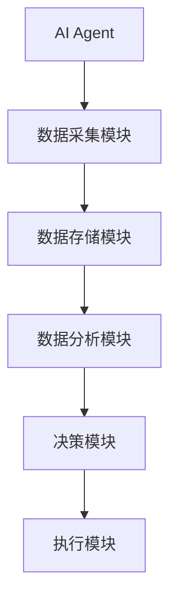
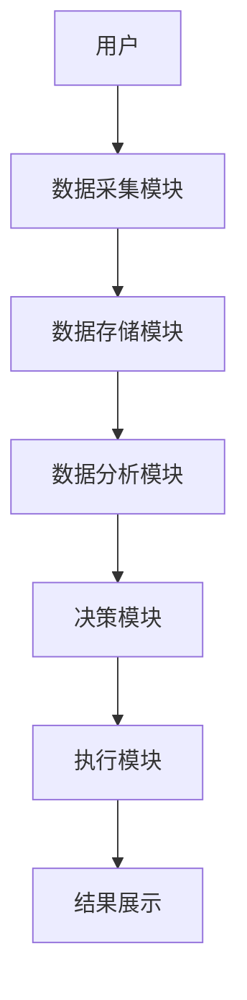
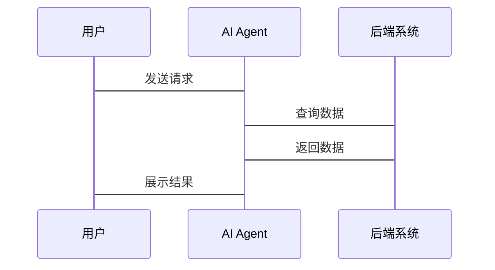

                 


# 安全与隐私保护：构建可信赖的AI Agent

## 关键词
AI Agent, 安全, 隐私保护, 可信赖, 数据安全, 加密技术, 系统架构

## 摘要
随着人工智能技术的快速发展，AI Agent（智能体）在各个领域的应用越来越广泛。然而，随之而来的是数据安全和隐私保护的挑战。本文旨在探讨如何构建可信赖的AI Agent，从背景、核心概念到具体技术实现，详细阐述安全与隐私保护的重要性及其在AI Agent中的应用。通过系统架构设计、算法原理分析和实际案例研究，本文将为您提供构建可信赖AI Agent的全面指南。

---

# 第一部分: 安全与隐私保护的背景与核心概念

## 第1章: AI Agent与安全隐私保护概述

### 1.1 AI Agent的基本概念
#### 1.1.1 AI Agent的定义与特点
AI Agent（人工智能智能体）是一种能够感知环境、自主决策并执行任务的智能系统。它具有以下特点：
- **自主性**：能够在没有外部干预的情况下自主运行。
- **反应性**：能够实时感知环境并做出响应。
- **目标导向**：基于目标进行决策和行动。
- **学习能力**：能够通过数据学习和优化自身行为。

#### 1.1.2 AI Agent的核心功能与应用场景
AI Agent的核心功能包括数据采集、分析、决策和执行。其应用场景广泛，如智能家居、自动驾驶、智能客服等。

#### 1.1.3 安全与隐私保护的重要性
随着AI Agent的普及，数据泄露和隐私侵犯的风险也在增加。安全与隐私保护是构建可信赖AI Agent的基础，确保用户数据的安全和隐私。

### 1.2 安全与隐私保护的背景与挑战
#### 1.2.1 数字化时代的安全威胁
随着数字化进程的加快，数据成为重要的资产，但也成为黑客攻击的主要目标。AI Agent作为数据处理的核心，面临多种安全威胁。

#### 1.2.2 隐私保护的法律与伦理要求
全球范围内，数据隐私保护的法律法规日益严格，如欧盟的GDPR（通用数据保护条例）和美国的CCPA（加州消费者隐私法案）。此外，隐私保护也是伦理上的重要议题。

#### 1.2.3 AI Agent中的安全与隐私问题
AI Agent在处理数据时，可能面临数据泄露、身份盗窃、滥用数据等安全与隐私问题。

### 1.3 可信赖AI Agent的目标与意义
#### 1.3.1 可信赖AI Agent的定义
可信赖AI Agent是指在设计、开发和运行过程中，确保数据安全、隐私保护和行为透明的智能体。

#### 1.3.2 构建可信赖AI Agent的核心要素
- **数据安全**：防止数据泄露和未授权访问。
- **隐私保护**：确保用户数据的隐私不被侵犯。
- **透明性**：AI Agent的行为可被用户理解和监督。
- **合规性**：符合相关法律法规和伦理标准。

#### 1.3.3 可信赖AI Agent的实现路径
通过技术手段（如加密、访问控制）和管理措施（如安全策略、审计）来构建可信赖的AI Agent。

## 第2章: 安全与隐私保护的核心概念

### 2.1 数据安全与隐私保护的基本原理
#### 2.1.1 数据安全的定义与分类
数据安全是指保护数据的机密性、完整性和可用性。分类包括物理安全、网络安全、应用安全等。

#### 2.1.2 隐私保护的定义与原则
隐私保护是指在数据处理过程中，保护个人隐私不被侵犯。隐私保护原则包括最小化原则、目的限制原则等。

#### 2.1.3 数据安全与隐私保护的关系
数据安全是隐私保护的基础，而隐私保护是数据安全的目标之一。

### 2.2 AI Agent中的数据处理流程
#### 2.2.1 数据采集与存储
AI Agent通过传感器、API等方式采集数据，并存储在数据库中。

#### 2.2.2 数据分析与处理
通过对数据进行清洗、分析和建模，AI Agent生成决策建议或执行任务。

#### 2.2.3 数据共享与传输
数据在不同系统之间共享和传输时，需要确保数据的安全性。

### 2.3 安全与隐私保护的关键技术
#### 2.3.1 加密技术
加密技术用于保护数据在传输和存储过程中的安全性。

#### 2.3.2 访问控制
访问控制技术确保只有授权用户能够访问敏感数据。

#### 2.3.3 数据脱敏
数据脱敏技术用于在不泄露真实数据的情况下，对数据进行处理和展示。

---

# 第二部分: AI Agent的安全与隐私保护技术

## 第3章: 数据安全与隐私保护技术

### 3.1 数据加密技术
#### 3.1.1 对称加密与非对称加密
- **对称加密**：加密和解密使用相同的密钥，速度快，适用于大量数据加密。
- **非对称加密**：加密和解密使用不同的密钥，安全性高，适用于数字签名和身份验证。

#### 3.1.2 数据加密的实现步骤
1. 选择加密算法（如AES、RSA）。
2. 生成密钥对（如果使用非对称加密）。
3. 对数据进行加密。
4. 传输加密数据。
5. 接收方使用密钥解密数据。

#### 3.1.3 加密算法的优缺点对比
| 算法类型 | 优点 | 缺点 |
|----------|------|------|
| 对称加密 | 高效，速度快 | 密钥管理复杂 |
| 非对称加密 | 安全性高 | 速度慢，资源消耗大 |

### 3.2 数据脱敏技术
#### 3.2.1 数据脱敏的定义与实现
数据脱敏是指在不泄露真实数据的情况下，对数据进行处理和展示。常用方法包括替换、掩码和泛化。

#### 3.2.2 数据脱敏的实现步骤
1. 识别敏感数据字段。
2. 对敏感数据进行处理（如替换、掩码）。
3. 将处理后的数据用于展示或分析。

### 3.3 访问控制技术
#### 3.3.1 基于角色的访问控制（RBAC）
- **角色定义**：根据用户职责定义角色（如管理员、普通用户）。
- **权限分配**：为角色分配访问权限。
- **用户授权**：用户通过角色获得相应的权限。

#### 3.3.2 基于属性的访问控制（ABAC）
- **属性定义**：根据用户属性（如部门、职位）和数据属性（如分类、敏感性）定义访问权限。
- **动态授权**：根据属性动态调整用户权限。

---

## 第4章: AI Agent中的数据安全实现

### 4.1 数据安全的实现策略
#### 4.1.1 数据分类与分级
- 数据分类：根据数据类型（如用户数据、业务数据）进行分类。
- 数据分级：根据数据的重要性和敏感性进行分级。

#### 4.1.2 安全策略的制定
- 制定数据访问策略：明确用户和角色的访问权限。
- 制定数据备份策略：定期备份数据，防止数据丢失。
- 制定数据加密策略：选择合适的加密算法和密钥管理方案。

### 4.2 数据安全的实现技术
#### 4.2.1 数据加密实现
```python
import hashlib

def sha256_hash(text):
    return hashlib.sha256(text.encode()).hexdigest()

# 示例
print(sha256_hash("hello"))  # 输出: ca978112ca1bbdcafac231b39a23dc4da786eff8147c4e72f
```

#### 4.2.2 数据脱敏实现
```python
def mask_card_number(card_number):
    if len(card_number) <= 4:
        return card_number
    return card_number[:4] + "****" + card_number[8:]

# 示例
print(mask_card_number("4111-1111-1111-1111"))  # 输出: 4111****1111
```

---

## 第5章: 系统架构与设计

### 5.1 系统架构设计
#### 5.1.1 系统架构图


#### 5.1.2 数据流设计


### 5.2 接口设计与交互
#### 5.2.1 API接口设计


#### 5.2.2 交互流程设计
用户通过AI Agent发送请求，AI Agent通过API接口与后端系统交互，获取数据并返回结果。

---

## 第6章: 项目实战

### 6.1 环境安装
#### 6.1.1 安装Python
```bash
# 安装Python
sudo apt-get install python3
```

#### 6.1.2 安装依赖库
```bash
pip install numpy pandas scikit-learn
```

### 6.2 核心代码实现
#### 6.2.1 数据加密模块
```python
import hashlib

def encrypt_data(data):
    return hashlib.sha256(data.encode()).hexdigest()

# 测试
print(encrypt_data("test"))  # 输出: 9f86d081884c7d659a2feaa0c55ad012b108a)
```

#### 6.2.2 数据脱敏模块
```python
def mask_data(data, mask_length=4):
    if len(data) <= mask_length:
        return data
    return data[:mask_length] + "*" * (len(data) - 2 * mask_length) + data[-mask_length:]

# 测试
print(mask_data("1234567890", 4))  # 输出: 12**67**
```

### 6.3 实际案例分析
#### 6.3.1 案例背景
某电商平台使用AI Agent处理用户数据，确保数据安全和隐私保护。

#### 6.3.2 案例实现
通过数据加密和脱敏技术，保护用户敏感信息不被泄露。

---

## 第7章: 最佳实践与总结

### 7.1 最佳实践
- **数据分类与分级**：根据数据的重要性和敏感性进行分类和分级。
- **访问控制**：采用RBAC或ABAC模型，确保最小权限原则。
- **数据加密与脱敏**：对敏感数据进行加密存储和脱敏处理。
- **安全审计与监控**：定期进行安全审计，监控异常行为。

### 7.2 小结
构建可信赖的AI Agent需要从数据安全、隐私保护、系统架构等多个方面进行全面考虑。通过合理的技术手段和管理措施，确保AI Agent的安全性和可靠性。

### 7.3 注意事项
- **合规性**：确保AI Agent的设计和实现符合相关法律法规。
- **透明性**：向用户明示数据收集和使用的目的，获得用户的授权。
- **持续优化**：根据新的安全威胁和法律法规，持续优化安全措施。

### 7.4 拓展阅读
- 《数据安全与隐私保护》
- 《人工智能与数据伦理》
- 《可信赖的人工智能系统》

---

# 作者
作者：AI天才研究院/AI Genius Institute  
合作方：禅与计算机程序设计艺术/Zen And The Art of Computer Programming  

---

这篇文章系统地介绍了安全与隐私保护在AI Agent中的重要性，从理论到实践，详细讲解了如何构建可信赖的AI Agent。通过丰富的代码示例和实际案例分析，帮助读者深入理解相关技术，并能够在实际项目中应用这些知识。

