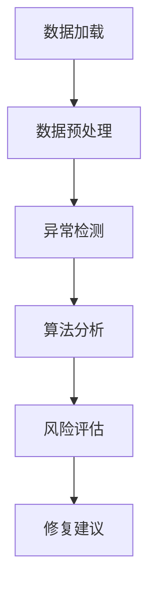

                 


# 第一部分: AI Agent安全审计基础

## 第1章: AI Agent与安全审计概述

### 1.1 AI Agent的基本概念
#### 1.1.1 AI Agent的定义与特点
- 定义：AI Agent是一种智能主体，能够感知环境并采取行动以实现目标。
- 特点：自主性、反应性、主动性、社会性。

#### 1.1.2 AI Agent的类型与应用场景
- 类型：简单反射型、基于模型的反射型、目标驱动型、效用驱动型。
- 应用场景：智能助手、自动驾驶、推荐系统、机器人控制等。

#### 1.1.3 AI Agent的安全需求与挑战
- 安全需求：保护隐私、防止数据泄露、防止恶意攻击、确保决策透明性。
- 挑战：复杂性、实时性、对抗性。

### 1.2 安全审计的基本概念
#### 1.2.1 安全审计的定义与作用
- 定义：安全审计是对系统或过程的安全性进行检查和评估，以发现潜在漏洞和风险。
- 作用：确保安全性、合规性、完整性。

#### 1.2.2 安全审计的流程与方法
- 流程：规划、准备、实施、报告、整改。
- 方法：基于标准的审计、风险导向的审计、基于工具的审计。

#### 1.2.3 AI Agent与安全审计的关系
- 依赖性：AI Agent的安全性依赖于安全审计的实施。
- 互动性：安全审计为AI Agent提供持续的安全保障，AI Agent为安全审计提供数据和决策支持。

### 1.3 AI Agent安全审计的背景与意义
#### 1.3.1 当前AI Agent应用的快速发展
- 技术进步：深度学习、自然语言处理等技术的发展推动了AI Agent的应用。
- 应用广泛：AI Agent在各个领域（如医疗、金融、交通）的应用越来越广泛。

#### 1.3.2 安全漏洞的潜在风险
- 数据泄露：可能导致用户隐私被窃取。
- 滥用风险：AI Agent可能被恶意利用进行攻击或欺诈。
- 模型缺陷：模型可能在特定情况下出现错误决策。

#### 1.3.3 定期安全审计的必要性
- 保障用户信任：通过定期审计确保AI Agent的安全性，提升用户信任。
- 符合法规要求：许多行业对AI系统的安全性有明确的法规要求。
- 提高系统韧性：通过持续审计，发现并修复漏洞，提高系统的整体安全性。

## 第2章: AI Agent安全审计的核心概念

### 2.1 AI Agent安全审计的背景介绍
#### 2.1.1 问题背景与问题描述
- 背景：随着AI Agent的应用越来越广泛，安全漏洞的风险也在增加。
- 问题描述：AI Agent可能存在数据泄露、滥用、模型缺陷等安全问题，需要定期进行安全审计。

#### 2.1.2 问题解决的思路与方法
- 思路：通过定期检查和评估AI Agent的安全性，发现并修复潜在漏洞。
- 方法：结合人工审查和工具检测，进行全面的安全评估。

#### 2.1.3 AI Agent安全审计的边界与外延
- 边界：仅关注AI Agent的安全性，不涉及其他系统或组件。
- 外延：包括AI Agent的输入、输出、决策过程和数据存储等方面。

#### 2.1.4 核心概念的结构与要素组成
- 核心概念：AI Agent、安全漏洞、安全审计。
- 要素组成：输入数据、模型算法、决策逻辑、输出结果、用户反馈。

### 2.2 核心概念与联系
#### 2.2.1 AI Agent安全审计的核心原理
- 安全审计通过检查AI Agent的各个部分，确保其符合安全标准和要求。
- 包括数据层安全、算法层安全和应用层安全的检查。

#### 2.2.2 核心概念的属性特征对比表
| 概念       | 属性特征                           |
|------------|------------------------------------|
| AI Agent   | 独立性、适应性、交互性             |
| 安全漏洞   | 潜在风险、可利用性、影响范围       |
| 安全审计   | 系统性、全面性、持续性             |

#### 2.2.3 ER实体关系图架构
```mermaid
erd
  安全审计
    + 审计对象: AI Agent
    + 审计内容: 数据、算法、模型
    + 审计结果: 合格、不合格、建议改进
  AI Agent
    + 输入数据: 用户指令、环境信息
    + 决策逻辑: 算法、规则库
    + 输出结果: 行动指令、反馈信息
  安全漏洞
    + 数据漏洞: 数据泄露、篡改
    + 算法漏洞: 决策错误、对抗攻击
    + 系统漏洞: 未授权访问、拒绝服务
```

## 第3章: AI Agent安全审计的算法原理

### 3.1 算法原理概述
#### 3.1.1 安全审计的基本流程
1. 数据收集：收集AI Agent的输入、输出和日志数据。
2. 模型分析：分析AI Agent的算法和模型结构。
3. 漏洞检测：识别潜在的安全漏洞。
4. 风险评估：评估漏洞的严重性和影响范围。
5. 安全修复：提出修复建议和措施。

### 3.2 AI Agent安全审计的算法原理
#### 3.2.1 数据分析与漏洞检测
- 数据预处理：清洗、标准化。
- 数据分析：统计分析、异常检测。
- 模型训练：使用监督学习或无监督学习检测数据中的异常模式。

#### 3.2.2 算法分析与漏洞识别
- 算法解释性：使用可解释性模型（如线性回归、决策树）分析算法的决策过程。
- 对抗攻击检测：使用对抗样本测试算法的鲁棒性，识别可能的对抗攻击点。

#### 3.2.3 风险评估与修复建议
- 风险评估：基于漏洞的影响和概率，评估其风险等级。
- 修复建议：提出针对不同漏洞的修复策略，如数据加密、算法优化、访问控制等。

### 3.3 算法实现与代码示例
#### 3.3.1 数据分析代码
```python
import pandas as pd
from sklearn.ensemble import IsolationForest

# 数据加载与预处理
data = pd.read_csv('agent_logs.csv')
data = data.dropna().astype('float')

# 异常检测
model = IsolationForest(n_estimators=100, random_state=42)
model.fit(data)
outliers = model.predict(data)
outliers[outliers == -1] = 0
outliers[outliers == 1] = 0
outliers[outliers == -1] = 1
```

#### 3.3.2 算法分析代码
```python
import numpy as np
from tensorflow.keras import models

# 加载AI Agent模型
model = models.load_model('agent_model.h5')

# 对抗攻击检测
epsilon = 0.1
perturbations = np.random.uniform(-epsilon, epsilon, data.shape)
perturbed_data = data + perturbations
predictions = model.predict(perturbed_data)
original_predictions = model.predict(data)
attack_success = np.sum(np.argmax(predictions, axis=1) != np.argmax(original_predictions, axis=1))
```

### 3.4 算法原理的数学模型与公式
#### 3.4.1 异常检测模型
- 使用Isolation Forest算法进行异常检测：
  $$ \text{异常分数} = \text{IsolationForest}.score_samples(\text{数据}) $$

#### 3.4.2 对抗攻击检测
- 使用扰动数据检测模型的鲁棒性：
  $$ \text{攻击成功率} = \frac{\sum_{i=1}^{n} (\text{预测}(x_i + \delta) \neq \text{预测}(x_i))}{n} $$

### 3.5 算法实现与流程图


### 3.6 算法优化与扩展
- 优化：使用集成学习提高检测精度。
- 扩展：结合自然语言处理技术，分析AI Agent的决策日志，识别潜在的漏洞。

---

接下来，我会根据上述大纲，逐步展开每个部分的详细内容，确保文章的逻辑性和完整性。

