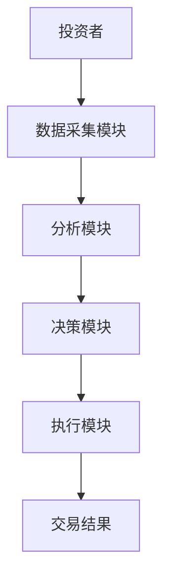
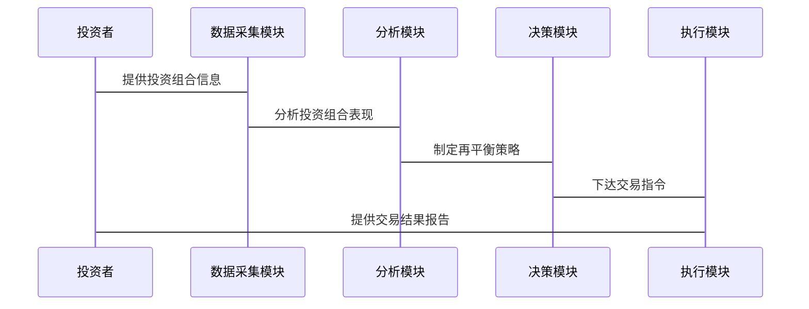

                 

# 定期更新投资组合：巴菲特的年度习惯

---

## 关键词：投资组合管理、巴菲特、价值投资、投资再平衡、资产配置、风险管理

---

## 摘要：  
定期更新投资组合是巴菲特投资策略中的核心习惯之一。本文通过分析巴菲特的投资理念、投资组合管理方法以及再平衡策略，揭示其成功的关键因素。文章从投资组合管理的基本概念出发，探讨定期更新的必要性，结合巴菲特的经典案例，详细讲解投资组合再平衡的原理、方法和实战应用，帮助读者掌握如何优化自己的投资组合。

---

# 第一部分: 定期更新投资组合的背景与重要性

## 第1章: 投资组合管理的基本概念

### 1.1 投资组合的定义与目标  
投资组合是指投资者持有的多种资产（如股票、债券、基金等）的集合。其目标是通过合理的资产配置，在风险可控的前提下，实现收益的最大化。投资组合管理的核心在于动态调整资产配置，以适应市场变化和个人财务状况的变化。

### 1.2 为什么需要定期更新投资组合  
市场环境和个人情况的变化会直接影响投资组合的收益和风险。定期更新投资组合可以帮助投资者：  
- 降低市场波动带来的风险。  
- 优化资产配置，提升整体收益。  
- 适应个人财务目标的变化。  

### 1.3 投资组合管理的必要性  
投资组合管理不仅仅是买入和卖出资产，更是一个系统化的过程。它需要结合市场趋势、企业基本面和个人风险偏好，进行持续的评估和调整。

---

## 第2章: 巴菲特的投资理念与年度习惯

### 2.1 巴菲特的投资哲学  
巴菲特是价值投资的代表人物。他强调购买优质企业，长期持有，而非频繁交易。他的投资理念包括：  
- 买入具有持续竞争优势的企业。  
- 以合理的价格买入，追求安全边际。  
- 长期持有，分享企业成长的成果。  

### 2.2 巴菲特的年度投资审查  
巴菲特每年都会审视自己的投资组合，评估持有的企业是否仍然具备投资价值。他关注企业的基本面变化，如盈利能力、行业地位和管理团队等。如果企业基本面恶化或市场环境变化，他会考虑调整持仓。

---

## 第3章: 投资组合管理的必要性

### 3.1 市场环境的变化  
市场环境的变化是投资组合调整的主要原因之一。例如：  
- 经济周期波动会影响资产价格。  
- 通货膨胀会影响货币购买力。  
- 行业趋势变化会影响企业价值。  

### 3.2 个人财务状况的变化  
投资者的财务状况也会随时间发生变化，如收入增加或减少、财务目标调整等，都需要相应调整投资组合。

---

# 第二部分: 投资组合再平衡的策略与方法

## 第4章: 投资组合再平衡的原理

### 4.1 再平衡的定义与作用  
再平衡是指调整投资组合中各资产的比例，以恢复原有的资产配置目标。其作用包括：  
- 控制风险。  
- 提升收益。  
- 适应市场变化。  

### 4.2 再平衡的常见方法  
- **定期再平衡**：按固定时间间隔调整资产配置。  
- **阈值再平衡**：当资产比例偏离目标时触发调整。  
- **事件驱动再平衡**：根据重大事件（如市场崩盘）进行调整。  

---

## 第5章: 投资组合再平衡的实施步骤

### 5.1 确定再平衡的频率  
巴菲特通常每年进行一次投资审查，这可以作为再平衡的时机。然而，对于普通投资者，可以根据市场波动和个人情况选择再平衡的频率。

### 5.2 评估当前投资组合的表现  
评估投资组合的表现，包括收益、风险和资产配置是否合理。例如，可以通过计算夏普比率来衡量风险调整后的收益。

### 5.3 制定再平衡的调整方案  
根据评估结果，制定具体的调整方案，包括增减哪些资产以及调整的比例。

---

## 第6章: 投资组合再平衡的数学模型与公式

### 6.1 资产配置比例的计算公式  
假设目标资产配置为股票60%、债券30%、现金10%，可以通过以下公式计算各资产的调整金额：  
$$ \text{调整金额} = \text{目标比例} \times \text{总资金} - \text{当前金额} $$  

### 6.2 风险调整后的收益计算  
夏普比率公式：  
$$ \text{夏普比率} = \frac{\text{投资组合收益} - \text{无风险利率}}{\text{投资组合收益的标准差}} $$  

---

## 第7章: 实战案例分析

### 7.1 巴菲特的经典投资组合调整案例  
例如，巴菲特在2008年金融危机期间增加了对伯克希尔 Hathaway 的持股，因为他认为公司的内在价值并未受到市场波动的影响。

### 7.2 个人投资者的再平衡实战  
假设投资者年初的投资组合为股票60%、债券30%、现金10%，但在市场波动后，股票比例下降至50%，债券上升至40%。为了恢复目标配置，投资者需要卖出债券，买入股票，使比例回到60%股票和30%债券。

---

# 第三部分: 投资组合管理的系统分析与架构设计

## 第8章: 投资组合管理的系统架构

### 8.1 系统功能设计  
- **数据采集模块**：收集市场数据和投资者信息。  
- **分析模块**：评估投资组合表现和风险。  
- **决策模块**：制定再平衡策略。  
- **执行模块**：下单交易。  

### 8.2 系统架构图  

---

## 第9章: 系统接口设计与交互流程

### 9.1 系统接口设计  
- 数据接口：获取市场数据和账户信息。  
- 交易接口：执行买卖指令。  
- 报告接口：生成投资组合报告。  

### 9.2 系统交互流程  

---

# 总结

定期更新投资组合是巴菲特成功的基石。通过定期审视和调整投资组合，投资者可以更好地应对市场变化和个人财务状况的变化。本文从理论到实践，详细讲解了投资组合管理的策略和方法，帮助读者掌握如何优化自己的投资组合。

---

**作者：AI天才研究院/AI Genius Institute & 禅与计算机程序设计艺术 /Zen And The Art of Computer Programming**

