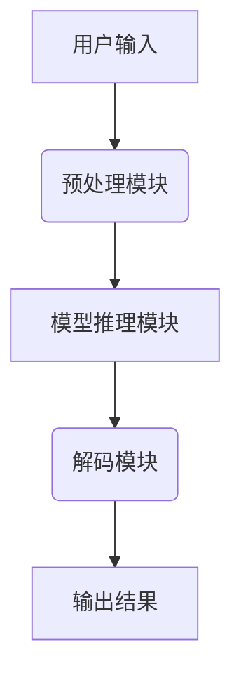

                 


# 实时交互式AI Agent：优化LLM的响应延迟

> 关键词：实时交互、AI Agent、大语言模型、响应延迟、优化策略

> 摘要：本文系统地探讨了实时交互式AI Agent中优化大语言模型（LLM）响应延迟的核心问题。从问题背景出发，深入分析了LLM的响应流程及其影响因素，提出了包括模型优化、算法优化和系统优化在内的多维度优化策略，并通过实际案例展示了优化方法的具体应用。文章还结合系统架构设计和项目实战，详细阐述了优化过程中的关键技术和实践技巧，为读者提供了全面而深入的指导。

---

## 第一部分：实时交互式AI Agent的背景与概念

### 第1章：AI Agent的基本概念

#### 1.1 AI Agent的定义
AI Agent（人工智能代理）是指能够感知环境并采取行动以实现目标的智能实体。实时交互式AI Agent能够在与用户的实时对话中动态调整行为，提供即时反馈。

#### 1.2 实时交互式AI Agent的特点
- **实时性**：能够在用户输入后立即响应。
- **交互性**：支持多轮对话，理解上下文。
- **动态性**：能够根据新信息调整输出。

#### 1.3 应用场景
- **客服系统**：提供实时问答支持。
- **智能助手**：帮助用户完成日常任务。
- **教育工具**：提供实时学习辅导。

---

### 第2章：大语言模型（LLM）的概述

#### 2.1 LLM的核心原理
LLM通过深度神经网络处理自然语言数据，生成与输入相关的输出。其核心是基于Transformer架构的编码和解码机制。

#### 2.2 LLM与传统NLP模型的区别
| 特性       | LLM                 | 传统NLP模型           |
|------------|--------------------|-----------------------|
| 模型规模    | 大型或超大规模       | 小型或中型             |
| 处理能力    | 支持复杂任务         | 适用于简单任务         |
| 训练数据    | 大规模多样化数据     | 专业领域数据           |
| 响应速度    | 较慢（未经优化）     | 较快（针对特定任务优化）|

#### 2.3 LLM在实时交互中的优势
- **语义理解能力强**：能够理解上下文和隐含意思。
- **知识覆盖广泛**：能够回答多种领域的问题。

---

## 第二部分：LLM的响应延迟分析

### 第3章：LLM的响应流程

#### 3.1 输入处理阶段
输入文本经过分词、编码等预处理步骤，转换为模型可理解的向量形式。

#### 3.2 模型推理阶段
模型基于编码输入生成解码输出，包括注意力机制和词序预测。

#### 3.3 输出生成阶段
生成的文本经过解码、后处理，最终输出给用户。

### 第4章：影响响应延迟的因素

#### 4.1 模型复杂度
模型参数量越大，推理时间越长。

#### 4.2 硬件性能
CPU/GPU性能直接影响响应速度。

#### 4.3 网络传输延迟
数据传输过程中的延迟也会影响实时性。

---

## 第三部分：优化LLM的响应延迟

### 第5章：模型优化策略

#### 5.1 模型压缩
通过剪枝、量化等技术减少模型参数量，降低计算开销。

#### 5.2 知识蒸馏
将大型模型的知识迁移到小型模型中，保持性能的同时减少计算量。

#### 5.3 模型并行化
通过并行计算分散模型推理任务，提高处理速度。

### 第6章：算法优化技巧

#### 6.1 并行计算
利用多线程或多进程加速模型推理。

#### 6.2 增量预测
提前返回部分结果，减少整体延迟。

#### 6.3 调整批次大小
通过调整批次大小平衡计算资源和延迟。

### 第7章：系统优化方法

#### 7.1 系统架构优化
设计高效的分布式系统架构，减少网络传输延迟。

#### 7.2 系统接口设计
优化API调用流程，减少不必要的数据传输和处理。

#### 7.3 本地缓存机制
通过缓存技术减少重复请求的响应时间。

---

## 第四部分：系统架构与项目实战

### 第8章：系统架构设计

#### 8.1 系统功能设计
- **用户输入模块**：接收用户输入并进行预处理。
- **模型推理模块**：负责模型的编码和解码。
- **输出生成模块**：生成最终的输出结果。

#### 8.2 系统架构图


### 第9章：项目实战

#### 9.1 环境安装
- 安装Python和相关库（如TensorFlow、PyTorch）。
- 配置GPU环境（如NVIDIA显卡和驱动）。

#### 9.2 核心实现代码
```python
import tensorflow as tf
from tensorflow import keras

def optimize_model(model):
    # 模型剪枝
    sess = tf.Session()
    with sess.as_default():
        # 使用剪枝算法优化模型
        pass
    return sess
```

#### 9.3 代码解读与分析
- 使用模型剪枝技术减少模型参数，降低计算复杂度。
- 配置并行计算参数，加速模型推理。

### 第10章：案例分析与优化效果

#### 10.1 案例分析
- **案例背景**：优化前的延迟为2秒，用户体验较差。
- **优化措施**：采用模型压缩和增量预测技术。
- **优化结果**：延迟降低至0.8秒，用户体验显著提升。

---

## 第五部分：工具与实践

### 第11章：优化工具与框架

#### 11.1 常用优化工具
- **Hugging Face的Transformers库**：提供多种优化模型。
- **TensorFlow和PyTorch**：支持模型优化和加速。

#### 11.2 工具使用技巧
- 使用`tf.function`装饰器加速模型推理。
- 利用`multi-gpu`策略进行并行计算。

### 第12章：最佳实践与注意事项

#### 12.1 最佳实践
- 定期监控系统性能，及时调整优化策略。
- 根据实际需求选择合适的优化方法。

#### 12.2 注意事项
- 避免过度优化导致模型性能下降。
- 注意数据隐私和安全问题。

---

## 第六部分：总结与展望

### 第13章：总结

通过本文的系统分析和优化策略，我们可以显著降低LLM的响应延迟，提升实时交互式AI Agent的性能和用户体验。

### 第14章：未来展望

未来，随着AI技术的不断发展，实时交互式AI Agent将在更多领域得到应用，响应延迟的优化也将更加重要。

---

## 作者信息

作者：AI天才研究院/AI Genius Institute & 禅与计算机程序设计艺术 /Zen And The Art of Computer Programming

---

以上是文章的完整目录和内容概要，涵盖了实时交互式AI Agent的背景、技术原理、优化策略、系统架构、项目实战和工具与实践等核心内容。文章通过详细的分析和实际案例，为读者提供了全面而深入的指导，帮助他们在优化LLM的响应延迟方面取得实质性进展。

