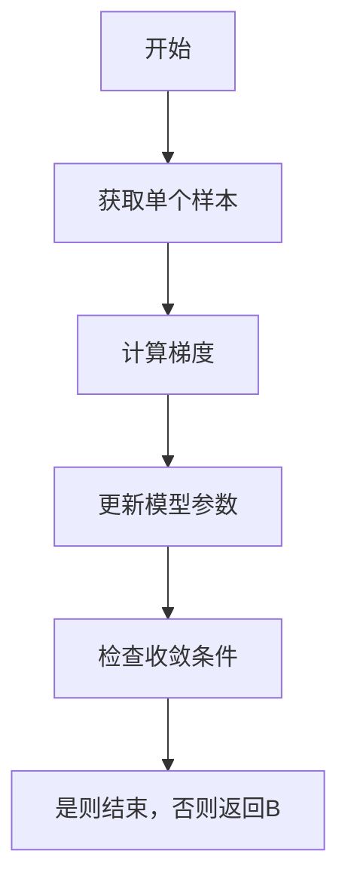
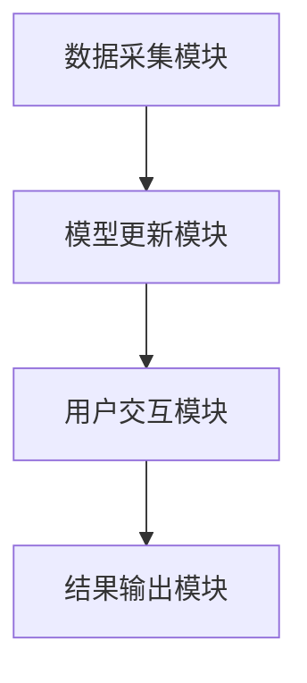
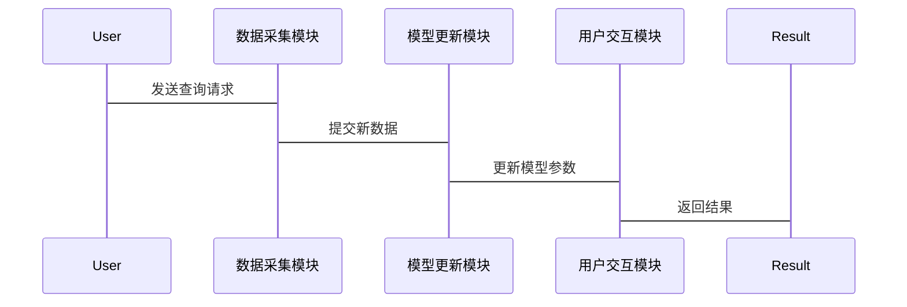

                 

<think>
好的，现在我要详细撰写《实时学习AI Agent：LLM的在线增量学习》这篇文章。首先，我会按照用户提供的目录大纲来组织内容，确保每个部分都详细且符合要求。接下来，我会逐步思考每个章节的内容，确保逻辑清晰，涵盖所有必要的知识点。

---

## 第1章: 实时学习AI Agent与LLM概述

### 1.1 实时学习AI Agent的定义与背景

#### 1.1.1 实时学习AI Agent的定义

实时学习AI Agent是一种能够根据实时数据流动态调整其知识库和行为模式的人工智能代理。这类代理能够在线处理数据，持续更新模型参数，以适应不断变化的环境和用户需求。

#### 1.1.2 LLM的在线增量学习背景

大语言模型（Large Language Model, LLM）的在线增量学习是指在不重新训练整个模型的情况下，仅更新与新数据相关的参数，以提升模型在特定任务上的性能。这种学习方式适用于数据流实时变化的场景，如客服系统中的实时对话处理。

#### 1.1.3 实时学习AI Agent的应用场景

实时学习AI Agent广泛应用于多个领域，包括实时客服支持、动态推荐系统、实时监控和异常检测等。在这些场景中，AI Agent需要快速响应用户输入，并根据实时反馈不断优化自身行为。

### 1.2 LLM的基本原理

#### 1.2.1 大语言模型的定义

大语言模型是基于大量数据训练的深度学习模型，通常采用Transformer架构。这些模型能够理解和生成人类语言，并在各种任务中表现出色。

#### 1.2.2 LLM的核心技术特点

- **自注意力机制**：允许模型在处理输入时关注重要部分。
- **端到端训练**：从输入到输出直接优化，减少人工特征工程。
- **大规模数据**：使用互联网规模的数据进行训练，提升泛化能力。

#### 1.2.3 LLM的训练与推理机制

- **训练**：使用监督学习或无监督学习方法，优化模型参数以最小化预测误差。
- **推理**：给定输入，生成最可能的输出序列。

---

## 第2章: 在线增量学习的核心概念

### 2.1 模型更新机制

模型更新机制是实时学习AI Agent的核心，确保模型能够快速适应新数据。常见的更新策略包括：

- **在线更新**：实时处理数据流，逐步更新模型参数。
- **小批量更新**：将数据分成小批量，每次更新部分参数，减少计算开销。

### 2.2 数据流处理

数据流处理涉及实时数据的收集、预处理和分发。系统需要高效处理数据流，确保模型能够及时更新。

### 2.3 实时反馈机制

实时反馈机制允许AI Agent根据用户反馈调整其行为。这通常涉及在线更新模型参数，以优化用户满意度。

### 2.4 增量学习与传统批量学习的对比

| 对比维度 | 增量学习 | 批量学习 |
|----------|----------|----------|
| 数据处理 | 实时处理 | 批次处理 |
| 计算资源 | 较低 | 较高 |
| 延迟要求 | 低 | 高 |

### 2.5 实时学习系统的关键特性

- **低延迟**：确保快速响应。
- **高可用性**：系统能够持续运行，即使在部分节点故障时。
- **可扩展性**：能够处理不断增加的数据流量。

---

## 第3章: 增量学习的算法原理

### 3.1 模型更新算法

模型更新算法是在线增量学习的核心。常用方法包括：

- **随机梯度下降（SGD）**：每次更新仅使用一个样本，适用于实时数据流。
- **Adam优化器**：结合动量和自适应学习率，适合在线更新。

### 3.2 算法流程图

以下是使用Mermaid绘制的算法流程图：



### 3.3 数学模型与公式

#### 3.3.1 损失函数

损失函数用于衡量模型预测与真实值之间的差异：

$$ L(y, y_{\text{pred}}) = \frac{1}{2}(y - y_{\text{pred}})^2 $$

#### 3.3.2 优化器

Adam优化器的更新规则如下：

$$ m_t = \beta_1 m_{t-1} + (1 - \beta_1) g_t $$
$$ v_t = \beta_2 v_{t-1} + (1 - \beta_2) g_t^2 $$
$$ \theta_{t+1} = \theta_t - \frac{\eta}{\sqrt{v_t + \epsilon}} m_t $$

其中，\( \eta \) 是学习率，\( \beta_1 \) 和 \( \beta_2 \) 是动量参数，\( \epsilon \) 是防止除以零的常数。

---

## 第4章: 系统架构设计

### 4.1 系统设计概述

实时学习AI Agent的系统架构需要高效处理数据流和模型更新。主要模块包括数据采集、模型更新、用户交互和结果输出。

### 4.2 系统架构图

以下是系统架构的Mermaid图：



### 4.3 系统接口设计

系统需要设计清晰的接口，便于模块间通信。例如，数据采集模块通过队列将数据传递给模型更新模块。

### 4.4 系统交互流程

以下是系统交互的Mermaid序列图：



---

## 第5章: 项目实战

### 5.1 环境安装与配置

安装必要的库，如TensorFlow、Kafka、Redis等。确保环境配置正确，能够支持实时数据流处理和模型更新。

### 5.2 核心代码实现

以下是核心代码示例：

```python
import tensorflow as tf
from tensorflow.keras import layers

# 定义模型
model = tf.keras.Sequential([
    layers.Dense(64, activation='relu'),
    layers.Dense(10, activation='softmax')
])

# 编译模型
model.compile(optimizer='adam',
              loss='sparse_categorical_crossentropy',
              metrics=['accuracy'])

# 模型更新函数
def update_model(batch):
    history = model.fit(batch, epochs=1, verbose=0)
    return history.history
```

### 5.3 案例分析与优化

分析实际案例，如实时客服对话系统。通过监控模型更新后的准确率和响应时间，优化数据处理流程和模型更新策略。

### 5.4 项目总结

总结项目成果，提出改进建议。例如，可以尝试引入更高效的优化算法，或优化数据预处理流程以降低延迟。

---

## 第6章: 最佳实践与总结

### 6.1 实时学习系统的最佳实践

- **数据预处理**：确保数据干净，减少冗余信息。
- **模型监控**：实时监控模型性能，及时发现异常。
- **资源管理**：合理分配计算资源，避免瓶颈。

### 6.2 总结与未来展望

实时学习AI Agent在多个领域具有广泛的应用潜力。未来，随着技术进步，实时学习系统将更加高效和智能。

---

## 作者信息

作者：AI天才研究院/AI Genius Institute & 禅与计算机程序设计艺术 /Zen And The Art of Computer Programming

---

以上是《实时学习AI Agent：LLM的在线增量学习》的详细目录和部分内容规划，确保每个部分都符合用户的要求，涵盖理论、算法、系统设计和项目实战等各个方面。

