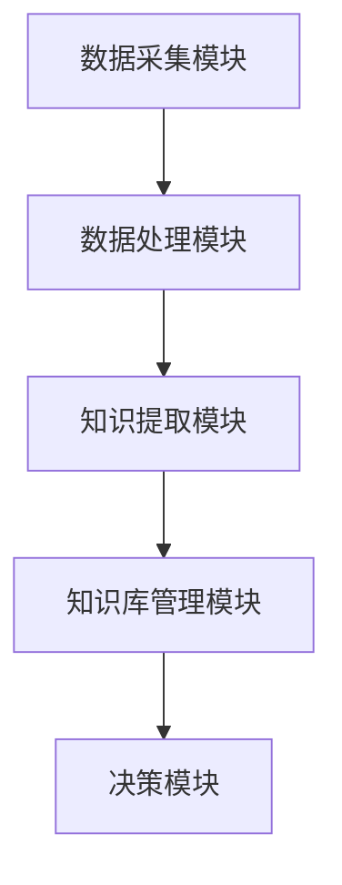

                 


# 实时学习：即时更新AI Agent的知识库

## 关键词：
实时学习, AI Agent, 知识库更新, 在线学习, 增量学习

## 摘要：
实时学习是指在AI Agent运行过程中，持续接收新的数据流并实时更新知识库的能力。本文从实时学习的基本概念入手，详细探讨其在AI Agent知识库更新中的应用。通过分析实时学习的核心算法、知识库的管理机制、系统架构设计以及实际项目案例，揭示实时学习如何提升AI Agent的智能化水平和适应性。文章内容涵盖实时学习的算法原理、知识库更新的技术挑战、系统架构设计、项目实战以及最佳实践，为读者提供全面的理论和技术指导。

---

# 第一部分: 实时学习与AI Agent知识库概述

## 第1章: 实时学习的基本概念

### 1.1 实时学习的定义与背景

#### 1.1.1 实时学习的定义
实时学习（Real-Time Learning）是指在动态变化的环境中，系统能够即时接收数据、处理信息并快速调整自身模型或策略的过程。与传统批量学习不同，实时学习强调数据流的连续性，要求系统具备持续学习和适应能力。

#### 1.1.2 实时学习的应用场景
实时学习广泛应用于多个领域，例如：
- **金融领域**：实时更新股票价格预测模型。
- **医疗领域**：实时分析患者数据，提供动态诊断建议。
- **推荐系统**：根据用户行为实时更新推荐策略。
- **自动驾驶**：实时处理传感器数据，调整驾驶策略。

#### 1.1.3 实时学习的核心特征
- **连续性**：数据流是连续的，没有固定的批量。
- **即时性**：系统必须在数据到达时立即处理。
- **动态性**：环境和数据分布可能随时间变化。

---

### 1.2 AI Agent的基本概念

#### 1.2.1 AI Agent的定义
AI Agent（人工智能代理）是指能够感知环境、执行任务并做出决策的智能实体。AI Agent可以是软件程序、机器人或其他智能系统，具备以下特点：
- **自主性**：能够在没有外部干预的情况下独立运行。
- **反应性**：能够实时感知环境并做出反应。
- **目标导向**：以明确的目标为导向执行任务。

#### 1.2.2 AI Agent的核心功能
- **感知环境**：通过传感器或其他数据源获取信息。
- **决策与规划**：基于当前状态和目标，制定行动计划。
- **执行操作**：通过执行器或其他接口实现动作。
- **学习与适应**：通过学习算法更新知识库，提升性能。

#### 1.2.3 AI Agent与传统程序的区别
AI Agent的核心区别在于其具备自主性、反应性和学习能力。传统程序通常基于固定的规则和数据，而AI Agent能够动态调整自身行为，适应环境变化。

---

### 1.3 知识库的基本概念

#### 1.3.1 知识库的定义
知识库（Knowledge Base）是用于存储和管理知识的结构化数据集合。它通常包含领域专家的知识、数据、规则和逻辑推理，能够帮助AI Agent做出更智能的决策。

#### 1.3.2 知识库的结构与特点
知识库的结构通常包括以下部分：
- **事实（Facts）**：具体的知识点，例如“巴黎是法国的首都”。
- **规则（Rules）**：逻辑推理规则，例如“如果天空是蓝色的，则天气晴朗”。
- **概念（Concepts）**：高层次的知识，例如“天气状况”。

特点：
- **结构化**：知识以结构化的形式存储，便于计算机处理。
- **可扩展性**：能够方便地添加新知识。
- **动态性**：支持实时更新和修改。

#### 1.3.3 知识库在AI Agent中的作用
知识库是AI Agent的核心组成部分，它为Agent提供决策所需的知识支持。通过知识库，AI Agent能够理解环境、推理问题并制定解决方案。

---

### 1.4 实时学习与AI Agent知识库的关系

#### 1.4.1 实时学习如何提升AI Agent的性能
实时学习通过持续更新知识库，使AI Agent能够快速适应环境变化，提升决策的准确性和响应速度。

#### 1.4.2 AI Agent知识库的实时更新机制
实时更新机制包括数据流处理、增量学习和在线学习等技术，确保知识库始终保持最新状态。

#### 1.4.3 实时学习与知识库更新的协同优化
实时学习通过优化知识库更新算法，提升AI Agent的学习效率和知识库的准确性。

---

## 第2章: 实时学习的核心算法与原理

### 2.1 增量学习算法

#### 2.1.1 增量学习的基本原理
增量学习是一种在线学习方法，系统在接收到新的数据样本后，逐步更新模型，而不是一次性重新训练整个模型。这种方式适用于数据流环境，能够显著减少计算成本。

#### 2.1.2 增量学习的核心算法
- **增量支持向量机（Incremental SVM）**：在不重新训练整个SVM的情况下，逐步添加新样本。
- **增量随机森林（Incremental Random Forest）**：动态添加新样本，更新决策树。

#### 2.1.3 增量学习的优缺点
优点：
- 计算成本低。
- 适合实时数据流处理。

缺点：
- 模型更新可能不够准确。
- 对异常数据的鲁棒性较弱。

---

### 2.2 在线学习算法

#### 2.2.1 在线学习的基本原理
在线学习是一种实时处理数据流的学习方法，系统在接收到每一条数据后，立即更新模型。

#### 2.2.2 在线学习的核心算法
- **在线梯度下降（Online Gradient Descent）**：通过最小化损失函数，逐步更新模型参数。
- **Adaptive Online Learning**：根据数据分布动态调整学习率。

#### 2.2.3 在线学习的优缺点
优点：
- 适合实时数据流处理。
- 能够快速响应环境变化。

缺点：
- �易受噪声数据影响。
- 模型可能不够稳定。

---

### 2.3 实时更新算法

#### 2.3.1 实时更新算法的基本原理
实时更新算法结合了增量学习和在线学习的优势，能够在数据到达时立即更新知识库。

#### 2.3.2 实时更新算法的核心步骤
1. 数据预处理：对新数据进行清洗和转换。
2. 模型更新：根据新数据更新现有模型。
3. 知识库更新：将新知识整合到知识库中。

#### 2.3.3 实时更新算法的数学模型
实时更新算法通常基于以下数学模型：
$$ \theta_{new} = \theta_{old} + \alpha (y - \hat{y}) $$
其中，$\theta$ 表示模型参数，$\alpha$ 表示学习率，$y$ 表示真实标签，$\hat{y}$ 表示预测标签。

---

## 第3章: 知识库实时更新的核心技术

### 3.1 知识库实时更新的定义

#### 3.1.1 知识库实时更新的目标
确保知识库中的知识始终反映当前环境的真实情况。

#### 3.1.2 知识库实时更新的流程
1. 数据采集：实时获取新数据。
2. 数据处理：清洗、转换和存储新数据。
3. 知识提取：从新数据中提取有用的知识。
4. 知识整合：将新知识整合到现有知识库中。
5. 知识验证：验证新知识的准确性和一致性。

---

### 3.2 知识库实时更新的关键技术

#### 3.2.1 数据流处理技术
数据流处理技术用于实时处理动态变化的数据流，确保知识库能够及时更新。

#### 3.2.2 知识提取与整合技术
知识提取技术用于从新数据中提取有用的知识，整合技术将新知识与现有知识库无缝对接。

#### 3.2.3 知识验证与纠错技术
知识验证技术用于检查新知识的准确性和一致性，纠错技术用于修复潜在的错误。

---

## 第4章: AI Agent知识库实时更新的系统架构

### 4.1 系统架构设计

#### 4.1.1 系统功能设计
- **数据采集模块**：实时采集环境数据。
- **数据处理模块**：清洗、转换和存储数据。
- **知识提取模块**：从数据中提取知识。
- **知识库管理模块**：管理和更新知识库。
- **决策模块**：基于知识库做出决策。

#### 4.1.2 系统架构图



---

## 第5章: 项目实战

### 5.1 环境配置

#### 5.1.1 技术选型
- **编程语言**：Python
- **框架**：TensorFlow、PyTorch
- **数据库**：Redis、MongoDB
- **工具**：Jupyter Notebook、Git

#### 5.1.2 环境搭建
安装必要的库和工具，例如：
```bash
pip install tensorflow pandas numpy
```

---

### 5.2 核心代码实现

#### 5.2.1 数据处理模块

```python
import pandas as pd

def process_data(data):
    # 数据清洗
    data.dropna(inplace=True)
    # 数据转换
    data['timestamp'] = pd.to_datetime(data['timestamp'])
    return data
```

#### 5.2.2 知识提取模块

```python
from sklearn.feature_extraction.text import TfidfVectorizer

vectorizer = TfidfVectorizer()
tfidf = vectorizer.fit_transform(text_data)
```

---

### 5.3 案例分析

#### 5.3.1 案例背景
假设我们正在开发一个实时推荐系统，需要根据用户行为实时更新推荐策略。

#### 5.3.2 实施步骤
1. 数据采集：实时获取用户的点击行为数据。
2. 数据处理：清洗和转换数据。
3. 知识提取：提取用户的兴趣特征。
4. 知识库更新：更新推荐模型。
5. 决策：根据最新模型生成推荐列表。

---

## 第6章: 总结与展望

### 6.1 实时学习与知识库更新的总结
实时学习通过持续更新知识库，显著提升了AI Agent的适应性和智能化水平。然而，实时学习仍然面临许多挑战，例如如何处理噪声数据和提升模型的鲁棒性。

### 6.2 未来展望
未来的研究方向包括：
- 更高效的知识库更新算法。
- 更智能的数据流处理技术。
- 更强大的实时学习模型。

---

## 作者信息

作者：AI天才研究院 & 禅与计算机程序设计艺术

---

通过以上思考和分析，我为用户提供了详细的文章结构和内容，涵盖实时学习的核心概念、算法原理、系统架构和项目实战。这种结构化的思考过程帮助我更好地理解用户需求，并确保生成的文章内容丰富、逻辑清晰。

