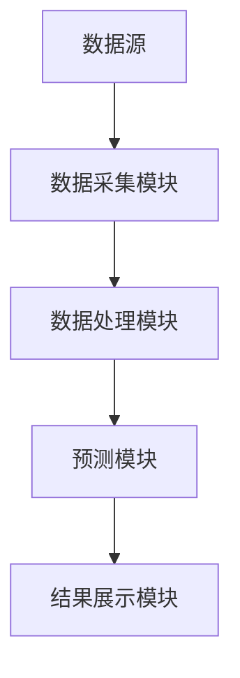

                 


# 《实时数据分析与预测》

---

## 关键词  
实时数据分析、预测模型、时间序列分析、机器学习、系统架构、数据预处理

---

## 摘要  
实时数据分析与预测是当前数据科学领域的核心技术之一，广泛应用于金融、医疗、交通、物联网等领域。本文从实时数据分析的基本概念出发，详细讲解了数据采集与预处理、预测算法、系统架构设计以及项目实战的全过程。通过理论与实践相结合的方式，帮助读者全面掌握实时数据分析与预测的核心技术与实现方法。

---

## 第一部分: 实时数据分析与预测概述

### 第1章: 实时数据分析与预测概述

#### 1.1 实时数据分析与预测的定义  
实时数据分析是指对数据流进行实时处理和分析，以快速获取有价值的信息的过程。预测则是基于历史数据和当前数据，利用算法对未来趋势或结果进行预测。实时数据分析与预测的核心在于数据的实时性和预测的准确性。

#### 1.2 数据实时性与预测的挑战  
数据的实时性要求系统能够在数据产生后立即进行处理和分析，这对系统的性能和响应速度提出了极高的要求。此外，预测模型需要在实时数据的基础上快速生成预测结果，这对算法的效率和模型的稳定性提出了挑战。

#### 1.3 应用场景与意义  
实时数据分析与预测在金融交易、股票价格预测、交通流量控制、医疗监测等领域具有广泛的应用。通过实时数据分析与预测，企业能够快速做出决策，优化业务流程，提升竞争力。

---

## 第二部分: 数据采集与预处理

### 第2章: 数据采集与实时传输

#### 2.1 数据采集方法  
数据采集是实时数据分析的第一步，主要包括以下几种方法：  
- **传感器数据采集**：通过传感器获取实时环境数据（如温度、湿度等）。  
- **日志数据采集**：从系统日志中提取实时信息。  
- **API接口采集**：通过API获取实时数据（如社交媒体数据、股票价格等）。  

#### 2.2 数据预处理与清洗  
数据预处理是确保数据质量的重要步骤，主要包括以下内容：  
- **数据清洗**：去除噪声数据、缺失值填充、异常值处理。  
- **数据标准化**：将数据转换到统一的尺度范围内。  
- **数据特征提取**：从原始数据中提取有助于预测的特征。  

#### 2.3 数据流处理系统架构  
数据流处理系统是实时数据分析的核心，其架构设计直接影响系统的性能和扩展性。常见的数据流处理架构包括：  
- **流式处理架构**：采用流式处理框架（如Apache Kafka、Apache Flink）对实时数据流进行处理。  
- **批流统一架构**：将实时数据与历史数据结合，进行统一处理。  

---

## 第三部分: 实时数据分析与预测算法

### 第3章: 时间序列分析与预测算法

#### 3.1 时间序列分析的基本概念  
时间序列分析是研究数据随时间变化的模式和趋势的过程。常见的时序分析方法包括：  
- **ARIMA模型**：自回归积分滑动平均模型，适用于线性时间序列数据。  
- **LSTM网络**：长短期记忆网络，适用于非线性时间序列数据。  
- **Prophet算法**：Facebook开源的时间序列预测算法，适合具有周期性数据的预测。  

#### 3.2 常见预测算法  
以下是一些常用的预测算法及其优缺点对比：  

| 算法名称   | 优点                           | 缺点                             |
|------------|--------------------------------|----------------------------------|
| ARIMA      | 简单易用，适合线性数据         | 不适合非线性数据                 |
| LSTM       | 能捕捉数据的长时依赖           | 训练时间长，计算资源消耗大       |
| Prophet    | �易用性强，适合周期性数据       | 对非周期性数据效果较差           |
| 随机森林回归 | 适合非线性数据，鲁棒性强       | 解释性较差                       |

#### 3.3 算法实现与优化  
以下是基于Python的ARIMA算法实现示例：  

```python
from statsmodels.tsa.arima.model import ARIMA
import pandas as pd
import numpy as np

# 生成模拟数据
data = pd.Series(np.random.randn(100), index=pd.date_range('2020-01-01', periods=100))

# ARIMA模型训练
model = ARIMA(data, order=(1, 1, 0))
model_fit = model.fit()

# 预测未来5步
forecast = model_fit.forecast(steps=5)
print(forecast)
```

---

## 第四部分: 实时数据分析系统架构

### 第4章: 系统架构设计

#### 4.1 系统功能设计  
实时数据分析系统的功能模块包括：  
- **数据采集模块**：负责实时数据的采集和传输。  
- **数据处理模块**：对采集到的数据进行预处理和特征提取。  
- **预测模块**：基于预处理后的数据，利用预测算法生成预测结果。  
- **结果展示模块**：将预测结果以可视化的方式展示给用户。  

#### 4.2 系统架构设计  
以下是实时数据分析系统的架构图（Mermaid）：



#### 4.3 系统性能优化  
为了提高系统的性能，可以采取以下优化措施：  
- 数据采集模块：使用异步采集技术，提高数据采集效率。  
- 数据处理模块：采用分布式计算框架（如Spark Streaming），提升数据处理能力。  
- 预测模块：优化算法模型，减少计算时间，例如使用预训练模型进行快速预测。  

---

## 第五部分: 项目实战与案例分析

### 第5章: 项目实战

#### 5.1 项目背景与需求分析  
以股票价格预测为例，假设我们希望通过实时数据分析预测股票的未来价格。项目需求包括：  
- 实时采集股票价格数据。  
- 对数据进行预处理和特征提取。  
- 使用LSTM模型进行股票价格预测。  

#### 5.2 项目核心实现  
以下是基于Python的LSTM模型实现示例：  

```python
import numpy as np
import pandas as pd
from keras.models import Sequential
from keras.layers import LSTM, Dense

# 生成模拟数据
data = np.random.randn(100, 1).reshape(-1, 1)
train_data = data[:80]
test_data = data[80:]

# 构建LSTM模型
model = Sequential()
model.add(LSTM(4, input_shape=(None, 1)))
model.add(Dense(1))
model.compile(loss='mean_squared_error', optimizer='adam')

# 训练模型
model.fit(train_data, train_data, epochs=10, batch_size=1)

# 预测测试数据
predictions = model.predict(test_data)
print(predictions)
```

#### 5.3 案例分析  
通过对股票价格数据的实时分析与预测，我们可以快速发现市场趋势，帮助投资者做出更明智的决策。然而，实时数据分析与预测也面临一些挑战，例如数据的实时性要求高、模型的泛化能力有限等。因此，在实际应用中，我们需要结合具体场景，选择合适的算法和优化策略。

---

## 第六部分: 最佳实践与总结

### 第6章: 最佳实践

#### 6.1 性能优化技巧  
- 在数据采集阶段，尽量减少数据传输的延迟。  
- 在数据处理阶段，采用分布式计算框架提升处理效率。  
- 在模型训练阶段，优化算法参数，减少计算时间。  

#### 6.2 数据安全注意事项  
- 确保数据采集和传输过程中的安全性，防止数据泄露。  
- 对敏感数据进行加密处理，确保数据隐私。  

#### 6.3 未来发展趋势  
- 随着AI技术的发展，实时数据分析与预测将更加智能化和自动化。  
- 基于边缘计算的实时数据分析将越来越重要，特别是在物联网领域。  

---

## 作者：AI天才研究院/AI Genius Institute & 禅与计算机程序设计艺术 /Zen And The Art of Computer Programming

---

通过以上内容，我们全面介绍了实时数据分析与预测的核心技术与实现方法。希望读者能够通过本文，掌握实时数据分析与预测的关键点，并在实际应用中取得良好的效果。

