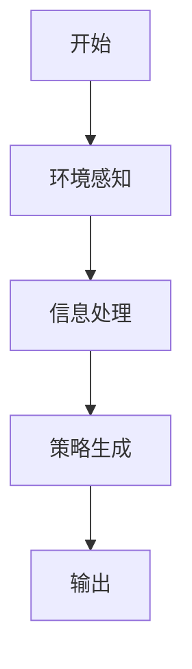
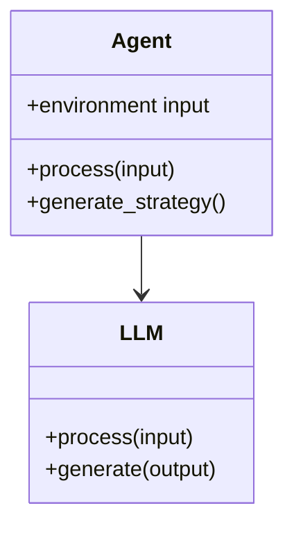

                 


# 实时策略生成AI Agent：LLM在动态决策中的应用

> 关键词：实时策略生成，AI Agent，LLM，动态决策，决策系统

> 摘要：本文探讨了实时策略生成AI Agent在动态决策中的应用，特别是大语言模型（LLM）在实时策略生成中的作用。文章从背景介绍、核心概念、算法原理、系统架构到项目实战，全面分析了实时策略生成AI Agent的实现与应用，并提供了详细的代码示例和案例分析。

---

# 第一部分: 实时策略生成AI Agent的背景与应用

## 第1章: 实时策略生成AI Agent的背景与应用

### 1.1 实时策略生成的定义与背景

#### 1.1.1 实时策略生成的基本概念
实时策略生成指的是在极短时间内根据当前环境状态生成最优或近似最优的决策策略。这种能力在许多领域中至关重要，例如游戏AI、自动驾驶、金融交易和机器人控制等。实时策略生成需要AI系统能够快速响应动态变化的环境，并做出适应性的决策。

#### 1.1.2 动态决策问题的背景
动态决策问题是指在环境不断变化的情况下，系统需要持续调整策略以应对新的挑战。传统的静态决策方法难以应对动态变化，而实时策略生成AI Agent通过动态调整策略，能够有效解决这类问题。动态决策问题广泛存在于现实世界中，例如交通管理、金融市场和军事指挥等领域。

#### 1.1.3 AI Agent在动态决策中的作用
AI Agent作为实时策略生成的核心，能够通过感知环境、分析信息和生成策略来实现动态决策。AI Agent的优势在于其能够快速处理大量数据，并通过机器学习算法不断优化决策策略。AI Agent的决策能力依赖于算法的先进性、数据的全面性以及系统的实时性。

---

### 1.2 LLM在实时策略生成中的应用

#### 1.2.1 LLM的定义与特点
大语言模型（LLM）是指基于大规模数据训练的深度学习模型，具有强大的自然语言处理能力。LLM的特点包括：
1. 大规模参数：通常包含 billions 级别的参数，能够捕捉复杂的语言模式。
2. 预训练与微调：通过大量无标签数据预训练，并在特定任务上进行微调。
3. 流式生成：能够逐步生成文本，适合实时策略生成。

#### 1.2.2 LLM在动态决策中的优势
LLM在动态决策中的优势主要体现在以下几点：
1. 自然语言处理能力：能够理解和生成人类语言，适用于复杂的决策场景。
2. 模型可解释性：通过生成可解释的文本，帮助人类理解AI的决策过程。
3. 实时响应：具备快速生成策略的能力，适用于需要实时反馈的场景。

#### 1.2.3 LLM在实时策略生成中的应用领域
LLM在实时策略生成中的应用领域包括：
1. 游戏AI：生成实时策略以优化游戏表现。
2. 自动驾驶：实时决策以应对交通变化。
3. 金融交易：实时生成交易策略以捕捉市场机会。
4. 机器人控制：实时生成动作策略以适应环境变化。

---

## 第2章: 实时策略生成AI Agent的核心概念与联系

### 2.1 实时策略生成AI Agent的核心原理
实时策略生成AI Agent的核心原理是通过感知环境、分析信息并生成最优策略。具体步骤包括：
1. 环境感知：通过传感器或数据源获取环境信息。
2. 信息处理：利用模型对信息进行分析和理解。
3. 策略生成：基于分析结果生成实时决策策略。

### 2.2 LLM与动态决策系统的联系
LLM与动态决策系统的联系主要体现在以下方面：
1. 输入输出接口：LLM作为决策系统的核心，接收输入并生成输出。
2. 模型训练：通过大量数据训练模型，使其具备动态决策能力。
3. 实时生成：利用LLM的流式生成能力，实现实时策略生成。

---

## 第3章: 实时策略生成AI Agent的算法原理

### 3.1 LLM的算法流程
LLM的算法流程包括以下步骤：
1. 数据预处理：对输入数据进行清洗和格式化。
2. 模型编码：将输入转换为模型能够处理的形式。
3. 模型推理：通过模型生成输出。
4. 结果解码：将模型输出转换为可理解的形式。

### 3.2 基于LLM的实时策略生成算法
基于LLM的实时策略生成算法如下：



---

## 第4章: 实时策略生成AI Agent的系统架构

### 4.1 系统功能模块设计
实时策略生成AI Agent的系统功能模块包括：
1. 数据输入模块：接收环境数据。
2. 模型处理模块：对数据进行处理和分析。
3. 策略生成模块：生成实时策略。
4. 输出模块：输出生成的策略。

### 4.2 系统架构设计
系统架构设计如下：



---

## 第5章: 项目实战

### 5.1 环境搭建
1. 安装Python和相关库：
   ```bash
   pip install torch transformers
   ```

2. 下载预训练模型：
   ```bash
   huggingface transformers --model_name gpt2
   ```

### 5.2 核心代码实现

```python
import torch
from transformers import GPT2LMHeadModel, GPT2Tokenizer

# 初始化模型和分词器
model_name = "gpt2"
model = GPT2LMHeadModel.from_pretrained(model_name)
tokenizer = GPT2Tokenizer.from_pretrained(model_name)

def generate_strategy(prompt):
    inputs = tokenizer(prompt, return_tensors="pt")
    outputs = model.generate(**inputs, max_length=50, do_sample=True)
    return tokenizer.decode(outputs[0], skip_special_tokens=True)

# 示例输入
prompt = "当前市场情况："
print(generate_strategy(prompt))
```

### 5.3 案例分析
通过上述代码，我们可以生成实时策略。例如，给定当前市场情况，模型会生成相应的投资策略。这种方法在金融交易和投资决策中具有广泛应用。

---

## 第6章: 总结与展望

### 6.1 全文总结
本文详细探讨了实时策略生成AI Agent的实现与应用，特别是LLM在动态决策中的作用。通过理论分析和实践案例，展示了实时策略生成AI Agent的潜力和优势。

### 6.2 未来展望
未来，实时策略生成AI Agent将在更多领域得到应用。研究方向包括优化模型性能、提高决策的可解释性和增强系统的实时性。

---

# 作者：AI天才研究院 & 禅与计算机程序设计艺术

---

以上是《实时策略生成AI Agent：LLM在动态决策中的应用》的完整内容，涵盖了背景、核心概念、算法原理、系统架构、项目实战和总结展望等多个方面，旨在为读者提供深入的技术见解。

