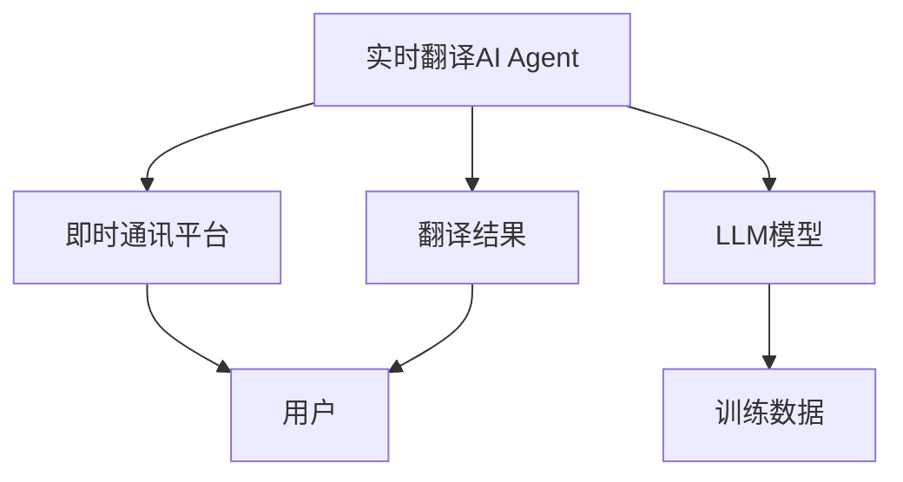

                 

# 实时翻译AI Agent：LLM在即时通讯中的应用

## 关键词：
实时翻译、LLM、AI Agent、即时通讯、自然语言处理

## 摘要：
本文探讨了实时翻译AI Agent在即时通讯中的应用，分析了大语言模型（LLM）如何实现实时翻译，并详细讲解了系统架构、算法原理和项目实现。通过Mermaid图和数学公式，深入剖析了实时翻译AI Agent的技术细节，为开发者提供实践指导。

---

## 第一部分: 实时翻译AI Agent的背景与核心概念

### 第1章: 实时翻译AI Agent的背景介绍

#### 1.1 问题背景
##### 1.1.1 实时翻译的需求与挑战
在多语言交流日益频繁的今天，实时翻译的需求急剧增加。即时通讯场景下，用户希望快速理解不同语言的信息，避免延迟和误解。然而，现有翻译技术存在以下挑战：
- **延迟问题**：传统翻译工具需要等待用户输入完整句话后才能翻译，影响实时性。
- **准确性不足**：基于规则的翻译工具难以处理复杂语境，导致翻译错误。
- **资源消耗**：实时翻译需要大量的计算资源，尤其是在移动端设备上。

##### 1.1.2 LLM在实时翻译中的优势
大语言模型（LLM）凭借其强大的自然语言处理能力，为实时翻译提供了新的解决方案。LLM的优势包括：
- **实时生成能力**：LLM可以逐词逐句实时生成翻译，实现近乎实时的响应。
- **上下文理解**：LLM能够理解上下文，提供更准确的翻译结果。
- **多语言支持**：LLM通常支持多种语言，能够处理复杂的多语言场景。

##### 1.1.3 即时通讯中的翻译应用场景
在即时通讯中，实时翻译的应用场景包括：
- **跨国通讯**：支持不同语言的用户进行实时交流。
- **社交网络**：用户可以在社交平台上实时阅读和回复多语言信息。
- **客户服务**：企业提供实时翻译支持，提升客户体验。

#### 1.2 问题描述
##### 1.2.1 现有翻译技术的局限性
现有翻译技术主要依赖统计机器翻译（SMT）和基于规则的翻译方法，存在以下局限性：
- **延迟高**：需要等待用户输入完整句话后才能进行翻译。
- **准确性低**：难以处理复杂的语法结构和语境。
- **资源消耗大**：需要大量的训练数据和计算资源。

##### 1.2.2 LLM在即时通讯中的潜在价值
LLM在即时通讯中的应用价值体现在：
- **实时性**：LLM可以逐词生成翻译，实现近乎实时的响应。
- **准确性**：LLM通过上下文理解，提供更准确的翻译结果。
- **灵活性**：LLM可以轻松扩展支持更多语言。

##### 1.2.3 实时翻译AI Agent的目标与边界
实时翻译AI Agent的目标是实现实时、准确、高效的翻译服务。其边界包括：
- **实时性**：翻译结果需要在用户输入的同时生成。
- **准确性**：翻译结果需要准确反映原意。
- **资源消耗**：需要在有限的计算资源下实现高效的翻译。

#### 1.3 问题解决思路
##### 1.3.1 LLM与实时翻译的结合方式
LLM与实时翻译的结合方式包括：
- **增量输入**：用户逐词输入，模型逐词生成翻译。
- **上下文记忆**：模型通过记忆上下文，提供更准确的翻译。
- **多语言支持**：模型支持多种语言，实现无缝切换。

##### 1.3.2 实时翻译AI Agent的核心功能
实时翻译AI Agent的核心功能包括：
- **实时翻译**：逐词逐句生成翻译结果。
- **上下文理解**：基于上下文优化翻译质量。
- **多语言支持**：支持多种语言的翻译。

##### 1.3.3 系统架构的设计原则
系统架构的设计原则包括：
- **模块化设计**：系统分为输入模块、翻译模块和输出模块。
- **高效性**：确保翻译过程高效，减少延迟。
- **可扩展性**：支持新增语言和功能的扩展。

#### 1.4 核心概念与外延
##### 1.4.1 实时翻译AI Agent的定义与组成
实时翻译AI Agent定义为：一个能够实时接收输入、生成翻译结果的智能体。其组成包括：
- **输入模块**：接收用户输入。
- **翻译模块**：负责生成翻译结果。
- **输出模块**：将翻译结果传递给用户。

##### 1.4.2 LLM在实时翻译中的角色与作用
LLM在实时翻译中的角色包括：
- **生成器**：生成翻译结果。
- **理解器**：理解输入文本的语义。
- **记忆模块**：记忆上下文信息。

##### 1.4.3 实时翻译的边界与应用场景
实时翻译的边界包括：
- **实时性**：翻译结果需要实时生成。
- **准确性**：翻译结果需要准确反映原意。
- **资源消耗**：需要在有限的计算资源下实现高效的翻译。

##### 1.4.4 实时翻译AI Agent的实体关系图

#### 1.5 本章小结
本章介绍了实时翻译AI Agent的背景，分析了现有翻译技术的局限性，提出了LLM在实时翻译中的优势，并详细描述了实时翻译AI Agent的核心概念和实体关系图。

---

## 第二部分: 实时翻译AI Agent的核心概念与联系

### 第2章: 实时翻译AI Agent的核心概念

#### 2.1 实时翻译AI Agent的定义与特点
##### 2.1.1 实时翻译AI Agent的定义
实时翻译AI Agent是一种能够实时接收输入、生成翻译结果的智能体。它通过LLM技术实现实时翻译，支持多种语言和复杂语境的理解。

##### 2.1.2 核心特点：实时性、准确性、智能化
- **实时性**：翻译结果在用户输入的同时生成。
- **准确性**：通过上下文理解，提供高质量的翻译。
- **智能化**：能够理解上下文，优化翻译结果。

##### 2.1.3 与其他翻译工具的区别
实时翻译AI Agent与传统翻译工具的区别在于：
- **实时性**：实时生成翻译结果。
- **准确性**：基于上下文优化翻译质量。
- **智能化**：具备理解和学习能力。

#### 2.2 LLM与实时翻译的关系
##### 2.2.1 LLM的基本原理
LLM基于概率生成模型，通过大量的训练数据学习语言的规律，生成符合语法规则的文本。

##### 2.2.2 LLM在实时翻译中的应用优势
- **实时生成能力**：LLM可以逐词生成翻译，实现近乎实时的响应。
- **上下文理解**：LLM能够理解上下文，提供更准确的翻译结果。
- **多语言支持**：LLM通常支持多种语言，能够处理复杂的多语言场景。

##### 2.2.3 LLM的局限性与改进方向
- **计算资源消耗大**：需要大量的计算资源支持实时翻译。
- **模型更新成本高**：模型更新需要重新训练，耗时耗力。
- **语境理解有限**：在复杂语境下，翻译结果可能不够准确。

#### 2.3 实时翻译AI Agent的核心要素
##### 2.3.1 自然语言处理模块
- **输入处理**：接收用户的输入，进行分词和语法分析。
- **翻译生成**：基于LLM生成翻译结果。
- **结果优化**：通过上下文优化翻译质量。

##### 2.3.2 实时通讯接口
- **输入接收**：接收用户的输入文本。
- **输出传递**：将翻译结果传递给用户。

##### 2.3.3 翻译引擎与优化算法
- **翻译引擎**：基于LLM的翻译模型，生成翻译结果。
- **优化算法**：通过优化算法提升翻译质量。

#### 2.4 实时翻译AI Agent的实体关系图

#### 2.5 本章小结
本章详细讲解了实时翻译AI Agent的核心概念，分析了LLM在实时翻译中的应用优势，并通过实体关系图展示了系统的组成和关系。

---

## 第三部分: 实时翻译AI Agent的算法原理

### 第3章: LLM的算法原理

#### 3.1 LLM的基本原理
##### 3.1.1 语言模型的定义
语言模型是一种能够生成或理解人类语言的模型，其核心是概率分布。

##### 3.1.2 基于概率的生成模型
LLM基于概率生成模型，通过给定前几个词的概率分布，生成后续词。

##### 3.1.3 大模型的

---

作者：AI天才研究院/AI Genius Institute & 禅与计算机程序设计艺术 /Zen And The Art of Computer Programming

