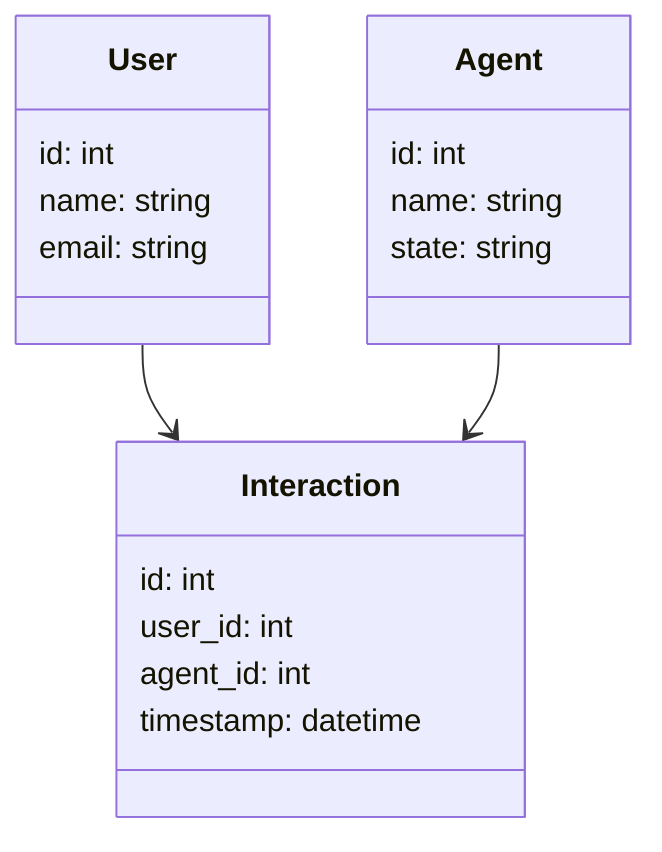
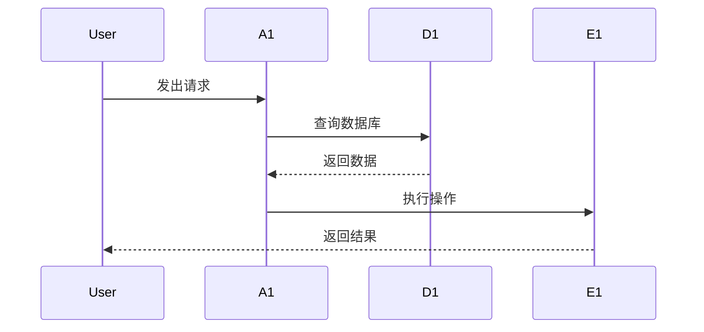

                 


# 实现AI Agent与传统IT系统的无缝集成

## 关键词：
AI Agent, 传统IT系统, 系统集成, 人工智能, 知识图谱, 自然语言处理, 机器学习

## 摘要：
本文详细探讨了AI Agent与传统IT系统无缝集成的背景、原理、方法和实际应用。通过分析AI Agent的核心技术，如自然语言处理和机器学习，结合传统IT系统的架构和功能，提出了一种系统的集成方案。文章还通过具体案例展示了如何在实际项目中实现这种集成，并提供了最佳实践和注意事项，帮助读者在实际应用中规避常见问题，提升系统性能和用户体验。

---

## 第一部分: AI Agent与传统IT系统集成的背景与基础

### 第1章: AI Agent与传统IT系统概述

#### 1.1 AI Agent的基本概念
##### 1.1.1 什么是AI Agent
AI Agent（人工智能代理）是一种能够感知环境、自主决策并执行任务的智能实体。它能够通过传感器获取信息，利用算法进行分析和推理，并通过执行器对外界产生影响。

##### 1.1.2 AI Agent的核心特征
- **自主性**：能够在没有外部干预的情况下独立运作。
- **反应性**：能够实时感知环境变化并做出反应。
- **主动性**：主动寻求目标，而不是被动响应。
- **社会性**：能够与其他AI Agent或人类进行交互和协作。

##### 1.1.3 AI Agent与传统软件的区别
| 特性       | AI Agent              | 传统软件          |
|------------|-----------------------|-------------------|
| 智能水平    | 高                   | 低或无           |
| 学习能力    | 强                   | 无或弱           |
| 自主性      | 高                   | 低或无           |
| 适应性      | 强                   | 一般或无         |

---

#### 1.2 传统IT系统的构成
##### 1.2.1 传统IT系统的定义
传统IT系统是指基于计算机技术和网络技术构建的信息化系统，通常包括操作系统、数据库、应用程序和网络设备。

##### 1.2.2 传统IT系统的组成部分
- **硬件**：服务器、终端、存储设备等。
- **软件**：操作系统、数据库管理系统、应用程序。
- **网络**：局域网、广域网等。
- **数据**：结构化和非结构化的数据存储。

##### 1.2.3 传统IT系统的优缺点
| 优点       | 缺点                 |
|------------|----------------------|
| 稳定性      | 创新性不足           |
| 可靠性      | 扩展性有限           |
| �易用性      | 人工干预较多         |

---

#### 1.3 AI Agent与传统IT系统的结合意义
##### 1.3.1 提升系统智能化水平
通过AI Agent，传统IT系统能够实现自动化决策和问题解决，减少人工干预。

##### 1.3.2 增强系统灵活性与适应性
AI Agent能够快速适应环境变化，使传统IT系统更具灵活性。

##### 1.3.3 优化企业运营效率
AI Agent可以优化业务流程，提高效率，降低成本。

---

## 第二部分: AI Agent与传统IT系统的集成原理

### 第2章: AI Agent的核心技术与实现

#### 2.1 AI Agent的核心技术
##### 2.1.1 自然语言处理（NLP）
NLP用于理解和生成人类语言，使AI Agent能够与人类进行自然对话。

##### 2.1.2 机器学习（ML）
ML使AI Agent能够从数据中学习模式，并进行预测和分类。

##### 2.1.3 知识图谱与推理
知识图谱为AI Agent提供知识库，支持复杂的逻辑推理。

---

#### 2.2 AI Agent的实现流程
##### 2.2.1 需求分析与目标设定
明确AI Agent的功能需求，确定目标。

##### 2.2.2 数据采集与预处理
从传统IT系统中获取数据，并进行清洗和标注。

##### 2.2.3 模型训练与优化
使用机器学习算法训练模型，并进行调优。

##### 2.2.4 系统集成与部署
将AI Agent集成到传统IT系统中，并进行测试和优化。

---

#### 2.3 AI Agent的算法实现
##### 2.3.1 基于规则的AI Agent
```python
# 示例：基于规则的简单AI Agent
def decide_action(sensor_data):
    if sensor_data['temperature'] > 30:
        return 'cooling'
    elif sensor_data['temperature'] < 20:
        return 'heating'
    else:
        return 'no_action'
```

##### 2.3.2 基于模型的AI Agent
```python
# 示例：基于机器学习的AI Agent
import tensorflow as tf
model = tf.keras.Sequential([
    tf.keras.layers.Dense(64, activation='relu'),
    tf.keras.layers.Dense(1, activation='sigmoid')
])
model.compile(optimizer='adam', loss='binary_crossentropy')
```

##### 2.3.3 基于强化学习的AI Agent
```python
# 示例：强化学习AI Agent的简单实现
import numpy as np
class Agent:
    def __init__(self, state_space, action_space):
        self.state_space = state_space
        self.action_space = action_space
        # 初始化策略网络
        self.policy = np.random.rand(state_space, action_space)
```

---

## 第三部分: 传统IT系统的智能化改造

### 第3章: 传统IT系统的智能化需求分析

#### 3.1 传统IT系统的痛点与挑战
##### 3.1.1 系统耦合度过高
传统系统模块之间耦合度过高，难以单独升级或修改。

##### 3.1.2 人工干预过多
传统系统需要大量人工操作，效率低下。

##### 3.1.3 系统扩展性不足
传统系统难以快速扩展，难以应对业务增长。

---

#### 3.2 AI Agent对传统IT系统的价值
##### 3.2.1 提高系统智能化水平
通过AI Agent，系统能够自动完成复杂任务，减少人工干预。

##### 3.2.2 增强系统灵活性与适应性
AI Agent能够快速适应环境变化，使系统更具灵活性。

##### 3.2.3 优化企业运营效率
AI Agent可以优化业务流程，提高效率，降低成本。

---

## 第四部分: AI Agent与传统IT系统的集成方案

### 第4章: 系统分析与架构设计方案

#### 4.1 项目场景介绍
假设我们正在开发一个智能客服系统，结合AI Agent实现自动化问答和任务处理。

---

#### 4.2 系统功能设计
##### 4.2.1 领域模型设计


---

#### 4.3 系统架构设计
```mermaid
div class="mermaid"
graph LR
    I1[用户] --> S1[传感器]
    S1 --> A1[AI Agent]
    A1 --> D1[数据库]
    A1 --> E1[执行器]
    E1 --> S2[效果]
```

---

#### 4.4 系统接口设计
##### 4.4.1 接口定义
- **输入接口**：从传感器获取数据。
- **输出接口**：通过执行器输出结果。
- **数据接口**：与数据库进行交互。

##### 4.4.2 接口交互流程


---

## 第五部分: 项目实战

### 第5章: 实现AI Agent与传统IT系统的集成

#### 5.1 环境安装
- 安装Python 3.8+
- 安装TensorFlow、Keras、Scikit-learn等库。

#### 5.2 核心代码实现
##### 5.2.1 数据预处理
```python
import pandas as pd

# 加载数据
data = pd.read_csv('data.csv')

# 数据清洗
data = data.dropna()
```

##### 5.2.2 模型训练
```python
from sklearn.model import LogisticRegression

model = LogisticRegression()
model.fit(X_train, y_train)
```

##### 5.2.3 系统集成
```python
# 示例：将AI Agent集成到传统IT系统
def integrate_agent(system, agent):
    system.agent = agent
    return system

# 初始化传统IT系统
system = TraditionalSystem()
agent = AIAGENT()

# 集成
integrated_system = integrate_agent(system, agent)
```

---

#### 5.3 代码解读与分析
- **数据预处理**：清洗数据，确保模型输入的正确性。
- **模型训练**：使用机器学习算法训练模型，提高AI Agent的智能水平。
- **系统集成**：将AI Agent与传统IT系统进行集成，确保两者协同工作。

---

#### 5.4 实际案例分析
假设我们正在开发一个智能客服系统，结合AI Agent实现自动化问答和任务处理。

---

## 第六部分: 最佳实践、小结与注意事项

### 第6章: 最佳实践

#### 6.1 小结
通过本文的介绍，我们了解了AI Agent与传统IT系统无缝集成的背景、原理、方法和实际应用。AI Agent的引入能够显著提升传统IT系统的智能化水平和运营效率。

#### 6.2 注意事项
- 确保数据安全和隐私保护。
- 定期更新模型，保持AI Agent的智能水平。
- 建立完善的监控机制，及时发现和解决问题。

#### 6.3 拓展阅读
- 《机器学习实战》
- 《深度学习入门：基于Python和Keras》
- 《自然语言处理入门》

---

## 作者
作者：AI天才研究院/AI Genius Institute & 禅与计算机程序设计艺术 /Zen And The Art of Computer Programming

