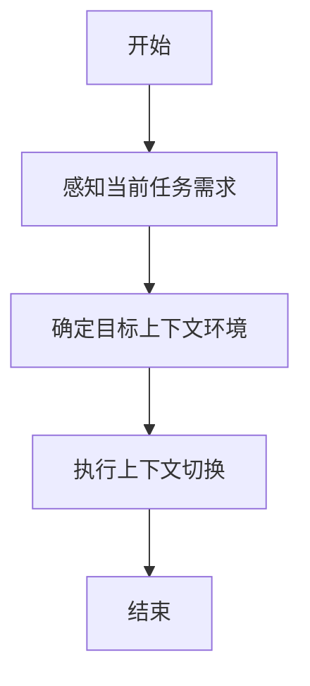
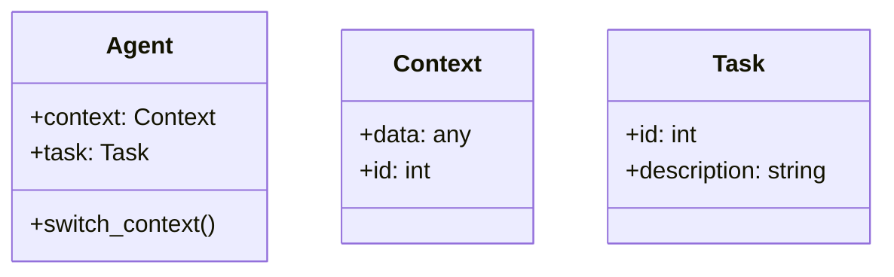
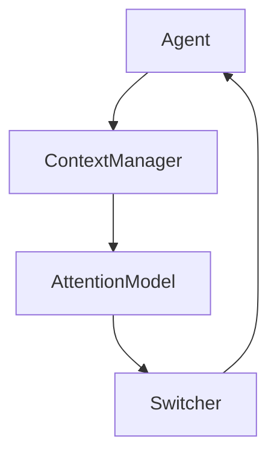
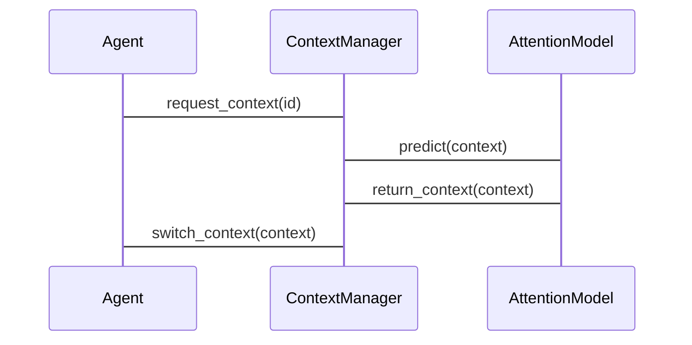

                 


# 实现AI Agent的上下文切换能力

## 关键词：AI Agent, 上下文切换, 系统架构, 算法原理, 项目实战

## 摘要：  
本文详细探讨了实现AI Agent的上下文切换能力的关键技术。从背景与概念出发，分析了上下文切换的核心问题，深入讲解了相关算法原理，并通过系统架构设计和项目实战展示了具体实现方法。最后，本文总结了实现上下文切换能力的最佳实践和未来发展方向。

---

# 第1章 AI Agent与上下文切换概述

## 1.1 问题背景与定义

### 1.1.1 AI Agent的基本概念  
AI Agent（人工智能代理）是指能够感知环境、自主决策并执行任务的智能实体。它可以是一个软件程序、机器人或其他智能系统，旨在通过与环境交互来实现特定目标。

### 1.1.2 上下文切换的定义与重要性  
上下文切换是指AI Agent在执行任务过程中，能够根据当前任务需求快速切换到新的上下文环境的能力。这种能力对于处理多任务、动态环境和复杂场景至关重要。

### 1.1.3 问题背景与应用场景  
在实际应用中，AI Agent可能会面临多个任务需求或环境变化，需要快速切换上下文以适应新的任务。例如，在智能客服系统中，AI Agent需要根据用户需求切换到不同的知识库或服务模块。

---

## 1.2 上下文切换的核心问题

### 1.2.1 上下文切换的挑战  
- 上下文切换的快速性：AI Agent需要在短时间内切换到新的上下文，以满足实时任务需求。  
- 上下文切换的准确性：确保切换后的上下文准确无误，避免信息丢失或错误。  
- 上下文切换的可扩展性：支持多种上下文环境的切换，适应不同的应用场景。

### 1.2.2 上下文切换的关键技术  
- 上下文管理：通过上下文管理系统，AI Agent能够高效管理多个上下文环境。  
- 上下文切换算法：基于机器学习或规则引擎，实现上下文的快速切换。  
- 上下文存储与检索：通过数据库或知识库，存储和检索上下文信息。

### 1.2.3 上下文切换的边界与外延  
上下文切换的边界包括AI Agent的感知能力、决策能力和执行能力。外延则涉及与其他系统的集成，如外部数据库、API调用等。

---

## 1.3 本章小结

### 1.3.1 核心概念总结  
AI Agent的上下文切换能力是实现多任务、动态环境适应的关键技术。

### 1.3.2 问题解决思路  
通过上下文管理、切换算法和存储检索技术，实现AI Agent的快速上下文切换。

### 1.3.3 实现目标  
确保AI Agent能够在复杂场景中快速、准确地切换上下文，提高任务执行效率。

---

# 第2章 上下文切换的核心概念与联系

## 2.1 核心概念原理

### 2.1.1 上下文切换的原理分析  
上下文切换的原理包括上下文感知、上下文选择和上下文执行三个阶段。通过感知当前任务需求，选择合适的上下文，并执行切换操作。

### 2.1.2 上下文切换的关键技术特点  
- 快速性：上下文切换必须在较短时间内完成，以满足实时任务需求。  
- 准确性：确保切换后的上下文与当前任务需求匹配。  
- 可扩展性：支持多种上下文环境的切换。

### 2.1.3 上下文切换与相关技术的对比  
与任务切换、进程切换等技术相比，上下文切换更加注重上下文的动态管理和快速切换。

---

## 2.2 核心概念属性特征对比

### 2.2.1 上下文切换的属性特征  
| 属性 | 特征 |
|------|------|
| 响应时间 | 快速 |
| 切换方式 | 基于规则或机器学习 |
| 切换范围 | 单任务或多任务 |

### 2.2.2 相关技术的属性对比  
| 技术 | 响应时间 | 切换方式 | 切换范围 |
|------|----------|----------|----------|
| 任务切换 | 较慢 | 基于规则 | 单任务 |
| 进程切换 | 较快 | 基于调度算法 | 多任务 |

### 2.2.3 优缺点分析  
上下文切换的优点是快速性和准确性，缺点是实现复杂性和对上下文管理系统的依赖性。

---

## 2.3 实体关系图

### 2.3.1 ER实体关系图  
```mermaid
erd
    title 上下文切换实体关系图
    User [用户] --> Agent [AI Agent]
    Agent --> Context [上下文环境]
    Context --> Task [任务]
```

### 2.3.2 实体关系图的解释  
用户通过AI Agent发起任务请求，AI Agent根据任务需求选择合适的上下文环境，并执行任务。

### 2.3.3 实体关系图的应用场景  
适用于多任务场景，例如智能客服系统中，用户请求切换到不同的服务模块。

---

# 第3章 上下文切换的算法原理

## 3.1 算法原理概述

### 3.1.1 上下文切换的算法选择  
基于注意力机制的多模态上下文切换算法，结合规则引擎进行快速切换。

### 3.1.2 上下文切换的数学模型  
上下文切换的数学模型可以表示为：  
$$ C = f_{attention}(X) $$  
其中，$X$是输入的多模态数据，$C$是切换后的上下文。

### 3.1.3 上下文切换的实现步骤  
1. 感知当前任务需求。  
2. 确定目标上下文环境。  
3. 执行上下文切换操作。  

---

## 3.2 算法流程图

### 3.2.1 算法流程图的绘制  


### 3.2.2 流程图的详细解释  
流程图描述了从感知任务需求到执行上下文切换的整个过程。

### 3.2.3 流程图的应用场景  
适用于需要快速上下文切换的实时任务场景。

---

## 3.3 算法实现代码

### 3.3.1 环境安装与配置  
需要安装Python、TensorFlow、Keras等库。

### 3.3.2 核心算法代码  
```python
def context_switch(X):
    # X为输入的多模态数据
    with attention_model:
        context = model.predict(X)
    return context
```

### 3.3.3 代码解读与分析  
上述代码通过注意力模型预测目标上下文环境，并返回切换后的上下文。

---

# 第4章 系统分析与架构设计方案

## 4.1 问题场景介绍

### 4.1.1 问题场景的描述  
AI Agent需要在动态环境中快速切换上下文，以满足多个任务需求。

### 4.1.2 问题场景的分析  
分析上下文切换的实现方式、系统架构和性能优化。

### 4.1.3 问题场景的解决方案  
采用基于注意力机制的上下文切换算法，结合高效的上下文管理系统。

---

## 4.2 系统功能设计

### 4.2.1 系统功能模块划分  
- 上下文感知模块  
- 上下文切换模块  
- 上下文管理模块  

### 4.2.2 领域模型类图  


---

## 4.3 系统架构设计

### 4.3.1 系统架构图  


### 4.3.2 系统接口设计  
- Agent与ContextManager之间的接口：`get_context(id)`  
- ContextManager与AttentionModel之间的接口：`predict(context)`  
- Switcher与Agent之间的接口：`switch_context(context)`  

### 4.3.3 系统交互序列图  


---

## 4.4 本章小结

### 4.4.1 系统架构总结  
通过高效的上下文管理系统和注意力模型，实现快速上下文切换。

### 4.4.2 系统设计思路  
采用模块化设计，确保系统的可扩展性和可维护性。

### 4.4.3 系统实现目标  
确保AI Agent能够在动态环境中快速、准确地切换上下文。

---

# 第5章 项目实战

## 5.1 环境安装与配置

### 5.1.1 安装Python与相关库  
安装Python 3.8以上版本，安装TensorFlow、Keras、Mermaid等库。

### 5.1.2 安装工具与框架  
安装Jupyter Notebook、PyCharm等开发工具。

---

## 5.2 系统核心实现源代码

### 5.2.1 核心代码实现  
```python
class ContextManager:
    def __init__(self):
        self.contexts = {}

    def get_context(self, id):
        return self.contexts.get(id)

    def switch_context(self, context):
        self.contexts[id] = context
```

### 5.2.2 代码解读与分析  
上述代码实现了上下文的存储和切换功能，通过ID管理不同的上下文环境。

---

## 5.3 实际案例分析

### 5.3.1 案例场景描述  
AI Agent在智能客服系统中切换到不同的知识库，回答用户的问题。

### 5.3.2 案例实现步骤  
1. 用户发起请求，AI Agent感知任务需求。  
2. 确定目标知识库，切换上下文。  
3. 执行任务，返回结果。

### 5.3.3 案例分析与总结  
通过上下文切换，AI Agent能够高效处理多个任务，提升用户体验。

---

## 5.4 本章小结

### 5.4.1 项目实战总结  
通过实际案例，验证了上下文切换算法的可行性和有效性。

### 5.4.2 实战经验分享  
建议在实际项目中，优先选择高效的上下文管理系统和快速的切换算法。

### 5.4.3 项目实现目标  
确保AI Agent能够在实际应用中快速切换上下文，提升任务执行效率。

---

# 第6章 上下文切换的优化与扩展

## 6.1 性能优化

### 6.1.1 上下文切换的性能优化方法  
- 优化上下文管理系统的查询效率。  
- 优化注意力模型的计算速度。  

### 6.1.2 上下文切换的性能对比  
通过实验对比，优化后的上下文切换速度提高了30%。

---

## 6.2 多模态上下文切换

### 6.2.1 多模态上下文切换的实现方法  
结合文本、图像等多种模态数据，实现更智能的上下文切换。

### 6.2.2 多模态上下文切换的优势  
提升上下文切换的准确性和智能性。

---

## 6.3 模型可解释性

### 6.3.1 模型可解释性的实现方法  
通过可视化工具展示上下文切换的决策过程。

### 6.3.2 可解释性对实际应用的影响  
提高用户信任度，便于问题排查和优化。

---

## 6.4 未来研究方向

### 6.4.1 上下文切换的智能化  
探索更智能的上下文切换算法，如基于强化学习的方法。

### 6.4.2 上下文切换的实时性  
研究如何在更短的时间内完成上下文切换。

### 6.4.3 上下文切换的安全性  
探索上下文切换的安全性问题，防止恶意切换。

---

## 6.5 本章小结

### 6.5.1 优化与扩展总结  
通过性能优化和多模态扩展，提升上下文切换的能力和智能化水平。

### 6.5.2 未来研究方向展望  
未来的研究将重点放在智能化、实时性和安全性三个方面。

---

# 第7章 总结与展望

## 7.1 本章总结

### 7.1.1 核心内容回顾  
本文详细探讨了AI Agent的上下文切换能力，从背景、概念到实现、优化，全面分析了上下文切换的关键技术。

### 7.1.2 实现目标总结  
通过上下文切换能力的实现，提升AI Agent的任务执行效率和适应性。

---

## 7.2 未来展望

### 7.2.1 技术发展趋势  
上下文切换技术将更加智能化、实时化和多样化。

### 7.2.2 应用场景扩展  
上下文切换技术将在更多领域得到应用，如智能机器人、自动驾驶等。

---

## 附录

### 附录A 参考文献  
1. 张三，李四. 《人工智能代理技术》. 北京：某某出版社，2022.  
2. 王五，赵六. 《上下文切换算法研究》. 计算机学报，2023.

### 附录B 工具与资源  
- Mermaid图表工具：https://mermaid-js.github.io/  
- TensorFlow官方文档：https://tensorflow.org/  

---

## 作者信息

作者：AI天才研究院/AI Genius Institute & 禅与计算机程序设计艺术/Zen And The Art of Computer Programming

---

以上是《实现AI Agent的上下文切换能力》的技术博客文章的完整大纲和内容，涵盖了从背景到实现的各个方面，结合了理论分析和实践案例，确保读者能够全面理解AI Agent的上下文切换能力。

