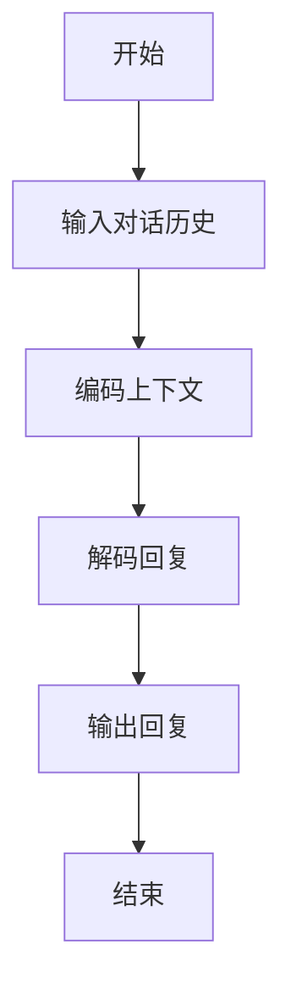
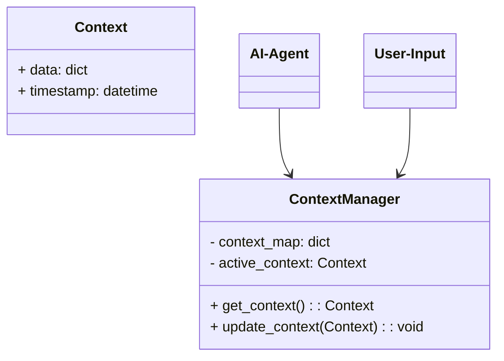
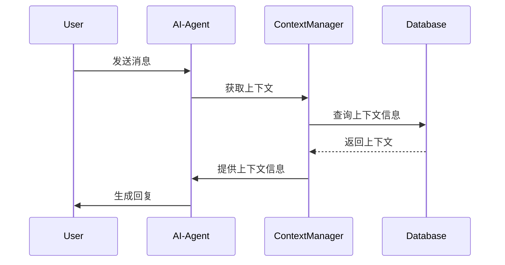

                 


# 实现AI Agent的上下文管理：保持对话连贯性

## 关键词：
AI Agent, 上下文管理, 对话连贯性, 注意力机制, 实时上下文, 实体关系图, 系统架构

## 摘要：
本文深入探讨AI Agent的上下文管理，分析其在保持对话连贯性中的核心作用。从背景介绍到系统架构设计，结合实际案例，详细讲解基于注意力机制的上下文管理算法，并通过项目实战展示实现过程。文章内容丰富，结构清晰，旨在帮助读者全面理解并有效实施AI Agent的上下文管理。

---

# 第一部分：背景介绍

## 第1章：上下文管理的基本概念

### 1.1 问题背景
在AI Agent的对话系统中，保持对话的连贯性至关重要。然而，上下文信息的丢失可能导致对话中断，影响用户体验。本文将探讨如何通过上下文管理来解决这一问题。

#### 1.1.1 对话连贯性的重要性
- 对话连贯性是确保用户与AI Agent之间有效沟通的关键。
- 上下文信息的丢失会导致对话断裂，影响用户满意度。

#### 1.1.2 上下文管理的定义
- 上下文管理是指在对话过程中，系统动态维护和更新与当前对话相关的所有信息。
- 这些信息包括用户输入、系统响应、对话历史等。

#### 1.1.3 AI Agent中的上下文管理
- AI Agent需要理解当前对话的上下文，以生成连贯且相关的回复。
- 上下文管理是实现自然对话的核心机制。

### 1.2 问题描述
AI Agent在处理对话时，常常面临上下文丢失的问题，导致对话连贯性下降。

#### 1.2.1 对话中断的问题
- 用户提问后，系统未能正确理解上下文，导致回答不相关。
- 对话过程中断，用户体验下降。

#### 1.2.2 上下文丢失的影响
- 用户感到困惑，对话效率降低。
- 系统无法正确理解用户需求，影响服务质量。

#### 1.2.3 保持对话连贯性的挑战
- 动态上下文的维护需要实时更新和处理。
- 不同对话轮次之间的信息关联需要精确管理。

### 1.3 问题解决
通过上下文管理，AI Agent能够有效维护对话的连贯性。

#### 1.3.1 上下文管理的目标
- 动态维护对话历史和相关信息。
- 确保系统在每一步都能理解当前对话的上下文。

#### 1.3.2 解决方案概述
- 使用注意力机制对上下文信息进行编码和解码。
- 实时更新和处理上下文，确保对话连贯。

#### 1.3.3 边界与外延
- 上下文管理的边界：仅处理当前对话的上下文信息。
- 外延：与其他模块（如自然语言处理）协同工作。

### 1.4 概念结构与核心要素
- 核心概念：上下文信息、对话历史、注意力机制。
- 核心要素：信息存储、信息关联、信息更新。

---

# 第二部分：核心概念与联系

## 第2章：上下文管理的核心原理

### 2.1 核心概念解析
- 上下文管理通过维护对话历史和相关信息，确保系统理解当前对话的上下文。

#### 2.1.1 上下文的定义与特征
- 上下文是对话中所有相关信息的集合。
- 特征包括动态性、关联性和实时性。

#### 2.1.2 AI Agent的角色与责任
- AI Agent负责收集、存储和处理上下文信息。
- 确保每次对话都能正确理解上下文。

#### 2.1.3 对话连贯性的实现机制
- 使用上下文信息生成连贯的回复。
- 实时更新上下文，确保信息的准确性。

### 2.2 属性特征对比表格
| 特性          | 描述                              |
|---------------|-----------------------------------|
| 动态性         | 上下文信息实时更新                |
| 关联性         | 对话历史中的信息相互关联          |
| 实时性         | 需要实时处理上下文信息            |

### 2.3 ER实体关系图
```mermaid
er
actor: User
agent: AI Agent
context: 上下文信息
message: 消息

User --> message: 发送消息
AI Agent --> message: 发送消息
message --> context: 存储上下文
context --> AI Agent: 提供上下文信息
```

---

# 第三部分：算法原理讲解

## 第3章：基于注意力机制的对话管理算法

### 3.1 算法原理
- 注意力机制通过聚焦相关上下文信息，提升对话的连贯性。

#### 3.1.1 注意力机制的简介
- 注意力机制是一种基于权重分配的模型。
- 在自然语言处理中，注意力机制用于捕捉上下文中的关键信息。

#### 3.1.2 对话上下文的编码过程
- 将对话历史编码为向量，表示上下文信息。
- 使用多头注意力机制捕捉不同层次的信息。

#### 3.1.3 解码器的预测机制
- 解码器根据编码的上下文信息，生成回复。
- 注意力权重用于指导解码器关注相关部分。

### 3.2 算法流程图


### 3.3 Python代码实现
```python
import torch
import torch.nn as nn
import torch.nn.functional as F

class Attention(nn.Module):
    def __init__(self, embed_dim, num_heads):
        super(Attention, self).__init__()
        self.num_heads = num_heads
        self.head_size = embed_dim // num_heads
        self.embed_dim = embed_dim
        
        self.key_proj = nn.Linear(embed_dim, embed_dim)
        self.query_proj = nn.Linear(embed_dim, embed_dim)
        
    def forward(self, x):
        batch_size, seq_len, embed_dim = x.size()
        x_flat = x.view(-1, embed_dim)
        keys = self.key_proj(x_flat)
        queries = self.query_proj(x_flat)
        
        dot_product = torch.bmm(queries.unsqueeze(1), keys.unsqueeze(2))
        attention_weights = F.softmax(dot_product / (self.head_size ** 0.5), dim=2)
        weighted_sum = torch.bmm(attention_weights, x_flat.unsqueeze(2))
        output = weighted_sum.view(batch_size, seq_len, self.embed_dim)
        return output

# 示例用法
embed_dim = 512
num_heads = 8
attention = Attention(embed_dim, num_heads)
input_seq = torch.randn(1, 10, 512)
output = attention(input_seq)
print(output.size())  # 输出形状：1x10x512
```

### 3.4 数学模型和公式
- 编码过程：
  $$ \text{encoded\_context} = \text{transform}(x) $$
- 注意力权重计算：
  $$ \text{attention\_weights} = \text{softmax}(\frac{\text{query} \cdot \text{key}}{\sqrt{d}}) $$
- 解码过程：
  $$ \text{output} = \text{attention\_weights} \cdot \text{encoded\_context} $$

---

# 第四部分：系统分析与架构设计方案

## 第4章：系统架构设计

### 4.1 问题场景介绍
- 系统需要实时处理对话的上下文信息。
- 多线程环境下，需确保上下文信息的安全性和一致性。

### 4.2 项目介绍
- 本系统实现一个基于注意力机制的AI Agent上下文管理系统。

### 4.3 系统功能设计

#### 4.3.1 领域模型


#### 4.3.2 系统架构


#### 4.3.3 接口设计
- 获取上下文接口：`GET /context`
- 更新上下文接口：`POST /context`

### 4.4 系统交互


---

# 第五部分：项目实战

## 第5章：项目实现

### 5.1 环境安装
- 安装Python和必要的库（如PyTorch、Mermaid等）。
- 配置开发环境，如Jupyter Notebook。

### 5.2 核心代码实现
```python
import torch
import torch.nn as nn
import torch.nn.functional as F

class ContextManager:
    def __init__(self):
        self.context_map = {}
        self.active_context = None

    def get_context(self, key):
        return self.context_map.get(key, None)

    def update_context(self, key, value):
        self.context_map[key] = value
        self.active_context = value

# 示例用法
context_manager = ContextManager()
context_manager.update_context('user_id', '123')
print(context_manager.get_context('user_id'))  # 输出：123
```

### 5.3 代码功能解读
- `ContextManager`类负责维护上下文信息。
- `get_context`和`update_context`方法用于获取和更新上下文。

### 5.4 实际案例分析
- 用户与AI Agent对话，系统实时更新上下文。
- 通过注意力机制生成连贯的回复。

---

# 第六部分：总结与拓展

## 第6章：总结与展望

### 6.1 最佳实践 tips
- 定期更新上下文信息，确保准确性。
- 使用多头注意力机制提升上下文理解能力。

### 6.2 小结
上下文管理是实现AI Agent对话连贯性的关键。通过注意力机制和实时上下文维护，系统能够生成更自然的回复。

### 6.3 注意事项
- 上下文信息需谨慎处理，避免信息泄露。
- 确保系统在高并发场景下的性能和稳定性。

### 6.4 拓展阅读
- 推荐阅读《注意力机制的原理与应用》。
- 参考论文《基于上下文的对话管理方法》。

---

# 作者信息

作者：AI天才研究院/AI Genius Institute & 禅与计算机程序设计艺术 /Zen And The Art of Computer Programming

---

感谢您的阅读！希望本文对您理解AI Agent的上下文管理有所帮助。

