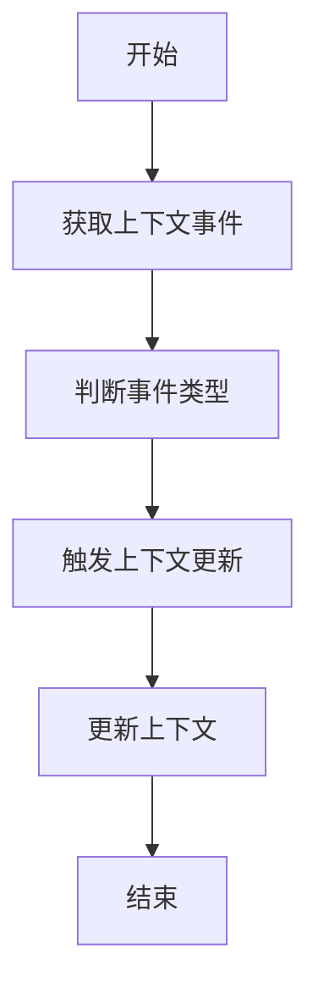
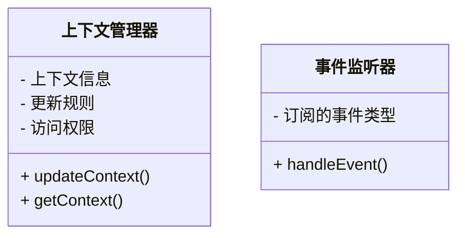
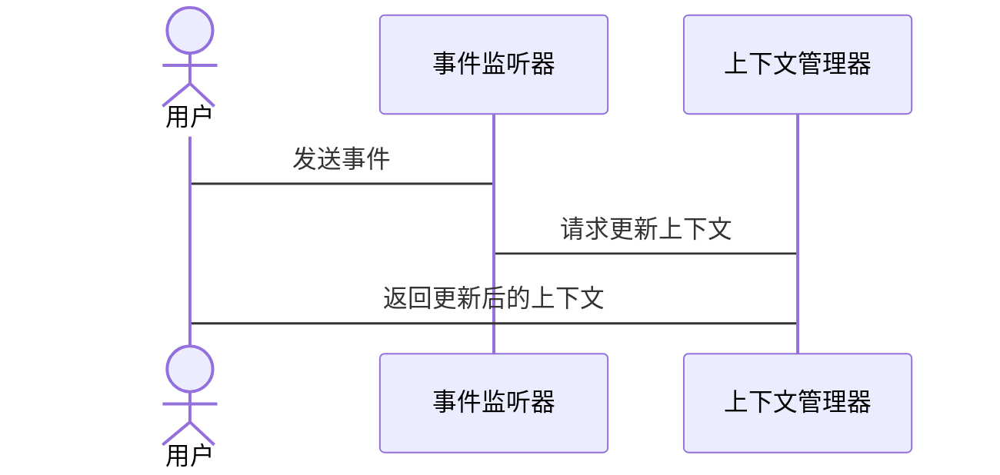

                 


# 实现AI Agent的动态上下文管理

## 关键词
AI Agent, 动态上下文管理, 人工智能, 上下文计算, 动态系统, 系统架构

## 摘要
AI Agent的动态上下文管理是实现智能系统高效运作的核心技术。本文将详细介绍动态上下文管理的基本概念、算法原理、系统架构及其实现案例，帮助读者全面理解如何在AI Agent中有效地管理动态上下文。

---

## 第一部分: AI Agent与动态上下文管理概述

### 第1章: AI Agent的基本概念与背景

#### 1.1 AI Agent的定义与特点
AI Agent（智能体）是指在计算环境中能够感知环境并采取行动以实现目标的实体。其特点包括自主性、反应性、主动性、社交能力和社会性。AI Agent能够根据环境信息动态调整行为，这使其在复杂场景中具有强大的适应能力。

#### 1.2 动态上下文管理的背景与意义
在AI Agent的实际应用中，环境信息的动态变化要求系统能够实时更新和管理上下文信息。动态上下文管理通过捕捉环境变化，调整系统行为，从而提高AI Agent的智能性和灵活性。其意义在于提升系统的动态适应能力和用户体验。

#### 1.3 AI Agent与动态上下文管理的关系
动态上下文管理是AI Agent实现智能决策的关键支撑。AI Agent通过动态上下文管理获取实时信息，从而做出更准确的判断和响应。这种管理方式不仅增强了系统的动态适应性，还优化了资源利用效率。

---

## 第二部分: 动态上下文管理的核心概念

### 第2章: 动态上下文管理的定义与特点
动态上下文管理是指在系统运行过程中，实时更新和维护上下文信息，以适应环境变化的过程。其特点包括动态性、实时性和上下文相关性。

### 第3章: 动态上下文管理的核心要素
动态上下文管理的核心要素包括上下文的表示与存储、动态更新机制以及上下文的访问与控制。通过这些要素，系统能够高效地管理上下文信息。

### 第4章: 动态上下文管理的ER实体关系图
```mermaid
er
actor: 用户
context: 上下文
context_attribute: 上下文属性
```

---

## 第三部分: 动态上下文管理的算法原理

### 第3章: 动态上下文管理的算法概述
动态上下文管理的算法包括基于事件驱动的动态上下文更新算法、基于规则的上下文访问控制算法和基于概率的上下文相关性计算算法。

### 第4章: 动态上下文更新算法的实现


### 第5章: 动态上下文管理的数学模型
上下文相关性的计算公式：
$$相关性 = \frac{事件频率}{上下文大小}$$
权重更新的公式：
$$权重更新 = \alpha \cdot 相关性$$

---

## 第四部分: 系统架构与设计

### 第4章: 系统功能设计
系统功能设计包括上下文信息采集、上下文动态更新、上下文访问控制和上下文信息展示。

### 第5章: 系统架构设计


### 第6章: 接口设计与交互流程


---

## 第五部分: 项目实战与实现

### 第5章: 项目环境安装
项目需要安装Python和相关库，如pandas和numpy。

### 第6章: 核心代码实现
```python
class ContextManager:
    def __init__(self):
        self.context = {}
        self.rules = []

    def update_context(self, event):
        # 根据事件更新上下文
        pass

    def get_context(self):
        return self.context

class EventHandler:
    def __init__(self, context_manager):
        self.context_manager = context_manager

    def handle_event(self, event_type):
        if event_type in self.subscribed_events:
            self.context_manager.update_context(event_type)
```

### 第7章: 实际案例分析
通过具体案例分析，展示动态上下文管理在实际场景中的应用，如智能客服系统中的动态上下文更新。

---

## 第六部分: 优化与总结

### 第6章: 性能优化策略
通过缓存优化、异步处理和事件过滤等方法提升系统性能。

### 第7章: 方法对比与总结
对比不同方法的优缺点，总结动态上下文管理在AI Agent中的重要性，并展望未来的研究方向。

---

## 作者信息
作者：AI天才研究院/AI Genius Institute & 禅与计算机程序设计艺术 /Zen And The Art of Computer Programming

