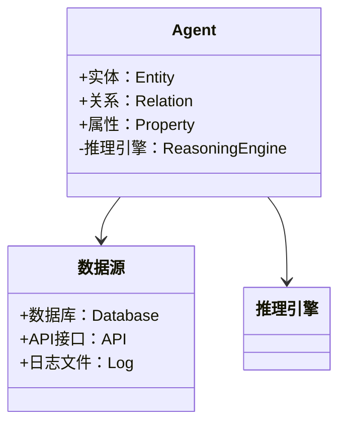

                 


# 实现AI Agent的动态知识图谱构建

> 关键词：AI Agent，动态知识图谱，知识图谱构建，动态更新，图神经网络，知识表示学习

> 摘要：本文详细探讨了AI Agent的动态知识图谱构建方法，涵盖核心概念、算法原理、系统设计与项目实战。通过理论与实践结合，深入分析动态知识图谱的构建过程，包括知识抽取、融合、更新与表示学习，结合图神经网络技术，构建高效、实时的知识图谱系统。

---

# 第1章: AI Agent与动态知识图谱概述

## 1.1 AI Agent的基本概念
### 1.1.1 AI Agent的定义与特点
AI Agent（人工智能代理）是一种能够感知环境、自主决策并执行任务的智能系统。其特点包括自主性、反应性、目标导向性和社会性。

### 1.1.2 动态知识图谱的定义与特点
动态知识图谱是一种实时更新的知识表示结构，具有动态性、可扩展性和语义丰富性。

### 1.1.3 AI Agent与动态知识图谱的关系
AI Agent依赖动态知识图谱进行推理和决策，而动态知识图谱为AI Agent提供实时、准确的知识支持。

## 1.2 动态知识图谱的构建背景
### 1.2.1 知识图谱的演变历程
从静态知识图谱到动态知识图谱的演变，反映了技术进步对知识管理的需求。

### 1.2.2 动态知识图谱的应用场景
包括实时信息处理、智能问答系统、推荐系统等领域。

### 1.2.3 动态知识图谱的核心问题
数据实时性、更新效率和知识准确性是动态知识图谱构建的核心挑战。

## 1.3 本章小结
本章介绍了AI Agent与动态知识图谱的基本概念，分析了动态知识图谱的构建背景及核心问题。

---

# 第2章: 动态知识图谱的核心概念与联系

## 2.1 知识图谱构建的核心要素
### 2.1.1 实体与关系
实体是知识图谱的基本单元，关系描述实体之间的联系。

### 2.1.2 属性与值
属性描述实体的特征，值是属性的具体取值。

### 2.1.3 知识图谱的结构化表示
通过结构化的形式（如RDF、RDFS）表示知识。

## 2.2 动态知识图谱的更新机制
### 2.2.1 实时更新与批处理更新
实时更新适用于高频率变化的数据，批处理更新适用于周期性更新。

### 2.2.2 增量更新与全量更新
增量更新仅处理变化部分，全量更新重新构建整个知识图谱。

### 2.2.3 更新的触发条件与策略
基于时间、事件或用户反馈触发更新。

## 2.3 知识图谱的动态扩展
### 2.3.1 动态添加新实体
通过API或事件驱动的方式添加新实体。

### 2.3.2 动态修改已有关系
基于用户反馈或数据变化修改关系。

### 2.3.3 动态删除无效信息
基于过期时间或使用频率删除无效信息。

## 2.4 核心概念的ER实体关系图
```mermaid
er
actor(Agent, 实体, 关系, 属性)
```

## 2.5 本章小结
本章详细阐述了动态知识图谱的核心概念，分析了更新机制和扩展方式。

---

# 第3章: 动态知识图谱的构建算法

## 3.1 知识抽取与融合算法
### 3.1.1 基于规则的知识抽取
通过预定义规则从文本中提取实体和关系。

### 3.1.2 基于深度学习的知识抽取
使用NER（命名实体识别）和RE（关系抽取）模型提取知识。

### 3.1.3 多源数据的融合策略
通过冲突检测和协商机制融合多源数据。

## 3.2 动态更新的算法实现
### 3.2.1 基于图的更新算法
通过图遍历算法更新节点属性和关系。

### 3.2.2 基于向量的更新算法
通过向量空间模型更新实体和关系的表示。

### 3.2.3 增量式更新的实现细节
通过局部更新避免全量重构，提高效率。

## 3.3 算法的数学模型与公式
### 3.3.1 知识表示的向量空间模型
$$v_i = \sum_{j=1}^{n} w_{ij}x_j$$

### 3.3.2 动态更新的公式推导
$$u_{new} = u_{old} + \Delta u$$

## 3.4 本章小结
本章介绍了动态知识图谱的构建算法，包括知识抽取、融合和动态更新的实现。

---

# 第4章: 基于图的表示学习

## 4.1 图表示学习的基本原理
### 4.1.1 图的节点表示
通过GNN（图神经网络）提取节点的低维表示。

### 4.1.2 图的边表示
通过边嵌入模型表示边的语义信息。

### 4.1.3 图的嵌入学习
通过优化目标函数学习图的全局嵌入。

## 4.2 基于GNN的动态知识图谱表示
### 4.2.1 图神经网络的基本结构
包括GCN、GAT等常见GNN模型。

### 4.2.2 动态知识图谱中的GNN应用
通过GNN实时更新节点和边的表示。

### 4.2.3 GNN的训练与推理
基于动态数据流进行在线训练和推理。

## 4.3 图表示学习的数学模型
### 4.3.1 GNN的聚合函数
$$h_i^{(l+1)} = \sigma(\sum_{j \in N(i)} W_{ij}h_j^{(l)})$$

### 4.3.2 图嵌入的计算公式
$$Z = GAE(X)$$

## 4.4 本章小结
本章详细探讨了基于图的表示学习方法，特别是GNN在动态知识图谱中的应用。

---

# 第5章: 动态知识图谱的系统架构设计

## 5.1 系统功能设计
### 5.1.1 数据源接口
支持多种数据源的接入。

### 5.1.2 知识抽取模块
负责从数据中抽取实体、关系和属性。

### 5.1.3 知识更新模块
实现知识图谱的动态更新。

### 5.1.4 知识推理引擎
支持基于知识图谱的推理任务。

## 5.2 系统架构设计
### 5.2.1 领域模型


### 5.2.2 系统架构图


## 5.3 本章小结
本章从系统架构的角度，详细设计了动态知识图谱的构建与应用流程。

---

# 第6章: 项目实战

## 6.1 环境配置
### 6.1.1 安装依赖
使用Python和相关库（如TensorFlow、PyTorch、NetworkX）。

### 6.1.2 数据准备
收集和预处理动态变化的数据集。

## 6.2 核心代码实现
### 6.2.1 知识抽取模块
```python
def extract_entity(text):
    # 使用NER模型提取实体
    pass
```

### 6.2.2 动态更新模块
```python
def update KnowledgeGraph(change_log):
    # 根据变更日志更新知识图谱
    pass
```

### 6.2.3 推理引擎
```python
def infer(query):
    # 基于知识图谱推理答案
    pass
```

## 6.3 数据处理与测试
### 6.3.1 数据预处理
清洗和格式化数据。

### 6.3.2 系统测试
通过测试案例验证系统的正确性。

## 6.4 本章小结
本章通过实际项目，展示了动态知识图谱构建的具体实现过程。

---

# 第7章: 扩展与展望

## 7.1 研究热点
### 7.1.1 实时知识更新
研究如何提高知识更新的实时性和效率。

### 7.1.2 图表示学习的优化
探索更高效的图嵌入方法。

## 7.2 未来趋势
### 7.2.1 跨模态知识图谱
结合文本、图像等多种模态信息。

### 7.2.2 自适应更新策略
基于动态变化自适应调整更新频率和策略。

## 7.3 注意事项
### 7.3.1 数据质量
确保数据来源可靠，避免错误信息。

### 7.3.2 性能优化
通过并行计算和分布式架构提高系统性能。

## 7.4 拓展阅读
推荐相关领域的书籍和论文，供读者深入学习。

## 7.5 本章小结
本章展望了动态知识图谱的未来发展方向，并提供了相关建议。

---

# 作者

作者：AI天才研究院/AI Genius Institute  
& 禅与计算机程序设计艺术 /Zen And The Art of Computer Programming

