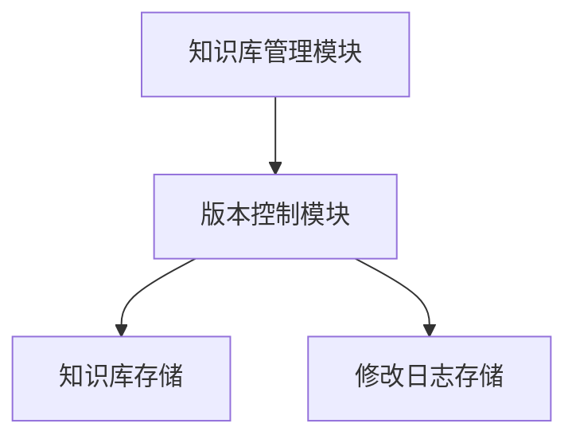

                 


# 实现AI Agent的动态知识库版本控制与回滚

## 关键词：AI Agent, 动态知识库, 版本控制, 回滚机制, 系统架构, 知识图谱

## 摘要：  
本文详细探讨了AI Agent动态知识库版本控制与回滚的实现方法。首先介绍了AI Agent和动态知识库的基本概念，分析了版本控制与回滚的必要性。接着，深入讲解了动态知识库的结构、版本控制的原理和回滚机制，并通过对比分析和ER实体关系图展示了核心概念。随后，从算法原理、系统架构设计、项目实战等方面进行了详细的技术分析，最后总结了实现过程中的最佳实践和注意事项。

---

# 第一部分: AI Agent与动态知识库版本控制概述

## 第1章: AI Agent与动态知识库概述

### 1.1 AI Agent的基本概念

#### 1.1.1 AI Agent的定义与分类  
AI Agent（人工智能代理）是指能够感知环境、自主决策并执行任务的智能实体。根据智能水平和应用场景的不同，AI Agent可以分为简单反射型代理、基于模型的反射型代理、目标驱动型代理和效用驱动型代理。

#### 1.1.2 动态知识库的定义与特点  
动态知识库是指能够实时更新、自我优化的知识存储系统，具有以下特点：  
1. **动态性**：知识库内容可以实时更新和扩展。  
2. **分布式**：支持多源异构数据的集成与管理。  
3. **可扩展性**：能够根据需求灵活调整知识存储结构。  

#### 1.1.3 动态知识库在AI Agent中的作用  
动态知识库是AI Agent的核心组成部分，负责存储和管理AI Agent运行所需的所有知识，包括领域知识、上下文信息和历史数据。

### 1.2 动态知识库版本控制的背景与需求

#### 1.2.1 知识库动态更新的必要性  
AI Agent在运行过程中会不断获取新信息，知识库需要实时更新以保持准确性。

#### 1.2.2 版本控制在知识库管理中的重要性  
版本控制是确保知识库更新过程中数据一致性、可追溯性和可恢复性的关键机制。

#### 1.2.3 AI Agent对知识库版本控制的需求  
AI Agent需要在动态知识库更新过程中，支持版本回滚功能，以应对更新失败或数据错误的情况。

### 1.3 本章小结  
本章介绍了AI Agent的基本概念，分析了动态知识库的定义、特点及其在AI Agent中的作用，明确了知识库版本控制的必要性。

---

# 第二部分: 动态知识库版本控制的核心概念与原理

## 第2章: 动态知识库版本控制的核心概念

### 2.1 动态知识库的结构与组成

#### 2.1.1 知识库的层次结构  
动态知识库通常由以下几个层次组成：  
1. **数据层**：存储原始数据。  
2. **知识层**：通过知识抽取、融合和推理，构建知识图谱。  
3. **应用层**：提供API接口，支持上层应用的调用。  

#### 2.1.2 动态知识的表示方法  
常用的知识表示方法包括RDF（资源描述框架）、OWL（Web本体语言）和图嵌入表示（如Word2Vec、GloVe）。

#### 2.1.3 知识节点与关系的定义  
知识节点是知识图谱中的基本单元，表示具体的概念或实体；关系表示节点之间的关联。

### 2.2 版本控制的基本原理

#### 2.2.1 版本控制的定义与作用  
版本控制是指对知识库的修改、更新和变更进行记录和管理的过程，主要用于保证数据的完整性和可追溯性。

#### 2.2.2 知识库版本的标识与存储  
知识库版本通常通过哈希值、时间戳或版本号进行标识，并存储在版本库中。

#### 2.2.3 版本之间的依赖关系  
知识库版本之间的依赖关系可以通过DAG（有向无环图）或树状结构表示。

### 2.3 回滚机制的核心原理

#### 2.3.1 回滚的定义与应用场景  
回滚是指将知识库恢复到某个特定版本的操作，常见于数据更新失败、数据污染或需要恢复到已知正确状态的场景。

#### 2.3.2 版本回滚的实现方式  
1. **基于快照的回滚**：通过存储知识库的快照，直接恢复到目标版本。  
2. **基于增量的回滚**：通过记录变更日志，逐步撤销修改。  

#### 2.3.3 回滚过程中的冲突处理  
当多个版本之间存在冲突时，需要通过版本依赖关系和冲突检测机制进行处理。

### 2.4 核心概念对比表

| 比较项       | 静态知识库             | 动态知识库             |
|--------------|----------------------|----------------------|
| 数据更新     | 不支持实时更新         | 支持实时更新           |
| 版本控制     | 无版本控制             | 强依赖版本控制         |
| 应用场景     | 静态查询               | 动态推理和实时应用       |

### 2.5 ER实体关系图  
```mermaid
er
actor: AI Agent
knowledge_base: 动态知识库
version: 版本信息
dependency: 版本依赖关系

actor --> knowledge_base: 管理
knowledge_base --> version: 包含
version --> dependency: 依赖
```

---

# 第三部分: 动态知识库版本控制的算法原理

## 第3章: 基于树状结构的版本控制算法

### 3.1 算法原理概述

#### 3.1.1 树状结构的定义  
树状结构是一种常见的数据结构，用于表示文件或数据的层次关系，每个节点代表一个知识库版本。

#### 3.1.2 树状结构的版本控制算法  
1. **初始化**：创建根节点，代表初始版本。  
2. **新增版本**：每次修改知识库后，创建新的节点，并记录与父节点的依赖关系。  
3. **回滚操作**：通过遍历树状结构，找到目标版本，并恢复对应的知识库状态。

### 3.2 算法实现步骤

#### 3.2.1 知识库修改操作  
1. 创建新版本节点。  
2. 记录修改操作日志。  

#### 3.2.2 知识库回滚操作  
1. 找到目标版本节点。  
2. 根据依赖关系，撤销所有后续版本的修改。  

### 3.3 算法的数学模型

#### 3.3.1 版本树的表示  
版本树可以用图论中的树结构表示，每个节点表示一个版本，边表示版本之间的依赖关系。

#### 3.3.2 版本回滚的数学表达  
假设当前版本为v，目标版本为u，则回滚操作可以表示为：  
$$ v = v \setminus (v \setminus u) $$  

---

## 第4章: 基于哈希的版本控制算法

### 4.1 算法原理概述

#### 4.1.1 哈希函数的定义  
哈希函数是一种将任意长度的输入映射为固定长度的哈希值的函数。

#### 4.1.2 哈希版本控制的实现原理  
每次修改知识库后，计算当前知识库的哈希值，并记录在版本控制表中。

### 4.2 算法实现步骤

#### 4.2.1 知识库修改操作  
1. 计算当前知识库的哈希值。  
2. 将哈希值记录到版本控制表中。  

#### 4.2.2 知识库回滚操作  
1. 根据目标哈希值，找到对应的版本。  
2. 恢复知识库到目标版本的状态。  

### 4.3 算法的数学模型

#### 4.3.1 哈希值的计算  
$$ hash(value) = \sum_{i=0}^{n-1} value[i] \times 2^{i} \mod p $$  

#### 4.3.2 哈希版本控制的实现  
每次修改知识库后，计算哈希值，并将其存储在版本控制表中。

---

# 第四部分: 动态知识库版本控制的系统架构设计

## 第5章: 系统架构设计

### 5.1 问题场景介绍  
AI Agent需要在动态知识库中实时更新知识，并支持版本回滚功能，以应对知识库更新失败或数据错误的情况。

### 5.2 系统功能设计

#### 5.2.1 知识库管理模块  
- 功能：支持知识库的创建、更新和查询。  
- 实现：通过RESTful API接口实现。  

#### 5.2.2 版本控制模块  
- 功能：记录知识库的修改日志，支持版本回滚。  
- 实现：基于树状结构或哈希算法实现版本控制。  

### 5.3 系统架构设计图  


### 5.4 接口设计与交互流程

#### 5.4.1 知识库修改接口  
```python
def update_knowledge_base(new_version):
    # 更新知识库
    # 记录修改日志
```

#### 5.4.2 知识库回滚接口  
```python
def rollback(version_id):
    # 根据版本ID恢复知识库
```

---

## 第6章: 项目实战

### 6.1 环境安装与配置

#### 6.1.1 安装Python环境  
```bash
python --version
pip install --upgrade pip
```

#### 6.1.2 安装相关依赖  
```bash
pip install requests
pip install mermaid
```

### 6.2 核心功能实现

#### 6.2.1 知识库版本控制实现  
```python
class KnowledgeBase:
    def __init__(self):
        self.versions = {}
    
    def save_version(self, version_id, content):
        self.versions[version_id] = content
    
    def rollback(self, version_id):
        return self.versions[version_id]
```

#### 6.2.2 版本回滚实现  
```python
def rollback_to_version(version_id):
    kb = KnowledgeBase()
    return kb.rollback(version_id)
```

### 6.3 实际案例分析

#### 6.3.1 知识库更新失败的案例  
假设在某个版本中，知识库更新失败，需要回滚到上一个版本。

#### 6.3.2 知识库数据污染的案例  
假设知识库中存在错误数据，需要通过版本回滚恢复到正确的数据。

### 6.4 代码实现与解读

#### 6.4.1 知识库管理代码  
```python
class KnowledgeBaseManager:
    def __init__(self):
        self.current_version = "v1"
        self.versions = {"v1": "initial state"}
    
    def update(self, new_version):
        self.versions[new_version] = self.versions[self.current_version]
        self.current_version = new_version
```

#### 6.4.2 版本回滚代码  
```python
def rollback(version_id):
    manager = KnowledgeBaseManager()
    manager.current_version = version_id
```

---

## 第7章: 总结与展望

### 7.1 本章总结  
本文详细介绍了AI Agent动态知识库版本控制与回滚的实现方法，包括核心概念、算法原理和系统架构设计。

### 7.2 未来展望  
未来，可以进一步研究分布式知识库的版本控制方法，以及如何结合区块链技术实现更加安全可靠的版本控制机制。

### 7.3 最佳实践 Tips  
1. 在实际应用中，建议使用成熟的版本控制工具或框架。  
2. 定期备份知识库，防止数据丢失。  
3. 在版本回滚过程中，注意处理可能的冲突和异常情况。  

### 7.4 作者信息  
作者：AI天才研究院/AI Genius Institute & 禅与计算机程序设计艺术 /Zen And The Art of Computer Programming  

---

通过本文的详细分析和实战指导，读者可以深入了解AI Agent动态知识库版本控制与回滚的实现方法，并能够在实际项目中灵活运用这些技术。

