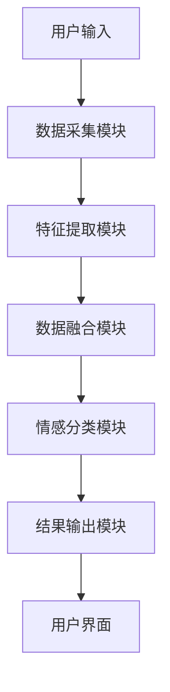

                 


# 实现AI Agent的多模态情感识别

## 关键词：AI Agent, 多模态情感识别, 情感计算, 深度学习, 多模态数据融合

## 摘要：  
本文深入探讨了AI Agent在多模态情感识别中的实现方法，从基础概念到算法原理，再到系统架构和项目实战，全面解析了如何通过多模态数据（文本、语音、图像）进行情感识别。文章结合理论与实践，详细介绍了多模态数据的特征提取、融合方法，以及基于深度学习的情感计算模型，并通过实际案例展示了如何搭建一个多模态情感识别系统。本文旨在为AI Agent的开发者和研究人员提供一份全面的技术指南，帮助他们更好地理解和实现多模态情感识别。

---

## 第1章: AI Agent与多模态情感识别概述

### 1.1 AI Agent的基本概念  
AI Agent（人工智能代理）是指能够感知环境、自主决策并执行任务的智能实体。它广泛应用于自然语言处理、推荐系统、智能助手等领域。AI Agent的核心特征包括自主性、反应性、目标导向性和学习能力。  

### 1.2 多模态情感识别的背景与意义  
情感识别是理解人类情感状态的关键技术，而多模态情感识别通过结合文本、语音和图像等多种信息，能够更准确地捕捉人类情感。多模态数据的融合可以提高情感识别的准确性和鲁棒性，尤其是在复杂场景中。  

### 1.3 多模态情感识别的挑战与解决方案  
情感识别的主要挑战包括跨模态数据的异构性、情感表达的模糊性以及数据标注的困难。为了解决这些问题，本文提出了基于深度学习的多模态数据融合方法，并通过对比分析不同融合策略的优缺点，为实际应用提供了参考。

---

## 第2章: 多模态数据的特征与分析

### 2.1 多模态数据的特征提取  
#### 2.1.1 文本特征提取  
文本特征提取通常包括词袋模型、TF-IDF和词嵌入（如Word2Vec、GloVe）等方法。这些方法能够将文本转化为数值表示，便于后续处理。  

#### 2.1.2 语音特征提取  
语音特征提取主要通过梅尔频率倒谱系数（MFCC）提取语音信号的特征，同时结合语音的情感特征（如音调、语速）进行分析。  

#### 2.1.3 图像特征提取  
图像特征提取常用的方法包括基于CNN的特征提取和基于区域的特征提取。这些方法能够捕捉图像中的情感线索，如面部表情和姿态。  

### 2.2 多模态数据的融合方法  
#### 2.2.1 基于特征融合的方法  
特征融合方法将不同模态的特征向量进行线性组合或非线性变换，以获得更丰富的特征表示。  

#### 2.2.2 基于模型融合的方法  
模型融合方法通过训练多个独立模型，并将它们的输出结果进行融合，以提高整体性能。  

#### 2.2.3 基于注意力机制的融合方法  
注意力机制通过自适应地关注不同模态的重要性，动态调整特征的权重，从而实现更高效的融合。  

### 2.3 多模态数据融合的对比分析  
下表对比了三种融合方法的优缺点：  

| 方法              | 优点                              | 缺点                              |
|-------------------|-----------------------------------|-----------------------------------|
| 基于特征融合      | 实现简单，特征表达能力强          | 可能忽略模态间的相互依赖关系    |
| 基于模型融合      | 能够充分利用各模态的优势          | 计算复杂度较高，难以实时应用      |
| 基于注意力机制    | 能够动态调整模态权重，灵活性高      | 需要额外设计注意力网络结构        |

### 2.4 本章小结  
多模态数据的特征提取和融合是情感识别的关键步骤，不同方法各有优缺点，选择合适的融合策略可以显著提升识别性能。

---

## 第3章: 情感计算的原理与模型

### 3.1 情感计算的基本原理  
情感计算是指通过计算机技术分析和理解人类情感状态的过程。其核心步骤包括数据采集、特征提取、情感识别和结果输出。  

### 3.2 基于深度学习的情感计算模型  
#### 3.2.1 RNN与LSTM在情感计算中的应用  
RNN和LSTM模型通过处理序列数据，能够捕捉文本中的情感变化。例如，LSTM可以通过门控机制有效地捕捉长距离依赖关系。  

#### 3.2.2 Transformer模型在情感计算中的应用  
Transformer模型通过自注意力机制，能够捕捉文本中全局的语义信息，从而提高情感识别的准确性。  

### 3.3 多模态情感计算模型  
多模态情感计算模型通过融合多种模态的数据，能够更全面地捕捉情感信息。例如，结合文本和语音模态，可以同时分析说话的内容和语气，从而更准确地识别情感状态。  

### 3.4 本章小结  
基于深度学习的情感计算模型在多模态情感识别中表现出色，尤其是Transformer模型在捕捉全局语义信息方面具有明显优势。

---

## 第4章: 多模态情感识别的算法实现

### 4.1 多模态情感识别算法概述  
多模态情感识别算法通常包括特征提取、数据融合和情感分类三个主要步骤。  

### 4.2 基于深度学习的多模态融合算法  
#### 4.2.1 网络结构设计  
多模态情感识别模型通常采用编码器-解码器结构，编码器用于提取各模态的特征，解码器用于融合特征并输出情感标签。  

#### 4.2.2 模型训练与优化  
模型训练采用交叉熵损失函数，并通过Adam优化器进行优化。训练过程中，可以通过数据增强和正则化技术提高模型的泛化能力。  

### 4.3 代码实现与分析  
以下是一个简单的多模态情感识别模型的代码示例：  

```python
import torch
import torch.nn as nn
import torch.optim as optim

class MultiModalEmotionRecognizer(nn.Module):
    def __init__(self, input_size, hidden_size):
        super(MultiModalEmotionRecognizer, self).__init__()
        self.lstm = nn.LSTM(input_size, hidden_size, batch_first=True)
        self.fc = nn.Linear(hidden_size, 1)

    def forward(self, x):
        out, _ = self.lstm(x)
        out = self.fc(out[:, -1, :])
        return out

# 示例数据
input_size = 32  # 输入特征维度
hidden_size = 64  # 隐藏层维度
model = MultiModalEmotionRecognizer(input_size, hidden_size)
criterion = nn.BCEWithLogitsLoss()
optimizer = optim.Adam(model.parameters(), lr=0.001)
```

### 4.4 本章小结  
通过深度学习算法，可以实现高效的多模态情感识别。模型设计和训练过程中需要重点关注特征提取、数据融合和优化策略的选择。

---

## 第5章: 系统架构与项目实战

### 5.1 项目背景与目标  
本项目旨在开发一个多模态情感识别系统，能够通过文本、语音和图像三种模态数据识别用户的情感状态。  

### 5.2 系统功能设计  
系统功能模块包括数据采集、特征提取、数据融合、情感分类和结果输出。  

#### 5.2.1 数据采集  
数据采集模块通过麦克风和摄像头获取用户的语音和图像数据。  

#### 5.2.2 特征提取  
特征提取模块分别对文本、语音和图像数据进行特征提取，并输出特征向量。  

#### 5.2.3 数据融合  
数据融合模块将不同模态的特征向量进行融合，输出综合特征向量。  

#### 5.2.4 情感分类  
情感分类模块基于融合特征向量，通过训练好的模型输出情感标签。  

#### 5.2.5 结果输出  
结果输出模块将情感标签转换为用户友好的形式（如文本或语音），并返回给用户。  

### 5.3 系统架构设计  
下图展示了系统的整体架构：  



### 5.4 项目实战  
#### 5.4.1 环境搭建  
项目需要安装以下依赖：  
- Python 3.6+
- PyTorch 1.9+
- OpenCV 4.5+
- librosa 0.10+

#### 5.4.2 核心代码实现  
以下是情感分类模块的实现代码：  

```python
import torch
import torch.nn as nn
import torch.optim as optim

class EmotionClassifier(nn.Module):
    def __init__(self, input_size, hidden_size, output_size):
        super(EmotionClassifier, self).__init__()
        self.fc1 = nn.Linear(input_size, hidden_size)
        self.fc2 = nn.Linear(hidden_size, output_size)
        self.dropout = nn.Dropout(0.5)
        self.relu = nn.ReLU()

    def forward(self, x):
        x = self.fc1(x)
        x = self.relu(x)
        x = self.dropout(x)
        x = self.fc2(x)
        return x

# 示例输入
input_size = 128  # 融合特征维度
hidden_size = 64   # 隐藏层维度
output_size = 3    # 情感类别数（如：正面、中性、负面）
model = EmotionClassifier(input_size, hidden_size, output_size)
criterion = nn.CrossEntropyLoss()
optimizer = optim.SGD(model.parameters(), lr=0.01)
```

### 5.5 本章小结  
通过项目实战，可以深入了解多模态情感识别系统的实现过程。从数据采集到结果输出，每一步都需要精心设计和优化。

---

## 第6章: 总结与展望

### 6.1 本章总结  
本文全面介绍了AI Agent的多模态情感识别技术，从理论到实践，详细讲解了多模态数据的特征提取、融合方法以及情感计算模型的实现。  

### 6.2 未来展望  
未来的研究方向包括：  
1. 更高效的多模态数据融合方法。  
2. 更准确的情感计算模型，如基于Transformer的多模态情感识别模型。  
3. 多模态情感识别在更多领域的应用，如教育、医疗和人机交互。  

### 6.3 最佳实践Tips  
- 在实际应用中，建议根据具体场景选择合适的融合方法。  
- 数据预处理和特征提取是关键步骤，需要仔细设计。  
- 模型训练时，可以通过数据增强和正则化技术提高模型的泛化能力。  

### 6.4 本章小结  
多模态情感识别是一项具有广泛应用前景的技术，未来的研究和应用将更加深入。

---

## 作者：AI天才研究院/AI Genius Institute & 禅与计算机程序设计艺术 /Zen And The Art of Computer Programming

---

本文通过系统的理论讲解和实践案例，全面剖析了AI Agent的多模态情感识别技术。希望本文能够为相关领域的研究和应用提供有价值的参考和启发。

