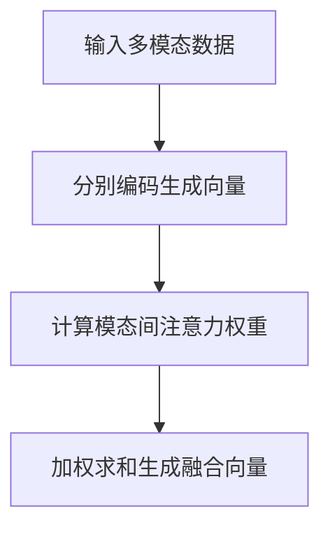
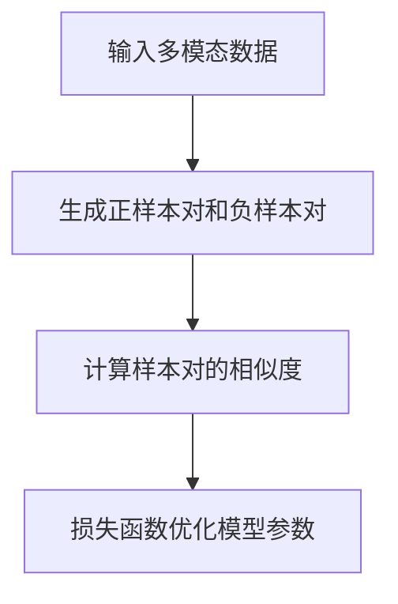
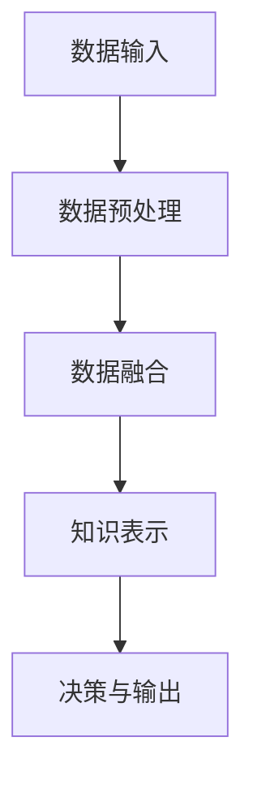

                 


# 实现AI Agent的多模态知识融合

> **关键词**：AI Agent, 多模态知识融合, 多模态数据, 知识图谱, 深度学习, 对比学习

> **摘要**：本文详细探讨了AI Agent实现多模态知识融合的核心原理、算法实现、系统架构设计及实际应用场景。通过结合多模态数据处理、知识图谱构建和深度学习技术，本文提出了一种高效的多模态知识融合方法，并通过具体案例展示了其在实际项目中的应用。文章内容涵盖背景介绍、核心概念、算法原理、系统架构、项目实战等多个方面，为读者提供了全面的技术指导。

---

## 第一部分: AI Agent与多模态知识融合背景

### 第1章: AI Agent概述

#### 1.1 AI Agent的基本概念

AI Agent（人工智能代理）是指能够感知环境、自主决策并采取行动以实现特定目标的智能实体。AI Agent可以是软件程序、机器人或其他智能系统。其核心特征包括：

- **自主性**：能够在没有外部干预的情况下自主决策。
- **反应性**：能够实时感知环境并做出反应。
- **目标导向性**：所有行为均以实现特定目标为导向。

AI Agent的应用场景广泛，包括智能助手、自动驾驶、智能客服、机器人助手等。

#### 1.2 多模态数据的基本概念

多模态数据是指来自多种感官渠道（如视觉、听觉、文本、触觉等）的数据形式。常见的多模态数据类型包括：

- **视觉数据**：图像、视频等。
- **听觉数据**：音频、语音等。
- **文本数据**：自然语言文本。
- **其他数据**：如传感器数据、地理位置信息等。

多模态数据的特点是信息互补性强，能够提供更全面的感知能力。通过多模态数据的融合，AI Agent能够更准确地理解环境并做出更智能的决策。

#### 1.3 多模态知识融合的背景与意义

随着AI技术的快速发展，单纯依赖单一模态数据的AI Agent已经难以满足复杂场景的需求。多模态知识融合通过整合多种模态的数据，能够显著提升AI Agent的感知能力和决策水平。例如，在自动驾驶场景中，AI Agent需要同时处理视觉、听觉、传感器等多种数据，以实现更精准的环境感知和决策。

---

## 第二部分: 多模态知识融合的核心概念

### 第2章: 多模态数据的处理与融合

#### 2.1 多模态数据的预处理

在进行多模态数据融合之前，需要对数据进行预处理。预处理的主要目的是消除数据中的噪声，使其更适合后续的融合和分析。

- **数据清洗**：去除无用或错误的数据。
- **数据标准化**：将不同模态的数据转换到相同的尺度。
- **数据增强**：通过增加数据的多样性和鲁棒性来提升模型性能。

#### 2.2 多模态数据的表示与建模

多模态数据的表示是知识融合的关键步骤。常见的表示方法包括向量表示和图结构表示。

- **向量表示**：将多模态数据转换为高维向量，便于后续的计算和分析。
- **图结构表示**：将多模态数据建模为图结构，利用图的节点和边来表示数据之间的关系。

#### 2.3 多模态数据的融合策略

多模态数据的融合策略包括基于概率的融合方法、基于规则的融合方法和基于深度学习的融合方法。

- **基于概率的融合方法**：利用概率论中的联合分布来表示多模态数据的不确定性。
- **基于规则的融合方法**：通过预定义的规则来合并不同模态的数据。
- **基于深度学习的融合方法**：利用深度学习模型（如Transformer、对比学习模型）来自动学习多模态数据的潜在关系。

---

## 第三部分: 多模态知识融合的算法原理

### 第3章: 多模态融合的算法原理

#### 3.1 基于注意力机制的多模态编码器

基于注意力机制的多模态编码器是一种高效的多模态融合方法。其基本原理如下：

1. 对于输入的多模态数据，分别进行编码，生成对应的向量表示。
2. 使用注意力机制来计算不同模态数据之间的权重。
3. 根据权重对不同模态的数据进行加权求和，生成最终的融合向量。

图1展示了基于注意力机制的多模态编码器的流程图。




#### 3.2 对比学习在多模态融合中的应用

对比学习是一种有效的无监督学习方法。在多模态融合中，对比学习的目标是让不同模态的数据在相同的语义空间中对齐。

图2展示了对比学习在多模态融合中的应用流程图。




---

## 第四部分: 系统分析与架构设计

### 第4章: 多模态知识融合系统的架构设计

#### 4.1 系统功能需求分析

多模态知识融合系统的功能需求包括：

- **数据输入与预处理**：接收多种模态的数据并进行预处理。
- **数据融合**：对预处理后的数据进行融合。
- **知识表示**：将融合后的数据表示为知识图谱或其他形式。
- **决策与输出**：根据融合后的知识进行决策并输出结果。

#### 4.2 系统架构设计

图3展示了多模态知识融合系统的架构图。




#### 4.3 系统接口设计

系统的接口设计包括：

- **数据接口**：用于接收多模态数据。
- **融合接口**：用于实现多模态数据的融合算法。
- **知识接口**：用于表示和存储融合后的知识。
- **决策接口**：用于根据知识进行决策并输出结果。

---

## 第五部分: 项目实战与案例分析

### 第5章: 多模态知识融合的项目实战

#### 5.1 项目环境搭建

项目环境搭建的主要步骤包括：

1. **安装开发工具**：安装Python、TensorFlow、PyTorch等开发工具。
2. **数据集准备**：获取多模态数据集（如图像、文本、音频等）。
3. **环境配置与测试**：配置运行环境并进行初步测试。

#### 5.2 项目核心代码实现

以下是项目的核心代码示例：

```python
import tensorflow as tf
from tensorflow.keras import layers

# 定义多模态编码器
class MultiModalEncoder:
    def __init__(self, input_dims):
        self.encoders = []
        for dim in input_dims:
            encoder = self.build_encoder(dim)
            self.encoders.append(encoder)
    
    def build_encoder(self, input_dim):
        encoder = tf.keras.Sequential([
            layers.Dense(64, activation='relu'),
            layers.Dense(32, activation='relu')
        ])
        return encoder
    
    def call(self, inputs):
        encoded_outputs = []
        for i, encoder in enumerate(self.encoders):
            encoded_output = encoder(inputs[i])
            encoded_outputs.append(encoded_output)
        # 使用注意力机制进行融合
        attention_weights = layers.Dense(1, activation='softmax')(tf.stack(encoded_outputs, axis=1))
        attention_weights = tf.squeeze(attention_weights, axis=-1)
        fused_output = tf.reduce_sum(tf.stack(encoded_outputs, axis=1) * attention_weights, axis=1)
        return fused_output
```

#### 5.3 项目测试与优化

测试的主要步骤包括：

1. **数据加载与预处理**：加载数据集并进行预处理。
2. **模型训练**：训练多模态编码器模型。
3. **模型评估**：评估模型的性能并进行优化。

---

## 第六部分: 总结与展望

### 第6章: 总结与展望

#### 6.1 总结

本文详细探讨了AI Agent实现多模态知识融合的核心原理、算法实现、系统架构设计及实际应用场景。通过结合多模态数据处理、知识图谱构建和深度学习技术，本文提出了一种高效的多模态知识融合方法，并通过具体案例展示了其在实际项目中的应用。

#### 6.2 未来展望

未来的研究方向包括：

- **更高效的知识表示方法**：探索更高效的多模态知识表示方法，如基于图神经网络的知识表示。
- **更智能的融合算法**：研究更智能的多模态融合算法，如基于自监督学习的融合方法。
- **更广泛的应用场景**：将多模态知识融合技术应用于更多领域，如医疗、教育、金融等。

---

## 参考文献

1. LeCun, Y., Bengio, Y., & Hinton, G. (2015). Deep learning. Nature, 521(7555), 436-444.
2. Vaswani, A., et al. (2017). Attention is all you need. Advances in neural information processing systems, 30, 5998-6008.
3. He, K., et al. (2020). Momentum contrast for unsupervised visual representation learning. Proceedings of the IEEE/CVF conference on computer vision and pattern recognition, 10780-10789.

---

## 作者

作者：AI天才研究院/AI Genius Institute & 禅与计算机程序设计艺术 /Zen And The Art of Computer Programming

---

通过以上目录和内容，您可以根据需求进一步扩展每个章节的具体内容，确保文章的完整性和深度。

