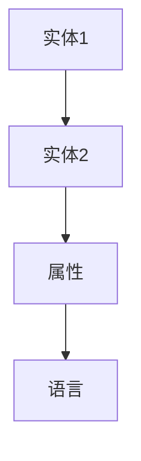
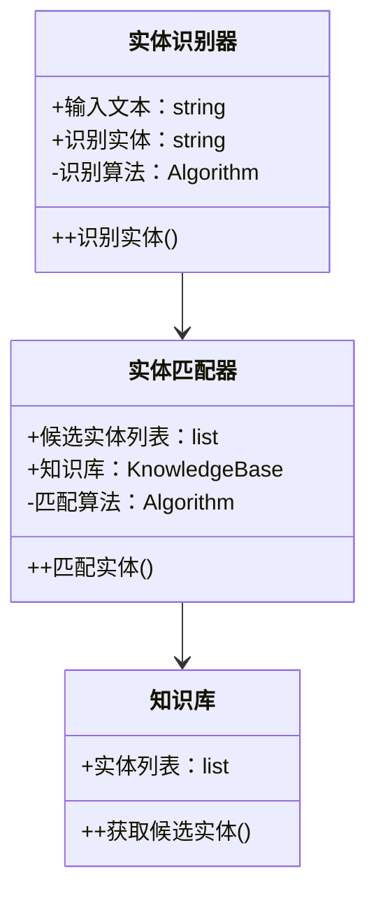
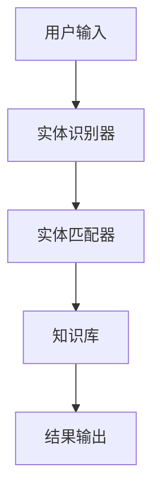

                 


# 实现AI Agent的多语言实体链接

> 关键词：AI Agent，多语言实体链接，自然语言处理，知识图谱，跨语言信息检索

> 摘要：本文详细探讨了实现AI Agent的多语言实体链接技术，从背景、概念、算法到系统架构和项目实战，全面解析了多语言实体链接的实现方法。通过分析不同语言环境下的实体链接挑战，结合AI Agent的实际应用场景，提出了基于知识图谱和深度学习的解决方案，并给出了详细的系统设计和代码实现。

---

# 第一部分：多语言实体链接的背景与挑战

## 第1章：多语言实体链接的背景与挑战

### 1.1 实体链接的基本概念
实体链接（Entity Linking）是指将文本中的实体（如人名、地名、组织名）与知识库中的具体实体进行匹配的过程。通过实体链接，可以将文本中的实体信息转化为可计算的结构化数据，从而为后续的信息处理提供支持。

### 1.2 多语言实体链接的必要性
在多语言环境下，实体链接的复杂性显著增加。不同语言的命名习惯、文化差异以及语言本身的语法结构差异，使得跨语言实体链接面临更大的挑战。例如，中文中的“苹果”可能指的是苹果公司，而英文中的“Apple”同样指代苹果公司，但需要确保在不同语言环境下正确识别和链接。

### 1.3 AI Agent在多语言实体链接中的作用
AI Agent作为智能助手，需要处理来自不同语言的用户输入，准确识别并链接到相应的实体，以提供正确的服务或信息。例如，当用户在中文环境下提到“星巴克”，AI Agent需要将其链接到“Starbucks”这个实体，以便提供相关服务信息。

---

## 第2章：多语言实体链接的核心概念与联系

### 2.1 实体链接的核心原理
实体链接的核心原理包括以下几个步骤：
1. **实体识别**：通过自然语言处理技术（如NER，Named Entity Recognition）识别文本中的实体。
2. **实体消歧**：在多个可能的实体中，选择最符合上下文的实体。
3. **实体对齐**：将识别出的实体与知识库中的实体进行匹配。

### 2.2 多语言实体链接的特征对比
以下是不同实体链接方法的特征对比：

| 方法             | 特征                     |
|------------------|--------------------------|
| 符号链接          | 基于规则，适用于结构化数据 |
| 统计链接          | 基于概率模型，适用于非结构化数据 |
| 深度学习方法      | 基于神经网络，能够捕捉复杂的语义信息 |

### 2.3 实体关系图
以下是一个简单的实体关系图，展示了实体链接的基本结构：



---

## 第3章：多语言实体链接的算法原理

### 3.1 符号链接算法
符号链接是一种基于规则的实体链接方法。其基本原理是通过预定义的规则和知识库中的实体信息，将文本中的实体映射到知识库中的实体。

#### 实现步骤
1. **实体识别**：使用NER技术识别文本中的实体。
2. **实体匹配**：将识别出的实体与知识库中的实体进行匹配，基于规则进行筛选。
3. **结果输出**：输出匹配的实体信息。

#### 优缺点
- **优点**：规则简单，易于实现。
- **缺点**：依赖规则，难以处理复杂的语义信息。

### 3.2 统计链接算法
统计链接是一种基于概率模型的实体链接方法。其核心思想是通过计算文本中的实体与知识库中的实体之间的概率相似度，选择概率最大的实体作为匹配结果。

#### 实现步骤
1. **实体识别**：使用NER技术识别文本中的实体。
2. **计算相似度**：基于概率模型计算候选实体与文本实体的相似度。
3. **选择最优实体**：选择相似度最高的实体作为最终结果。

#### 优缺点
- **优点**：能够处理复杂的语义信息。
- **缺点**：需要大量训练数据，计算复杂度较高。

### 3.3 深度学习方法
深度学习方法是一种基于神经网络的实体链接方法。其核心思想是通过预训练模型（如BERT）捕捉文本中的语义信息，并将其与知识库中的实体进行匹配。

#### 实现步骤
1. **文本编码**：将文本中的实体编码为向量表示。
2. **知识库编码**：将知识库中的实体编码为向量表示。
3. **相似度计算**：计算文本实体向量与知识库实体向量的相似度，选择相似度最高的实体作为匹配结果。

#### 优缺点
- **优点**：能够捕捉复杂的语义信息，效果更优。
- **缺点**：需要大量计算资源和训练数据。

---

## 第4章：多语言实体链接的数学模型与公式

### 4.1 实体相似度计算的公式
实体相似度计算是深度学习方法的核心步骤之一。以下是常用的余弦相似度公式：

$$
\text{相似度} = \frac{\sum_{i=1}^{n} w_i \cdot w'_i}{\sqrt{\sum_{i=1}^{n} w_i^2} \cdot \sqrt{\sum_{i=1}^{n} w'_i^2}}
$$

其中，$w_i$和$w'_i$分别表示文本实体和知识库实体的向量分量。

### 4.2 知识库实体编码的公式
知识库实体的编码可以通过预训练模型（如BERT）生成：

$$
\text{实体向量} = \text{BERT}(\text{实体})
$$

---

## 第5章：多语言实体链接的系统分析与架构设计

### 5.1 项目场景介绍
AI Agent需要处理多语言环境下的实体链接请求。例如，用户在中文环境下搜索“星巴克”，AI Agent需要将其链接到“Starbucks”这个实体。

### 5.2 系统功能设计
以下是系统功能设计的类图：



### 5.3 系统架构设计
以下是系统架构设计的架构图：



---

## 第6章：多语言实体链接的项目实战

### 6.1 环境安装
实现多语言实体链接需要以下环境：
- Python 3.8+
- transformers库
- numpy库

### 6.2 核心代码实现
以下是基于BERT的实体链接实现代码：

```python
from transformers import BertTokenizer, BertModel
import numpy as np

# 初始化BERT模型和分词器
tokenizer = BertTokenizer.from_pretrained('bert-base-uncased')
model = BertModel.from_pretrained('bert-base-uncased')

# 定义实体匹配函数
def compute_similarity(text_entity, kb_entity):
    # 对文本实体和知识库实体进行编码
    text_input = tokenizer(text_entity, return_tensors='np')
    kb_input = tokenizer(kb_entity, return_tensors='np')
    
    # 获取实体向量
    with torch.no_grad():
        text_vec = model(**text_input)[0]
        kb_vec = model(**kb_input)[0]
    
    # 计算余弦相似度
    text_vec = text_vec.numpy().flatten()
    kb_vec = kb_vec.numpy().flatten()
    dot_product = np.dot(text_vec, kb_vec)
    norm_text = np.linalg.norm(text_vec)
    norm_kb = np.linalg.norm(kb_vec)
    similarity = dot_product / (norm_text * norm_kb)
    
    return similarity

# 示例
text_entity = "星巴克"
kb_entity = "Starbucks"
similarity = compute_similarity(text_entity, kb_entity)
print(f"相似度：{similarity}")
```

### 6.3 案例分析
以下是一个实际案例分析：

1. **用户输入**：我需要查找星巴克的地址。
2. **实体识别**：识别出“星巴克”为实体。
3. **实体匹配**：将“星巴克”与知识库中的“Starbucks”进行匹配，计算相似度。
4. **结果输出**：输出“星巴克”对应的地址信息。

### 6.4 项目总结
通过上述实现，可以实现一个简单的多语言实体链接系统。实际应用中，还需要考虑更多的因素，如实体消歧、知识库的更新等。

---

## 第7章：多语言实体链接的最佳实践与扩展

### 7.1 最佳实践
1. **选择合适的实体链接方法**：根据具体场景选择符号链接、统计链接或深度学习方法。
2. **优化知识库**：确保知识库的覆盖范围和准确性。
3. **处理歧义实体**：通过上下文信息优化实体消歧。

### 7.2 注意事项
- 处理多语言实体链接时，需要注意不同语言之间的命名习惯差异。
- 确保系统的健壮性，能够处理未识别的实体。

### 7.3 拓展阅读
- 《Entity Linking: From Theory to Practice》
- 《BERT-based Entity Linking for Multilingual Texts》

---

# 作者：AI天才研究院 & 禅与计算机程序设计艺术

