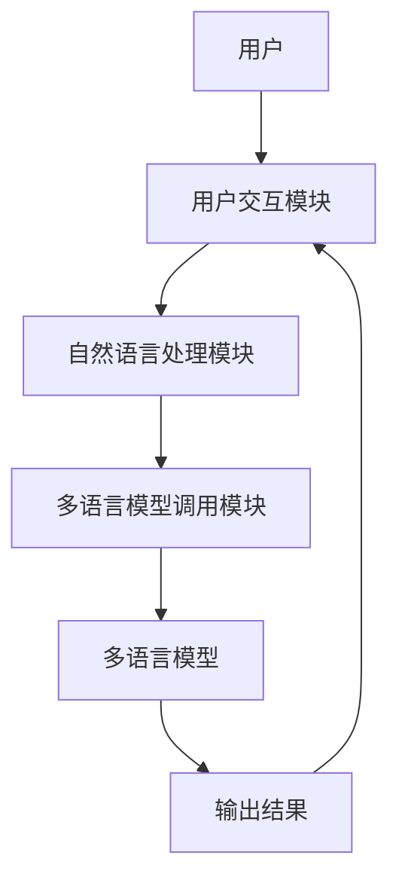
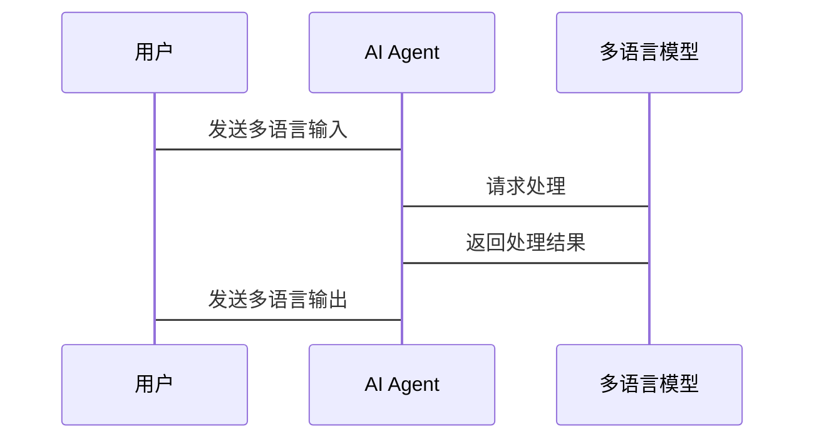

                 


# 实现AI Agent的多语言支持

## 关键词：AI Agent，多语言支持，自然语言处理，机器学习，深度学习

## 摘要：  
本文详细探讨了实现AI Agent多语言支持的关键技术与方法。通过背景介绍、核心概念分析、算法原理讲解、系统架构设计、项目实战和最佳实践等多方面的内容，全面解析了如何构建一个能够支持多种语言的智能代理系统。文章从理论到实践，结合具体案例，帮助读者掌握实现AI Agent多语言支持的核心技术与实践经验。

---

## 第一部分：背景介绍

### 第1章：AI Agent与多语言支持的背景

#### 1.1 AI Agent的基本概念  
AI Agent（智能代理）是指能够感知环境、自主决策并执行任务的智能系统。它可以分为简单反射型、基于模型的反射型、目标驱动型和效用驱动型等类型。AI Agent广泛应用于客服系统、智能助手、自动驾驶等领域。

#### 1.2 多语言支持的重要性  
在全球化背景下，支持多种语言的AI Agent能够满足不同地区用户的需求，提升用户体验。例如，支持多语言的智能客服系统可以为全球用户提供本地化服务，提高企业的市场竞争力。

#### 1.3 实现多语言支持的挑战  
- **语言理解的复杂性**：不同语言的语法结构、文化背景差异较大，导致模型训练和推理的难度增加。
- **计算资源需求**：多语言模型通常需要更大的计算资源和更复杂的算法设计。
- **数据稀缺性**：小语种语言的数据量有限，可能导致模型性能不足。

#### 1.4 实现多语言支持的意义  
- 提高AI Agent的通用性和适用性。
- 满足全球用户的需求，扩大市场覆盖范围。
- 为后续技术优化奠定基础。

---

## 第二部分：核心概念与联系

### 第2章：多语言支持的核心原理  

#### 2.1 多语言模型的核心原理  
多语言模型通过共享语言表征（如词嵌入）和任务参数，实现多种语言的联合训练。这种方式可以提高模型的跨语言迁移能力，减少训练数据的需求。

#### 2.2 多语言支持与自然语言处理的联系  
- **语言理解**：多语言模型需要能够理解不同语言的语义。
- **语言生成**：模型需要能够生成多种语言的文本。
- **交互机制**：支持多语言的AI Agent需要能够与用户进行多语言对话。

#### 2.3 多语言模型的对比分析  
以下是几种常见多语言模型的对比：

| 模型名称 | 参数共享 | 跨语言迁移 | 适用场景 |
|----------|----------|------------|----------|
| XLM      | 是       | 强         | 多语言NLP任务 |
| MULINER   | 是       | 中         | 跨语言信息检索 |
| Multilingual BERT | 是 | 强 | 多语言文本分析 |

#### 2.4 ER实体关系图  
以下是AI Agent多语言支持的ER实体关系图：

```mermaid
erDiagram
    user<->"使用多语言AI Agent": agent
    agent<->"支持多种语言模型": language_model
    language_model<->"处理多种语言数据": data
```

---

## 第三部分：算法原理讲解  

### 第3章：多语言模型的算法原理  

#### 3.1 多语言模型的训练机制  
多语言模型通常采用以下训练策略：

1. **多任务学习**：模型在多个语言任务（如翻译、问答）上同时训练。
2. **参数共享**：共享语言表征层的参数，减少参数数量。
3. **跨语言迁移**：利用一种语言的训练数据提升其他语言的性能。

#### 3.2 多语言模型的推理机制  
推理过程包括以下步骤：

1. **输入处理**：接收多语言输入并进行分词。
2. **编码**：将输入转换为模型可理解的向量表示。
3. **解码**：生成目标语言的输出。

#### 3.3 代码实现示例  

以下是多语言模型的训练代码示例：

```python
import tensorflow as tf
from tensorflow import keras

# 定义多语言模型
class MultilingualModel(keras.Model):
    def __init__(self, vocab_size, embedding_dim, num_classes):
        super(MultilingualModel, self).__init__()
        self.embedding = keras.layers.Embedding(vocab_size, embedding_dim)
        self.fc = keras.layers.Dense(num_classes, activation='softmax')

    def call(self, inputs):
        x = self.embedding(inputs)
        x = self.fc(x)
        return x

# 定义训练循环
def train_model(model, optimizer, loss_fn, train_data, epochs=10):
    for epoch in range(epochs):
        for inputs, labels in train_data:
            with tf.GradientTape() as tape:
                predictions = model(inputs)
                loss = loss_fn(labels, predictions)
            gradients = tape.gradient(loss, model.trainable_variables)
            optimizer.apply_gradients(zip(gradients, model.trainable_variables))
```

#### 3.4 数学模型与公式  

**词嵌入表示：**  
$$ \text{embedding}(x) = W_x \cdot x $$  
其中，$x$ 是输入词的索引，$W_x$ 是词嵌入矩阵。

**解码器结构：**  
$$ y = \text{softmax}(W_y \cdot \text{embedding}(x) + b_y) $$  
其中，$W_y$ 是输出层权重矩阵，$b_y$ 是偏置项。

---

## 第四部分：系统分析与架构设计  

### 第4章：AI Agent多语言支持的系统设计  

#### 4.1 系统功能模块  
1. **自然语言处理模块**：负责语言理解和生成。
2. **多语言模型调用模块**：调用预训练的多语言模型。
3. **用户交互模块**：处理用户的输入输出。

#### 4.2 系统架构设计  

以下是系统的架构图：



#### 4.3 接口设计  
- **输入接口**：支持多种语言的文本输入。
- **输出接口**：支持多种语言的文本输出。

#### 4.4 交互流程设计  

以下是交互流程图：



---

## 第五部分：项目实战  

### 第5章：实现一个多语言支持的AI Agent  

#### 5.1 环境安装  
```bash
pip install tensorflow
pip install transformers
```

#### 5.2 核心代码实现  

以下是多语言模型的实现代码：

```python
from transformers import AutoTokenizer, AutoModelForMaskedLM
import torch

# 加载预训练多语言模型
tokenizer = AutoTokenizer.from_pretrained('facebook/multilingual-mBert')
model = AutoModelForMaskedLM.from_pretrained('facebook/multilingual-mBert')

# 定义输入
input_ids = tokenizer("Hello, my name is Alice.", return_tensors="pt")['input_ids']
input_ids = input_ids.unsqueeze(0)

# 推理过程
outputs = model(input_ids)
```

#### 5.3 代码解读与分析  
1. **加载模型**：使用预训练的多语言模型。
2. **输入处理**：将输入文本转换为模型可接受的格式。
3. **推理过程**：生成模型的输出。

#### 5.4 实际案例分析  
案例：支持中英文的多语言问答系统。

#### 5.5 项目小结  
通过项目实战，读者可以掌握多语言模型的实现方法和应用场景。

---

## 第六部分：最佳实践与小结  

### 第6章：实现AI Agent多语言支持的关键点  

#### 6.1 最佳实践  
1. **选择合适的模型**：根据需求选择适合的多语言模型。
2. **处理小语种数据**：通过数据增强和迁移学习提升小语种性能。
3. **优化计算资源**：合理分配计算资源，降低训练成本。

#### 6.2 注意事项  
- 注意语言之间的差异，避免文化敏感问题。
- 定期更新模型，保持性能稳定。

#### 6.3 拓展阅读  
- 推荐阅读《Deep Learning》（Ian Goodfellow 著）。
- 关注Hugging Face的Transformers库，获取最新的多语言模型。

---

## 作者：AI天才研究院/AI Genius Institute & 禅与计算机程序设计艺术 /Zen And The Art of Computer Programming  

---

通过本文的详细讲解，读者可以全面掌握实现AI Agent多语言支持的核心技术与实践方法。希望本文能为相关领域的研究和应用提供有价值的参考。

