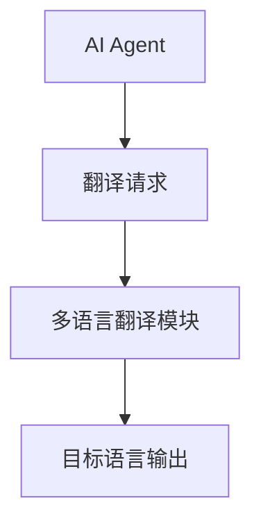
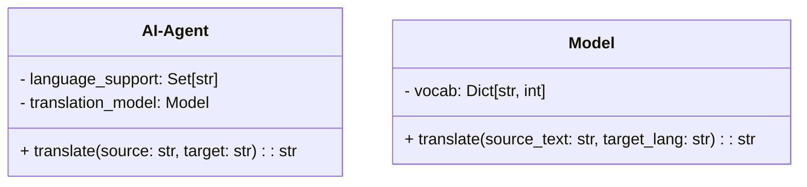
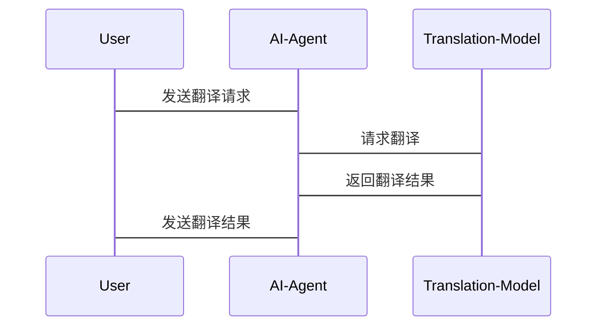

                 


# 实现AI Agent的多语言翻译能力

> 关键词：AI Agent，多语言翻译，自然语言处理，机器学习，系统架构

> 摘要：本文详细探讨了如何实现AI Agent的多语言翻译能力，从问题背景到算法原理，再到系统设计和项目实战，全面解析了实现这一能力的各个关键环节。

---

## 第1章: 问题背景与核心概念

### 1.1 问题背景

#### 1.1.1 当前AI翻译技术的局限性
目前，AI翻译技术在处理复杂语境和多语言场景时仍存在不足，如翻译准确度低、无法理解上下文等。

#### 1.1.2 多语言翻译的实际需求
随着全球化的发展，多语言翻译需求日益增长，特别是在跨文化交流和商业活动中。

#### 1.1.3 AI Agent在多语言翻译中的作用
AI Agent能够通过集成多语言翻译模型，提供实时、高效的翻译服务。

### 1.2 问题描述

#### 1.2.1 多语言翻译的核心挑战
翻译模型需要处理多种语言，且每种语言的语法和语境差异较大。

#### 1.2.2 AI Agent的翻译能力要求
AI Agent需要支持多种语言翻译，并具备上下文理解和实时响应能力。

#### 1.2.3 问题解决的目标与边界
目标是实现AI Agent的多语言翻译能力，边界包括支持的语言数量、翻译准确度等。

### 1.3 核心概念与结构

#### 1.3.1 AI Agent的基本概念
AI Agent是一种智能体，能够感知环境并执行任务。

#### 1.3.2 多语言翻译的实现机制
通过集成NLP模型，AI Agent可以实现多语言翻译。

#### 1.3.3 核心要素与组成关系
涉及AI Agent、翻译请求、多语言翻译模块、目标语言输出等要素。

## 第2章: 核心概念与联系

### 2.1 AI Agent与多语言翻译的关系

#### 2.1.1 AI Agent的定义与功能
AI Agent能够执行任务，包括信息处理和决策。

#### 2.1.2 多语言翻译的核心原理
基于NLP技术，将源语言文本转换为目标语言。

#### 2.1.3 两者结合的实现方式
通过API集成翻译模块，AI Agent能够处理多语言请求。

### 2.2 核心概念对比表

| 对比维度       | AI Agent                     | 多语言翻译                   |
|----------------|------------------------------|-------------------------------|
| 核心功能       | 执行任务                     | 转换语言                     |
| 技术基础       | 机器学习                     | 自然语言处理                 |
| 应用场景       | 智能助手、自动化系统         | 跨文化交流、跨语言服务       |

### 2.3 ER实体关系图



## 第3章: 算法原理与数学模型

### 3.1 算法原理

#### 3.1.1 翻译模型的选择
选择Transformer模型，因为它在NLP任务中表现优异。

#### 3.1.2 神经机器翻译的原理
基于编码器-解码器结构，将源语言编码为向量，再解码为目标语言。

#### 3.1.3 基于Transformer的模型结构
使用多头自注意力机制，捕捉文本中的长距离依赖关系。

### 3.2 数学模型与公式

#### 3.2.1 编码器-解码器结构
编码器将输入序列转换为上下文向量：
$$
\text{Encoder}(x) = z
$$

解码器根据编码结果生成目标语言序列：
$$
\text{Decoder}(z, y) = \hat{y}
$$

#### 3.2.2 自注意力机制
自注意力权重计算公式：
$$
\text{Attention}(Q, K, V) = \text{softmax}\left(\frac{QK^T}{\sqrt{d_k}}\right)V
$$

### 3.3 Python代码实现

#### 3.3.1 简单翻译模型示例
```python
import torch
import torch.nn as nn

class Transformer(nn.Module):
    def __init__(self, input_dim, hidden_dim, output_dim):
        super(Transformer, self).__init__()
        self.encoder = nn.Linear(input_dim, hidden_dim)
        self.decoder = nn.Linear(hidden_dim, output_dim)
    
    def forward(self, x):
        encoded = torch.relu(self.encoder(x))
        decoded = self.decoder(encoded)
        return decoded

# 示例输入
input_dim = 100
hidden_dim = 200
output_dim = 50
model = Transformer(input_dim, hidden_dim, output_dim)
input_tensor = torch.randn(1, input_dim)
output_tensor = model(input_tensor)
print(output_tensor)
```

## 第4章: 系统分析与架构设计

### 4.1 系统功能设计

#### 4.1.1 领域模型类图


### 4.2 系统架构设计

#### 4.2.1 架构图


### 4.3 系统接口设计

#### 4.3.1 接口描述
AI-Agent通过REST API接收翻译请求，调用翻译模型完成翻译。

#### 4.3.2 序列图


## 第5章: 项目实战

### 5.1 环境安装

#### 5.1.1 安装依赖
```bash
pip install torch transformers
```

### 5.2 系统核心实现

#### 5.2.1 翻译模型实现
```python
from transformers import MarianMT

class Translator:
    def __init__(self, source_lang, target_lang):
        self.model = MarianMT(source_lang=source_lang, target_lang=target_lang)
    
    def translate(self, text):
        return self.model.translate(text)
```

### 5.3 实际案例分析

#### 5.3.1 案例分析
输入文本：“Hello, how are you?”，目标语言为西班牙语，输出为“¡Hola, ¿cómo estás?”。

### 5.4 项目小结
通过集成现有的NLP模型，可以快速实现AI Agent的多语言翻译能力。

## 第6章: 最佳实践

### 6.1 小结
实现AI Agent的多语言翻译能力需要结合NLP模型和系统设计。

### 6.2 注意事项
- 确保模型支持所需语言。
- 处理翻译中的错误和异常。

### 6.3 扩展阅读
- 参考Transformers库文档，了解更多翻译模型。
- 学习系统架构设计的最佳实践。

---

## 作者：AI天才研究院/AI Genius Institute & 禅与计算机程序设计艺术 /Zen And The Art of Computer Programming

