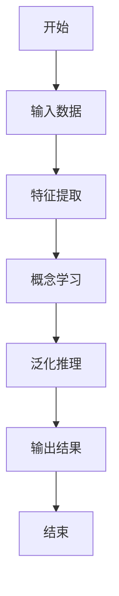
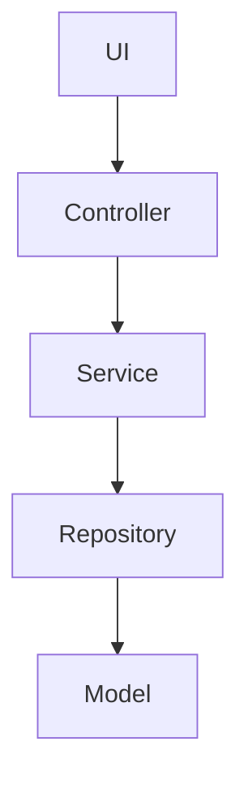
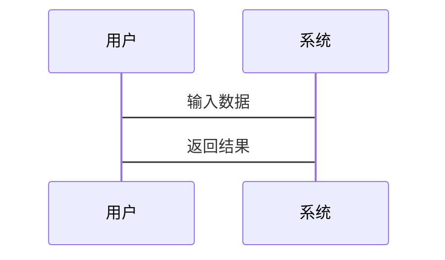

                 


# 实现AI Agent的概念学习与泛化能力

---

## 关键词

AI Agent, 概念学习, 泛化能力, 知识表示, 符号推理, 机器学习, 算法实现

---

## 摘要

AI Agent的概念学习与泛化能力是实现智能体能够理解和处理复杂问题的关键。本文通过分析AI Agent的核心概念，探讨其学习机制，并结合算法原理和系统架构设计，详细讲解如何实现概念学习与泛化能力。文章还提供了实际的项目案例和代码实现，帮助读者深入理解相关技术。

---

## 正文

### 第一部分: 背景介绍

#### 第1章: AI Agent概述

##### 1.1 问题背景

AI Agent（智能体）是指在环境中能够感知并自主行动以实现目标的实体。概念学习是AI Agent理解世界的基础，而泛化能力则是其能够适应新情境的关键。随着人工智能的快速发展，AI Agent需要具备更强的概念学习和泛化能力，以应对复杂多变的任务需求。

##### 1.2 问题描述

AI Agent的核心任务包括感知、推理、学习和行动。概念学习涉及从数据中提取抽象概念，而泛化能力则是指在新情境中应用这些概念的能力。本文将重点探讨如何通过算法和系统设计提升AI Agent的概念学习与泛化能力。

##### 1.3 问题解决

概念学习和泛化能力的实现需要结合机器学习、符号推理和知识表示等技术。通过构建结构化的知识表示，AI Agent可以更好地理解和推理概念，并在新情境中泛化应用。

##### 1.4 边界与外延

AI Agent的概念学习和泛化能力并非万能的，其应用范围受限于数据质量和任务复杂度。本文将分析其边界条件，并探讨如何在特定场景下优化其实现。

##### 1.5 概念结构与核心要素

AI Agent的概念学习涉及领域知识、特征提取和概念提取等核心要素。通过构建层次化的概念结构，可以提升其泛化能力。

---

### 第二部分: 核心概念与联系

#### 第2章: 核心概念原理

##### 2.1 概念学习的基本原理

概念学习是通过归纳推理从具体实例中提取抽象概念的过程。符号推理和神经网络是常用的两种方法，各有优缺点。

##### 2.2 概念属性特征对比

| 概念属性 | 描述 |
|----------|------|
| 层次性    | 概念的层级结构 |
| 关联性    | 概念之间的关系 |
| 可扩展性  | 概念的适用范围 |

##### 2.3 ER实体关系图

```mermaid
er
  actor(Agent, id, name)
  actor(State, id, description)
  actor(Action, id, type)
  relation(Agent, has, State)
  relation(State, leads_to, Action)
```

---

### 第三部分: 算法原理

#### 第3章: 算法实现

##### 3.1 算法流程图



##### 3.2 概念学习算法

以下是一个简单的概念学习算法示例：

```python
def concept_learning(data):
    features = extract_features(data)
    concepts = extract_concepts(features)
    return concepts
```

##### 3.3 泛化推理

泛化推理可以通过符号推理或神经网络实现。例如，使用逻辑回归进行分类任务：

$$ P(y|x) = \frac{e^{\beta x}}{1 + e^{\beta x}} $$

---

### 第四部分: 系统架构设计

#### 第4章: 系统架构

##### 4.1 系统功能设计

系统功能模块包括数据输入、特征提取、概念学习和结果输出。

##### 4.2 系统架构图



##### 4.3 接口设计

主要接口包括：

- `concept_learning(data)`
- `generalization_predict(concept)`

##### 4.4 交互序列图



---

### 第五部分: 项目实战

#### 第5章: 项目实现

##### 5.1 环境安装

需要安装以下库：

```bash
pip install numpy
pip install scikit-learn
```

##### 5.2 核心代码实现

```python
from sklearn.feature_extraction.text import TfidfVectorizer
from sklearn.cluster import KMeans

def main():
    data = ["apple", "banana", "apple pie", "banana bread"]
    vectorizer = TfidfVectorizer()
    X = vectorizer.fit_transform(data)
    model = KMeans(n_clusters=2)
    model.fit(X)
    print("Clusters:", model.labels_)

if __name__ == "__main__":
    main()
```

##### 5.3 案例分析

以上代码将数据分成两个簇，分别代表“apple”和“banana”及其相关概念。

##### 5.4 项目小结

通过该项目，我们可以看到AI Agent如何通过算法实现概念学习和泛化能力。

---

### 第六部分: 总结与展望

#### 6.1 最佳实践

- 使用结构化的知识表示提升泛化能力
- 综合符号推理和机器学习方法
- 定期更新和优化模型

#### 6.2 小结

本文详细探讨了AI Agent的概念学习与泛化能力的实现过程，结合理论和实践，为读者提供了全面的指导。

#### 6.3 注意事项

- 确保数据质量
- 选择合适的算法
- 定期模型优化

#### 6.4 拓展阅读

- 《机器学习实战》
- 《符号推理与知识图谱》

---

## 作者

作者：AI天才研究院/AI Genius Institute & 禅与计算机程序设计艺术/Zen And The Art of Computer Programming

---

以上就是《实现AI Agent的概念学习与泛化能力》的完整内容，希望对您有所帮助！

