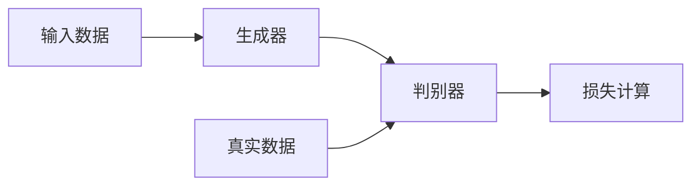
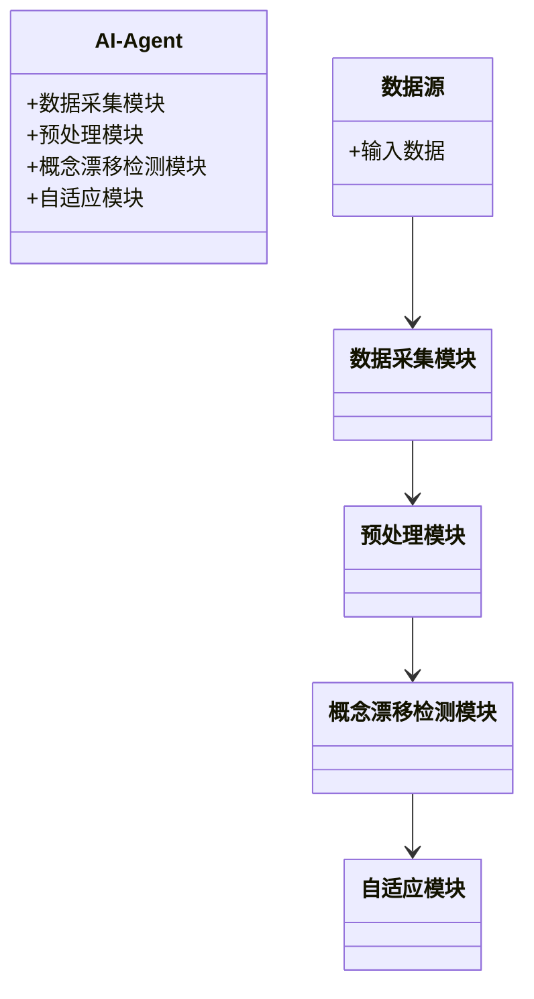

                 

# 实现AI Agent的概念漂移检测与适应

---

## 关键词：
AI Agent，概念漂移，机器学习，实时检测，自适应系统

---

## 摘要：
随着机器学习模型在动态环境中的广泛应用，概念漂移检测与适应成为确保模型持续性能的关键技术。本文深入探讨AI Agent中的概念漂移检测与适应，从理论基础到实际应用，结合算法原理和系统架构设计，为读者提供全面的指导。

---

# 第一部分: AI Agent与概念漂移概述

## 第1章: 概念漂移检测与适应的背景

### 1.1 概念漂移的定义与问题背景
#### 1.1.1 什么是概念漂移
概念漂移是指数据分布或模型目标在运行时发生的变化，导致模型性能下降的现象。例如，电商中的用户购买行为可能因市场变化而改变。

#### 1.1.2 概念漂移的分类与特点
概念漂移主要分为突然漂移、渐进漂移和分布漂移，具有实时性、动态性和潜在性的特点。

#### 1.1.3 概念漂移在AI Agent中的重要性
AI Agent需实时检测概念漂移，以保持决策准确性。例如，在金融 fraud detection中，漂移可能导致模型漏检。

### 1.2 AI Agent的概念与应用场景
#### 1.2.1 AI Agent的基本定义
AI Agent是具备感知环境、自主决策和执行任务的智能体。

#### 1.2.2 AI Agent的核心功能
包括感知环境、分析数据、决策制定和执行操作。

#### 1.2.3 概念漂移检测在AI Agent中的应用
例如，在智能客服系统中，漂移可能导致意图识别错误。

### 1.3 概念漂移检测的挑战与意义
#### 1.3.1 概念漂移检测的难点
动态环境、数据稀疏性和检测实时性是主要挑战。

#### 1.3.2 概念漂移检测在AI Agent中的价值
提升模型适应性和可靠性，降低业务风险。

#### 1.3.3 概念漂移检测的边界与外延
明确概念漂移的适用范围，避免过度扩展。

### 1.4 本章小结
概念漂移检测是AI Agent的关键技术，直接影响其性能和决策能力。

---

# 第二部分: 概念漂移检测的核心概念与原理

## 第2章: 概念漂移检测的核心概念

### 2.1 概念漂移检测的原理与方法
#### 2.1.1 统计方法
基于统计检验（如Kolmogorov-Smirnov）检测数据分布变化。

#### 2.1.2 机器学习方法
使用分类模型（如决策树）比较训练集和新数据的性能差异。

#### 2.1.3 深度学习方法
通过对抗训练检测数据分布变化，如使用CycleGAN。

### 2.2 概念漂移检测的核心要素
#### 2.2.1 数据分布变化的检测
比较当前数据与模型训练数据的分布差异。

#### 2.2.2 模型性能的评估
通过准确率、F1分数等指标监控模型性能变化。

#### 2.2.3 概念漂移的分类与检测
根据变化的类型选择合适的检测方法。

### 2.3 概念漂移检测与AI Agent的结合
#### 2.3.1 AI Agent中的概念漂移检测流程
包括数据采集、分布分析、性能监控和反馈机制。

#### 2.3.2 概念漂移检测在AI Agent中的作用
实时更新模型，提升适应性和准确性。

---

# 第三部分: 算法原理与实现

## 第3章: 概念漂移检测算法原理

### 3.1 统计方法
使用Kolmogorov-Smirnov检验，通过比较累积分布函数判断数据分布变化。

### 3.2 机器学习方法
基于分类模型，比较新数据与训练数据的分类结果差异。

### 3.3 深度学习方法
通过对抗训练检测数据分布变化，生成器和判别器分别学习源数据和目标数据。

#### 3.3.1 流程图

### 3.4 算法对比与选择
| 方法 | 优势 | 劣势 |
|------|------|------|
| 统计方法 | 简单高效 | 易受样本数量影响 |
| 机器学习方法 | 高准确性 | 训练耗时 |
| 深度学习方法 | 强大学习能力 | 计算资源需求高 |

---

# 第四部分: 系统架构与设计

## 第4章: 系统架构设计

### 4.1 系统功能设计
- 数据采集模块：实时收集环境数据。
- 预处理模块：清洗和转换数据。
- 概念漂移检测模块：分析数据分布变化。
- 自适应模块：更新模型或调整策略。

### 4.2 系统架构图

### 4.3 接口设计
- 数据输入接口：接收实时数据流。
- 检测结果接口：输出概念漂移警报。

---

# 第五部分: 项目实战与案例分析

## 第5章: 项目实战

### 5.1 环境安装
安装必要的库，如TensorFlow、Scikit-learn、Keras。

### 5.2 核心实现
#### 5.2.1 数据准备
加载数据集并进行预处理。

#### 5.2.2 模型训练
训练初始模型，如随机森林。

#### 5.2.3 概念漂移检测
使用统计方法检测数据分布变化。

#### 5.2.4 自适应更新
当检测到漂移时，重新训练模型。

### 5.3 结果分析
展示检测结果和模型性能变化，验证方法的有效性。

---

# 第六部分: 最佳实践与总结

## 第6章: 最佳实践

### 6.1 关键点总结
- 选择合适的方法：统计、机器学习或深度学习。
- 实时监控：持续检测数据变化。
- 自动化更新：及时调整模型。

### 6.2 小结
概念漂移检测是AI Agent的重要组成部分，需要结合具体场景选择合适的检测方法。

### 6.3 注意事项
- 定期校准模型，避免累积误差。
- 处理高维数据时，使用降维技术。
- 考虑计算资源限制，选择轻量级方法。

### 6.4 扩展阅读
推荐阅读相关论文，如“Concept Drift Detection via Statistical Tests”。

---

## 作者：
作者：AI天才研究院 & 禅与计算机程序设计艺术

