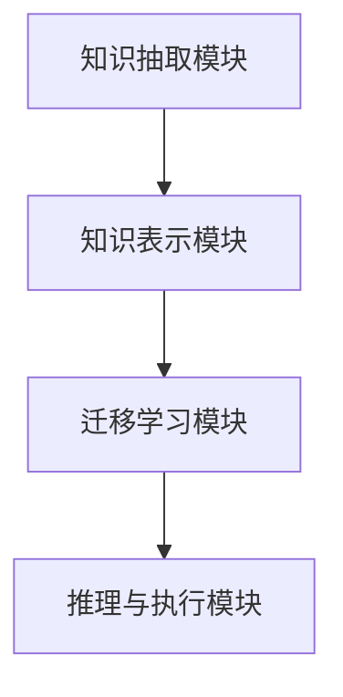

                 


# 实现AI Agent的跨领域知识迁移

---

## 关键词

- AI Agent
- 跨领域知识迁移
- 迁移学习
- 知识图谱
- 多领域适应

---

## 摘要

AI Agent的跨领域知识迁移是指让AI代理能够将从一个领域学到的知识迁移到另一个领域，从而提升其在多种复杂场景中的适应能力和智能水平。本文将从理论、算法、系统架构到实战，全面探讨AI Agent实现跨领域知识迁移的关键技术，包括知识表示、迁移学习、领域适应等核心概念，并结合实际案例，详细解析如何设计和实现一个高效的跨领域知识迁移系统。

---

## 第1章：AI Agent与跨领域知识迁移的背景

### 1.1 AI Agent的基本概念

AI Agent（人工智能代理）是指能够感知环境、自主决策并执行任务的智能体。它可以是一个软件程序，也可以是一个物理机器人，其核心目标是通过感知和行动来实现特定的目标。

#### 1.1.1 AI Agent的定义与特点
- **定义**：AI Agent是一个具有智能的实体，能够通过传感器感知环境，通过执行器与环境交互，并通过内部逻辑推理做出决策。
- **特点**：
  - **自主性**：能够在没有外部干预的情况下自主运行。
  - **反应性**：能够实时感知环境变化并做出反应。
  - **目标导向**：所有行为都围绕着实现特定目标展开。
  - **学习能力**：能够通过经验或数据优化自身的决策能力。

#### 1.1.2 跨领域知识迁移的背景
- AI Agent在单一领域表现优异，但面对跨领域任务时，往往需要重新学习，效率低下。
- 跨领域知识迁移能够帮助AI Agent快速适应新领域，减少重复学习的时间和资源消耗。
- 在实际应用中，跨领域任务的场景越来越复杂，例如医疗与金融领域的结合、多语言翻译等。

#### 1.1.3 当前AI Agent的应用现状
- **单一领域应用**：如智能音箱、推荐系统等。
- **跨领域应用的挑战**：例如在医疗领域学习的诊断知识无法直接迁移到金融领域进行风险评估。

---

### 1.2 跨领域知识迁移的背景与挑战

#### 1.2.1 跨领域知识迁移的定义
- 跨领域知识迁移是指将一个领域的知识、经验或模型迁移到另一个领域，以提升目标领域的性能。

#### 1.2.2 知识迁移的核心问题
- **领域差异性**：不同领域的数据分布、特征、标签可能差异很大。
- **知识表示**：如何将知识以一种通用的形式表示，使其能够跨领域适用。
- **迁移策略**：选择合适的迁移方法，平衡源领域和目标领域的差异。

#### 1.2.3 跨领域知识迁移的难点与解决方案
- **难点**：
  - 数据量差异：目标领域可能缺乏足够的数据。
  - 领域特性差异：不同领域的特征提取方式不同。
- **解决方案**：
  - 使用通用的知识表示方法，如知识图谱。
  - 借助迁移学习算法，减少领域差异的影响。

---

## 第2章：知識表示与迁移学习基础

### 2.1 知识表示的理论基础

#### 2.1.1 知识表示的基本概念
- 知识表示是将知识以某种形式编码，便于计算机理解和使用。
- 常见的表示方法包括符号表示（如知识图谱）和向量表示（如词嵌入）。

#### 2.1.2 知识图谱与符号表示
- **知识图谱**：通过图结构表示实体及其关系，例如Google的Knowledge Graph。
- **符号表示**：使用符号逻辑表达知识，例如规则引擎。

#### 2.1.3 向量空间模型与分布式表示
- **向量空间模型**：将知识表示为向量，例如Word2Vec生成的词向量。
- **分布式表示**：通过神经网络学习得到的分布式表示，能够捕捉语义信息。

---

### 2.2 迁移学习的核心原理

#### 2.2.1 迁移学习的定义与分类
- **定义**：迁移学习是指将一个领域（源领域）的知识迁移到另一个领域（目标领域）。
- **分类**：
  - **有监督迁移学习**：源领域和目标领域都有标注数据。
  - **无监督迁移学习**：目标领域缺乏标注数据。
  - **半监督迁移学习**：结合有监督和无监督的场景。

#### 2.2.2 迁移学习的三要素：源域、目标域与共享特征
- **源域（Source Domain）**：已知的领域，拥有大量标注数据。
- **目标域（Target Domain）**：需要迁移的目标领域，可能数据较少或无标注。
- **共享特征（Shared Features）**：源域和目标域之间共有的特征，是迁移的基础。

#### 2.2.3 迁移学习的数学模型与公式
- **源域和目标域的分布表示**：
  $$ P_{source}(X,Y) \rightarrow P_{target}(X,Y) $$
- **条件概率转移**：
  $$ P_{target}(Y|X) = P_{source}(Y|X) \cdot \frac{P_{target}(X)}{P_{source}(X)} $$

---

## 第3章：主流的迁移学习算法

### 3.1 参数迁移与特征迁移

#### 3.1.1 参数迁移的基本原理
- **参数迁移**：将源域模型的参数直接迁移到目标域，通常需要微调。
- **优点**：简单高效，适用于目标域数据量较小的情况。
- **缺点**：可能面临领域漂移，即目标域特征与源域差异较大时效果不佳。

#### 3.1.2 特征迁移的基本原理
- **特征迁移**：通过提取源域和目标域的共享特征，构建特征变换模型。
- **优点**：能够更好地捕捉领域间的共性特征。
- **缺点**：需要额外的特征提取步骤，计算复杂度较高。

---

### 3.2 对抗迁移与领域适应

#### 3.2.1 对抗迁移的基本原理
- **对抗迁移**：通过对抗网络消除领域差异，使源域和目标域的特征分布一致。
- **生成对抗网络（GAN）**：
  $$ \min_{G} \max_{D} \mathbb{E}_{X \sim P_{source}}[\log D(G(X))] + \mathbb{E}_{X \sim P_{target}}[\log (1 - D(G(X)))] $$

#### 3.2.2 领域适应的策略
- **领域无关特征**：提取适用于多个领域的特征。
- **领域相关特征**：针对特定领域优化特征表示。

---

## 第4章：AI Agent跨领域知识迁移的系统架构设计

### 4.1 问题场景与系统功能设计

#### 4.1.1 问题场景
- **医疗与金融领域的知识迁移**：将医疗诊断知识迁移到金融风险评估。
- **多语言翻译**：将一种语言的翻译模型迁移到另一种语言。

#### 4.1.2 系统功能设计
- **知识抽取模块**：从源领域数据中提取知识。
- **知识表示模块**：将知识转化为通用表示形式。
- **迁移学习模块**：实现跨领域知识迁移。
- **推理与执行模块**：基于迁移后的知识进行推理和执行任务。

---

### 4.2 系统架构设计

#### 4.2.1 系统架构图


#### 4.2.2 系统接口设计
- **输入接口**：接收源领域和目标领域的数据。
- **输出接口**：输出迁移后的知识和推理结果。

---

## 第5章：项目实战与案例分析

### 5.1 环境安装与代码实现

#### 5.1.1 环境安装
- Python 3.8+
- TensorFlow 2.0+
- Scikit-learn

#### 5.1.2 代码实现
```python
import tensorflow as tf
from tensorflow.keras import layers

# 源领域数据
source_data = ...
# 目标领域数据
target_data = ...

# 特征提取网络
def feature_extractor():
    model = tf.keras.Sequential()
    model.add(layers.Dense(64, activation='relu'))
    model.add(layers.Dense(32, activation='relu'))
    return model

# 对抗网络
def discriminator():
    model = tf.keras.Sequential()
    model.add(layers.Dense(32, activation='relu'))
    model.add(layers.Dense(1, activation='sigmoid'))
    return model

# 迁移学习网络
def transfer_network():
    feature_model = feature_extractor()
    discriminator_model = discriminator()
    return feature_model, discriminator_model
```

---

## 第6章：总结与展望

### 6.1 最佳实践

#### 6.1.1 数据预处理
- 确保源域和目标域的数据分布尽可能一致。
- 对目标域数据进行清洗和增强。

#### 6.1.2 模型选择
- 根据任务需求选择合适的迁移学习算法。
- 对抗迁移适合领域差异较大的场景。

#### 6.1.3 领域适应
- 在目标域上进行微调，提升迁移效果。

---

### 6.2 总结

本文详细探讨了AI Agent实现跨领域知识迁移的关键技术，从理论到实践，全面解析了知识表示、迁移学习、系统架构等核心内容。通过实际案例分析，展示了如何设计和实现一个高效的跨领域知识迁移系统。

---

### 6.3 展望

未来，AI Agent的跨领域知识迁移将朝着以下几个方向发展：
- **多领域迁移**：支持更多领域的知识迁移。
- **实时迁移**：实现动态、实时的知识更新。
- **强化学习结合**：结合强化学习提升迁移后的决策能力。

---

## 作者：AI天才研究院/AI Genius Institute & 禅与计算机程序设计艺术 /Zen And The Art of Computer Programming

