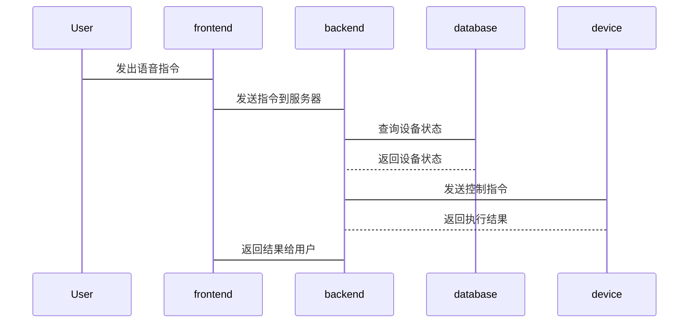

                 


# 实现基于AI Agent的个人助理系统

## 关键词：AI Agent，个人助理系统，人工智能，机器学习，自然语言处理

## 摘要：  
本文详细探讨了基于AI Agent的个人助理系统的实现方法，从核心概念到算法原理，再到系统架构和项目实战，全面解析了AI Agent在个人助理系统中的应用。通过理论与实践相结合的方式，本文为读者提供了从零开始构建一个智能个人助理系统的完整指南。

---

## 第一部分: 引言

## 第1章: AI Agent与个人助理系统概述

### 1.1 AI Agent的基本概念

#### 1.1.1 什么是AI Agent
AI Agent（智能体）是一种能够感知环境并采取行动以实现目标的实体。它可以是一个软件程序，也可以是物理设备，通过传感器和执行器与环境交互。

#### 1.1.2 AI Agent的核心特点
- **自主性**：能够在没有外部干预的情况下运行。
- **反应性**：能够实时感知环境并做出反应。
- **目标导向**：所有行为都以实现特定目标为导向。
- **学习能力**：通过经验改进性能。

#### 1.1.3 AI Agent与传统软件的区别
| 特性 | 传统软件 | AI Agent |
|------|----------|----------|
| 行为方式 | 预定义规则 | 实时感知与决策 |
| 交互方式 | 单向输入输出 | 双向交互 |
| 学习能力 | 无 | 有 |

### 1.2 个人助理系统的背景与应用

#### 1.2.1 个人助理系统的定义
个人助理系统是一种基于AI Agent的智能系统，旨在通过自然语言处理（NLP）、机器学习等技术，为用户提供个性化服务。

#### 1.2.2 个人助理系统的应用场景
- **日程管理**：提醒用户重要事件。
- **信息检索**：帮助用户查找所需信息。
- **任务执行**：自动完成用户的指令。
- **情感交互**：通过情感分析与用户进行自然对话。

#### 1.2.3 个人助理系统的用户需求分析
用户需求主要集中在以下几个方面：
- **准确性**：系统需要准确理解用户的意图。
- **实时性**：系统需要快速响应用户请求。
- **个性化**：系统需要根据用户习惯提供定制化服务。

### 1.3 本章小结
本章介绍了AI Agent的基本概念及其在个人助理系统中的应用，为后续章节的深入讨论奠定了基础。

---

## 第二部分: AI Agent的核心概念与原理

## 第2章: AI Agent的核心概念

### 2.1 AI Agent的类型与分类

#### 2.1.1 基于规则的AI Agent
基于规则的AI Agent通过预定义的规则来执行任务。例如，当检测到特定关键词时，系统会触发预设的响应。

#### 2.1.2 基于模型的AI Agent
基于模型的AI Agent通过构建环境模型来做出决策。例如，智能音箱会根据用户的语音指令构建一个语音识别模型。

#### 2.1.3 基于学习的AI Agent
基于学习的AI Agent通过机器学习算法从数据中学习，从而不断优化自己的行为。例如，聊天机器人通过监督学习来提高对话质量。

### 2.2 AI Agent的组成与结构

#### 2.2.1 知识库
知识库是AI Agent的核心组件之一，存储了系统所需的所有信息，包括用户数据、环境信息等。

#### 2.2.2 行为推理模块
行为推理模块负责根据当前状态和目标，生成相应的动作。例如，当用户说“明天的天气怎么样”，系统会触发天气查询模块。

#### 2.2.3 交互接口
交互接口是AI Agent与用户之间的桥梁，支持多种交互方式，如语音、文本、图形界面等。

### 2.3 AI Agent的核心算法与技术

#### 2.3.1 状态空间搜索
状态空间搜索是一种常见的AI Agent算法，用于在状态空间中找到最优路径。例如，迷宫导航问题可以通过广度优先搜索（BFS）或深度优先搜索（DFS）来解决。

#### 2.3.2 启发式算法
启发式算法通过引入启发函数来加速搜索过程。例如，A*算法通过估算距离（heuristic）来优化路径搜索。

#### 2.3.3 机器学习在AI Agent中的应用
机器学习技术在AI Agent中主要用于模式识别和预测。例如，自然语言处理（NLP）模型可以通过深度学习来提高文本理解能力。

---

## 第3章: AI Agent的数学模型与算法原理

### 3.1 状态空间与搜索算法

#### 3.1.1 状态空间的定义
状态空间是由所有可能的状态组成的集合。例如，在迷宫导航问题中，每个格子代表一个状态。

#### 3.1.2 搜索算法的分类
- **无信息搜索**：如BFS和DFS，适用于完全可探索的环境。
- **有信息搜索**：如A*和贪心算法，适用于部分可探索的环境。

#### 3.1.3 A*算法的数学模型
A*算法通过评估函数$f(n) = g(n) + h(n)$来选择下一个扩展的节点，其中$g(n)$表示从起点到节点$n$的实际成本，$h(n)$表示从节点$n$到目标节点的估计成本。

### 3.2 启发式算法的实现

#### 3.2.1 启发式函数的设计
启发式函数的设计直接影响搜索效率。例如，在迷宫导航中，可以使用欧几里得距离作为启发函数。

#### 3.2.2 A*算法的流程图
```mermaid
graph TD
A[起点] --> B[选择下一个节点]
B --> C[计算f(n)]
C --> D[判断是否是目标节点]
D --> E[是，结束]
D --> F[否，继续搜索]
```

### 3.3 机器学习在AI Agent中的应用

#### 3.3.1 监督学习与无监督学习的对比
| 方法 | 描述 | 优缺点 |
|------|------|--------|
| 监督学习 | 基于标记数据进行训练 | 数据标注成本高 |
| 无监督学习 | 基于未标记数据进行训练 | 适合数据量大的场景 |

#### 3.3.2 神经网络在AI Agent中的应用
神经网络通过多层感知器（MLP）或卷积神经网络（CNN）来处理复杂的模式识别任务。例如，自然语言处理任务可以通过Transformer模型来实现。

---

## 第四部分: 系统架构与实现

## 第4章: 系统架构设计

### 4.1 问题场景介绍
假设我们正在开发一个智能音箱系统，用户可以通过语音指令控制家居设备。

### 4.2 项目介绍
我们的目标是设计一个基于AI Agent的智能音箱系统，支持语音交互和设备控制。

### 4.3 系统功能设计

#### 4.3.1 领域模型
```mermaid
classDiagram
class User {
    id
    name
    preferences
}
class Device {
    id
    name
    status
}
class VoiceCommand {
    command
    timestamp
}
User -> Device: 控制
User -> VoiceCommand: 下达指令
Device -> VoiceCommand: 返回状态
```

#### 4.3.2 系统架构设计


### 4.4 系统接口设计

#### 4.4.1 接口描述
- **输入接口**：麦克风、按钮。
- **输出接口**：扬声器、显示屏。
- **网络接口**：Wi-Fi、蓝牙。

#### 4.4.2 接口交互示例


### 4.5 系统交互设计

#### 4.5.1 交互流程
1. 用户发出语音指令。
2. 系统将指令转换为文本并解析。
3. 系统根据解析结果执行相应的操作。
4. 系统将结果反馈给用户。

#### 4.5.2 交互案例分析
- **案例1**：用户说“打开客厅灯”，系统通过语音识别模块识别指令，调用设备控制模块打开灯。
- **案例2**：用户说“查询今天的天气”，系统调用天气API获取数据并反馈结果。

---

## 第五部分: 项目实战

## 第5章: 项目实战

### 5.1 环境安装

#### 5.1.1 安装Python
```bash
# 安装Python 3.8及以上版本
sudo apt-get update
sudo apt-get install python3.8
```

#### 5.1.2 安装依赖库
```bash
pip install numpy
pip install scikit-learn
pip install nltk
pip install transformers
```

### 5.2 系统核心实现

#### 5.2.1 自然语言处理模块
```python
from transformers import pipeline

nlp = pipeline("text-classification", model="bert-base")
```

#### 5.2.2 语音识别模块
```python
import speech_recognition as sr

r = sr.Recognizer()
with sr.Microphone() as source:
    audio = r.listen(source)
    text = r.recognize_google(audio)
```

#### 5.2.3 设备控制模块
```python
import serial

ser = serial.Serial('COM3', 9600)
ser.write(b'ledon\n')
```

### 5.3 代码应用解读与分析

#### 5.3.1 代码结构
```plaintext
project/
├── main.py
├── config.py
├── modules/
│   ├── nlp_module.py
│   ├── voice_recognition.py
│   └── device_control.py
```

#### 5.3.2 代码实现细节
- **nlp_module.py**：负责文本处理和分类。
- **voice_recognition.py**：负责语音识别和转换。
- **device_control.py**：负责设备控制和状态反馈。

### 5.4 实际案例分析

#### 5.4.1 案例1：语音指令“打开客厅灯”
1. 用户发出语音指令“打开客厅灯”。
2. 语音识别模块将其转换为文本。
3. NLP模块解析指令并调用设备控制模块。
4. 设备控制模块通过串口发送指令到灯具设备。

#### 5.4.2 案例2：查询天气信息
1. 用户发出语音指令“查询今天的天气”。
2. 语音识别模块将其转换为文本。
3. NLP模块解析指令并调用天气API。
4. 天气API返回结果并反馈给用户。

### 5.5 项目小结
本章通过实际案例展示了如何将AI Agent应用于个人助理系统，详细讲解了系统的实现过程和关键代码。

---

## 第六部分: 总结与展望

## 第6章: 总结与展望

### 6.1 最佳实践 tips
- **模块化设计**：确保系统易于扩展和维护。
- **数据安全**：重视用户数据的隐私保护。
- **多模态交互**：支持多种交互方式以提高用户体验。

### 6.2 本章小结
本文从理论到实践，详细探讨了基于AI Agent的个人助理系统的实现方法，为读者提供了从零开始构建智能系统的完整指南。

### 6.3 注意事项
- **性能优化**：在处理大规模数据时，需要优化算法和数据结构。
- **用户体验**：注重系统的易用性和响应速度。

### 6.4 拓展阅读
- 推荐阅读《人工智能：一种现代方法》（Russell & Norvig）以深入了解AI Agent的核心理论。
- 推荐阅读《深度学习》（Goodfellow等）以掌握机器学习的数学基础。

---

## 作者：AI天才研究院/AI Genius Institute & 禅与计算机程序设计艺术 /Zen And The Art of Computer Programming

