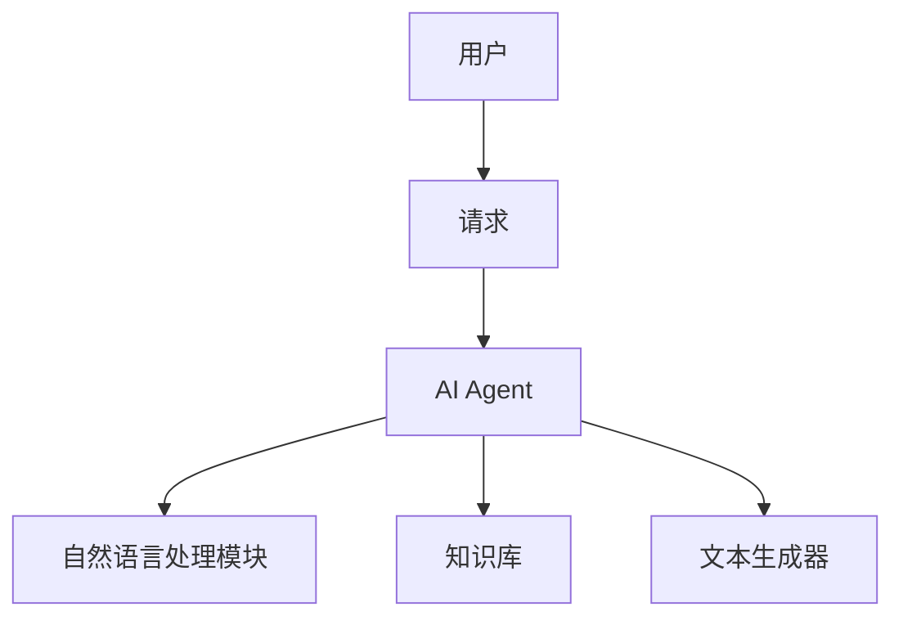
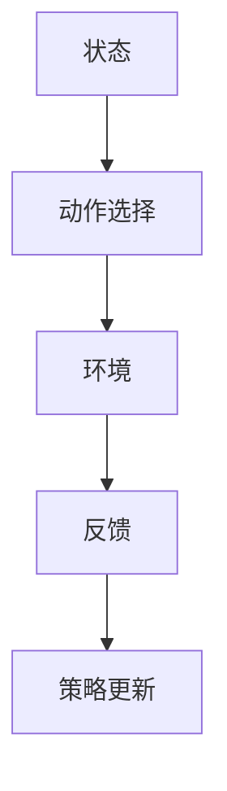
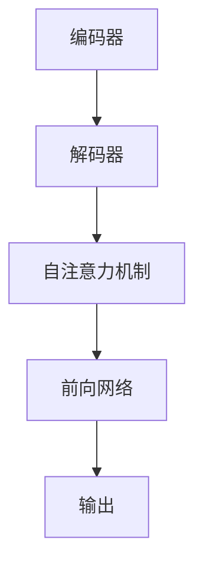

                 


# 实现基于AI Agent的智能写作助手

## 关键词：AI Agent，智能写作，自然语言处理，强化学习，文本生成，系统架构

## 摘要：  
本文详细探讨了如何利用AI Agent技术实现智能写作助手的开发。通过分析AI Agent的核心概念、算法原理、系统架构及项目实战，本文为读者提供了从理论到实践的全面指导。我们从智能写作的背景出发，深入探讨了AI Agent在写作过程中的作用，结合NLP和强化学习技术，详细讲解了智能写作助手的实现原理。同时，我们通过实际案例分析和系统设计，展示了如何构建一个高效、智能的写作辅助系统。

---

# 第一部分: AI Agent与智能写作助手的背景与基础

## 第1章: AI Agent与智能写作助手概述

### 1.1 AI Agent的基本概念

#### 1.1.1 AI Agent的定义与特点
AI Agent（人工智能代理）是指能够感知环境并采取行动以实现目标的智能实体。它具有以下特点：
- **自主性**：能够独立决策和行动。
- **反应性**：能够实时感知环境并做出响应。
- **目标导向**：通过优化目标函数来实现特定目标。
- **学习能力**：能够通过经验改进自身性能。

#### 1.1.2 AI Agent的核心要素与功能
AI Agent的核心要素包括：
- **知识库**：存储与任务相关的知识和数据。
- **感知模块**：用于接收外部输入并解析需求。
- **推理引擎**：根据知识库和输入信息进行推理。
- **执行模块**：根据推理结果采取行动。

#### 1.1.3 AI Agent在智能写作中的作用
在智能写作中，AI Agent可以作为用户的助手，帮助完成以下任务：
- **内容生成**：根据用户需求生成文本。
- **语法校对**：自动检测语法错误。
- **风格优化**：调整文本风格以匹配目标读者。
- **灵感激发**：提供写作建议和灵感。

### 1.2 智能写作助手的发展现状

#### 1.2.1 写作工具的历史演变
写作工具经历了以下几个阶段：
1. **传统工具**：如打字机和文字处理器（Word）。
2. **基于规则的智能工具**：如简单的语法检查工具。
3. **基于机器学习的智能工具**：如利用NLP技术的自动完成功能。
4. **AI Agent驱动的智能工具**：当前及未来发展方向。

#### 1.2.2 当前智能写作工具的特点与局限
当前智能写作工具的特点：
- **自动化**：能够自动完成部分写作任务。
- **个性化**：可以根据用户风格提供定制化建议。
- **实时反馈**：能够即时检测错误并提供改进建议。

当前智能写作工具的局限：
- **理解深度不足**：难以完全理解上下文。
- **创造力有限**：生成内容缺乏创新性。
- **多语言支持不足**：部分工具仅支持单一语言。

#### 1.2.3 AI Agent在智能写作中的潜力
AI Agent的引入将为智能写作工具带来以下潜力：
- **更智能的交互**：通过自然语言理解实现更流畅的对话。
- **更强的创造力**：结合强化学习技术生成更具创新性的内容。
- **更高效的协作**：能够与其他工具和服务无缝集成。

### 1.3 问题背景与目标

#### 1.3.1 写作过程中的常见问题
写作过程中常见的问题包括：
- **灵感枯竭**：难以找到合适的写作素材。
- **效率低下**：重复劳动，如语法校对。
- **风格不统一**：缺乏统一的风格指导。
- **反馈滞后**：传统工具的反馈不够及时。

#### 1.3.2 AI Agent如何解决这些问题
AI Agent可以通过以下方式解决上述问题：
- **实时灵感激发**：通过分析知识库提供创意建议。
- **自动化校对**：利用NLP技术实现语法和拼写检查。
- **风格统一**：根据用户偏好调整文本风格。
- **即时反馈**：通过实时分析提供改进建议。

#### 1.3.3 本项目的具体目标与范围
本项目的具体目标是开发一个基于AI Agent的智能写作助手，能够：
- **理解用户需求**：通过自然语言交互明确用户意图。
- **生成高质量内容**：结合知识库和NLP技术生成文本。
- **提供实时反馈**：检测语法错误并优化文本风格。
- **支持多语言**：实现对多种语言的写作支持。

## 1.4 本章小结
本章介绍了AI Agent的基本概念及其在智能写作中的作用，分析了当前智能写作工具的发展现状及存在的问题，并提出了本项目的目标与范围。

---

# 第二部分: AI Agent的核心概念与原理

## 第2章: AI Agent的核心概念与原理

### 2.1 AI Agent的原理与机制

#### 2.1.1 知识表示与推理
知识表示是AI Agent理解和推理的基础。常见的知识表示方法包括：
- **符号表示**：用符号（如概念、规则）表示知识。
- **语义网络**：通过节点和边表示概念及其关系。
- **知识图谱**：构建结构化的知识网络。

#### 2.1.2 自然语言处理（NLP）基础
NLP技术是AI Agent实现自然语言交互的核心。主要技术包括：
- **分词**：将文本分割为词语或短语。
- **句法分析**：分析句子的语法结构。
- **语义理解**：理解文本的含义和意图。

#### 2.1.3 目标驱动的行为决策
AI Agent的行为决策基于目标函数的优化。典型的决策过程包括：
1. **感知环境**：获取输入信息。
2. **解析需求**：识别用户意图。
3. **推理与规划**：根据知识库生成解决方案。
4. **执行行动**：输出结果并反馈。

### 2.2 AI Agent与NLP技术的结合

#### 2.2.1 NLP技术在写作中的应用
NLP技术在智能写作中的应用包括：
- **自动完写**：根据上下文预测后续文本。
- **语法校对**：检测语法错误并提出修改建议。
- **风格匹配**：调整文本风格以符合目标读者的偏好。

#### 2.2.2 AI Agent如何调用NLP技术
AI Agent通过以下步骤调用NLP技术：
1. **接收输入**：获取用户的写作需求。
2. **解析意图**：识别用户的需求类型。
3. **调用NLP模块**：根据需求调用相应的NLP功能。
4. **生成输出**：输出符合需求的文本。

#### 2.2.3 技术结合的实现路径
实现AI Agent与NLP技术结合的路径包括：
- **模块化设计**：将NLP功能模块化，便于调用。
- **API接口**：通过API实现模块间的通信。
- **数据共享**：确保知识库与NLP模块的数据一致。

### 2.3 AI Agent的实体关系与系统架构

#### 2.3.1 实体关系图（ER图）
以下是AI Agent与智能写作助手的实体关系图：


#### 2.3.2 系统架构图
以下是系统的整体架构图：


## 2.4 本章小结
本章详细讲解了AI Agent的核心概念与原理，分析了NLP技术在智能写作中的应用，并通过实体关系图和系统架构图展示了AI Agent的实现路径。

---

# 第三部分: AI Agent的算法原理与数学模型

## 第3章: AI Agent的算法原理

### 3.1 基于强化学习的决策算法

#### 3.1.1 强化学习的基本原理
强化学习是一种通过试错机制来优化决策策略的技术。主要组成部分包括：
- **环境**：AI Agent所处的环境。
- **动作**：AI Agent可以采取的动作。
- **状态**：环境在某一时刻的状态。
- **奖励**：环境对AI Agent行为的反馈。

#### 3.1.2 AI Agent的决策过程
AI Agent的决策过程可以分为以下几个步骤：
1. **感知环境**：获取当前环境状态。
2. **选择动作**：基于当前状态选择一个动作。
3. **执行动作**：将动作应用于环境。
4. **获得反馈**：根据动作结果获得奖励或惩罚。
5. **更新策略**：根据反馈调整决策策略。

#### 3.1.3 算法流程图
以下是强化学习的算法流程图：


### 3.2 基于NLP的文本生成算法

#### 3.2.1 变压器（Transformer）模型
Transformer模型是当前最先进的文本生成模型之一，其核心组件包括：
- **编码器**：将输入文本转换为嵌入表示。
- **解码器**：根据编码器的输出生成目标文本。

#### 3.2.2 解码器（Decoder）的工作原理
解码器通过以下步骤生成文本：
1. **初始化**：生成初始解码器状态。
2. **自注意力机制**：计算词与词之间的相关性。
3. **前向传播**：将注意力结果输入前向网络。
4. **输出**：生成下一个词的预测概率。

#### 3.2.3 算法流程图
以下是Transformer模型的算法流程图：


## 3.3 本章小结
本章详细讲解了AI Agent的算法原理，重点介绍了强化学习和NLP文本生成算法，通过流程图和数学公式展示了算法的实现细节。

---

# 第四部分: 项目实战与系统设计

## 第4章: 项目实战

### 4.1 环境配置

#### 4.1.1 Python版本要求
建议使用Python 3.6及以上版本。

#### 4.1.2 安装依赖
安装以下依赖：
```bash
pip install numpy
pip install transformers
pip install matplotlib
```

### 4.2 系统核心实现

#### 4.2.1 意图识别模块
意图识别模块的实现代码如下：
```python
def intent_recognition(text):
    # 这里可以调用预训练的NLP模型进行意图识别
    return "写作需求"
```

#### 4.2.2 文本生成模块
文本生成模块的实现代码如下：
```python
def text_generation(prompt, length=50):
    # 这里可以调用预训练的生成模型
    return generated_text
```

### 4.3 实际案例分析

#### 4.3.1 案例一：新闻稿生成
用户输入：生成一篇关于人工智能的新闻稿。
系统输出：一篇结构合理、内容丰富的新闻稿。

#### 4.3.2 案例二：营销文案生成
用户输入：生成一则吸引人的产品营销文案。
系统输出：一则符合目标读者偏好的营销文案。

## 4.4 本章小结
本章通过实际案例展示了AI Agent智能写作助手的实现过程，详细讲解了系统核心模块的实现方法，并通过具体案例分析了系统的实际应用效果。

---

# 第五部分: 总结与展望

## 第5章: 总结与展望

### 5.1 本章总结
本文详细探讨了基于AI Agent的智能写作助手的实现方法，从理论到实践，系统地介绍了AI Agent的核心概念、算法原理、系统架构及项目实现。通过本文的指导，读者可以掌握AI Agent在智能写作中的应用技术。

### 5.2 未来展望
未来，AI Agent在智能写作中的应用将更加广泛和深入。以下是未来发展的几个方向：
- **多模态交互**：结合视觉、听觉等多种模态信息，实现更丰富的交互方式。
- **个性化优化**：通过用户行为分析，提供更个性化的写作建议。
- **实时协作**：支持多人实时协作，实现更高效的团队写作。

## 5.3 最佳实践Tips
- 在实现AI Agent时，建议优先选择开源的NLP框架（如Hugging Face）。
- 在部署系统时，注意保护用户隐私和数据安全。
- 在优化系统性能时，可以尝试使用轻量级模型和边缘计算技术。

## 5.4 小结
本文通过详细的理论分析和实际案例，展示了基于AI Agent的智能写作助手的实现过程，为读者提供了从理论到实践的全面指导。

---

# 附录: 参考文献与进一步阅读

- [1] 禅与计算机程序设计艺术. 人工智能基础.
- [2] Hugging Face. Transformer模型实现.
- [3] OpenAI. 强化学习指南.

---

# 作者：AI天才研究院/AI Genius Institute & 禅与计算机程序设计艺术 /Zen And The Art of Computer Programming

