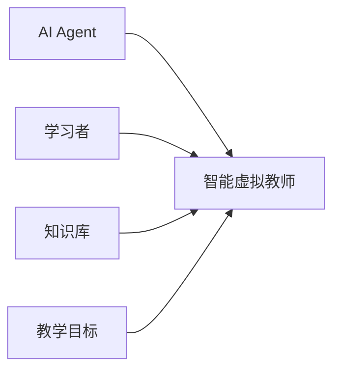
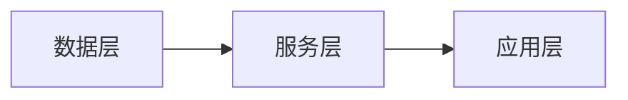

                 


# 实现基于AI Agent的智能虚拟教师

## 关键词：AI Agent，智能虚拟教师，教育技术，生成式AI，强化学习，系统架构

## 摘要：  
本文详细探讨了基于AI Agent的智能虚拟教师的实现方法，从理论基础到算法原理，再到系统架构设计和项目实战，全面解析了智能虚拟教师的核心技术与应用。文章首先介绍了AI Agent的基本概念及其在教育领域的应用背景，然后深入分析了生成式AI和强化学习的算法原理，结合系统架构设计和项目实战，展示了如何构建一个功能完善的智能虚拟教师系统。最后，文章展望了智能虚拟教师的未来发展和潜在挑战。

---

## 第一部分: 基于AI Agent的智能虚拟教师背景介绍

### 第1章: AI Agent与智能虚拟教师概述

#### 1.1 AI Agent的基本概念  
AI Agent（智能代理）是指能够感知环境、做出决策并采取行动的智能实体。它具备以下几个核心特征：  
1. **自主性**：能够在没有外部干预的情况下自主运行。  
2. **反应性**：能够实时感知环境并做出响应。  
3. **目标导向**：具有明确的目标，并能采取行动以实现目标。  
4. **学习能力**：能够通过经验改进自身的行为和决策能力。  

AI Agent与传统AI的区别在于，传统AI通常专注于特定任务的解决，而AI Agent具备更强的自主性和适应性，能够动态调整行为以应对复杂环境。

#### 1.2 智能虚拟教师的定义与特点  
智能虚拟教师（Intelligent Virtual Teacher, IVT）是一种基于AI Agent的教育工具，能够通过自然语言处理、机器学习等技术，为学习者提供个性化的教学服务。其核心功能包括：  
1. **知识传授**：基于学习者的需求，提供定制化的教学内容。  
2. **互动问答**：通过自然语言处理技术，与学习者进行实时对话。  
3. **个性化推荐**：根据学习者的学习进度和偏好，推荐合适的学习资源。  
4. **情感支持**：通过情感计算技术，提供情感支持和心理疏导。  

与传统教学工具相比，智能虚拟教师的优势在于其智能化和个性化，能够为学习者提供更高效、更贴心的学习体验。

#### 1.3 AI Agent在教育领域的应用背景  
随着人工智能技术的快速发展，教育领域正在经历一场数字化转型。AI Agent作为一项核心技术，为教育工具的智能化提供了新的可能性。  
1. **教育技术的发展趋势**：从传统的教学工具到智能化的学习管理系统，再到个性化的智能虚拟教师，教育技术正在向更智能化、更个性化的方向发展。  
2. **AI Agent在教育中的潜在价值**：AI Agent能够通过大数据分析和机器学习，帮助教师更好地了解学生的学习情况，提供个性化的教学策略。同时，智能虚拟教师能够24小时在线，为学生提供即时的学习支持。  
3. **当前智能虚拟教师的应用现状**：目前，智能虚拟教师已经在语言学习、在线辅导等领域得到了初步应用，但仍面临技术成熟度不足、用户体验不佳等挑战。

#### 1.4 本章小结  
本章主要介绍了AI Agent的基本概念及其在教育领域的应用背景，重点阐述了智能虚拟教师的核心功能和特点。通过对比分析，展示了智能虚拟教师在教育领域的巨大潜力。

---

## 第二部分: 基于AI Agent的智能虚拟教师核心概念与联系

### 第2章: AI Agent的核心原理  

#### 2.1 AI Agent的感知、决策与执行  
AI Agent的运行过程可以分为三个主要阶段：感知、决策和执行。  
1. **感知阶段**：AI Agent通过传感器、摄像头、麦克风等设备感知外部环境的信息。例如，在智能虚拟教师中，感知阶段可能包括接收学习者的问题、情感状态等信息。  
2. **决策阶段**：AI Agent基于感知到的信息，结合自身的知识库和决策算法，生成行动方案。例如，在智能虚拟教师中，决策阶段可能包括根据学习者的问题生成回答、推荐学习资源等。  
3. **执行阶段**：AI Agent根据决策结果采取相应的行动。例如，在智能虚拟教师中，执行阶段可能包括通过自然语言生成技术生成回答，并通过网络将回答反馈给学习者。  

#### 2.2 智能虚拟教师的核心算法  
智能虚拟教师的核心算法包括生成式AI和强化学习。  
1. **生成式AI算法**：生成式AI通过概率模型生成文本、图像等输出。在智能虚拟教师中，生成式AI主要用于对话生成和内容创作。  
2. **强化学习算法**：强化学习通过试错机制优化AI Agent的行为策略。在智能虚拟教师中，强化学习可以用于优化教学策略和个性化推荐算法。  

#### 2.3 AI Agent与智能虚拟教师的实体关系图  


---

## 第三部分: 基于AI Agent的智能虚拟教师算法原理

### 第3章: 生成式AI算法原理  

#### 3.1 生成式AI的数学模型  
生成式AI的核心是概率生成模型，常用的模型包括变分自编码器（VAE）和生成对抗网络（GAN）。  
1. **变分自编码器（VAE）**  
   VAE通过最大化似然函数来学习数据的分布。其数学模型如下：  
   $$ \mathcal{L} = \mathbb{E}_{x}[ \log p(x)] - \mathbb{E}_{z}[ \log q(z|x)] $$  
   其中，$x$ 表示输入数据，$z$ 表示潜在变量。  

2. **生成对抗网络（GAN）**  
   GAN由生成器和判别器组成。生成器的目标是生成与真实数据无法区分的假数据，判别器的目标是区分真实数据和生成数据。其损失函数为：  
   $$ \mathcal{L}_{GAN} = \mathbb{E}_{x}[ \log D(x)] + \mathbb{E}_{z}[ \log (1 - D(G(z)))] $$  
   其中，$D(x)$ 表示判别器输出，$G(z)$ 表示生成器输出。  

#### 3.2 强化学习算法的实现  
强化学习通过试错机制优化AI Agent的行为策略。常用的强化学习算法包括Q-learning和深度强化学习。  
1. **Q-learning算法**  
   Q-learning通过维护一个Q值表，记录每个状态-动作对的期望奖励。其更新公式为：  
   $$ Q(s, a) = Q(s, a) + \alpha [r + \gamma \max Q(s', a') - Q(s, a)] $$  
   其中，$\alpha$ 表示学习率，$\gamma$ 表示折扣因子。  

2. **深度强化学习**  
   深度强化学习通过神经网络近似Q值函数。常用的算法包括Deep Q-Network（DQN）和Actor-Critic（AC）算法。  

---

## 第四部分: 基于AI Agent的智能虚拟教师系统分析与架构设计

### 第4章: 智能虚拟教师系统分析  

#### 4.1 系统功能设计  
智能虚拟教师系统主要包括以下几个功能模块：  
1. **知识库管理**：存储教学内容、学习者数据等。  
2. **对话系统**：实现与学习者的自然语言交互。  
3. **个性化推荐**：根据学习者的需求推荐学习资源。  

#### 4.2 系统架构设计  
智能虚拟教师系统的架构可以分为数据层、服务层和应用层。  


---

## 第五部分: 基于AI Agent的智能虚拟教师项目实战

### 第5章: 智能虚拟教师项目实战  

#### 5.1 环境配置  
项目需要以下环境：  
1. Python 3.8及以上版本  
2. 安装必要的库：numpy、pandas、tensorflow、keras等。  

#### 5.2 核心代码实现  
以下是一个简单的对话系统的实现代码：  
```python
import numpy as np
from tensorflow.keras.models import Model
from tensorflow.keras.layers import Input, Dense, LSTM, Bidirectional

# 定义生成式模型
def build_generator():
    input_layer = Input(shape=(max_length,))
    lstm_layer = Bidirectional(LSTM(128))(input_layer)
    dense_layer = Dense(256, activation='relu')(lstm_layer)
    output_layer = Dense(vocab_size, activation='softmax')(dense_layer)
    model = Model(inputs=input_layer, outputs=output_layer)
    return model

# 定义强化学习策略
def reinforce_policy():
    # 简单的Q-learning实现
    Q = defaultdict(float)
    alpha = 0.1
    gamma = 0.9
    return Q, lambda s, a: Q[s][a] + alpha * (r + gamma * max(Q[s'].values()) - Q[s][a])
```

#### 5.3 项目总结  
通过本项目的实现，我们展示了如何利用生成式AI和强化学习构建智能虚拟教师系统。尽管目前的技术还存在一些不足，但随着技术的进步，智能虚拟教师将为教育领域带来更多的可能性。

---

## 第六部分: 基于AI Agent的智能虚拟教师高级应用与未来展望

### 第6章: 高级应用与未来展望  

#### 6.1 智能虚拟教师的高级功能  
未来，智能虚拟教师将具备更多高级功能，例如：  
1. **多模态交互**：支持语音、图像等多种交互方式。  
2. **自适应学习**：根据学习者的行为动态调整教学策略。  

#### 6.2 技术挑战与解决方案  
尽管智能虚拟教师具有巨大的潜力，但在实际应用中仍面临诸多挑战，例如：  
1. **数据隐私问题**：需要采取数据加密和匿名化处理。  
2. **算法可解释性**：需要提高生成式AI和强化学习算法的可解释性。  

#### 6.3 未来发展方向  
未来，智能虚拟教师将朝着更智能化、更个性化的方向发展，同时在教育技术、医疗健康等领域也将发挥更大的作用。

---

## 作者：AI天才研究院/AI Genius Institute & 禅与计算机程序设计艺术 /Zen And The Art of Computer Programming

---

**注**：以上内容为基于AI Agent的智能虚拟教师技术博客文章的目录和部分内容示例。实际撰写时，需根据具体需求进一步扩展和详细阐述。

