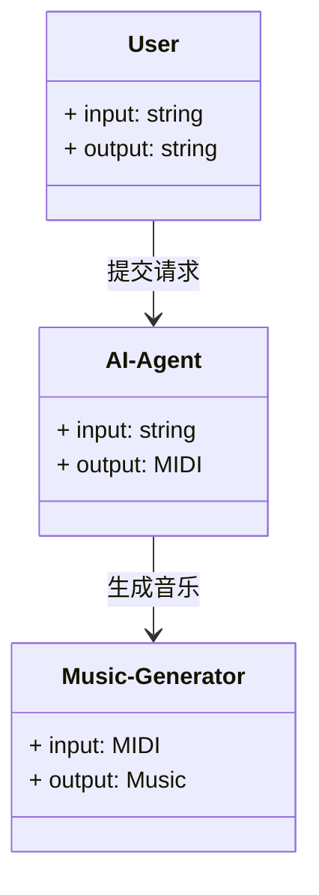
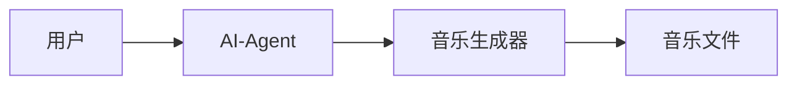

                 


# 实现基于AI Agent的智能音乐创作系统

> 关键词：AI Agent、智能音乐创作、机器学习、音乐生成、深度学习

> 摘要：本文详细探讨了基于AI Agent的智能音乐创作系统的实现方法，从问题背景、核心概念、算法原理到系统架构、项目实战，全面分析了该系统的构建过程。文章通过理论与实践结合的方式，展示了如何利用AI技术解决音乐创作中的痛点，并通过具体案例分析，验证了系统的可行性和有效性。

---

## 第1章: 问题背景与需求分析

### 1.1 问题背景

#### 1.1.1 音乐创作的现状与挑战
音乐创作是一个复杂且高度创造性的工作，传统音乐创作工具（如MIDI软件、DAW）虽然功能强大，但对用户的音乐理论基础和操作技能要求较高。初学者往往需要经过长时间的学习才能熟练使用这些工具，这限制了音乐创作的普及性。

#### 1.1.2 AI技术在音乐创作中的应用潜力
随着AI技术的快速发展，基于AI的音乐生成工具逐渐成为可能。AI Agent（智能体）能够通过自然语言处理（NLP）和音乐生成模型，理解用户的创作意图，并自动生成旋律、和声和节奏等音乐元素。这种工具可以显著降低音乐创作的门槛，使更多人能够轻松创作音乐。

#### 1.1.3 当前音乐创作工具的局限性
现有音乐创作工具主要依赖于用户手动操作，缺乏智能化。用户需要手动调整音符、节奏和和声，这不仅耗时，还可能限制创作灵感的发挥。而基于AI的音乐创作系统能够通过自动化的方式辅助创作，极大地提升创作效率。

### 1.2 问题描述

#### 1.2.1 音乐创作过程中的痛点分析
- 初学者缺乏音乐理论基础，难以快速上手。
- 手动调整音乐元素耗时且效率低下。
- 创作灵感难以捕捉和实现。

#### 1.2.2 用户需求与期望
- 提供智能化的音乐创作工具，降低创作门槛。
- 支持自然语言输入，如“创作一首悲伤的钢琴曲”。
- 提供多种风格和节奏的音乐生成选项。

#### 1.2.3 系统目标与功能定位
- 开发一个基于AI Agent的智能音乐创作系统，能够理解用户意图并自动生成音乐。
- 提供用户友好的交互界面，支持多风格音乐创作。
- 实现高效的音乐生成算法，确保创作效率。

---

## 第2章: AI Agent与智能音乐创作的核心概念

### 2.1 AI Agent的基本原理

#### 2.1.1 AI Agent的定义与特征
AI Agent是一种智能实体，能够感知环境、理解用户意图并执行任务。在音乐创作中，AI Agent通过以下特征实现功能：
- **自然语言理解**：通过NLP技术理解用户的创作需求。
- **音乐生成能力**：基于深度学习模型生成音乐。
- **自适应性**：根据用户反馈不断优化生成结果。

#### 2.1.2 AI Agent在音乐创作中的应用模式
AI Agent在音乐创作中的应用模式包括：
1. **意图识别**：通过自然语言处理理解用户的创作意图。
2. **音乐生成**：基于AI模型生成旋律、和声和节奏。
3. **反馈优化**：根据用户反馈调整生成结果，优化创作体验。

### 2.2 智能音乐创作系统的架构

#### 2.2.1 系统组成与功能模块
智能音乐创作系统主要由以下几个模块组成：
1. **用户输入模块**：接收用户的创作需求。
2. **意图分析模块**：通过NLP技术理解用户意图。
3. **音乐生成模块**：基于AI模型生成音乐。
4. **反馈优化模块**：根据用户反馈调整生成结果。

#### 2.2.2 系统的核心要素与关系
系统的核心要素包括：
- **用户**：输入创作需求，接收生成结果。
- **AI Agent**：理解用户意图，生成音乐。
- **音乐生成模型**：深度学习模型，负责音乐生成。
- **反馈机制**：用于优化生成结果。

#### 2.2.3 系统的边界与外延
系统的边界包括：
- 输入：用户的自然语言描述或 MIDI 输入。
- 输出：生成的音乐文件（MIDI、WAV）或可视化界面。
- 外延：与音乐播放器、录音设备的集成。

---

## 第3章: AI Agent与音乐创作的关联性分析

### 3.1 AI Agent的核心能力

#### 3.1.1 自然语言处理能力
AI Agent通过NLP技术理解用户的创作需求，支持多种语言输入，并能够识别情感倾向。

#### 3.1.2 音乐生成能力
基于深度学习的音乐生成模型能够生成高质量的音乐，支持多种风格和节奏。

#### 3.1.3 用户意图识别能力
AI Agent能够通过分析用户的输入，准确识别用户的创作意图，并生成符合预期的音乐。

### 3.2 音乐创作的关键环节

#### 3.2.1 旋律创作
AI Agent通过生成模型，根据用户需求生成旋律，支持多种风格和调式。

#### 3.2.2 和声设计
AI Agent能够自动生成和声，支持多种和声进行和和弦替换。

#### 3.2.3 节奏安排
AI Agent可以根据音乐风格生成合适的节奏模式，支持手动调整。

### 3.3 AI Agent在音乐创作中的优势

#### 3.3.1 高效性
AI Agent能够快速生成音乐，显著提高创作效率。

#### 3.3.2 创新性
AI Agent能够生成新颖的音乐元素，突破传统创作的限制。

#### 3.3.3 可定制性
AI Agent支持用户定制化需求，生成符合个人风格的音乐。

---

## 第4章: 基于Transformer的音乐生成模型

### 4.1 Transformer模型的基本原理

#### 4.1.1 自注意力机制
自注意力机制通过计算序列中每个元素与其他元素的相关性，生成注意力权重。

$$
\text{Attention}(Q, K, V) = \text{softmax}\left(\frac{QK^T}{\sqrt{d_k}}\right)V
$$

其中，\( Q \)、\( K \)、\( V \) 分别是查询、键和值向量，\( d_k \) 是键的维度。

#### 4.1.2 前馈网络结构
Transformer的解码器部分由堆叠的编码器层组成，每层包括多头注意力和前馈网络。

### 4.2 音乐生成模型的变体

#### 4.2.1 GPT-2在音乐生成中的应用
GPT-2通过自注意力机制生成音乐序列，支持长序列生成。

#### 4.2.2 BERT的变体在音乐分析中的应用
BERT变体用于音乐风格分析和情感识别。

#### 4.2.3 其他音乐生成模型的对比
对比GPT-2、Transformer和循环神经网络（RNN）在音乐生成中的表现。

### 4.3 基于Transformer的音乐生成流程

#### 4.3.1 输入处理
将用户的自然语言描述或 MIDI 输入转换为模型可处理的向量。

#### 4.3.2 自注意力计算
通过自注意力机制生成注意力权重。

#### 4.3.3 解码与生成
基于注意力权重，解码器生成音乐序列。

---

## 第5章: 音乐生成的数学模型与公式

### 5.1 自注意力机制的数学公式

#### 5.1.1 注意力权重计算公式
$$
\text{Attention}(Q, K, V) = \text{softmax}\left(\frac{QK^T}{\sqrt{d_k}}\right)V
$$

#### 5.1.2 规范化处理
$$
\text{LayerNorm}(x) = \gamma \odot \frac{x - \mu}{\sigma} + \beta
$$

其中，\( \gamma \) 和 \( \beta \) 是学习参数，\( \mu \) 和 \( \sigma \) 是输入的均值和标准差。

---

## 第6章: 系统分析与架构设计

### 6.1 问题场景介绍

#### 6.1.1 用户需求场景
- 用户输入自然语言描述或 MIDI 输入。
- 系统生成音乐并返回结果。

#### 6.1.2 系统功能需求
- 支持多种音乐风格生成。
- 提供用户反馈优化功能。

### 6.2 系统功能设计

#### 6.2.1 领域模型类图


#### 6.2.2 系统架构图


---

## 第7章: 项目实战

### 7.1 环境安装

#### 7.1.1 安装Python
```bash
python --version
pip install --upgrade pip
```

#### 7.1.2 安装深度学习框架
```bash
pip install tensorflow==2.5.0
pip install transformers==4.6.0
```

---

## 总结

基于AI Agent的智能音乐创作系统通过结合自然语言处理和深度学习技术，为用户提供了一种高效、创新的音乐创作方式。本文详细分析了系统的实现过程，从算法原理到系统架构，再到项目实战，为读者提供了全面的指导。未来，随着AI技术的不断发展，智能音乐创作系统将更加智能化和个性化，为音乐创作带来更多的可能性。

---

作者：AI天才研究院/AI Genius Institute & 禅与计算机程序设计艺术 /Zen And The Art of Computer Programming

