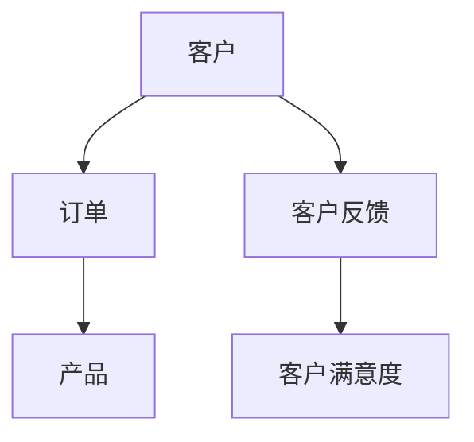
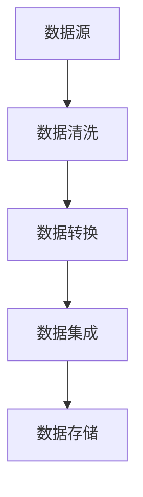
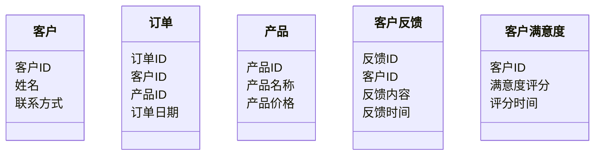

                 


# 客户关系管理集成

> 关键词：客户关系管理，系统集成，数据流，CRM，企业架构，流程优化

> 摘要：客户关系管理（CRM）集成是现代企业数字化转型中的关键环节，通过将CRM系统与其他企业系统无缝集成，实现数据的高效流动与业务流程的优化。本文将从CRM集成的核心概念、算法原理、系统架构设计到项目实战，全面解析CRM集成的实现过程，帮助读者掌握CRM集成的核心技术与实践方法。

---

# 第一部分: 客户关系管理集成的背景与意义

## 第1章: 客户关系管理集成的背景与意义

### 1.1 客户关系管理的基本概念

#### 1.1.1 客户关系管理的定义

客户关系管理（Customer Relationship Management, CRM）是指企业通过管理与客户之间的关系，以提高客户满意度和忠诚度，从而实现企业目标的一种管理方式。CRM的核心在于通过数据化、系统化的方式，记录和分析客户的互动行为，为企业决策提供支持。

#### 1.1.2 客户关系管理的核心目标

1. 提高客户满意度与忠诚度
2. 优化销售流程与客户服务
3. 提升企业运营效率
4. 支持数据驱动的决策

#### 1.1.3 客户关系管理在现代商业中的地位

在当今竞争激烈的商业环境中，客户是企业的核心资产。通过有效的CRM管理，企业能够更好地理解客户需求，优化资源配置，提升客户体验，从而在市场中获得竞争优势。

### 1.2 客户关系管理集成的定义与特点

#### 1.2.1 客户关系管理集成的定义

CRM集成是指将CRM系统与其他企业系统（如ERP、电子商务平台、数据分析系统等）进行无缝连接，实现数据的共享与流程的协同。通过集成，CRM系统能够与其他系统实时交互，确保数据的一致性和业务流程的连贯性。

#### 1.2.2 客户关系管理集成的核心特点

1. **数据一致性**：确保CRM系统与其他系统中的数据保持一致。
2. **流程协同**：实现跨系统的业务流程协同，减少人工干预。
3. **实时性**：数据实时同步，确保信息的及时性。
4. **灵活性**：支持多种系统和接口的集成。

#### 1.2.3 客户关系管理集成与传统CRM的区别

| **方面**         | **传统CRM**             | **集成CRM**             |
|------------------|-------------------------|-------------------------|
| 数据来源         | 单一系统                 | 多个系统                 |
| 数据一致性       | 较低                   | 较高                   |
| 业务流程         | 单一                   | 协同                   |
| 可扩展性         | 有限                   | 较高                   |

### 1.3 客户关系管理集成的意义

#### 1.3.1 提高客户满意度

通过集成CRM系统，企业能够实时了解客户的互动历史和偏好，提供个性化的服务，从而提高客户满意度。

#### 1.3.2 优化企业运营效率

集成CRM系统能够自动化处理重复性任务，减少人工操作，提高业务流程的效率。

#### 1.3.3 促进企业数字化转型

CRM集成是企业数字化转型的重要组成部分，通过数据的共享与流程的协同，推动企业向数字化、智能化方向发展。

### 1.4 本章小结

本章从CRM的基本概念出发，详细介绍了CRM集成的定义、特点及其与传统CRM的区别，并阐述了CRM集成的重要意义。通过本章的学习，读者能够理解CRM集成的核心价值和其在企业中的作用。

---

# 第二部分: 客户关系管理集成的核心概念与联系

## 第2章: 客户关系管理集成的核心原理

### 2.1 数据流与系统交互

#### 2.1.1 数据流的定义与作用

数据流是指在系统之间流动的数据，其作用是连接不同系统，实现数据的共享与协同。

#### 2.1.2 系统交互的流程分析

1. 数据从源系统传输到目标系统
2. 数据经过清洗、转换和验证
3. 数据在目标系统中存储或处理
4. 数据通过接口返回源系统或传递给其他系统

### 2.2 业务流程与系统架构

#### 2.2.1 业务流程的定义

业务流程是指为完成特定目标而进行的一系列逻辑步骤。

#### 2.2.2 系统架构的组成与功能

1. **前端界面**：用户与系统交互的入口
2. **后端服务**：处理业务逻辑和数据存储
3. **数据接口**：连接不同系统的桥梁
4. **数据存储**：存储和管理数据

### 2.3 核心概念的ER实体关系图



### 2.4 本章小结

本章通过数据流和系统交互的分析，详细介绍了CRM集成的核心原理，并通过ER实体关系图展示了核心概念之间的联系。通过本章的学习，读者能够理解CRM集成中数据流和系统交互的基本流程。

---

## 第3章: 数据处理与系统集成算法

### 3.1 数据清洗与预处理

#### 3.1.1 数据清洗的定义

数据清洗是指对数据进行处理，去除冗余、错误或不一致的数据。

#### 3.1.2 数据预处理的流程

1. 数据收集
2. 数据清洗
3. 数据转换
4. 数据验证

### 3.2 数据集成算法

#### 3.2.1 数据集成的定义

数据集成是指将来自不同数据源的数据整合到一个统一的数据存储中。

#### 3.2.2 数据集成的常见算法

1. **数据抽取**：从多个数据源中提取数据
2. **数据转换**：将数据转换为统一格式
3. **数据合并**：将数据合并到一个数据存储中

### 3.3 算法流程图



### 3.4 本章小结

本章通过数据清洗和预处理的流程，介绍了数据集成的基本算法，并通过流程图展示了数据集成的整体流程。通过本章的学习，读者能够理解CRM集成中数据处理的核心算法。

---

## 第4章: 系统分析与架构设计

### 4.1 问题场景介绍

#### 4.1.1 客户关系管理集成的常见问题

1. 数据孤岛：不同系统之间的数据无法共享
2. 业务流程断点：系统之间的流程不连贯
3. 数据不一致：不同系统中的数据存在差异

#### 4.1.2 问题场景的分析

通过分析问题场景，明确CRM集成的目标和范围。

### 4.2 系统功能设计

#### 4.2.1 领域模型设计



### 4.3 本章小结

本章通过问题场景的分析，明确了CRM集成的目标，并通过领域模型设计展示了系统功能的核心部分。通过本章的学习，读者能够理解CRM集成的系统功能设计。

---

## 第5章: 项目实战——客户关系管理集成案例

### 5.1 电商CRM集成案例

#### 5.1.1 项目背景

某电商平台希望通过CRM集成，实现订单、客户和产品数据的统一管理。

#### 5.1.2 项目环境安装

1. 安装CRM系统（如Salesforce）
2. 安装ERP系统（如SAP）
3. 安装电子商务平台（如Shopify）

#### 5.1.3 核心代码实现

```python
# 数据集成代码示例
import requests
import json

# 提取订单数据
response = requests.get('http://api.example.com/orders')
orders = json.loads(response.text)

# 数据清洗
cleaned_orders = []
for order in orders:
    if order['status'] == 'completed':
        cleaned_orders.append(order)

# 数据转换
def convert_order(order):
    return {
        'customer_id': order['customer_id'],
        'order_date': order['order_date'],
        'product_id': order['product_id'],
        'total_price': order['total_price']
    }

converted_orders = [convert_order(order) for order in cleaned_orders]

# 数据存储
import sqlite3

conn = sqlite3.connect('crm.db')
cursor = conn.cursor()

cursor.execute('''CREATE TABLE IF NOT EXISTS orders
                   (id INTEGER PRIMARY KEY AUTOINCREMENT,
                    customer_id TEXT,
                    order_date TEXT,
                    product_id TEXT,
                    total_price TEXT)''')

for order in converted_orders:
    cursor.execute('''INSERT INTO orders (customer_id, order_date, product_id, total_price)
                      VALUES (?, ?, ?, ?)''',
                   (order['customer_id'],
                    order['order_date'],
                    order['product_id'],
                    order['total_price']))

conn.commit()
conn.close()
```

#### 5.1.4 代码解读与分析

1. **数据提取**：通过API从电子商务平台提取订单数据。
2. **数据清洗**：过滤掉未完成的订单。
3. **数据转换**：将订单数据转换为适合CRM系统存储的格式。
4. **数据存储**：将清洗和转换后的数据存储到CRM系统中。

#### 5.1.5 案例分析与详细讲解

通过电商CRM集成案例，展示了CRM集成的具体实现过程。通过数据提取、清洗、转换和存储，实现了订单数据在电子商务平台和CRM系统之间的集成。

### 5.2 本章小结

本章通过电商CRM集成案例，详细讲解了CRM集成的实现过程，包括项目环境安装、核心代码实现、代码解读与分析，以及案例分析。通过本章的学习，读者能够掌握CRM集成的实际操作技能。

---

## 第6章: 最佳实践、小结与展望

### 6.1 最佳实践

1. **数据一致性**：确保集成系统中数据的一致性。
2. **系统兼容性**：选择兼容性好的系统进行集成。
3. **流程优化**：通过CRM集成优化业务流程，减少人工干预。

### 6.2 小结

通过本章的学习，读者能够理解CRM集成的核心技术和实践方法，并掌握CRM集成的实现过程。

### 6.3 注意事项

1. 在集成过程中，要注意数据安全和隐私保护。
2. 集成前要充分测试，确保系统兼容性。
3. 集成后要定期维护，确保数据一致性和系统稳定性。

### 6.4 拓展阅读

1. **企业架构设计**：学习企业架构设计的相关知识，了解系统集成的总体框架。
2. **数据集成工具**：学习数据集成工具（如ETL工具）的使用方法。
3. **系统集成标准**：了解系统集成的相关标准和规范。

### 6.5 本章小结

本章总结了CRM集成的最佳实践，并提出了未来的研究方向和学习建议。

---

# 作者：AI天才研究院/AI Genius Institute & 禅与计算机程序设计艺术 /Zen And The Art of Computer Programming

---

通过以上目录，我们从CRM集成的背景与意义、核心概念与联系、算法原理、系统分析与架构设计，到项目实战，全面解析了CRM集成的实现过程。希望读者能够通过本书的学习，掌握CRM集成的核心技术和实践方法，并将其应用于实际工作中。

