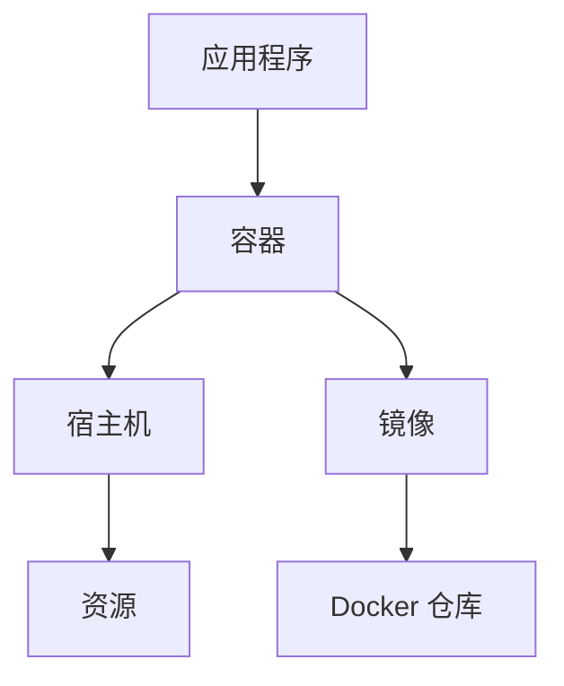
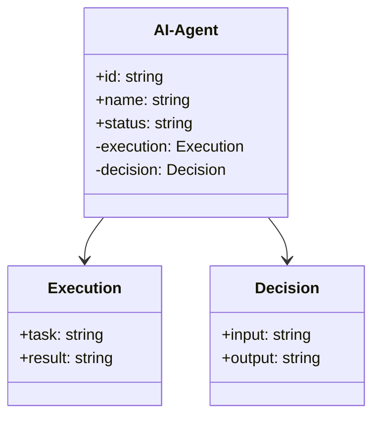
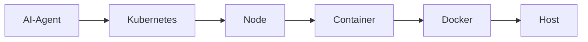

                 


# 容器化部署：简化AI Agent的运维管理

## 关键词：容器化部署、AI Agent、运维管理、Docker、Kubernetes

## 摘要：  
容器化部署通过将AI Agent封装为轻量级容器，实现快速部署、弹性扩展和环境一致性，从而简化运维管理。本文深入探讨容器化部署的核心概念、算法原理、系统架构设计，并结合实际案例，展示如何通过容器化技术提升AI Agent的运维效率。  

---

## 第一部分：容器化部署基础

### 第1章：容器化技术概述

#### 1.1 容器化技术的基本概念  
- **1.1.1 容器化技术的定义**  
  容器化是一种轻量级虚拟化技术，通过将应用程序及其依赖打包为独立的容器，实现跨环境的无缝运行。  
- **1.1.2 容器化与虚拟化的区别**  
  | 特性         | 容器化             | 虚拟化           |  
  |--------------|------------------|------------------|  
  | 资源利用率     | 高               | 较低             |  
  | 启动速度       | 快（秒级）       | 较慢（分钟级）   |  
  | 隔离性         | 有限（共享宿主机内核） | 高（独立操作系统） |  

- **1.1.3 容器化技术的核心优势**  
  - 环境一致性：确保应用程序在不同环境中运行一致。  
  - 资源利用率高：容器共享宿主机内核，资源占用低。  
  - 快速部署：容器启动时间短，适合自动化部署。  

#### 1.2 Docker容器技术原理  
- **1.2.1 Docker的运行机制**  
  Docker通过镜像、容器、仓库三个核心概念实现应用程序的打包、分发与运行。  
  - 镜像：应用程序运行环境的快照，包含文件、依赖和配置。  
  - 容器：镜像运行时的实例，提供隔离的运行环境。  
  - 仓库：镜像的存储与分发平台，如Docker Hub。  

- **1.2.2 Docker的镜像管理**  
  ```bash
  # 下载基础镜像
  docker pull ubuntu:22.04

  # 创建并运行容器
  docker run -it ubuntu:22.04 /bin/bash
  ```

- **1.2.3 Docker的网络与存储机制**  
  - 网络：容器可以通过桥接网络、host网络或自定义网络连接外部服务。  
  - 存储：容器使用挂载卷或临时存储，支持持久化数据存储。  

#### 1.3 容器编排工具简介  
- **1.3.1 Kubernetes的简介**  
  Kubernetes是一个开源的容器编排平台，提供容器部署、扩展和自愈能力。  
- **1.3.2 Docker Swarm的简介**  
  Docker Swarm是Docker官方提供的容器编排工具，支持集群管理与负载均衡。  
- **1.3.3 其他容器编排工具对比**  
  | 工具   | Kubernetes      | Docker Swarm    |  
  |--------|----------------|----------------|  
  | 集群管理 | 支持            | 支持            |  
  | 负载均衡 | 支持            | 支持            |  
  | 扩展性   | 强大            | 较弱            |  

---

## 第二部分：AI Agent的设计与部署需求

### 第2章：AI Agent的基本概念与设计

#### 2.1 AI Agent的定义与特点  
- **2.1.1 AI Agent的定义**  
  AI Agent是一种智能代理，能够感知环境、执行任务并优化决策。  
- **2.1.2 AI Agent的核心功能**  
  - 环境感知：通过传感器或API获取外部信息。  
  - 任务执行：根据需求执行具体操作。  
  - 智能决策：基于数据进行分析和决策。  

#### 2.2 AI Agent的架构设计  
- **2.2.1 AI Agent的模块划分**  
  - 感知层：负责数据采集与环境交互。  
  - 决策层：负责数据分析与决策制定。  
  - 执行层：负责任务执行与反馈处理。  

#### 2.3 容器化部署对AI Agent的意义  
- **2.3.1 提高AI Agent的可移植性**  
  容器化技术确保AI Agent在不同环境中运行一致。  
- **2.3.2 降低AI Agent的运维成本**  
  容器化部署简化了环境配置和资源管理。  
- **2.3.3 提升AI Agent的扩展性**  
  容器化技术支持快速扩展和弹性伸缩。  

---

## 第三部分：容器化部署的核心概念

### 第3章：容器化部署的核心概念与联系

#### 3.1 容器化部署的背景与问题背景  
- **3.1.1 传统部署方式的痛点**  
  - 环境依赖：不同环境可能导致程序行为不一致。  
  - 资源管理：传统虚拟机资源利用率低，成本高。  
  - 部署复杂：手动部署容易出错，效率低。  

#### 3.2 容器化部署的核心概念与联系  
- **3.2.1 容器化部署的核心原理**  
  容器化通过隔离环境和资源分配，确保应用程序在不同环境中运行一致。  
- **3.2.2 容器化部署的属性特征对比表**  
  | 属性       | 传统虚拟机       | 容器化部署       |  
  |------------|------------------|------------------|  
  | 启动时间     | 分钟级           | 秒级             |  
  | 资源占用     | 高               | 低               |  
  | 部署复杂度   | 高               | 低               |  

#### 3.3 容器化部署的ER实体关系图（使用 Mermaid 流程图）  


---

## 第四部分：容器化部署的算法原理

### 第4章：容器化部署的算法原理

#### 4.1 容器编排算法概述  
- **4.1.1 容器编排的核心算法**  
  容器编排算法负责任务调度、资源分配和负载均衡。  
- **4.1.2 反亲和性调度算法**  
  反亲和性调度算法通过避免将相关容器部署在同一节点，提升系统的容错能力。  
- **4.1.3 资源利用率优化算法**  
  优化算法通过动态调整资源分配，提高整体资源利用率。  

#### 4.2 容器编排算法的数学模型  
- **4.2.1 资源分配模型**  
  设系统有 $n$ 个节点，每个节点有 $c_i$ 个 CPU 核心和 $m_i$ 个内存 GB。  
  容器需要 $a_j$ 个 CPU 核心和 $b_j$ 个内存 GB，分配目标是最小化资源使用。  
  数学表达式为：  
  $$ \min \sum_{i=1}^{n} (c_i - a_j) + (m_i - b_j) $$  

- **4.2.2 调度算法的数学公式**  
  反亲和性调度算法公式：  
  $$ \text{score}(j) = \sum_{k \in \text{neighbors}(j)} \text{affinity}(j, k) $$  
  其中，$\text{affinity}(j, k)$ 表示容器 $j$ 和 $k$ 的亲和性分数。  

---

## 第五部分：容器化部署的系统架构设计

### 第5章：容器化部署的系统架构设计

#### 5.1 问题场景介绍  
- **5.1.1 AI Agent的部署需求**  
  AI Agent需要在云环境中快速部署，支持弹性扩展和高可用性。  
- **5.1.2 容器化部署的场景分析**  
  AI Agent运行在Kubernetes集群中，利用容器编排实现自动化运维。  

#### 5.2 系统架构设计  
- **5.2.1 领域模型类图（Mermaid 类图）**  


- **5.2.2 系统架构拓扑图（Mermaid 架构图）**  


---

## 第六部分：容器化部署的项目实战

### 第6章：容器化部署的项目实战

#### 6.1 环境安装  
- 安装Docker和Kubernetes环境：  
  ```bash
  # 安装Docker
  curl -fsSL https://get.docker.com | bash -s docker

  # 安装Kubernetes
  curl -LOk https://storage.googleapis.com/minikube/v1.27.0/minikube-linux-amd64
  chmod +x minikube-linux-amd64
  sudo mv minikube-linux-amd64 /usr/local/bin/minikube
  ```

#### 6.2 系统核心实现源代码  
- AI Agent的Dockerfile示例：  
  ```dockerfile
  FROM ubuntu:22.04
  LABEL maintainer="AI Genius Institute"

  WORKDIR /app
  COPY . .

  EXPOSE 8080
  CMD ["python", "app.py"]
  ```

- Kubernetes部署清单（ YAML 文件）：  
  ```yaml
  apiVersion: apps/v1
  kind: Deployment
  metadata:
    name: ai-agent
  spec:
    replicas: 3
    selector:
      matchLabels:
        app: ai-agent
    template:
      metadata:
        labels:
          app: ai-agent
      spec:
        containers:
        - name: ai-agent
          image: ai-agent:latest
          ports:
          - containerPort: 8080
  ```

#### 6.3 实际案例分析  
- 部署AI Agent到Kubernetes集群：  
  ```bash
  kubectl apply -f deployment.yaml
  ```

- 验证部署状态：  
  ```bash
  kubectl get pods -l app=ai-agent
  ```

---

## 第七部分：最佳实践与总结

### 第7章：最佳实践与总结

#### 7.1 小结  
容器化部署通过简化环境配置和资源管理，显著提升了AI Agent的运维效率。  

#### 7.2 注意事项  
- 确保容器镜像的安全性，避免引入恶意代码。  
- 合理配置资源限制，防止容器争抢资源导致性能下降。  

#### 7.3 拓展阅读  
- 《容器化与云计算》  
- 《Kubernetes深入理解与实践》  

---

## 作者：AI天才研究院/AI Genius Institute & 禅与计算机程序设计艺术 /Zen And The Art of Computer Programming

