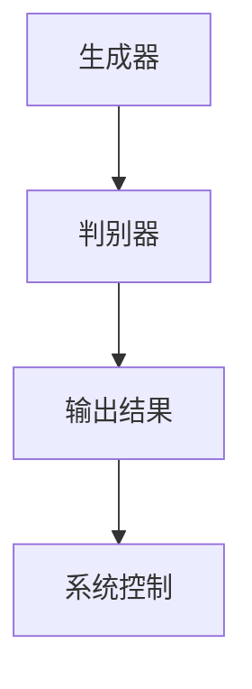

                 


# 对抗生成网络在AI Agent开发中的应用

## 关键词：对抗生成网络, AI Agent, GAN, 深度学习, 生成模型

## 摘要：本文探讨了对抗生成网络（GANs）在AI Agent开发中的应用，详细分析了GAN的基本原理及其在对话系统、任务规划和决策制定中的具体应用。通过系统架构设计和项目实战，展示了如何利用GAN技术提升AI Agent的生成能力和智能水平。最后，总结了GAN在AI Agent开发中的价值，并展望了未来的发展方向。

---

## 第1章：对抗生成网络概述

### 1.1 背景介绍

对抗生成网络（GANs）是一种深度学习模型，由Ian Goodfellow等人于2014年提出。GANs由生成器和判别器组成，通过对抗训练的方式生成高质量的数据样本。生成器的目标是生成与真实数据相似的样本，而判别器的目标是区分生成样本和真实样本。两者的博弈过程使得生成器不断优化生成能力，最终达到生成样本与真实样本难以区分的效果。

### 1.2 基本原理

#### 1.2.1 GAN的数学模型

GAN的损失函数由两部分组成：生成器的损失函数和判别器的损失函数。生成器的目标是最小化判别器的损失，而判别器的目标是最大化其自身的损失。

$$ \text{生成器损失} = -\log(1 - D(G(x))) $$
$$ \text{判别器损失} = -(\log(D(x)) + \log(1 - D(G(x)))) $$

其中，$D(x)$表示判别器对输入样本$x$的判断概率，$G(x)$表示生成器生成的样本。

#### 1.2.2 GAN的训练过程

GAN的训练过程是一个交替优化的过程。首先优化判别器，使其能够准确地区分真实样本和生成样本；然后优化生成器，使其生成的样本能够欺骗判别器。这个过程不断交替进行，直到生成器生成的样本质量达到 satisfactory level。

### 1.3 变体与应用

#### 1.3.1 GAN的变体

1. **DCGAN（深度卷积GAN）**：使用卷积层和反卷积层，提高生成图像的质量。
2. **WGAN（Wasserstein GAN）**：使用Wasserstein距离作为损失函数，训练更稳定。
3. **CycleGAN**：用于图像到图像的翻译，无需成对数据。

#### 1.3.2 GAN的应用

1. **图像生成**：如生成高质量的图像、修复图像。
2. **文本生成**：如生成连贯的文本、诗歌。
3. **语音合成**：如生成合成语音。

---

## 第2章：AI Agent开发基础

### 2.1 概念与分类

AI Agent是一种智能体，能够感知环境并采取行动以实现目标。根据智能水平，AI Agent可以分为反应式和认知式两类。反应式Agent仅根据当前感知做出反应，而认知式Agent具备推理和规划能力。

### 2.2 开发流程

AI Agent的开发流程包括需求分析、数据收集、模型训练和部署。数据预处理是关键步骤，确保数据质量对模型性能至关重要。

---

## 第3章：GAN在AI Agent中的应用场景

### 3.1 对话系统

GAN在对话系统中的应用主要体现在生成多样且自然的回复。通过对抗训练，生成器能够生成与上下文相关的回答，提升对话的流畅性。

### 3.2 任务规划

GAN用于任务规划，帮助AI Agent生成多种可能的执行计划，提高决策的多样性。

### 3.3 决策制定

在多决策点问题中，GAN可以生成多个备选方案，帮助AI Agent做出最优决策。

---

## 第4章：系统架构与设计

### 4.1 模块划分

系统由生成器模块、判别器模块和系统控制模块组成。生成器负责生成样本，判别器负责分类，系统控制模块协调各部分的交互。

### 4.2 组件交互

Mermaid流程图展示了各模块的交互过程，包括数据输入、生成样本和分类判断。



### 4.3 系统优化

通过优化模块间通信和提升系统性能，确保生成样本的质量和效率。

---

## 第5章：项目实战与实现

### 5.1 项目背景与目标

项目旨在开发一个基于GAN的对话系统，生成自然的对话回复。

### 5.2 功能设计

系统功能包括用户输入处理、生成回复和反馈收集。领域模型展示了功能模块之间的关系。

### 5.3 核心实现

生成器和判别器的实现代码如下：

```python
import torch
import torch.nn as nn

class Generator(nn.Module):
    def __init__(self, latent_dim, vocab_size):
        super(Generator, self).__init__()
        self.embedding = nn.Embedding(vocab_size, latent_dim)
        self.lstm = nn.LSTM(latent_dim, latent_dim, batch_first=True)
        self.fc = nn.Linear(latent_dim, vocab_size)

    def forward(self, x):
        embed = self.embedding(x)
        out, _ = self.lstm(embed)
        out = self.fc(out[:, -1])
        return out

class Discriminator(nn.Module):
    def __init__(self, vocab_size, hidden_dim):
        super(Discriminator, self).__init__()
        self.embedding = nn.Embedding(vocab_size, hidden_dim)
        self.lstm = nn.LSTM(hidden_dim, hidden_dim, batch_first=True)
        self.fc = nn.Linear(hidden_dim, 1)

    def forward(self, x):
        embed = self.embedding(x)
        out, _ = self.lstm(embed)
        out = self.fc(out[:, -1])
        return torch.sigmoid(out)
```

### 5.4 案例分析

通过实际案例展示GAN在对话系统中的应用效果，分析生成样本的质量和系统性能。

### 5.5 项目小结

总结项目成果，指出优点和改进方向。

---

## 第6章：总结与展望

### 6.1 总结

GAN在AI Agent中的应用提升了生成能力和智能水平，展示了其在对话、任务规划和决策制定中的价值。

### 6.2 展望

未来，GAN在多模态生成和强化学习中的结合将推动AI Agent的发展，实现更复杂和高效的智能系统。

---

## 作者：AI天才研究院  
禅与计算机程序设计艺术 / Zen And The Art of Computer Programming

