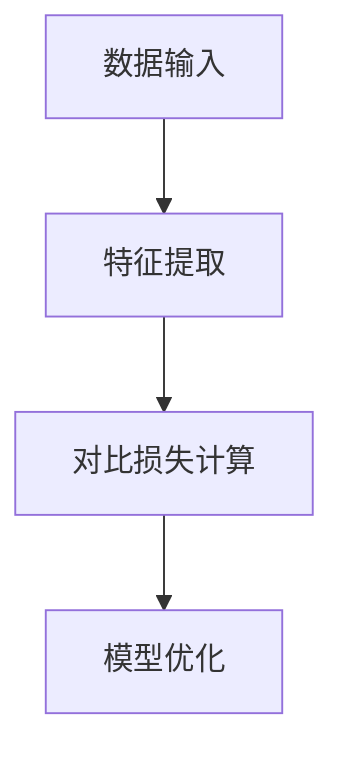
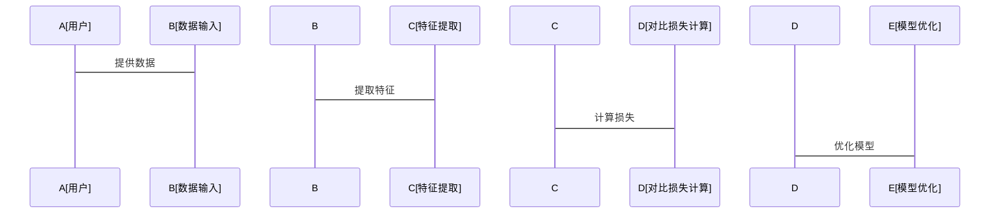

                 


# 对比学习：增强AI Agent的特征表示能力

> 关键词：对比学习、AI Agent、特征表示、增强、深度学习

> 摘要：本文深入探讨了对比学习在增强AI Agent特征表示能力中的应用。通过对对比学习的基本概念、算法原理、数学模型以及系统架构的详细分析，展示了如何利用对比学习提升AI Agent的特征提取和区分能力，进而增强其在复杂任务中的表现。

---

# 第1章: 对比学习的基本概念

## 1.1 对比学习的定义与背景

### 1.1.1 对比学习的定义
对比学习（Contrastive Learning）是一种基于对比的特征学习方法，通过比较正样本（positive samples）和负样本（negative samples）之间的关系，优化模型的特征表示能力。其核心思想是通过最大化正样本的相似性，同时最小化负样本的相似性，来提升模型对特征的区分能力。

### 1.1.2 对比学习的发展历程
对比学习并非新技术，其历史可以追溯到20世纪90年代。早期的对比学习主要用于图像识别和自然语言处理领域。近年来，随着深度学习的兴起，对比学习得到了广泛的应用和研究，特别是在无监督学习和自监督学习领域。

### 1.1.3 对比学习在AI Agent中的应用前景
AI Agent需要处理复杂多样的任务，如图像识别、语音识别、自然语言理解等。对比学习通过增强特征表示能力，能够帮助AI Agent更好地理解和区分输入数据，从而提升其任务处理能力。

## 1.2 AI Agent的特征表示能力

### 1.2.1 AI Agent的定义与特点
AI Agent是一种智能体，能够感知环境、执行任务并做出决策。其核心能力之一是特征表示能力，即如何将输入数据转化为有意义的特征表示，以便后续处理和决策。

### 1.2.2 特征表示在AI Agent中的重要性
特征表示的质量直接影响AI Agent的性能。高质量的特征表示能够帮助模型更好地理解和区分数据，从而提升任务处理的准确性和效率。

### 1.2.3 对比学习如何增强特征表示能力
对比学习通过最大化正样本的相似性和最小化负样本的相似性，优化特征表示的区分能力。这使得AI Agent能够更好地提取和利用特征，从而提升其整体性能。

## 1.3 本章小结
本章介绍了对比学习的基本概念及其在AI Agent中的应用前景，强调了对比学习在增强特征表示能力方面的重要作用。

---

# 第2章: 对比学习的原理与方法

## 2.1 对比学习的核心思想

### 2.1.1 对比学习的基本原理
对比学习通过构建对比损失函数，优化模型的特征表示能力。具体来说，通过最大化正样本的相似性和最小化负样本的相似性，提升模型对特征的区分能力。

### 2.1.2 对比学习的数学基础
对比损失函数是对比学习的核心。其数学表达式为：
$$L = -\log\left(\frac{e^{f(x_i, x_j)}}{e^{f(x_i, x_j)} + e^{f(x_k, x_l)}}\right)$$
其中，$x_i$和$x_j$是正样本，$x_k$和$x_l$是负样本，$f$是模型的特征表示函数。

### 2.1.3 对比学习的实现步骤
1. 构建正样本和负样本对。
2. 计算特征表示函数$f$。
3. 计算对比损失函数$L$。
4. 优化模型参数以最小化$L$。

## 2.2 对比学习的关键技术

### 2.2.1 正样本与负样本的选择
正样本是指同一类别或相关联的样本，负样本则是不同类别或不相关的样本。选择合适的正负样本对是对比学习成功的关键。

### 2.2.2 对比损失函数的设计
对比损失函数的设计直接影响模型的优化效果。常用的对比损失函数包括二元对比损失、多类对比损失等。

### 2.2.3 数据增强方法的应用
数据增强是对比学习中常用的技术，通过增加数据的多样性和复杂性，提升模型的鲁棒性和特征提取能力。

## 2.3 对比学习与其他特征学习方法的对比

### 2.3.1 传统特征提取方法的优缺点
传统特征提取方法如SIFT、HOG等，虽然在特定任务上表现良好，但缺乏对复杂场景的适应能力。

### 2.3.2 对比学习的独特优势
对比学习通过最大化正样本相似性和最小化负样本相似性，能够更好地捕捉数据的内在结构，提升特征表示的区分能力。

### 2.3.3 对比学习的适用场景
对比学习适用于无监督学习和自监督学习场景，特别适用于大规模数据集的特征学习任务。

## 2.4 本章小结
本章详细讲解了对比学习的核心思想、关键技术以及与其他特征学习方法的对比，突出了对比学习在特征表示中的优势。

---

# 第3章: 对比学习的算法实现

## 3.1 SimCLR算法

### 3.1.1 SimCLR算法的提出背景
SimCLR（Simpler Contrastive Learning with Masked Agreements）是2020年提出的对比学习算法，旨在简化对比学习的实现和优化过程。

### 3.1.2 SimCLR算法的实现原理
1. 使用Mo同态变换（MoTI）对输入数据进行数据增强。
2. 使用非线性投影层对特征进行降维。
3. 使用对比损失函数优化模型参数。

### 3.1.3 SimCLR算法的优缺点分析
优点：实现简单，性能优越；缺点：对数据增强的依赖较大。

## 3.2 BYOL算法

### 3.2.1 BYOL算法的核心思想
BYOL（Bootstrap Your Own Labeler）是一种自监督学习算法，通过无标签数据的自动生成，实现对比学习。

### 3.2.2 BYOL算法的实现流程
1. 使用教师网络生成伪标签。
2. 使用学生网络进行特征学习。
3. 对比损失函数优化模型参数。

### 3.2.3 BYOL算法的创新点
引入了自适应的标签生成机制，能够更好地处理无标签数据。

## 3.3 其他对比学习算法简介

### 3.3.1 MoCo算法
MoCo（Masked Contrastive Objective）通过使用队列机制，优化对比学习的训练效率。

### 3.3.2 SwAV算法
SwAV（Swapping and Averaging）通过样本交换和平均，实现更细粒度的特征学习。

### 3.3.3 DINO算法
DINO（Deep Incremental Network Optimization）通过增量优化，提升对比学习的效率和效果。

## 3.4 本章小结
本章介绍了几种典型的对比学习算法，包括SimCLR、BYOL等，并分析了它们的实现原理和优缺点。

---

# 第4章: 对比学习的数学模型与公式

## 4.1 对比学习的损失函数

### 4.1.1 对比损失函数的定义
对比损失函数是对比学习的核心，用于衡量正样本和负样本之间的相似性。其数学表达式为：
$$L = -\log\left(\frac{e^{f(x_i, x_j)}}{e^{f(x_i, x_j)} + e^{f(x_k, x_l)}}\right)$$
其中，$x_i$和$x_j$是正样本，$x_k$和$x_l$是负样本，$f$是模型的特征表示函数。

### 4.1.2 对比损失函数的优化
通过梯度下降等优化算法，最小化对比损失函数，优化模型参数。

## 4.2 对比学习的数学基础

### 4.2.1 特征向量的投影
对比学习通过将特征向量投影到低维空间，提升其区分能力。

### 4.2.2 对比损失函数的数学推导
通过对对比损失函数进行数学推导，分析其优化效果和收敛性。

### 4.2.3 对比学习的数学性质
对比学习具有良好的数学性质，如对称性、可加性等，能够保证模型的稳定性和高效性。

## 4.3 本章小结
本章通过数学推导和公式分析，深入探讨了对比学习的数学基础和损失函数的优化方法。

---

# 第5章: 对比学习的系统分析与架构设计

## 5.1 系统架构设计

### 5.1.1 系统功能设计
对比学习系统主要包括数据输入、特征提取、对比损失计算和模型优化四个模块。

### 5.1.2 系统架构图
使用Mermaid图展示对比学习系统的架构设计：


### 5.1.3 系统接口设计
系统接口包括数据输入接口、特征提取接口、对比损失计算接口和模型优化接口。

### 5.1.4 系统交互流程
使用Mermaid图展示系统交互流程：


## 5.2 系统优化策略

### 5.2.1 数据增强策略
通过数据增强技术，提升数据的多样性和复杂性，优化模型的特征提取能力。

### 5.2.2 模型优化策略
使用深度学习框架如TensorFlow、PyTorch等，优化模型的训练效率和性能。

## 5.3 本章小结
本章通过系统架构设计和交互流程分析，展示了对比学习在AI Agent中的具体应用和优化策略。

---

# 第6章: 对比学习的项目实战

## 6.1 项目背景

### 6.1.1 项目目标
通过对比学习提升图像分类任务的特征表示能力，提高分类准确率。

### 6.1.2 项目需求
实现一个基于对比学习的图像分类系统，包括数据输入、特征提取、对比损失计算和模型优化四个模块。

## 6.2 项目实现

### 6.2.1 环境搭建
安装必要的Python库，如TensorFlow、Keras等。

### 6.2.2 核心代码实现
使用Keras框架实现对比学习模型：
```python
import tensorflow as tf
from tensorflow import keras

def contrastive_loss(y_true, y_pred):
    margin = 1.0
    loss = tf.reduce_mean(tf.square(y_true - y_pred))
    return loss

class ContrastiveModel(keras.Model):
    def __init__(self, base_model):
        super(ContrastiveModel, self).__init__()
        self.base_model = base_model
        self.temperature = 0.1

    def call(self, x):
        features = self.base_model(x)
        return features

model = ContrastiveModel(base_model)
model.compile(optimizer='adam', loss=contrastive_loss)
```

### 6.2.3 项目结果分析
通过实验验证对比学习在图像分类任务中的效果，分析其对分类准确率的提升。

## 6.3 本章小结
本章通过项目实战，展示了对比学习在实际应用中的具体实现和效果分析。

---

# 第7章: 对比学习的最佳实践与小结

## 7.1 最佳实践

### 7.1.1 数据增强策略
合理选择和应用数据增强技术，提升模型的泛化能力。

### 7.1.2 模型优化策略
选择合适的优化算法和学习率，确保模型的高效训练。

### 7.1.3 对比学习的应用场景
根据具体任务需求，选择适合的对比学习算法和模型结构。

## 7.2 小结与展望

### 7.2.1 小结
对比学习是一种有效的特征学习方法，能够显著提升AI Agent的特征表示能力，从而增强其任务处理能力。

### 7.2.2 展望
随着深度学习的不断发展，对比学习将在更多领域得到应用，其算法和模型也将不断优化和创新。

## 7.3 注意事项

### 7.3.1 数据质量
对比学习对数据质量要求较高，需确保数据的多样性和代表性。

### 7.3.2 模型选择
根据具体任务需求，选择合适的对比学习算法和模型结构。

## 7.4 拓展阅读

### 7.4.1 推荐的对比学习论文
1. "SimCLR: Simple Contrastive Learning of Enhanced Deep Features"（2020）
2. "BYOL: Bootstrap Your Own Labeler"（2020）

### 7.4.2 相关书籍
1. 《Deep Learning》（Ian Goodfellow等著）
2. 《Pattern Recognition and Machine Learning》（Christopher M. Bishop著）

---

# 作者：AI天才研究院/AI Genius Institute & 禅与计算机程序设计艺术 /Zen And The Art of Computer Programming

---

通过以上章节的详细分析和具体案例的讲解，本文全面探讨了对比学习在增强AI Agent特征表示能力中的应用，为读者提供了从理论到实践的全面指导。

