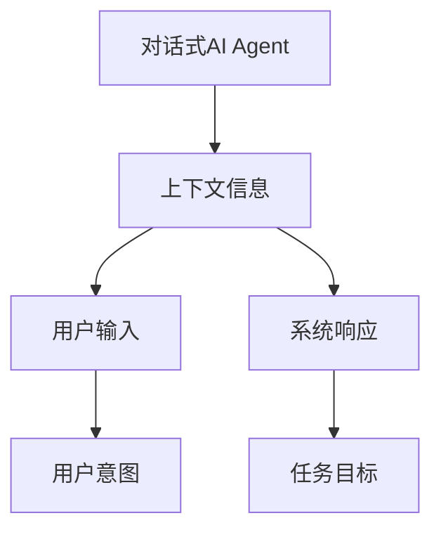
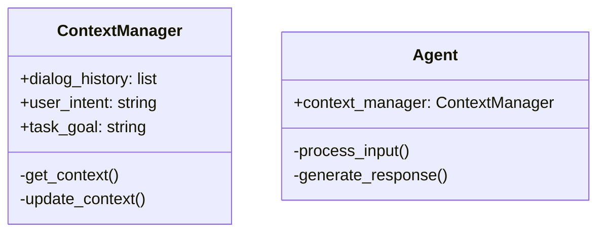
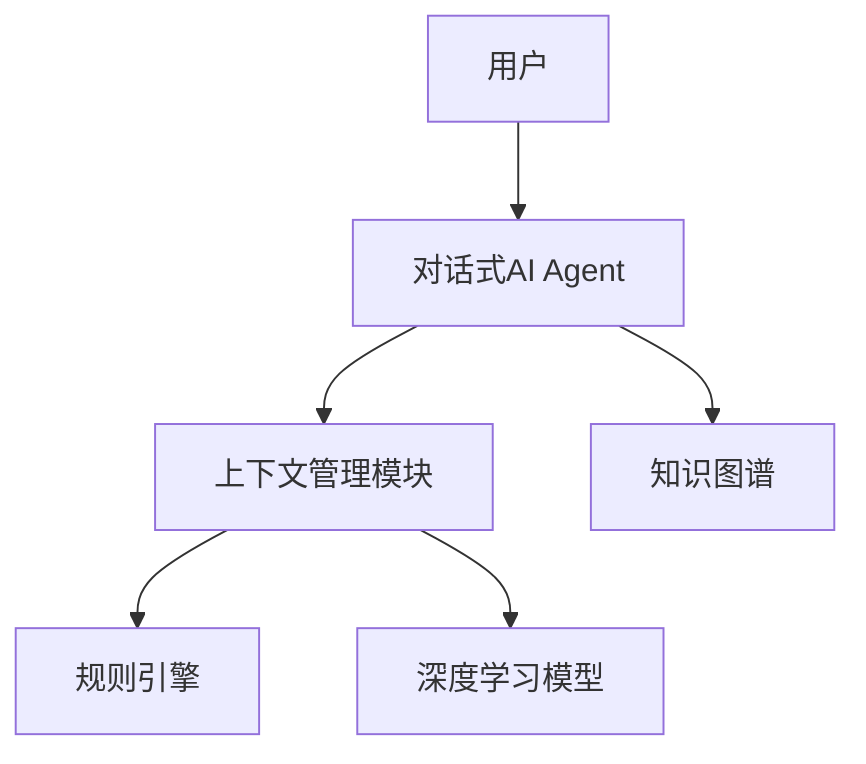
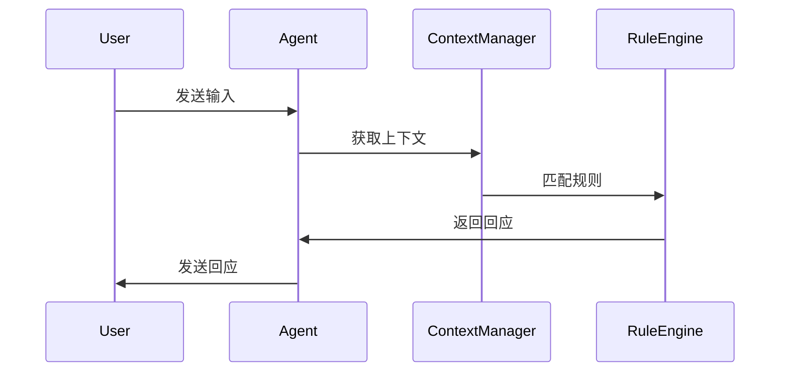

                 


# 对话式AI Agent的上下文管理技巧

---

## 关键词：
对话式AI Agent，上下文管理，自然语言处理，知识图谱，深度学习，系统架构

---

## 摘要：
对话式AI Agent的上下文管理是实现智能对话系统的核心技术之一。本文从对话式AI Agent的定义、上下文管理的原理、算法实现、系统架构设计以及项目实战等多个方面展开，深入分析了上下文管理在对话式AI中的重要性。文章详细讲解了基于规则和深度学习的上下文管理算法，并通过实际案例展示了如何将这些算法应用于对话式AI Agent的开发中。此外，本文还探讨了上下文管理在系统架构设计中的最佳实践，为开发者提供了实用的参考。

---

# 第1章: 对话式AI Agent与上下文管理概述

## 1.1 对话式AI Agent的定义与特点

### 1.1.1 对话式AI Agent的定义
对话式AI Agent（Dialog AI Agent）是一种能够通过自然语言与用户进行交互的智能系统，能够理解用户意图、生成符合上下文的响应，并根据对话历史调整行为。其核心目标是提供更自然、更智能的对话体验。

### 1.1.2 对话式AI Agent的核心特点
1. **智能性**：能够理解用户的意图并生成有意义的回应。
2. **上下文感知**：能够根据对话历史调整回答，保持对话的连贯性。
3. **自适应性**：能够根据对话结果动态调整策略，以更好地满足用户需求。
4. **多模态交互**：支持文本、语音、图像等多种交互方式。

### 1.1.3 对话式AI Agent的应用场景
- 智能客服：通过对话式AI Agent为用户提供个性化的客户服务。
- 智能助手：如Siri、Alexa等，能够帮助用户完成日常任务。
- 智能教育：通过对话式AI Agent为学生提供个性化的学习指导。
- 智能家居：通过对话式AI Agent控制智能家居设备，提供更便捷的生活体验。

## 1.2 上下文管理的定义与重要性

### 1.2.1 上下文管理的定义
上下文管理（Context Management）是指在对话过程中，系统对对话历史、用户意图、任务目标等信息进行存储、关联和推理的过程。通过上下文管理，对话式AI Agent能够更好地理解用户的当前需求，生成更准确的回应。

### 1.2.2 上下文管理在对话式AI中的重要性
1. **提高对话连贯性**：通过上下文管理，系统能够保持对话的连贯性，避免重复提问或不相关回答。
2. **增强用户体验**：上下文管理能够帮助系统更好地理解用户需求，提供更个性化的服务。
3. **提升系统智能性**：上下文管理是对话式AI Agent实现智能对话的核心技术之一。

### 1.2.3 上下文管理的边界与外延
- **边界**：上下文管理仅关注对话过程中的相关信息，不涉及外部知识库的调用。
- **外延**：上下文管理可以与知识图谱、自然语言处理等多种技术结合，扩展系统的功能。

## 1.3 对话式AI Agent上下文管理的核心要素

### 1.3.1 上下文信息的构成
1. **对话历史**：包括用户和系统的历史对话内容。
2. **用户意图**：用户在当前对话中的目标或需求。
3. **任务目标**：系统在当前对话中需要完成的任务目标。
4. **外部知识**：系统可能需要参考的知识库或外部数据。

### 1.3.2 上下文管理的流程
1. **信息存储**：将对话历史、用户意图等信息存储起来。
2. **信息关联**：将当前对话与历史对话进行关联，理解用户的上下文需求。
3. **信息推理**：根据上下文信息推理用户的潜在需求，生成合适的回应。

### 1.3.3 上下文管理与对话式AI Agent的关系
上下文管理是对话式AI Agent的核心模块之一，负责处理对话中的上下文信息，确保系统的智能性和连贯性。

## 1.4 本章小结
本章介绍了对话式AI Agent的定义、特点以及上下文管理的核心概念。通过分析上下文管理在对话式AI中的重要性，为后续章节的深入探讨奠定了基础。

---

# 第2章: 对话式AI Agent上下文管理的核心概念

## 2.1 上下文管理的原理

### 2.1.1 上下文信息的存储与检索
上下文信息通常以结构化的形式存储，包括对话历史、用户意图等。检索时，系统根据当前对话内容从存储中提取相关上下文信息。

### 2.1.2 上下文信息的更新与维护
随着对话的进行，上下文信息需要不断更新，以反映当前对话的状态和用户的需求变化。

### 2.1.3 上下文信息的关联与推理
通过关联对话历史和当前对话内容，系统可以推理出用户的潜在需求，生成更智能的回应。

## 2.2 上下文管理的核心算法与技术

### 2.2.1 基于规则的上下文管理
基于规则的上下文管理通过预定义的规则来处理上下文信息。例如，当用户提到“天气”，系统可以触发与天气相关的规则，生成相应的回应。

### 2.2.2 基于深度学习的上下文管理
基于深度学习的上下文管理利用神经网络模型（如Transformer）来处理对话历史，生成更自然的回应。

### 2.2.3 基于知识图谱的上下文管理
基于知识图谱的上下文管理将对话内容与知识图谱中的实体进行关联，帮助系统更好地理解用户需求。

## 2.3 上下文管理的实体关系图（ER图）



## 2.4 本章小结
本章详细介绍了上下文管理的核心算法和技术，并通过实体关系图展示了上下文管理的结构。这些内容为后续章节的算法实现奠定了基础。

---

# 第3章: 对话式AI Agent上下文管理的算法原理

## 3.1 基于规则的上下文管理算法

### 3.1.1 算法流程
1. **信息提取**：从用户输入中提取关键词或短语。
2. **规则匹配**：根据关键词匹配预定义的规则。
3. **生成回应**：根据匹配的规则生成回应。

### 3.1.2 算法实现
```python
def rule_based_context_management(user_input, context):
    keywords = extract_keywords(user_input)
    for rule in rules:
        if rule.trigger == keywords:
            return rule.response
    return default_response
```

### 3.1.3 优缺点分析
- **优点**：实现简单，适用于规则明确的场景。
- **缺点**：难以处理复杂或不确定的对话场景。

## 3.2 基于深度学习的上下文管理算法

### 3.2.1 算法流程
1. **对话历史编码**：将对话历史编码为向量。
2. **上下文推理**：根据编码向量生成回应。
3. **生成优化**：通过优化算法生成更自然的回应。

### 3.2.2 算法实现
```python
class DeepLearningContextManagement:
    def __init__(self, model):
        self.model = model

    def process(self, user_input, context):
        input_tensor = self.model.encode(user_input, context)
        output = self.model.generate(input_tensor)
        return output
```

### 3.2.3 数学模型
基于Transformer的上下文管理模型的编码过程可以表示为：
$$
\text{Encoded Context} = \text{Transformer}(X)
$$
其中，$X$ 是输入对话历史的张量。

---

# 第4章: 对话式AI Agent上下文管理的系统架构设计

## 4.1 系统功能设计

### 4.1.1 领域模型设计


### 4.1.2 系统架构设计


### 4.1.3 接口设计
- **输入接口**：接收用户的输入文本。
- **输出接口**：生成系统的回应。
- **上下文接口**：管理对话历史和用户意图。

### 4.1.4 交互设计


## 4.2 本章小结
本章从系统架构的角度分析了对话式AI Agent上下文管理的设计，包括领域模型、架构设计、接口设计和交互设计。

---

# 第5章: 对话式AI Agent上下文管理的项目实战

## 5.1 环境安装

### 5.1.1 安装Python环境
```bash
python -m pip install --upgrade pip
pip install numpy
pip install transformers
```

### 5.1.2 安装对话式AI框架
```bash
pip install transformers
pip install torch
pip install sentence-transformers
```

## 5.2 核心代码实现

### 5.2.1 上下文管理模块实现
```python
class ContextManager:
    def __init__(self):
        self.dialog_history = []
        self.user_intent = None
        self.task_goal = None

    def update_context(self, user_input, intent, goal):
        self.dialog_history.append(user_input)
        self.user_intent = intent
        self.task_goal = goal

    def get_context(self):
        return {
            "dialog_history": self.dialog_history,
            "user_intent": self.user_intent,
            "task_goal": self.task_goal
        }
```

### 5.2.2 对话式AI Agent实现
```python
class DialogAIAgent:
    def __init__(self, context_manager):
        self.context_manager = context_manager

    def process_input(self, user_input):
        context = self.context_manager.get_context()
        intent = extract_intent(user_input, context)
        goal = extract_goal(user_input, context)
        self.context_manager.update_context(user_input, intent, goal)
        response = generate_response(user_input, context)
        return response
```

## 5.3 案例分析与实现
### 5.3.1 案例分析
假设用户输入为“今天天气怎么样？”，系统需要根据上下文生成回应。

### 5.3.2 实现步骤
1. 提取用户意图：天气查询。
2. 更新上下文信息。
3. 生成回应：“今天天气晴朗，温度适宜。”

## 5.4 本章小结
本章通过实际项目案例，展示了对话式AI Agent上下文管理的实现过程，帮助读者更好地理解理论知识。

---

# 第6章: 对话式AI Agent上下文管理的最佳实践与小结

## 6.1 最佳实践
1. **保持上下文简洁**：只存储必要的上下文信息。
2. **结合多种技术**：将基于规则和深度学习的技术结合起来，提升系统智能性。
3. **定期优化**：根据用户反馈不断优化上下文管理算法。

## 6.2 注意事项
- **数据隐私**：确保上下文信息的安全性。
- **错误处理**：在上下文管理过程中，及时处理可能出现的错误。
- **性能优化**：优化上下文管理模块的性能，提升系统响应速度。

## 6.3 拓展阅读
- 《对话式AI Agent的自然语言处理技术》
- 《基于知识图谱的上下文管理研究》
- 《深度学习在对话式AI中的应用》

## 6.4 本章小结
本章总结了对话式AI Agent上下文管理的最佳实践，并为读者提供了进一步学习和研究的方向。

---

# 作者：AI天才研究院/AI Genius Institute & 禅与计算机程序设计艺术 /Zen And The Art of Computer Programming

---

通过以上大纲和内容，您可以开始撰写完整的博客文章。每个部分都需要按照上述结构进行详细展开，确保内容完整、逻辑清晰、技术深入。

