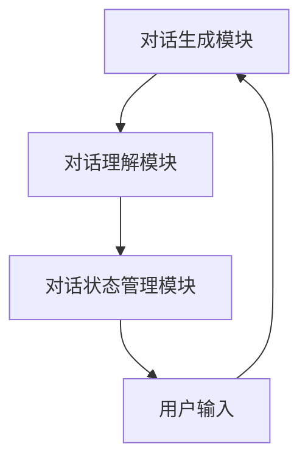

                 


# 对话式AI Agent：提升LLM的自然语言交互能力

## 关键词
对话式AI Agent, 自然语言处理, 大语言模型, 对话生成, 对话理解, 强化学习

## 摘要
对话式AI Agent作为人工智能领域的重要组成部分，旨在通过自然语言处理技术提升大语言模型（LLM）的交互能力。本文将从对话式AI Agent的基本概念入手，详细探讨其核心原理、算法实现、系统架构设计以及实际应用案例。通过对对话生成与理解的深入分析，结合数学模型和算法流程图，本文将为读者提供全面的理论支持和实践指导。

---

## 第1章: 对话式AI Agent的背景与概念

### 1.1 对话式AI Agent的基本概念
对话式AI Agent是一种能够与用户进行自然语言交互的智能系统，通过理解和生成人类语言，实现类似人类的对话能力。它结合了自然语言处理（NLP）、机器学习和人工智能技术，能够在多种场景下提供智能化的服务。

#### 1.1.1 对话式AI Agent的定义
对话式AI Agent（下文简称“对话式AI Agent”）是一种基于自然语言处理技术的智能系统，能够通过文本或语音与用户进行交互。它利用大语言模型（LLM）生成回复，并通过对话理解技术准确捕捉用户意图。

#### 1.1.2 对话式AI Agent的核心要素
- **对话生成**：基于用户的输入生成合适的回复。
- **对话理解**：解析用户的意图和情感。
- **对话状态管理**：跟踪对话的上下文信息。

#### 1.1.3 对话式AI Agent的分类
根据应用场景的不同，对话式AI Agent可以分为以下几类：
- **任务型对话式AI Agent**：用于特定任务，如预订机票、查询信息。
- **情感陪聊型对话式AI Agent**：用于情感支持和日常聊天。
- **混合型对话式AI Agent**：结合任务和情感陪聊功能。

### 1.2 对话式AI Agent的发展背景
对话式AI Agent的发展得益于自然语言处理技术的进步，尤其是大语言模型的崛起。LLM的强大生成能力为对话式AI Agent提供了坚实的基础，而对话式交互的需求则推动了其应用场景的不断扩展。

#### 1.2.1 自然语言处理技术的进步
- 分词、句法分析和语义理解等技术的提升，使得对话式AI Agent能够更准确地理解用户意图。
- 基于深度学习的模型（如BERT、GPT）为对话生成和理解提供了强大的支持。

#### 1.2.2 大语言模型的崛起
大语言模型（LLM）如GPT-3、GPT-4的出现，显著提升了对话生成的流畅性和准确性。这些模型通过海量数据的训练，能够生成与人类对话高度相似的文本。

#### 1.2.3 对话式AI Agent的应用场景
- **客服系统**：提供智能化的客户支持。
- **智能助手**：如Siri、Alexa等。
- **教育辅助**：为学生提供学习指导。
- **医疗咨询**：提供初步的医疗建议。

---

## 第2章: 对话式AI Agent的核心概念与联系

### 2.1 对话式AI Agent的原理
对话式AI Agent的工作原理涉及对话生成、对话理解和对话状态管理的协同作用。

#### 2.1.1 对话生成的流程
1. 用户输入：用户通过文本或语音输入问题或请求。
2. 意图理解：系统解析用户的意图和需求。
3. 回复生成：基于意图生成合适的回复。
4. 回复输出：将生成的回复返回给用户。

#### 2.1.2 对话理解的机制
对话理解是对话式AI Agent的核心技术之一，主要依赖于自然语言处理技术。

#### 2.1.3 对话状态管理的方法
对话状态管理通过维护对话历史、上下文信息，确保对话的连贯性和一致性。

### 2.2 对话式AI Agent与大语言模型的关系
对话式AI Agent依赖于大语言模型的生成能力，同时通过对话理解技术优化模型的输出。

#### 2.2.1 LLM在对话生成中的作用
LLM通过预训练掌握了大量语言数据，能够生成符合上下文的回复。

#### 2.2.2 对话式AI Agent对LLM的优化
通过对LLM的微调和约束，对话式AI Agent可以生成更符合用户需求的回复。

#### 2.2.3 对话式AI Agent与LLM的协同工作
对话式AI Agent利用LLM的生成能力，结合自身的理解能力，实现高效的对话交互。

---

## 第3章: 对话式AI Agent的算法原理

### 3.1 对话生成的算法
对话生成算法主要依赖于预训练语言模型和强化学习技术。

#### 3.1.1 基于生成对抗网络的对话生成
生成对抗网络（GAN）由生成器和判别器组成，通过对抗训练提升对话生成的质量。

#### 3.1.2 基于强化学习的对话生成
强化学习通过奖励机制优化对话生成策略。

#### 3.1.3 基于预训练模型的对话生成
预训练模型如GPT通过大规模数据训练，具备强大的生成能力。

### 3.2 对话理解的算法
对话理解算法主要依赖于自然语言处理技术和深度学习模型。

#### 3.2.1 基于词嵌入的对话理解
词嵌入技术如Word2Vec将词语转换为低维向量，便于模型处理。

#### 3.2.2 基于注意力机制的对话理解
注意力机制能够聚焦于对话中重要的词语和句子，提升理解的准确性。

#### 3.2.3 基于图神经网络的对话理解
图神经网络通过构建对话图，分析对话中的关系和依赖。

---

## 第4章: 对话式AI Agent的系统架构设计

### 4.1 系统功能设计
对话式AI Agent系统主要包括对话生成模块、对话理解模块和对话状态管理模块。

#### 4.1.1 对话生成模块
对话生成模块负责根据用户输入生成回复。

#### 4.1.2 对话理解模块
对话理解模块负责解析用户意图和情感。

#### 4.1.3 对话状态管理模块
对话状态管理模块负责维护对话历史和上下文信息。

### 4.2 系统架构图


### 4.3 接口设计
对话式AI Agent系统需要设计清晰的接口，确保各模块之间的协同工作。

#### 4.3.1 用户输入接口
用户通过文本或语音输入问题或请求。

#### 4.3.2 对话历史记录接口
对话历史记录接口用于维护对话的上下文信息。

#### 4.3.3 对话结果输出接口
对话结果输出接口将生成的回复返回给用户。

---

## 第5章: 对话式AI Agent的项目实战

### 5.1 环境安装与配置
对话式AI Agent的开发需要安装必要的开发环境和依赖库。

#### 5.1.1 安装Python
对话式AI Agent的开发主要基于Python语言，需安装Python 3.8或以上版本。

#### 5.1.2 安装依赖库
安装必要的Python库，如TensorFlow、PyTorch、Hugging Face的库等。

### 5.2 系统核心实现源代码
以下是一个简单的对话式AI Agent的实现示例：

```python
import transformers

# 加载预训练模型
model = transformers.GPT2LMHeadModel.from_pretrained('gpt2')
tokenizer = transformers.GPT2Tokenizer.from_pretrained('gpt2')

def generate_response(input_text):
    # 对话生成
    input_ids = tokenizer.encode(input_text, return_tensors='pt')
    output = model.generate(input_ids, max_length=50, num_beams=5)
    response = tokenizer.decode(output[0], skip_special_tokens=True)
    return response

# 使用示例
user_input = "今天天气怎么样？"
response = generate_response(user_input)
print(response)
```

### 5.3 代码应用解读与分析
上述代码展示了如何利用预训练模型生成对话回复。通过调用模型的生成接口，可以实现简单的对话交互。

### 5.4 实际案例分析
以下是一个实际应用案例：

#### 5.4.1 项目介绍
该项目旨在开发一个智能客服系统，通过对话式AI Agent为用户提供24小时的在线支持。

#### 5.4.2 系统功能
- 用户咨询：用户可以通过文本输入问题，系统生成回复。
- 情感分析：系统能够识别用户的情感，提供更贴心的服务。
- 历史记录：系统维护对话历史，方便后续的服务。

### 5.5 项目小结
通过实际项目的实施，对话式AI Agent的能力得到了充分的验证。系统的实现过程中，我们需要注意模型的优化和接口的设计，确保系统的高效性和稳定性。

---

## 第6章: 最佳实践与小结

### 6.1 最佳实践 tips
1. 在实际应用中，建议对模型进行微调，以适应特定场景的需求。
2. 对话式AI Agent的性能优化需要从算法、硬件和系统架构等多个方面入手。
3. 保持对技术的关注，及时更新模型和算法，以提升系统的性能。

### 6.2 小结
对话式AI Agent作为人工智能的重要组成部分，通过自然语言处理技术提升了大语言模型的交互能力。本文从理论到实践，详细探讨了对话式AI Agent的核心概念、算法实现和系统架构设计。通过实际项目的实施，我们验证了对话式AI Agent的潜力和价值。

### 6.3 注意事项
- 对话式AI Agent的开发需要结合具体的应用场景，灵活调整模型和算法。
- 系统的安全性和隐私保护是开发过程中需要重点关注的问题。

### 6.4 拓展阅读
1. 《深度学习入门：基于Python和TensorFlow》
2. 《自然语言处理入门：基于Python和机器学习》
3. 《大语言模型的原理与应用》

---

## 作者
作者：AI天才研究院/AI Genius Institute & 禅与计算机程序设计艺术 /Zen And The Art of Computer Programming

---

以上是《对话式AI Agent：提升LLM的自然语言交互能力》的技术博客文章的详细结构和内容。由于篇幅限制，本文仅展示了部分章节的内容，完整文章将包含更多细节和深入的分析。

