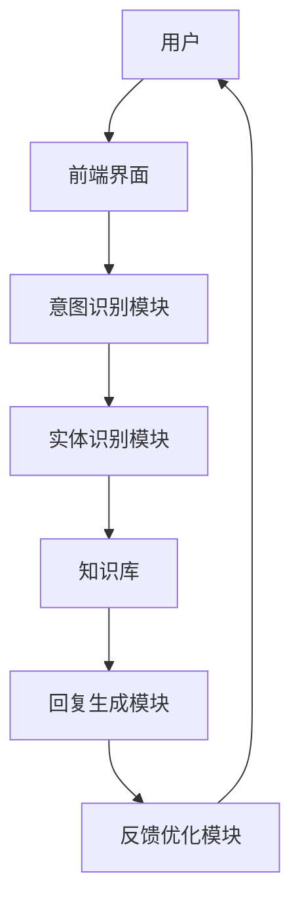
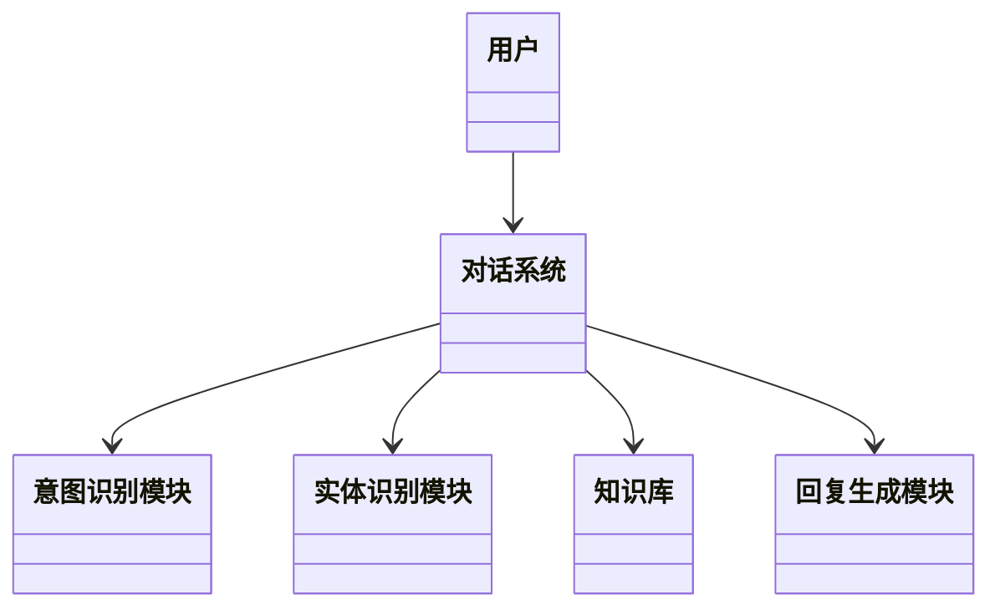
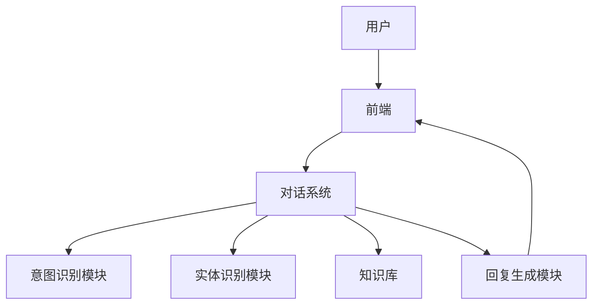
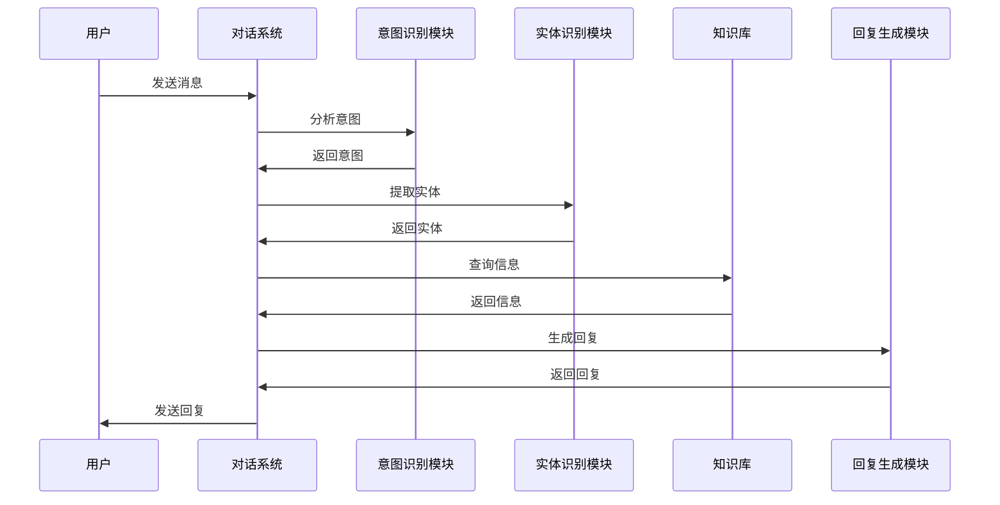

                 


# 对话式AI在客户服务中的应用与优化

## 关键词：对话式AI，客户服务，自然语言处理，意图识别，实体识别，系统架构，优化策略

## 摘要：  
对话式AI（Conversational AI）作为人工智能领域的前沿技术，正在深刻改变客户服务的方式。本文将从对话式AI的核心概念、技术原理、系统架构到实际应用进行全面探讨，分析其在客户服务中的优势与挑战，并提出优化策略。通过具体案例分析和系统设计，帮助读者理解如何有效利用对话式AI提升客户体验和企业效率。

---

## 第1章: 引言

### 1.1 对话式AI的背景与重要性
#### 1.1.1 对话式AI的定义与特点  
对话式AI是指能够理解和生成自然语言的智能系统，通过模拟人类对话方式与用户交互。其特点包括：  
- **智能化**：基于NLP和机器学习技术，能够理解和生成人类语言。  
- **实时性**：能够实时响应用户需求，提供即时服务。  
- **个性化**：通过分析用户行为和偏好，提供个性化服务。  

#### 1.1.2 对话式AI在客户服务中的应用背景  
随着企业对客户体验的重视，传统的电话或邮件客服模式逐渐被智能化的对话式AI取代。对话式AI能够24/7提供服务，且不受地域限制，极大地提升了客户满意度和企业效率。  

#### 1.1.3 对话式AI对企业的价值与挑战  
- **价值**：降低人力成本、提升客户满意度、提高服务效率。  
- **挑战**：技术复杂性、数据隐私问题、用户体验优化。  

### 1.2 本书的目标与结构  
本书旨在帮助读者全面理解对话式AI在客户服务中的应用，并掌握其优化策略。内容涵盖从基础概念到实际应用的全过程，适合技术开发者、企业管理人员以及对AI技术感兴趣的读者。  

---

## 第2章: 对话式AI的基础知识

### 2.1 对话式AI的定义与分类  
#### 2.1.1 对话式AI的定义  
对话式AI是指通过自然语言处理技术，模拟人类对话的智能系统。  

#### 2.1.2 对话式AI的分类  
- **规则驱动型**：基于预定义的规则和关键词进行匹配，适用于简单场景。  
- **数据驱动型**：基于机器学习和深度学习模型，通过大量数据训练生成回复，适用于复杂场景。  
- **混合型**：结合规则和数据驱动的优势，适用于综合场景。  

#### 2.1.3 对话式AI与传统客服的区别  
对话式AI能够实现24/7服务、个性化交互和数据驱动的智能决策，而传统客服受限于人力和时间，难以实现这些功能。  

### 2.2 对话式AI的技术原理  
#### 2.2.1 自然语言处理（NLP）基础  
NLP是对话式AI的核心技术，主要包括：  
- **分词**：将文本分割成词语或短语。  
- **词性标注**：识别词语的词性（名词、动词等）。  
- **句法分析**：分析句子的语法结构。  
- **语义理解**：理解文本的深层含义。  

#### 2.2.2 机器学习在对话式AI中的应用  
- **监督学习**：基于标注数据训练模型，用于意图识别和实体识别。  
- **无监督学习**：基于未标注数据发现模式，用于对话上下文理解。  
- **强化学习**：通过奖励机制优化对话策略。  

#### 2.2.3 对话式AI的实现流程  
1. **用户输入**：用户发送一条消息。  
2. **文本预处理**：对文本进行分词、去停用词等处理。  
3. **意图识别**：识别用户的意图（如查询产品信息）。  
4. **实体识别**：提取文本中的关键信息（如产品名称）。  
5. **生成回复**：基于意图和实体，生成合适的回复。  
6. **反馈优化**：根据用户反馈优化模型。  

### 2.3 对话式AI的实现方式  
#### 2.3.1 基于规则的对话系统  
通过预定义的规则和关键词匹配实现对话。例如：  
- 如果用户输入“我要投诉”，则触发投诉处理流程。  

#### 2.3.2 基于统计模型的对话系统  
通过统计模型（如马尔可夫链）预测下一个词或句子。  

#### 2.3.3 基于深度学习的对话系统  
使用神经网络模型（如Transformer）生成回复，具有更强的语义理解和生成能力。  

---

## 第3章: 对话式AI的核心概念

### 3.1 对话系统架构  
#### 3.1.1 对话系统的整体架构  
- **前端**：用户输入接口（如网页或移动端）。  
- **后端**：对话系统核心逻辑（如意图识别、实体识别）。  
- **知识库**：存储产品信息、常见问题等。  

#### 3.1.2 对话系统的模块划分  
- **意图识别模块**：识别用户的意图。  
- **实体识别模块**：提取文本中的关键信息。  
- **对话管理模块**：控制对话流程。  
- **回复生成模块**：生成合适的回复。  

#### 3.1.3 对话系统的交互流程  
1. 用户发送消息。  
2. 系统解析消息并识别意图和实体。  
3. 根据意图和实体生成回复。  
4. 返回回复给用户。  

### 3.2 意图识别与实体识别  
#### 3.2.1 意图识别的定义与作用  
- **定义**：识别用户在对话中的意图（如查询产品信息、投诉问题）。  
- **作用**：帮助系统理解用户需求，提供精准服务。  

#### 3.2.2 实体识别的定义与作用  
- **定义**：从文本中提取关键信息（如产品名称、订单号）。  
- **作用**：为后续处理提供必要的数据支持。  

#### 3.2.3 意图识别与实体识别的对比  
| 特性       | 意图识别             | 实体识别             |  
|------------|----------------------|----------------------|  
| 目的       | 理解用户需求         | 提取关键信息         |  
| 输入       | 用户意图             | 文本中的实体         |  
| 输出       | 用户的意图类别       | 实体标签             |  

### 3.3 对话上下文管理  
#### 3.3.1 对话上下文的定义  
对话上下文是指当前对话中的历史信息，用于理解用户的当前需求。  

#### 3.3.2 对话上下文的管理方式  
- **基于规则的上下文管理**：通过预定义的规则维护上下文。  
- **基于模型的上下文管理**：通过深度学习模型动态更新上下文。  

#### 3.3.3 对话上下文在客户服务中的应用  
- **多轮对话**：通过上下文理解用户的历史需求，提供更精准的服务。  
- **个性化推荐**：基于上下文信息推荐相关产品或解决方案。  

---

## 第4章: 对话式AI的算法原理

### 4.1 自然语言处理模型  
#### 4.1.1 词嵌入（Word Embedding）  
词嵌入是一种将词语表示为低维向量的技术，常用的模型包括Word2Vec和GloVe。  

#### 4.1.2 语义理解（Semantic Understanding）  
语义理解是通过深度学习模型（如BERT）理解文本的语义。  

### 4.2 意图识别算法  
#### 4.2.1 基于机器学习的意图识别  
- **训练数据**：标注的对话数据。  
- **算法**：使用支持向量机（SVM）或随机森林（Random Forest）进行分类。  

#### 4.2.2 基于深度学习的意图识别  
- **模型**：使用卷积神经网络（CNN）或循环神经网络（RNN）进行序列分类。  

### 4.3 实体识别算法  
#### 4.3.1 基于规则的实体识别  
通过预定义的正则表达式或关键词匹配提取实体。  

#### 4.3.2 基于深度学习的实体识别  
- **模型**：使用CRF（条件随机场）或Transformer进行序列标注。  

---

## 第5章: 对话式AI的系统设计与架构

### 5.1 系统架构设计  
#### 5.1.1 系统架构图  


#### 5.1.2 系统功能模块  
- **前端界面**：用户与系统交互的界面。  
- **意图识别模块**：识别用户的意图。  
- **实体识别模块**：提取文本中的实体。  
- **知识库**：存储产品信息、常见问题等。  
- **回复生成模块**：生成回复。  
- **反馈优化模块**：根据用户反馈优化模型。  

### 5.2 系统功能设计  
#### 5.2.1 领域模型（Mermaid类图）  


#### 5.2.2 系统架构图  


#### 5.2.3 系统接口设计  
- **输入接口**：用户输入消息。  
- **输出接口**：系统返回回复。  

#### 5.2.4 系统交互流程图  


---

## 第6章: 对话式AI的项目实战

### 6.1 环境搭建  
- **工具安装**：安装Python、TensorFlow、Keras等。  
- **数据准备**：收集和标注对话数据。  

### 6.2 系统核心实现  
#### 6.2.1 意图识别的实现  
```python
import tensorflow as tf
from tensorflow.keras import layers

model = tf.keras.Sequential()
model.add(layers.Embedding(input_dim= vocabulary_size, output_dim= embedding_dim))
model.add(layers.LSTM(units= lstm_units))
model.add(layers.Dense(num_classes, activation='softmax'))
model.compile(optimizer='adam', loss='sparse_categorical_crossentropy', metrics=['accuracy'])
```

#### 6.2.2 实体识别的实现  
```python
import spacy

nlp = spacy.load("en_core_web_sm")
doc = nlp("The product has a problem with the delivery.")
for ent in doc.ents:
    print(ent.text, ent.label_)
```

#### 6.2.3 对话系统的实现  
```python
class DialogSystem:
    def __init__(self):
        self.intent_classifier = IntentClassifier()
        self.entityRecognizer = EntityRecognizer()
        self.response_generator = ResponseGenerator()

    def process_input(self, text):
        intent = self.intent_classifier.predict(text)
        entities = self.entityRecognizer.extract(text)
        response = self.response_generator.generate_response(intent, entities)
        return response
```

### 6.3 案例分析与总结  
通过实际案例分析，展示对话式AI在客户服务中的应用效果，并总结项目经验。

---

## 第7章: 对话式AI的优化策略

### 7.1 对话系统的优化方向  
- **算法优化**：提升模型的准确性和响应速度。  
- **数据优化**：增加多样化的训练数据。  
- **用户体验优化**：提供更自然的对话交互。  

### 7.2 提升对话系统性能的策略  
- **模型调优**：通过超参数调整和模型剪枝优化性能。  
- **多轮对话优化**：通过记忆网络增强上下文理解。  
- **用户反馈优化**：根据用户反馈不断改进模型。  

---

## 第8章: 案例分析与未来展望

### 8.1 案例分析  
通过具体案例分析对话式AI在客户服务中的实际应用，展示其优势和局限性。  

### 8.2 未来展望  
随着NLP和深度学习技术的发展，对话式AI将在客户服务中发挥更大的作用，实现更智能、更个性化的服务。

---

## 作者：AI天才研究院/AI Genius Institute & 禅与计算机程序设计艺术 /Zen And The Art of Computer Programming

---

以上是《对话式AI在客户服务中的应用与优化》的技术博客文章目录和内容大纲，涵盖了从基础概念到实际应用的各个方面，结合理论与实践，为读者提供全面的指导。

