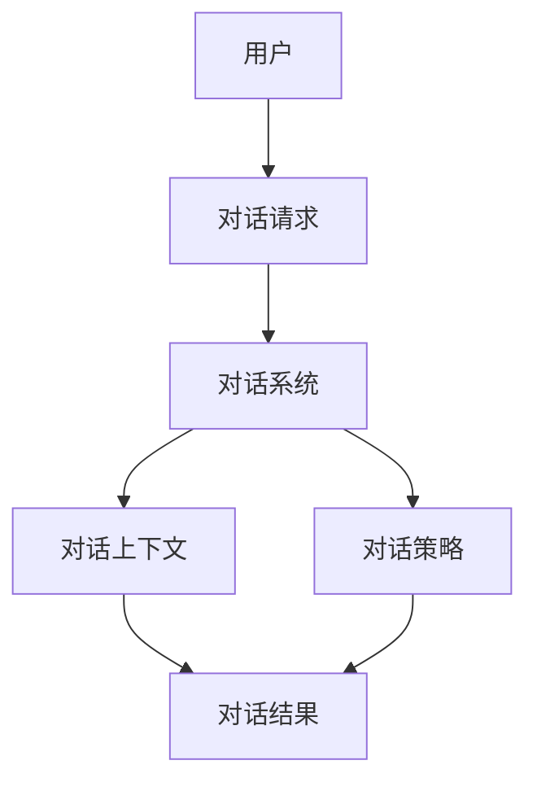
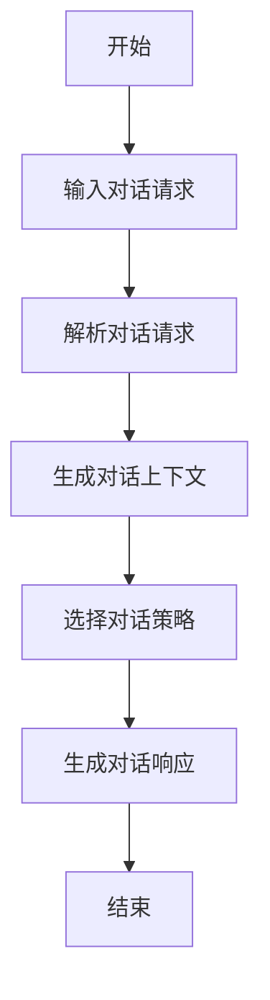
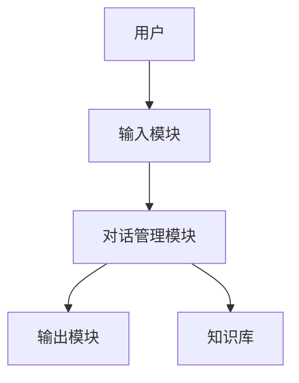
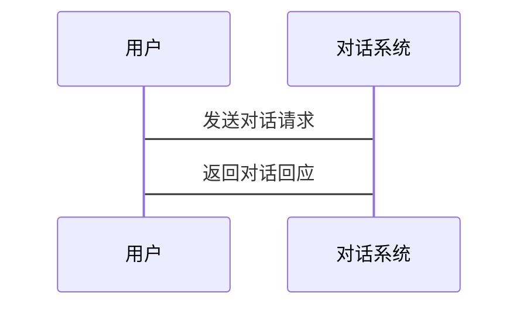

                 


# 对话管理：设计流畅的人机交互体验

**关键词：对话管理、人机交互、自然语言处理、人工智能、系统架构**

**摘要：**  
对话管理是实现流畅人机交互的核心技术，涉及自然语言处理和人工智能的多个方面。本文将从对话管理的基本概念、核心算法、系统架构到实际项目实现，全面解析如何设计和实现流畅的对话系统，帮助读者掌握对话管理的关键技术与实际应用。

---

# 第1章: 对话管理概述

## 1.1 对话管理的基本概念

### 1.1.1 对话管理的定义  
对话管理（Dialog Management）是指在人机交互过程中，系统如何理解和生成对话内容，以实现用户目标的技术。它负责处理用户的输入、维护对话上下文，并生成适当的回应。

### 1.1.2 对话管理的核心问题  
- **歧义性处理**：用户输入可能有多种解释，系统需选择最合适的回应。  
- **上下文理解**：对话需基于历史信息，确保连贯性。  
- **目标识别**：准确识别用户的意图，提供有效服务。  

### 1.1.3 对话管理的目标与价值  
目标：提高用户体验，实现高效、自然的对话。  
价值：提升产品智能化水平，增强用户满意度。

## 1.2 对话管理的背景与问题背景

### 1.2.1 人机交互的发展历程  
从简单命令交互到自然语言处理，对话管理是实现智能化交互的核心技术。

### 1.2.2 当前对话管理的主要挑战  
- **语义理解不足**：用户表达模糊时，系统难以准确理解意图。  
- **上下文管理复杂**：对话历史信息的处理需要高效存储和检索。  
- **动态策略调整**：对话过程中需根据用户反馈实时调整策略。

### 1.2.3 对话管理在实际应用中的问题描述  
以智能客服为例，用户提出问题，系统需准确理解并提供解决方案，同时处理用户的多样化需求。

## 1.3 对话管理的核心概念

### 1.3.1 对话流程与状态管理  
对话流程包括输入解析、策略选择、生成回应三个阶段。

### 1.3.2 对话上下文与记忆机制  
上下文是对话的历史信息，记忆机制用于存储和检索这些信息。

### 1.3.3 对话策略与反馈机制  
对话策略决定系统的回应方式，反馈机制用于优化对话流程。

## 1.4 对话管理的应用场景

### 1.4.1 智能客服系统  
处理用户咨询，提供解决方案。

### 1.4.2 智能助手（如Siri、Alexa）  
执行用户指令，如设置提醒、查询信息。

### 1.4.3 游戏NPC对话系统  
实现角色间的互动，提升游戏体验。

### 1.4.4 智慧教育中的对话系统  
根据学生需求，提供个性化教学支持。

## 1.5 本章小结  
对话管理是实现流畅人机交互的关键技术，涉及多个核心概念和应用场景。

---

# 第2章: 对话管理的核心概念与联系

## 2.1 对话管理的核心概念原理

### 2.1.1 对话流程的结构化分析  
对话流程包括输入解析、上下文维护、策略选择和生成回应。

### 2.1.2 对话上下文的表示方法  
常用基于知识图谱或向量表示的方法。

### 2.1.3 对话策略的分类与选择  
策略包括基于规则、统计和机器学习的方法。

## 2.2 对话管理的核心概念属性特征对比

| 属性       | 特征描述                       |
|------------|--------------------------------|
| 线性与非线性 | 流程是线性的还是非线性的       |
| 持久性与临时性 | 上下文是持久还是临时的         |
| 静态与动态调整 | 策略是静态设定还是动态调整     |

## 2.3 对话管理的ER实体关系图架构



## 2.4 本章小结  
对话管理的核心概念通过结构化分析和实体关系图展示，为后续实现奠定基础。

---

# 第3章: 对话管理的算法原理

## 3.1 对话管理的基础算法

### 3.1.1 基于规则的对话管理算法  
通过预设规则匹配用户输入，生成回应。

### 3.1.2 基于统计的对话管理算法  
利用概率模型预测用户意图。

### 3.1.3 基于机器学习的对话管理算法  
使用深度学习模型，如循环神经网络（RNN）进行训练。

## 3.2 对话管理的高级算法

### 3.2.1 基于强化学习的对话管理算法  
通过强化学习优化对话策略，提升用户体验。

### 3.2.2 基于生成模型的对话管理算法  
使用生成对抗网络（GAN）生成多样化的对话内容。

### 3.2.3 基于知识图谱的对话管理算法  
结合知识图谱，提供更准确的知识支持。

## 3.3 对话管理算法的流程图



## 3.4 对话管理算法的数学模型

- **基于RNN的模型**：  
  $$ P(y_t | y_{<t}, x) $$  
  其中，$y_t$是当前时间步的输出，$x$是输入序列。

- **强化学习模型**：  
  使用策略梯度方法，目标函数为：  
  $$ J = \mathbb{E}_{\tau}[R(\tau)] $$  
  其中，$\tau$是轨迹，$R$是奖励函数。

## 3.5 本章小结  
对话管理算法从基础到高级，结合多种技术提升对话质量。

---

# 第4章: 对话管理系统的分析与设计

## 4.1 对话管理系统的架构设计

### 4.1.1 系统架构图  


### 4.1.2 功能设计  
包括输入解析、上下文管理、策略选择和生成回应。

## 4.2 对话管理系统的实现方案

### 4.2.1 系统功能模块  
- 输入解析模块：处理用户输入，提取意图。  
- 上下文管理模块：维护对话历史。  
- 策略选择模块：根据上下文选择最优策略。  
- 输出生成模块：生成对话回应。

### 4.2.2 系统接口设计  
定义清晰的API，如`/api/v1/dialogue`，用于接收和处理对话请求。

## 4.3 对话管理系统的交互设计

### 4.3.1 序列图  


## 4.4 本章小结  
系统架构设计和实现方案为对话管理的高效运行提供了保障。

---

# 第5章: 对话管理项目的实战

## 5.1 项目实战环境安装

### 5.1.1 安装Python和相关库  
```bash
pip install python
pip install numpy
pip install tensorflow
```

### 5.1.2 安装对话管理框架  
如Rasa框架：  
```bash
pip install rasa
```

## 5.2 系统核心实现源代码

### 5.2.1 对话管理模块实现  
```python
class DialogManager:
    def __init__(self):
        self.context = {}
    
    def process_input(self, input_str):
        # 解析输入
        intent = self.extract_intent(input_str)
        return self.generate_response(intent)
    
    def extract_intent(self, input_str):
        # 示例：简单关键词匹配
        return 'greeting'
    
    def generate_response(self, intent):
        # 根据意图生成回应
        return 'Hello!'
```

### 5.2.2 对话上下文管理  
```python
class ContextManager:
    def __init__(self):
        self.history = []
    
    def add_context(self, context):
        self.history.append(context)
    
    def get_context(self, idx):
        return self.history[idx]
```

## 5.3 项目实战案例分析

### 5.3.1 案例：智能客服对话系统  
用户输入“我的订单在哪里？”，系统识别意图并查询订单信息，返回结果。

### 5.3.2 案例分析  
通过案例分析，优化对话流程和策略选择。

## 5.4 项目小结  
项目实战帮助读者理解对话管理的实现过程和实际应用。

---

# 第6章: 最佳实践与小结

## 6.1 最佳实践

### 6.1.1 系统设计注意事项  
- 确保上下文管理高效。  
- 优化策略选择算法，提升准确率。  

### 6.1.2 开发与调试技巧  
- 使用日志记录对话流程。  
- 定期测试和优化对话系统。  

## 6.2 小结  
对话管理是实现流畅人机交互的关键，通过本文的学习，读者可以掌握对话管理的核心技术与实际应用。

---

# 作者：AI天才研究院/AI Genius Institute & 禅与计算机程序设计艺术 /Zen And The Art of Computer Programming

