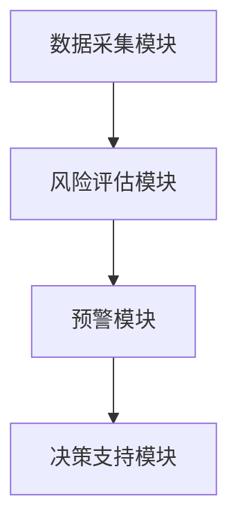

                 


# 尾部风险管理：防范极端市场事件的策略

## 关键词：尾部风险，极端事件，风险管理，金融系统，概率模型

## 摘要：  
尾部风险是指在概率分布的“尾部”区域发生的低概率但高影响的极端事件。这些事件可能对金融市场造成巨大冲击，甚至引发系统性危机。本文将从尾部风险的定义、特征、度量方法、防范策略等多个维度进行深入探讨，结合数学模型和实际案例，为金融从业者提供防范极端市场事件的有效策略。

---

# 第一部分：尾部风险管理的背景与核心概念

## 第1章：尾部风险管理概述

### 1.1 尾部风险的定义与特征

#### 1.1.1 尾部风险的定义
尾部风险（Tail Risk）是指在概率分布曲线的尾部区域发生的低概率但高影响的极端事件。与常态分布（Normal Distribution）假设不同，尾部风险关注的是“黑天鹅”事件（Black Swan Events）或“灰犀牛”事件（Gray Rhino Events）的可能性。

#### 1.1.2 尾部风险的特征
- **低概率性**：尾部事件的发生概率远低于常态分布中的概率。
- **高影响性**：一旦发生，尾部事件可能对市场或系统造成巨大冲击。
- **不可预测性**：尾部事件往往超出常规模型的预测范围，具有高度的不确定性。

#### 1.1.3 尾部风险的边界与外延
尾部风险的边界通常通过概率阈值来定义，例如：
- **VaR（Value at Risk）**：在给定置信水平下，资产可能遭受的最大损失。
- **CVaR（Conditional Value at Risk）**：在VaR的基础上，考虑尾部事件的平均损失。

### 1.2 尾部风险管理的重要性

#### 1.2.1 极端市场事件的潜在影响
- 尾部事件可能导致市场崩盘、金融机构破产或系统性金融危机。
- 例如，2008年全球金融危机和2020年新冠疫情引发的市场崩盘都属于尾部风险的典型表现。

#### 1.2.2 尾部风险对金融系统的威胁
- 尾部事件可能引发连锁反应，导致金融市场的流动性枯竭和信用危机。
- 金融机构的杠杆效应会进一步放大尾部风险的负面影响。

#### 1.2.3 尾部风险管理的必要性
- 通过识别和量化尾部风险，可以制定有效的风险对冲策略。
- 建立应急机制，确保在极端事件发生时能够迅速响应。

### 1.3 尾部风险管理的核心要素

#### 1.3.1 数据收集与分析
- 数据来源：历史市场数据、实时交易数据、宏观经济指标等。
- 数据特征：异常值、波动性、相关性。

#### 1.3.2 风险评估模型
- 使用统计模型（如VaR、CVaR）和机器学习模型（如随机森林、神经网络）进行风险评估。

#### 1.3.3 应急响应机制
- 制定危机管理计划，包括资产重新分配、流动性支持和市场干预。

---

## 第2章：尾部风险与极端市场事件的关系

### 2.1 极端市场事件的分类

#### 2.1.1 系统性风险
- 影响整个金融系统的风险，例如金融危机和经济衰退。
- 尾部风险可能引发系统性风险，但系统性风险的范围更广。

#### 2.1.2 非系统性风险
- 仅影响个别资产或机构的风险，例如信用违约。
- 尾部风险可能同时引发系统性风险和非系统性风险。

#### 2.1.3 尾部风险的特殊性
- 尾部风险是极端市场事件的一种特殊形式，其低概率和高影响性是其核心特征。

### 2.2 尾部风险的成因分析

#### 2.2.1 市场波动性
- 高波动性市场更容易出现尾部事件，例如杠杆交易和高频交易的普及加剧了市场的波动性。

#### 2.2.2 市场参与者的非理性行为
- 投资者情绪的波动、羊群效应和市场泡沫的积累都可能引发尾部事件。

#### 2.2.3 信息不对称的影响
- 信息不对称可能导致市场误定价，进而引发极端事件。

### 2.3 尾部风险与金融系统稳定性

#### 2.3.1 尾部风险对金融市场的冲击
- 尾部事件可能导致市场流动性枯竭、资产价格崩盘和信用链断裂。

#### 2.3.2 金融机构的脆弱性
- 金融机构的杠杆率过高和资产负债结构不合理是尾部风险的重要诱因。

#### 2.3.3 系统性风险的放大效应
- 尾部事件可能通过金融系统的相互关联，迅速蔓延至整个市场，引发系统性金融危机。

---

## 第3章：尾部风险的核心概念与原理

### 3.1 尾部风险的核心原理

#### 3.1.1 尾部风险的数学模型
- **概率密度函数（PDF）**：描述随机变量在不同取值的概率分布。
- **累积分布函数（CDF）**：描述随机变量小于或等于某个值的概率。

#### 3.1.2 尾部风险的概率分布
- **厚尾分布**（Fat-Tailed Distributions）：与正态分布相比，厚尾分布的尾部概率更高，更符合现实中的极端事件分布。

#### 3.1.3 尾部风险的度量方法
- 使用VaR和CVaR等统计方法量化尾部风险。

### 3.2 尾部风险的核心概念与联系

#### 3.2.1 尾部风险的属性对比
| 比较维度 | 尾部风险 | 系统性风险 | 非系统性风险 |
|---------|---------|------------|--------------|
| 定义     | 低概率、高影响的极端事件 | 影响整个金融系统的风险 | 影响个别资产或机构的风险 |
| 度量方法 | VaR、CVaR | 系统性风险模型 | 个体风险模型 |
| 应对策略 | 对冲和应急响应 | 宏观政策干预 | 机构内部风险管理 |

#### 3.2.2 尾部风险的度量方法
- **VaR（Value at Risk）**：在给定置信水平下，资产可能遭受的最大损失。
- **CVaR（Conditional Value at Risk）**：在VaR的基础上，考虑尾部事件的平均损失。

---

## 第4章：尾部风险管理的算法原理与数学模型

### 4.1 尾部风险管理的数学模型

#### 4.1.1 VaR的计算公式
$$ VaR_{\alpha} = \inf \{x | P(Loss \leq x) \geq \alpha\} $$
其中，$\alpha$ 是置信水平，$Loss$ 是损失变量。

#### 4.1.2 CVaR的计算公式
$$ CVaR_{\alpha} = \frac{1}{1-\alpha} \int_{\alpha}^{1} VaR_{p} dp $$
其中，$p$ 是概率水平。

#### 4.1.3 尾部风险的敏感性分析
- 通过蒙特卡洛模拟（Monte Carlo Simulation）评估不同假设下尾部风险的变化。

### 4.2 尾部风险管理的算法实现

#### 4.2.1 使用Python进行VaR计算
```python
import numpy as np
import pandas as pd

# 假设我们有一个资产回报的样本数据
returns = np.random.normal(loc=0, scale=1, size=10000)

# 计算VaR（95%置信水平）
alpha = 0.05
sorted_returns = np.sort(returns)
VaR = sorted_returns[int(alpha * len(sorted_returns))]
print(f"VaR at {1-alpha} confidence level: {VaR}")
```

#### 4.2.2 使用Python进行CVaR计算
```python
def compute_CVaR(data, alpha):
    sorted_data = sorted(data)
    threshold = alpha * len(sorted_data)
    CVaR = np.mean(sorted_data[threshold:])
    return CVaR

# 示例数据
data = np.random.normal(loc=0, scale=1, size=10000)
alpha = 0.05
CVaR = compute_CVaR(data, alpha)
print(f"CVaR at {alpha} confidence level: {CVaR}")
```

### 4.3 尾部风险管理的系统架构

#### 4.3.1 系统功能设计
- **数据采集模块**：实时采集市场数据。
- **风险评估模块**：使用VaR和CVaR模型评估尾部风险。
- **预警模块**：设置预警阈值，及时触发警报。
- **决策支持模块**：提供风险对冲和应急响应建议。

#### 4.3.2 系统架构图


---

## 第5章：尾部风险管理的系统实现与案例分析

### 5.1 项目实战：尾部风险预警系统

#### 5.1.1 环境配置
- 安装必要的Python库：`numpy`, `pandas`, `scikit-learn`, `matplotlib`

#### 5.1.2 系统核心实现
```python
import numpy as np
import pandas as pd
from sklearn.ensemble import IsolationForest

# 示例数据
data = np.random.normal(loc=0, scale=1, size=10000)
data = pd.Series(data)

# 使用孤立森林检测异常值
model = IsolationForest(n_estimators=100, contamination=0.01)
model.fit(data.values.reshape(-1, 1))
outliers = model.predict(data.values.reshape(-1, 1)) == -1

# 可视化
import matplotlib.pyplot as plt
plt.figure(figsize=(10, 6))
plt.plot(data.index, data.values, label='Market Data')
plt.scatter(data[outliers].index, data[outliers].values, color='red', label='Outliers')
plt.title('Tail Risk Detection')
plt.xlabel('Time')
plt.ylabel('Value')
plt.legend()
plt.show()
```

#### 5.1.3 实际案例分析
- 以2020年新冠疫情为例，分析市场数据中的尾部风险。
- 使用上述模型检测异常值，并评估风险对冲策略的有效性。

---

## 第6章：尾部风险管理的最佳实践与总结

### 6.1 最佳实践

#### 6.1.1 数据驱动的尾部风险识别
- 使用大数据和机器学习算法提高尾部风险的识别能力。
- 定期更新模型，适应市场变化。

#### 6.1.2 多元化的风险对冲策略
- 通过分散投资、对冲基金和保险产品降低尾部风险的影响。
- 结合VaR和CVaR模型进行多维度风险评估。

#### 6.1.3 应急响应与危机管理
- 制定详细的危机管理计划，明确各方责任和应对措施。
- 定期进行压力测试，确保系统在极端情况下的稳定性。

### 6.2 小结与注意事项

#### 6.2.1 尾部风险管理的核心要点
- **数据驱动**：利用大数据和机器学习技术提高风险识别能力。
- **模型选择**：结合VaR和CVaR等多维度模型进行风险评估。
- **应急机制**：建立完善的危机应对和决策支持体系。

#### 6.2.2 尾部风险管理的挑战
- **数据质量**：尾部事件的低概率性使得数据收集和分析面临挑战。
- **模型局限性**：统计模型无法完全捕捉所有尾部风险，需要结合专家判断。
- **系统复杂性**：金融系统的相互关联性使得尾部风险的管理和应对更加复杂。

### 6.3 拓展阅读与学习资源

#### 6.3.1 推荐书籍
- 《The Black Swan: The Impact of High-Impact, Low-Probability Events》
- 《Fooled by Randomness: The Hidden Role of Chance in Life and in the Markets》

#### 6.3.2 在线资源
- 学术论文：搜索“Tail Risk, Financial Crisis, Risk Management”。
- 工具与平台：使用Python的`statsmodels`和`pandas`库进行深入分析。

---

## 结语

尾部风险管理是金融领域的重要课题，其核心在于识别和应对低概率但高影响的极端事件。通过结合统计模型、机器学习算法和应急响应机制，可以有效降低尾部风险对金融系统的威胁。未来，随着大数据和人工智能技术的不断发展，尾部风险管理将更加精准和智能化，为金融市场的稳定保驾护航。

---

## 作者：AI天才研究院/AI Genius Institute & 禅与计算机程序设计艺术 /Zen And The Art of Computer Programming

---

**注**：由于篇幅限制，本文仅展示了部分内容，完整的文章将包含更多详细的公式推导、代码实现和案例分析，确保读者能够全面理解和掌握尾部风险管理的核心策略和实践方法。

