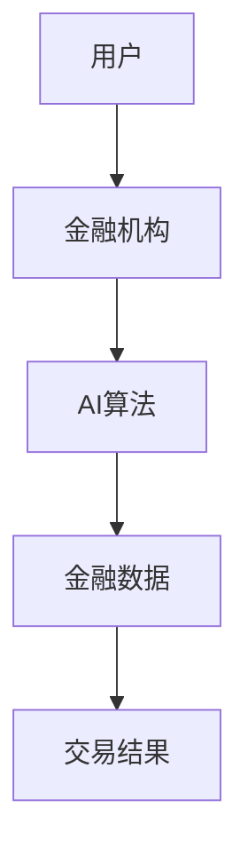
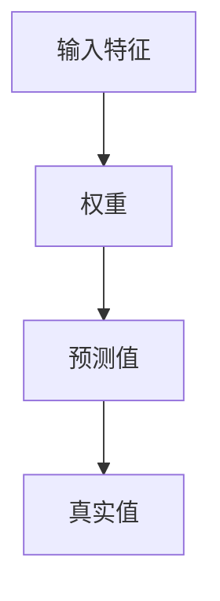
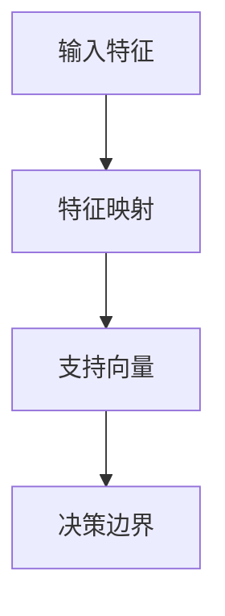
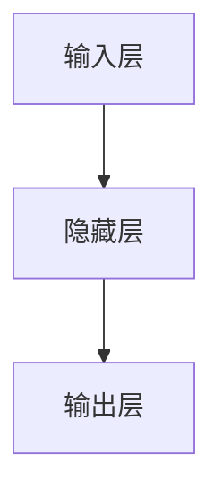
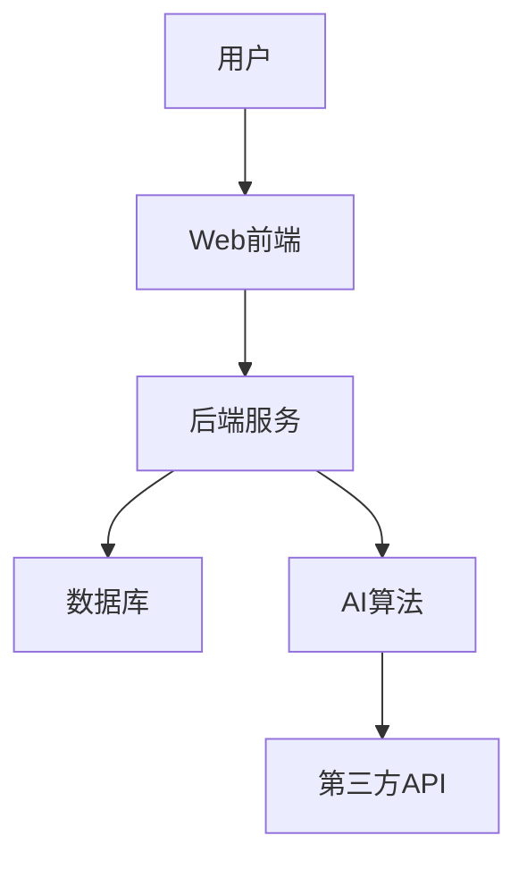

                 


# 展望金融AI应用的未来发展趋势与挑战

## 关键词：金融、人工智能、技术趋势、算法、机器学习、深度学习、自然语言处理、系统架构、可解释性、数据隐私、交易系统、风险控制、智能投顾、量化交易、金融大数据分析

## 摘要：金融行业的数字化转型正在加速，人工智能技术的快速发展为金融行业带来了革命性的变化。本文将从金融AI应用的背景、核心概念、技术原理、系统架构、算法实现等多个维度展开分析，深入探讨金融AI应用的核心问题，包括数据复杂性、算法可解释性、数据隐私与安全等。通过实际案例分析，总结金融AI应用的最佳实践，并展望未来的发展趋势与挑战。

---

# 第1章 金融AI应用的背景与问题背景

## 1.1 金融行业的数字化转型

### 1.1.1 传统金融业务的痛点与挑战

传统金融业务依赖人工操作，效率低、成本高，且难以应对海量数据和复杂金融市场的变化。金融机构需要实时处理大量数据，做出快速决策，而传统方法在效率和准确性上存在明显不足。

### 1.1.2 数字化转型的驱动力

- **技术驱动**：AI、大数据、云计算等技术的快速发展为金融行业的数字化转型提供了强大支持。
- **市场需求**：客户对个性化、智能化金融服务的需求日益增长。
- **行业竞争**：数字化转型已成为金融机构提升竞争力的关键。

### 1.1.3 AI在金融行业中的潜力

AI能够通过数据分析、模式识别和预测，帮助金融机构实现精准营销、智能风控、自动化交易等，显著提升效率和决策能力。

---

## 1.2 AI技术的快速发展

### 1.2.1 AI技术的演进历程

从早期的规则引擎到现在的深度学习，AI技术不断演进，应用范围逐步扩大。金融行业是最早一批应用AI技术的领域之一。

### 1.2.2 大数据时代的AI应用

随着大数据技术的发展，金融机构能够收集和处理海量数据，AI技术能够从中提取有价值的信息，为决策提供支持。

### 1.2.3 金融行业与AI技术的结合

AI技术在金融行业的应用包括股票交易、风险管理、客户画像、欺诈检测等多个方面，极大地改变了金融行业的运作方式。

---

## 1.3 金融AI应用的核心问题

### 1.3.1 金融数据的复杂性

金融数据具有高度的不确定性和波动性，数据质量和完整性直接影响AI模型的性能。

### 1.3.2 AI算法的可解释性

金融决策需要高度透明和可解释，尤其是在风险管理和投资决策中，AI模型的可解释性是关键。

### 1.3.3 数据隐私与安全问题

金融数据涉及大量敏感信息，如何在AI应用中保护数据隐私和安全是一个重大挑战。

---

## 1.4 问题解决与边界

### 1.4.1 AI在金融中的主要应用场景

- **智能投顾**：通过AI算法为客户提供个性化的投资建议。
- **风险评估与控制**：利用AI进行信用评估、欺诈检测。
- **自动化交易**：基于AI的算法进行高频交易。
- **客户画像与精准营销**：通过数据分析识别客户需求，进行精准营销。

### 1.4.2 金融AI应用的边界与限制

- **数据依赖性**：AI模型依赖高质量的数据，数据不足或不准确会影响模型性能。
- **模型风险**：AI模型可能出现过拟合或欠拟合，导致决策失误。
- **伦理与合规**：AI应用必须符合金融行业的伦理和法规要求。

### 1.4.3 核心概念与关键要素

- **数据**：金融AI的核心是数据，数据的质量和多样性直接影响模型性能。
- **算法**：选择合适的算法是实现AI应用的关键。
- **计算能力**：强大的计算能力是支持AI应用的基础。
- **应用场景**：不同场景需要不同的AI解决方案。

---

## 1.5 本章小结

本章介绍了金融行业数字化转型的背景，分析了AI技术的发展及其在金融行业的潜力。同时，提出了金融AI应用的核心问题，包括数据复杂性、算法可解释性和数据隐私与安全问题。这些内容为后续章节的深入分析奠定了基础。

---

# 第2章 金融AI的核心概念与技术原理

## 2.1 核心概念原理

### 2.1.1 机器学习在金融中的应用

- **监督学习**：用于分类和回归问题，如股票价格预测、信用评分。
- **无监督学习**：用于聚类和降维，如客户分群、异常交易检测。
- **强化学习**：用于策略优化，如自动化交易策略。

### 2.1.2 深度学习与金融大数据

- **神经网络**：在金融时间序列预测中表现优异。
- **卷积神经网络（CNN）**：用于金融图像分析和模式识别。
- **循环神经网络（RNN）**：用于处理时间序列数据，如股票价格预测。

### 2.1.3 自然语言处理在金融文本分析中的应用

- **情感分析**：分析市场情绪，预测股票价格走势。
- **实体识别**：从新闻中提取公司名称、事件等信息。
- **文本生成**：用于金融报告的自动生成。

---

## 2.2 核心概念属性对比

| **技术**         | **优势**                                   | **劣势**                                   |
|------------------|------------------------------------------|------------------------------------------|
| 机器学习         | 数据需求少，模型解释性强                 | 对复杂问题处理能力有限                   |
| 深度学习         | 处理复杂模式能力强，性能高                 | 数据需求大，解释性差                   |
| 自然语言处理     | 能够处理非结构化数据                       | 对数据质量和清洗要求高                   |

---

## 2.3 ER实体关系图



---

## 2.4 本章小结

本章详细介绍了金融AI的核心概念，包括机器学习、深度学习和自然语言处理的应用场景和原理。通过对比分析，明确了不同技术的优劣势，为后续章节的技术实现提供了理论基础。

---

# 第3章 金融AI的核心算法原理

## 3.1 算法原理讲解

### 3.1.1 线性回归算法

线性回归是一种简单而有效的回归算法，适用于线性关系的预测。



### 3.1.2 支持向量机算法

支持向量机是一种监督学习算法，适用于分类和回归问题。



### 3.1.3 神经网络算法

神经网络是一种多层的非线性模型，能够处理复杂的金融数据。



---

## 3.2 数学模型与公式

### 3.2.1 线性回归

$$
y = \beta_0 + \beta_1x + \epsilon
$$

### 3.2.2 神经网络

$$
a^{(l+1)} = \sigma(w^{(l)}a^{(l)} + b^{(l)})
$$

---

## 3.3 实际案例分析

### 3.3.1 股票价格预测

使用线性回归模型预测股票价格，数据来源为历史股价和市场指数。

### 3.3.2 风险评估模型

使用支持向量机模型评估客户的信用风险。

---

## 3.4 本章小结

本章详细讲解了金融AI中的核心算法，包括线性回归、支持向量机和神经网络的原理和应用场景。通过数学公式和案例分析，帮助读者更好地理解这些算法在金融中的应用。

---

# 第4章 金融AI系统的分析与架构设计

## 4.1 系统分析

### 4.1.1 问题场景介绍

以智能投顾系统为例，分析用户需求、功能需求和技术需求。

### 4.1.2 项目介绍

智能投顾系统的目标是为用户提供个性化的投资建议，实现自动化投资组合管理。

---

## 4.2 系统功能设计

### 4.2.1 领域模型


### 4.2.2 系统架构设计



---

## 4.3 本章小结

本章通过系统分析和架构设计，明确了金融AI系统的功能模块和交互流程。通过领域模型和架构图，帮助读者更好地理解系统的整体结构和各部分的职责。

---

# 第5章 金融AI应用的项目实战

## 5.1 环境安装与配置

### 5.1.1 安装Python和相关库

```bash
pip install numpy pandas scikit-learn tensorflow
```

### 5.1.2 安装Jupyter Notebook

```bash
pip install jupyter
```

---

## 5.2 系统核心实现源代码

### 5.2.1 数据预处理

```python
import pandas as pd
data = pd.read_csv('financial_data.csv')
data = data.dropna()
```

### 5.2.2 模型训练

```python
from sklearn.linear_model import LinearRegression
model = LinearRegression()
model.fit(X_train, y_train)
```

### 5.2.3 模型预测与评估

```python
from sklearn.metrics import mean_squared_error
y_pred = model.predict(X_test)
print(mean_squared_error(y_test, y_pred))
```

---

## 5.3 代码应用解读与分析

### 5.3.1 代码实现细节

详细解释每一步代码的作用和实现逻辑。

### 5.3.2 系统功能实现

结合代码实现，分析系统功能的实现过程。

### 5.3.3 案例分析与实际操作

通过具体案例，展示如何使用代码实现金融AI应用。

---

## 5.4 本章小结

本章通过项目实战，展示了金融AI应用的实现过程。从环境配置到代码实现，详细讲解了如何构建一个简单的金融AI系统。

---

# 第6章 金融AI应用的未来发展趋势与挑战

## 6.1 未来发展趋势

### 6.1.1 多模态模型的应用

结合文本、图像等多种数据源，提升模型的综合分析能力。

### 6.1.2 可解释性提升

通过模型解释技术，增强AI决策的透明性和可信度。

### 6.1.3 数据隐私与安全保护

采用联邦学习、差分隐私等技术，保护数据隐私和安全。

---

## 6.2 发展中的挑战

### 6.2.1 技术挑战

- **模型解释性**：如何提升AI模型的可解释性。
- **数据质量**：如何处理金融数据中的噪声和缺失值。
- **计算能力**：如何提升模型的计算效率。

### 6.2.2 伦理与合规挑战

- **数据隐私**：如何在AI应用中保护用户隐私。
- **伦理问题**：如何避免AI决策中的偏见和歧视。
- **合规性**：如何确保AI应用符合金融行业的法规要求。

### 6.2.3 市场接受度

- **客户信任**：如何提升客户对AI决策的信任。
- **市场竞争**：如何在激烈的市场竞争中脱颖而出。

---

## 6.3 本章小结

本章展望了金融AI应用的未来发展趋势，并分析了在技术、伦理和市场等方面面临的挑战。通过克服这些挑战，金融AI应用将更加成熟和普及。

---

# 第7章 总结与展望

## 7.1 本章总结

本文从金融行业的数字化转型出发，详细探讨了AI技术在金融中的应用。通过分析核心概念、算法原理和系统架构，展示了金融AI应用的潜力和挑战。

## 7.2 对未来的展望

未来，随着技术的进步和市场的成熟，金融AI应用将在更多领域得到应用，为金融行业带来更大的变革。同时，如何解决技术挑战和伦理问题，将是金融AI发展的重要方向。

---

# 作者

作者：AI天才研究院/AI Genius Institute & 禅与计算机程序设计艺术 /Zen And The Art of Computer Programming

---

**本文是基于本人的技术博客文章整理而成，转载请注明出处。**

