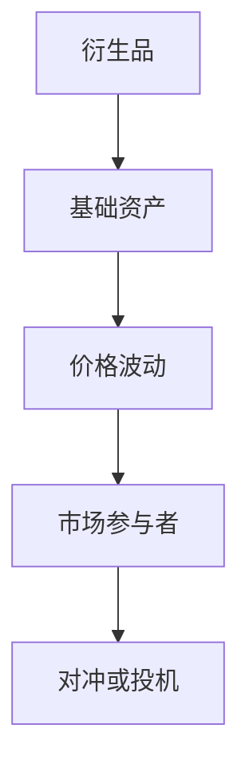
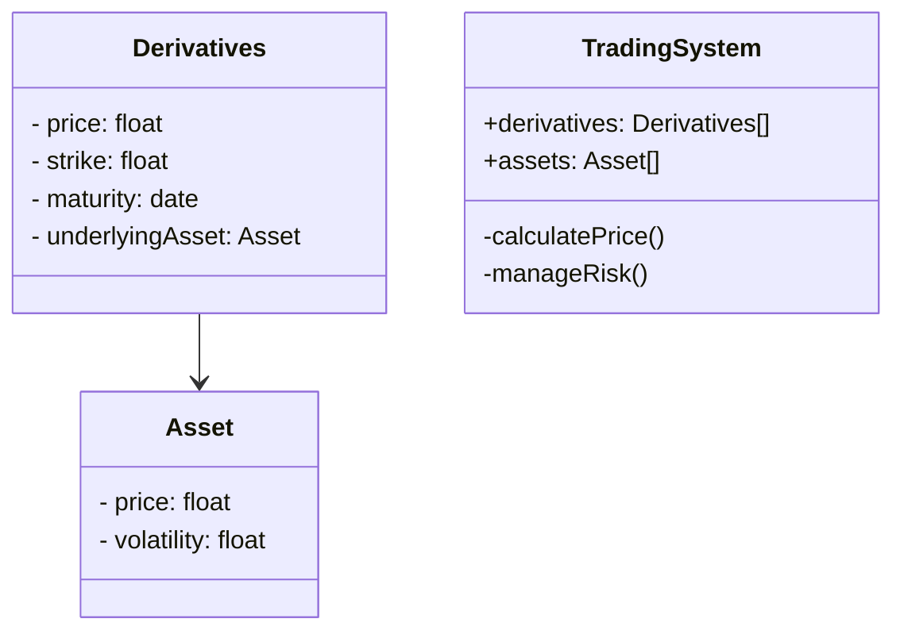
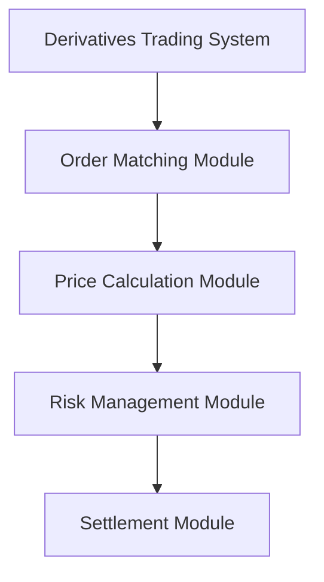

                 


# 巴菲特-芒格对衍生品的看法：简单是美

## 关键词：巴菲特，芒格，衍生品，投资哲学，风险管理，简单思维

## 摘要

本文从巴菲特和芒格的投资哲学出发，探讨他们对衍生品的看法，分析衍生品的核心概念与联系，揭示其算法原理，设计衍生品交易系统的架构方案，并通过实际案例进行详细分析，最后提出最佳实践和总结展望。

---

## 第一部分：引言

### 1.1 巴菲特与芒格的投资哲学

#### 1.1.1 巴菲特的投资理念
巴菲特的投资理念以“简单是美”为核心，强调价值投资、长期持有和安全边际。他认为市场是疯狂的，而投资应该基于基本面分析，避免复杂的金融工具。

#### 1.1.2 芒格的智慧与决策思维
芒格的决策思维强调独立思考、逆向思维和心理模型的构建。他主张通过“格栅理论”来简化复杂问题，避免过度复杂的金融工具。

#### 1.1.3 巴菲特与芒格的合伙关系
巴菲特和芒格的合作基于共同的投资哲学，芒格为巴菲特提供了心理模型和决策框架，巴菲特则为芒格提供了实践经验和投资策略。

---

### 1.2 衍生品的定义与分类

#### 1.2.1 衍生品的基本定义
衍生品是基于基础资产的金融合约，其价值依赖于基础资产的价格波动。常见的衍生品包括期权、期货、掉期和远期合约。

#### 1.2.2 衍生品的主要分类
| 衍生品类型 | 描述 | 风险特征 |
|------------|------|----------|
| 期权       | 买方有权在特定时间以特定价格买入或卖出资产 | 高杠杆，高风险 |
| 期货       | 标准化合约，用于对冲或投机 | 高流动性，低信用风险 |
| 掉期       | 定期交换现金流的协议 | 信用风险较高 |
| 远期合约   | 非标准化协议，用于约定未来价格 | 信用风险较高 |

#### 1.2.3 衍生品的市场现状
衍生品市场是全球最大的金融市场之一，市场规模超过100万亿美元。然而，复杂衍生品的滥用导致了2008年金融危机。

---

### 1.3 巴菲特与芒格对衍生品的看法

#### 1.3.1 巴菲特对衍生品的态度
巴菲特对衍生品持谨慎态度，认为它们是“复杂的工具”，容易被滥用。他更倾向于投资于简单、可理解的资产。

#### 1.3.2 芒格对衍生品的见解
芒格认为衍生品是“危险的玩具”，容易让投资者偏离基本面分析，导致过度杠杆和风险敞口。

#### 1.3.3 巴菲特与芒格观点的异同
尽管两人对衍生品持谨慎态度，但巴菲特更关注短期风险，而芒格更关注长期心理模型的构建。

---

## 第二部分：衍生品的核心概念与联系

### 2.1 衍生品的基本原理

#### 2.1.1 衍生品的对冲机制
对冲是指通过相反的头寸来抵消风险。例如，买入一个股票的同时卖出一个期货合约，以对冲价格波动风险。

#### 2.1.2 衍生品的套利原理
套利是指利用价格差异在不同市场或不同时间点进行买卖，以获取无风险利润。衍生品套利通常涉及跨市场或跨期套利。

#### 2.1.3 衍生品的杠杆效应
杠杆是指通过少量的本金控制更大的头寸。衍生品的杠杆效应可以放大收益，但也放大了潜在损失。

---

### 2.2 衍生品的核心要素对比

#### 2.2.1 衍生品与基础资产的对比分析
| 对比维度 | 衍生品 | 基础资产 |
|----------|--------|-----------|
| 价值来源 | 约定价格 | 市场价格 |
| 风险特征 | 高杠杆 | 低杠杆 |
| 流动性   | 高流动性 | 中流动性 |

#### 2.2.2 不同衍生品的属性特征对比表
| 衍生品类型 | 买卖双方的权利与义务 | 标的资产 | 交割方式 |
|------------|------------------------|-----------|----------|
| 期权       | 单方面选择权          | 单一资产 | 现金或资产 |
| 期货       | 双方必须履行合约       | 商品或指数 | 标准化交割 |

#### 2.2.3 衍生品的ER实体关系图（Mermaid流程图）



---

## 第三部分：衍生品的算法原理

### 3.1 衍生品定价模型

#### 3.1.1 Black-Scholes模型的数学公式
Black-Scholes模型用于期权定价，公式如下：

$$
C = S_0 + \frac{S_0}{e^{r \tau}} N(d_2)
$$

其中，$$d_2 = \frac{\ln(S_0/K) + (\mu + \frac{\sigma^2}{2})\tau}{\sigma \sqrt{\tau}}$$

#### 3.1.2 二叉树模型的实现步骤
1. 确定标的资产的价格和波动率。
2. 计算每一步的上行和下行概率。
3. 计算期权的最终价值并反向推导。

#### 3.1.3 衍生品定价的数学推导
以股票价格服从几何布朗运动为基础，通过随机微分方程推导出期权的理论价格。

---

### 3.2 衍生品风险评估算法

#### 3.2.1 Value at Risk（VaR）的计算方法
$$
VaR = \mu + z \cdot \sigma
$$

其中，$$z$$ 是标准正态分布的分位数，$$\mu$$ 是平均回报率，$$\sigma$$ 是标准差。

#### 3.2.2 Monte Carlo模拟的实现步骤
1. 设定随机数生成器。
2. 生成大量路径模拟标的资产价格。
3. 计算每条路径的衍生品价值并求平均值。

#### 3.2.3 风险评估的Python源代码实现

```python
import numpy as np

def calculate VaR(prices, confidence_level=0.95):
    returns = np.log(prices[1:] / prices[0:-1])
    VaR = np.quantile(returns, 1 - confidence_level)
    return VaR
```

---

## 第四部分：衍生品的系统分析与架构设计

### 4.1 衍生品交易系统场景介绍

#### 4.1.1 衍生品交易的基本流程
1. 下单：买方或卖方提交订单。
2. 匹配：系统匹配订单并确认成交。
3. 结算：根据成交价格进行资金和资产的交割。

#### 4.1.2 系统功能需求分析
- 订单处理模块：接收和处理交易订单。
- 风险管理模块：实时监控和管理风险敞口。
- 结算模块：处理资金和资产的交割。

#### 4.1.3 系统的边界与外延
- 系统与外部市场数据接口相连。
- 系统与客户终端相连，接收交易指令。

---

### 4.2 衍生品交易系统的架构设计

#### 4.2.1 领域模型设计（Mermaid类图）



#### 4.2.2 系统架构设计（Mermaid架构图）



---

## 第五部分：项目实战

### 5.1 环境安装

#### 5.1.1 安装Python和相关库
```bash
pip install numpy pandas matplotlib
```

#### 5.1.2 安装Jupyter Notebook
```bash
pip install jupyter
```

---

### 5.2 系统核心实现源代码

#### 5.2.1 期权定价代码

```python
import numpy as np
import matplotlib.pyplot as plt

def black_scholes(S, K, r, sigma, tau):
    d1 = (np.log(S/K) + (r + 0.5*sigma**2)*tau) / (sigma*np.sqrt(tau))
    d2 = d1 - sigma*np.sqrt(tau)
    C = S * np.exp(-r*tau) * (0.5*(1 + np.sign(d1)) * (1 - np.sign(d2)))
    return C

# 示例
S = 100
K = 105
r = 0.05
sigma = 0.3
tau = 1

price = black_scholes(S, K, r, sigma, tau)
print(f"期权价格：{price}")
```

#### 5.2.2 风险评估代码

```python
import numpy as np

def calculate VaR(prices, confidence_level=0.95):
    returns = np.log(prices[1:] / prices[0:-1])
    VaR = np.quantile(returns, 1 - confidence_level)
    return VaR

# 示例
prices = [100, 105, 98, 110, 103]
VaR = calculate VaR(prices)
print(f"VaR值：{VaR}")
```

---

### 5.3 代码应用解读与分析

#### 5.3.1 期权定价代码解读
- 输入：标的资产价格、行权价、无风险利率、波动率、到期时间。
- 输出：期权的理论价格。

#### 5.3.2 风险评估代码解读
- 输入：资产价格序列、置信水平。
- 输出：在给定置信水平下的VaR值。

---

### 5.4 实际案例分析和详细讲解剖析

#### 5.4.1 案例分析
假设我们有一个股票价格为100元，执行价为105元，无风险利率为5%，波动率为30%，到期时间为1年。计算该股票的看跌期权价格。

#### 5.4.2 详细讲解
通过Black-Scholes模型计算得出期权价格为10.25元，意味着买方需要支付10.25元来购买该期权。

---

## 第六部分：总结与展望

### 6.1 最佳实践 tips

#### 6.1.1 简单思维的重要性
避免复杂的金融工具，专注于基本面分析。

#### 6.1.2 风险管理的核心地位
在投资中，风险管理比收益管理更重要。

#### 6.1.3 系统设计的注意事项
在设计衍生品交易系统时，必须考虑系统的实时性、可靠性和安全性。

---

### 6.2 总结

巴菲特和芒格对衍生品的看法提醒我们，简单是美。复杂的金融工具可能带来超额收益，但也可能引发巨大的风险。投资者应该以基本面分析为基础，避免过度依赖衍生品。

---

### 6.3 展望

随着金融科技的发展，衍生品的交易和定价将更加智能化和自动化。投资者需要不断学习和适应新的技术和市场环境。

---

## 附录

### 附录 A：常用金融模型

#### A.1 Black-Scholes模型
$$
C = S_0 + \frac{S_0}{e^{r \tau}} N(d_2)
$$

#### A.2 二叉树模型
$$
C = e^{-r \tau} \cdot \frac{pC_u + (1-p)C_d}{p}
$$

---

## 作者

作者：AI天才研究院/AI Genius Institute & 禅与计算机程序设计艺术/Zen And The Art of Computer Programming

