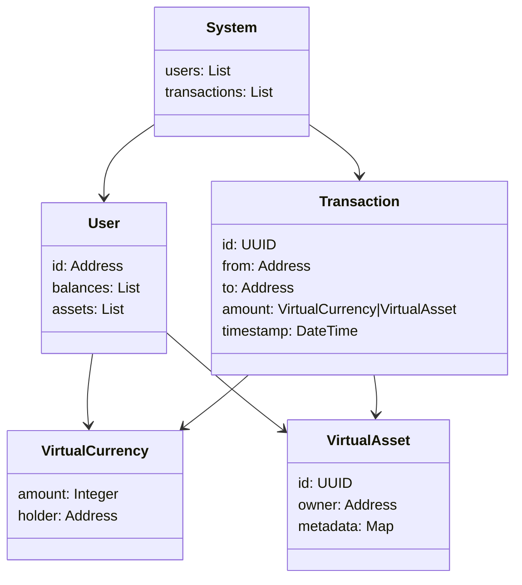
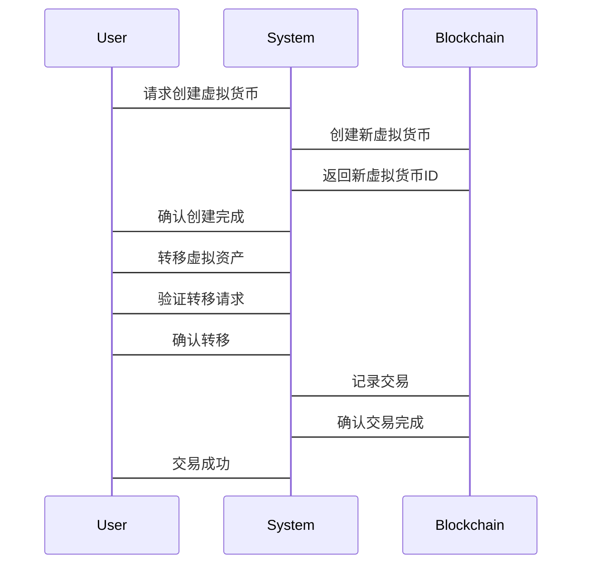

                 


# 巴菲特-芒格的元宇宙经济观：虚拟与现实的融合投资

## 关键词：
- 巴菲特, 芒格, 元宇宙, 虚拟经济, 价值投资, 投资策略, 经济融合

## 摘要：
本文探讨了巴菲特和芒格的投资理念在元宇宙经济中的应用。通过分析虚拟资产和虚拟货币的特性，结合他们的价值投资和多元思维模型，展示了如何在虚拟与现实经济的融合中进行有效投资。文章从背景介绍、核心概念、算法原理、系统设计到项目实战，全面解析了元宇宙经济中的投资策略和实践方法。

---

# 正文

## 第一部分: 巴菲特与芒格的经济观

### 第1章: 巴菲特与芒格的投资理念

#### 1.1 巴菲特的价值投资理论

##### 1.1.1 价值投资的核心思想
巴菲特的价值投资理论强调购买被低估的资产，长期持有，关注企业的内在价值。他的核心思想是寻找那些具有持续竞争优势、良好管理和稳固财务状况的公司。

##### 1.1.2 巴菲特的投资策略
巴菲特的投资策略包括：
1. **长期持有**：不频繁交易，长期持有优质资产。
2. **寻找护城河**：投资那些具有竞争优势和护城河的公司。
3. **关注ROE**：重视投资回报率（ROE）高的企业。

##### 1.1.3 巴菲特的成功案例分析
以可口可乐为例，巴菲特长期持有该股票，因为可口可乐拥有强大的品牌和分销网络，具备持久的竞争力。

#### 1.2 芒格的多元思维模型

##### 1.2.1 多元思维模型的定义
芒格的多元思维模型是一种通过多学科视角分析问题的方法，强调将不同领域的知识整合，形成全面的思考框架。

##### 1.2.2 芒格思维模型的核心要素
1. **跨学科知识**：涵盖心理学、经济学、物理学等领域。
2. **逆向思维**：从问题的反面思考，寻找解决方案。
3. **简化复杂问题**：通过基本原理简化问题，找到本质。

##### 1.2.3 芒格思维模型的实际应用
例如，在投资决策中，芒格会考虑企业的管理团队、财务状况、行业竞争等多个因素，综合分析后做出决策。

---

### 第2章: 元宇宙的经济体系

#### 2.1 元宇宙的定义与特征

##### 2.1.1 元宇宙的定义
元宇宙是一个虚拟的、持续的、3D的虚拟空间，用户可以通过虚拟现实技术进行互动，形成一个与现实世界平行的数字世界。

##### 2.1.2 元宇宙的核心特征
1. **虚拟性**：用户通过虚拟身份参与。
2. **持续性**：数据和内容持续存在。
3. **3D空间**：提供沉浸式的体验。
4. **去中心化**：基于区块链技术，确保数据的安全性和不可篡改性。

##### 2.1.3 元宇宙与现实世界的联系
元宇宙通过虚拟货币、数字资产与现实经济产生互动，例如虚拟货币可以兑换成法定货币，数字资产可以在不同平台间转移。

#### 2.2 元宇宙中的虚拟经济

##### 2.2.1 虚拟经济的定义
虚拟经济是基于虚拟货币、数字资产和虚拟服务的经济体系，存在于元宇宙中。

##### 2.2.2 虚拟经济的主要形式
1. **虚拟货币**：如比特币、以太坊等加密货币。
2. **数字资产**：如NFT（非同质化代币）、虚拟土地。
3. **虚拟服务**：如虚拟会议、虚拟教育等。

##### 2.2.3 虚拟经济与现实经济的融合
虚拟经济通过区块链技术与现实经济连接，例如虚拟货币可以用于购买现实世界的产品，数字资产可以作为投资工具。

---

### 第3章: 巴菲特与芒格的经济观在元宇宙中的应用

#### 3.1 巴菲特价值投资理论在元宇宙中的应用

##### 3.1.1 元宇宙中的价值投资机会
在元宇宙中，具有强大护城河的虚拟资产（如NFT）和虚拟货币可能具有长期价值。

##### 3.1.2 巴菲特价值投资理论在虚拟资产中的应用
投资者应关注那些具有长期竞争优势的虚拟资产，如由知名公司发行的NFT或虚拟货币。

##### 3.1.3 元宇宙中价值投资的风险与挑战
1. **价格波动**：虚拟资产价格波动较大，投资风险高。
2. **技术风险**：元宇宙技术尚不成熟，存在技术失败的风险。

#### 3.2 芒格多元思维模型在元宇宙中的应用

##### 3.2.1 多元思维模型在虚拟经济中的应用
芒格的多元思维模型可以帮助投资者从多个角度分析元宇宙中的投资标的，如技术、法律、经济等多个方面。

##### 3.2.2 芒格思维模型在元宇宙投资中的优势
通过跨学科视角，芒格能够识别潜在的风险和机会，做出更明智的投资决策。

##### 3.2.3 芒格思维模型在虚拟资产评估中的应用
例如，在评估虚拟货币时，芒格会考虑其技术基础（如区块链）、市场接受度、监管环境等多个因素。

---

### 第4章: 元宇宙经济中的投资策略

#### 4.1 元宇宙经济中的投资机会

##### 4.1.1 元宇宙中的虚拟货币
虚拟货币如比特币、以太坊等，具备去中心化、可编程的特点，适合用于元宇宙中的交易。

##### 4.1.2 元宇宙中的虚拟资产
NFT（非同质化代币）代表虚拟艺术品、虚拟土地等，具有独特的价值和稀缺性。

##### 4.1.3 元宇宙中的虚拟企业
虚拟企业通过元宇宙平台提供服务，如虚拟教育、虚拟娱乐等。

#### 4.2 元宇宙经济中的投资风险

##### 4.2.1 元宇宙经济的不确定性
虚拟货币和数字资产的市场波动大，监管政策不确定，存在较大的市场风险。

##### 4.2.2 元宇宙投资中的技术风险
元宇宙技术尚未成熟，存在技术失败和被替代的风险。

##### 4.2.3 元宇宙投资中的法律风险
虚拟资产的法律地位不明确，存在政策和法律风险。

---

## 第二部分: 元宇宙经济的系统分析与架构设计

### 第5章: 元宇宙经济的系统架构

#### 5.1 问题场景介绍
介绍元宇宙经济中的虚拟货币和数字资产交易系统，分析其功能需求和技术实现。

#### 5.2 系统功能设计

##### 5.2.1 领域模型（Mermaid 类图）


#### 5.3 系统架构设计（Mermaid 架构图）


#### 5.4 系统接口设计
定义系统接口，如API接口，用于虚拟货币和数字资产的创建、转移和查询。

#### 5.5 系统交互设计（Mermaid 序列图）


---

## 第三部分: 项目实战

### 第6章: 元宇宙虚拟经济分析系统的实战

#### 6.1 环境安装

##### 6.1.1 安装必要的开发工具
安装Python、Git、Jupyter Notebook等开发工具。

##### 6.1.2 安装虚拟货币和NFT相关库
安装如web3.py（用于以太坊交互）、ethers.js（用于Solidity开发）等库。

#### 6.2 系统核心实现源代码

##### 6.2.1 虚拟货币的创建与转移
```python
from web3 import Web3, HTTPProvider
from web3.middleware import geth
import json

# 初始化Web3实例
web3 = Web3(HTTPProvider('http://localhost:8545'))

# 加载ABI文件
with open('erc20_abi.json') as f:
    erc20_abi = json.load(f)

# 设置合约地址
erc20_address = '0xYourContractAddress'

# 转账函数
def transfer(from_address, to_address, amount):
    contract = web3.eth.contract(erc20_address, abi=erc20_abi)
    tx = contract.functions.transfer(to_address, amount).buildTransaction({'from': from_address})
    signed_tx = web3.eth.account.sign_transaction(tx, 'your_private_key')
    tx_hash = web3.eth.send_raw_transaction(signed_tx.rawTransaction)
    return tx_hash
```

##### 6.2.2 NFT资产的创建与查询
```python
def create_nft(owner_address):
    contract = web3.eth.contract(erc721_address, abi=erc721_abi)
    tx = contract.functions.mint(owner_address).buildTransaction({'from': owner_address})
    signed_tx = web3.eth.account.sign_transaction(tx, 'your_private_key')
    tx_hash = web3.eth.send_raw_transaction(signed_tx.rawTransaction)
    return tx_hash

def get_nft_owner(token_id):
    contract = web3.eth.contract(erc721_address, abi=erc721_abi)
    owner = contract.functions.ownerOf(token_id).call()
    return owner
```

#### 6.3 实际案例分析
分析一个具体的虚拟资产投资案例，如投资一个热门NFT项目，详细解读其市场表现和投资策略。

#### 6.4 项目小结
总结项目实战的经验，强调理论与实践结合的重要性。

---

## 第四部分: 最佳实践与拓展阅读

### 第7章: 最佳实践与注意事项

#### 7.1 投资策略
- **分散投资**：不要将所有资金投入单一虚拟资产。
- **长期持有**：遵循巴菲特的长期投资理念。
- **关注基本面**：分析虚拟资产的技术、市场和法律因素。

#### 7.2 风险管理
- **设置止损点**：控制投资风险。
- **定期评估**：及时调整投资组合。

#### 7.3 技术关注点
- **技术发展**：关注元宇宙相关技术的进展。
- **安全性**：选择安全可靠的区块链平台进行投资。

#### 7.4 税务与法律
- **税务合规**：了解虚拟资产的税务处理。
- **法律风险**：关注虚拟资产的法律监管动态。

### 第8章: 拓展阅读与进一步学习

#### 8.1 推荐书籍
- 《巴菲特传》：了解巴菲特的投资理念。
- 《芒格的智慧》：学习芒格的多元思维模型。
- 《元宇宙经济学》：深入理解元宇宙经济体系。

#### 8.2 在线资源
- 区块链技术文档：如Ethereum官方文档。
- 元宇宙项目白皮书：了解具体项目的经济模型。

#### 8.3 技术社区
- 加入区块链和元宇宙相关的技术社区，参与讨论和学习。

---

## 作者信息

作者：AI天才研究院/AI Genius Institute  
联系邮箱：contact@aiguru.org  
文章版权归作者所有，转载请注明出处。

---

以上是《巴菲特-芒格的元宇宙经济观：虚拟与现实的融合投资》的完整目录和文章内容。希望这篇文章能为您提供有价值的投资见解和实践指导。

