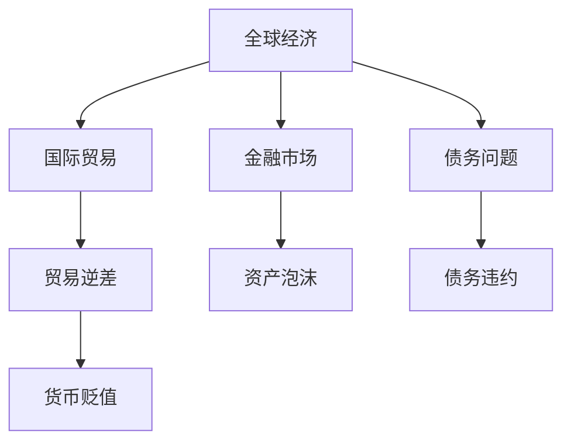
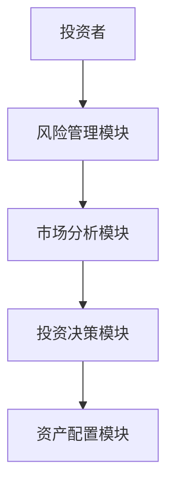

                 


# 巴菲特-芒格的全球经济失衡应对：风险中的机遇

> 关键词：巴菲特，芒格，全球经济失衡，风险管理，投资策略，价值投资

> 摘要：本文深入分析了巴菲特和芒格在应对全球经济失衡中的策略和思想，探讨了他们在风险中的投资机会，结合技术语言和系统分析方法，详细阐述了其投资哲学、风险管理策略以及实际案例分析。

---

## 第一部分：全球经济失衡的背景分析

### 第1章：全球经济失衡的定义与现状

#### 1.1 全球经济失衡的定义
全球经济失衡是指国际贸易、金融和货币体系中的不平衡状态，主要表现为贸易逆差、货币贬值和债务问题。这种失衡往往由各国的经济政策、产业结构和全球分工不均引起。

#### 1.2 全球经济失衡的现状
当前全球经济失衡主要体现在以下几个方面：
- **贸易失衡**：部分国家长期存在贸易逆差，导致国际支付压力加大。
- **货币失衡**：货币贬值与升值的周期性波动影响国际贸易和投资。
- **债务失衡**：全球债务规模不断扩大，特别是在发展中国家，债务风险加剧。

#### 1.3 巴菲特与芒格的投资背景
巴菲特和芒格的投资哲学强调长期价值和安全边际，这与应对全球经济失衡密切相关。他们通过分析经济周期和市场波动，寻找被低估的投资机会。

---

### 第2章：全球经济失衡的原因与影响

#### 2.1 经济失衡的主要原因
- **贸易政策**：关税壁垒和贸易摩擦加剧了全球经济失衡。
- **货币政策**：量化宽松和低利率政策导致货币贬值和资产泡沫。
- **产业结构**：发达国家的高端制造业转移与发展中国家的低端制造业依赖。

#### 2.2 全球经济失衡的影响
- **投资风险**：贸易摩擦和货币波动增加了跨国投资的不确定性。
- **市场波动**：经济失衡导致股市、汇市和债市的剧烈波动。
- **企业经营**：全球供应链的不稳定影响企业的生产和成本。

---

## 第二部分：巴菲特与芒格的投资哲学

### 第3章：巴菲特与芒格的核心投资理念

#### 3.1 价值投资的定义与核心要素
价值投资强调购买被低估的资产，注重企业的基本面和长期盈利能力。巴菲特的“安全边际”概念是指购买价格低于内在价值，以降低投资风险。

#### 3.2 逆向思维在投资中的应用
芒格的逆向思维强调在市场恐慌时寻找机会，避免 crowd mentality（从众心理）。例如，在2008年金融危机期间，巴菲特逆势投资美国运通和高盛，获得了丰厚的回报。

---

### 第4章：全球经济失衡下的投资机会

#### 4.1 科技行业的投资机会
- **技术创新**：人工智能、云计算和区块链等技术的广泛应用为科技行业提供了增长动力。
- **行业整合**：全球经济失衡可能导致科技公司间的并购，带来投资机会。

#### 4.2 消费行业的投资机会
- **消费升级**：中产阶级的崛起推动了高端消费品的需求。
- **品牌价值**：具有强大品牌影响力的企业在经济波动中更具抗风险能力。

#### 4.3 金融行业的投资机会
- **金融服务创新**：金融科技（FinTech）的发展为金融行业带来了新的投资机会。
- **风险管理**：全球债务风险上升，风险管理工具的需求增加。

---

## 第三部分：风险管理与应对策略

### 第5章：风险管理的核心原则

#### 5.1 风险分散的策略
巴菲特强调分散投资，避免将资金集中在单一领域或资产上。例如，巴菲特的伯克希尔哈撒韦公司投资于多个行业，以分散风险。

#### 5.2 安全边际的设定
安全边际是指购买价格低于内在价值的幅度。通过设定安全边际，投资者可以在市场波动中降低风险。

#### 5.3 逆向思维的应用
芒格的逆向思维强调在市场低迷时寻找机会，避免在市场高点投资。

---

## 第四部分：系统分析与架构设计方案

### 第6章：系统分析框架

#### 6.1 领域模型分析
以下是全球经济失衡的领域模型：



#### 6.2 系统架构设计
以下是应对全球经济失衡的系统架构：



---

## 第五部分：项目实战与案例分析

### 第7章：项目实战

#### 7.1 环境安装与数据准备
- **环境安装**：安装Python和相关数据分析库（Pandas、NumPy）。
- **数据准备**：收集全球经济数据，包括GDP、贸易数据和市场指数。

#### 7.2 核心算法实现
以下是计算资产安全边际的Python代码：

```python
def calculate_margin_of_safety(intrinsic_value, market_price):
    return intrinsic_value - market_price

# 示例数据
intrinsic_value = 100
market_price = 80

margin_of_safety = calculate_margin_of_safety(intrinsic_value, market_price)
print(f"安全边际为: {margin_of_safety}")
```

#### 7.3 实战案例分析
以2008年金融危机为例，巴菲特通过投资美国运通和高盛，利用逆向思维在市场低谷期获得超额收益。

---

## 第六部分：总结与展望

### 第8章：总结

#### 8.1 全书核心观点回顾
- 巴菲特和芒格的投资哲学强调价值投资、安全边际和逆向思维。
- 全球经济失衡提供了风险中的投资机会，但需要谨慎应对。

### 第8.2 未来展望
- **科技投资**：人工智能和区块链等技术将继续推动经济发展。
- **风险管理**：全球经济失衡的加剧要求投资者更加注重风险管理。

---

## 第七部分：最佳实践与注意事项

### 第9章：最佳实践

#### 9.1 投资中的风险管理原则
- **分散投资**：避免将资金集中在单一领域。
- **长期持有**：坚持价值投资，避免短期波动的干扰。

#### 9.2 长期投资与价值投资的结合
- **长期持有**：巴菲特的成功离不开长期持有的策略。
- **价值投资**：芒格的逆向思维强调在市场低谷时寻找价值。

---

## 作者信息

作者：AI天才研究院/AI Genius Institute & 禅与计算机程序设计艺术 /Zen And The Art of Computer Programming

---

通过以上结构，我们系统地分析了巴菲特和芒格在应对全球经济失衡中的策略，结合技术语言和实际案例，为读者提供了深度的见解和实践指导。

