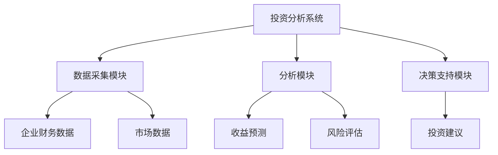

                 


# 巴菲特-芒格的共享经济投资：新商业模式的潜力

---

## 关键词

- 巴菲特投资策略
- 芮格思维模型
- 共享经济
- 价值投资
- 数学模型
- 系统架构

---

## 摘要

本文探讨了巴菲特和芒格在共享经济领域的投资策略，分析了共享经济的商业模式及其潜力。通过结合价值投资、多元思维模型和数学建模等方法，本文为投资者提供了深入的分析框架和实战指导。文章从背景介绍、投资理念、商业模式分析、投资案例、数学模型、系统架构到项目实战，层层展开，为读者提供了全面的视角和实用的工具。

---

## 第一部分：背景介绍

### 第1章：共享经济的定义与起源

#### 1.1 共享经济的定义

共享经济是一种通过数字化平台将闲置资源进行共享的商业模式。其核心在于利用技术手段匹配供需，降低资源浪费，创造新的经济价值。

#### 1.2 巴菲特与芒格的背景介绍

- **巴菲特的投资理念**：巴菲特以价值投资闻名，强调购买具有持续竞争优势的企业，关注企业的内在价值。
- **芒格的思维方式**：芒格倡导多元思维模型，强调通过跨学科思考来做出明智的投资决策。
- **合作历程**：巴菲特和芒格的合作始于1951年，芒格加入巴菲特的合伙企业后，两人共同创立了伯克希尔哈撒韦公司。

---

## 第二部分：巴菲特和芒格的投资理念

### 第2章：巴菲特的价值投资策略

#### 2.1 价值投资的核心原则

- **安全边际**：巴菲特强调以低于内在价值的价格买入股票，确保投资的安全性。
- **长期思维**：关注企业的长期价值，而非短期波动。
- **竞争优势**：投资具有强大护城河的企业。

#### 2.2 芮格的多元思维模型

- **思维模型的多样性**：芒格认为，通过学习多个领域的知识，可以更好地理解问题的本质。
- **模型的相互验证**：通过不同模型的交叉验证，提高决策的准确性。

---

## 第三部分：共享经济的商业模式分析

### 第3章：共享经济的商业模式

#### 3.1 共享经济的定义与特征

- **定义**：共享经济通过平台将资源所有者与需求者连接起来，实现资源的高效利用。
- **特征**：去中心化、按需分配、技术驱动。

#### 3.2 成功要素

- **用户需求匹配**：平台需精准匹配供需双方的需求。
- **技术支持**：依赖大数据和人工智能技术实现资源分配。
- **信任机制**：建立用户之间的信任体系。

---

## 第四部分：巴菲特和芒格对共享经济的投资分析

### 第4章：巴菲特和芒格的投资案例

#### 4.1 巴菲特对共享经济的投资案例

- **案例分析**：巴菲特对可口可乐的投资，体现了他对企业护城河和长期价值的关注。
- **分析框架**：通过财务指标、竞争优势和管理层能力评估企业。

#### 4.2 芮格对共享经济的投资案例

- **案例分析**：芒格对富国银行的投资，体现了他对风险管理和多元思维模型的应用。
- **分析框架**：通过跨学科视角分析企业的潜在风险和机会。

---

## 第五部分：数学模型与算法

### 第5章：共享经济的数学模型

#### 5.1 收益预测模型

- **模型定义**：基于历史数据和市场趋势预测共享经济企业的收益。
- **数学公式**：
  $$ \text{收益预测} = \alpha \times \text{市场需求} + \beta \times \text{供给能力} $$
- **代码实现**：使用Python中的ARIMA模型进行时间序列分析。

#### 5.2 风险评估模型

- **模型定义**：评估共享经济企业面临的风险因素。
- **数学公式**：
  $$ \text{风险评分} = \sum_{i=1}^{n} w_i \times r_i $$
- **代码实现**：使用决策树算法进行风险分类。

---

## 第六部分：系统架构设计

### 第6章：共享经济投资分析系统

#### 6.1 系统功能设计

- **数据采集模块**：采集共享经济企业的财务数据和市场数据。
- **分析模块**：利用多元模型和数学算法进行投资分析。
- **决策支持模块**：提供投资建议和风险预警。

#### 6.2 系统架构图



---

## 第七部分：项目实战

### 第7章：共享经济投资实战分析

#### 7.1 项目选择

- **案例选择**：滴滴出行。
- **数据采集**：收集滴滴的财务数据和市场数据。

#### 7.2 投资分析

- **收益预测**：使用ARIMA模型预测滴滴的未来收益。
- **风险评估**：利用决策树算法评估滴滴的风险因素。

#### 7.3 代码实现

```python
from statsmodels.tsa.arima.model import ARIMA
import pandas as pd

# 加载数据
data = pd.read_csv('滴滴收益.csv')

# 建模
model = ARIMA(data['收益'], order=(5, 1, 0))
model_fit = model.fit()

# 预测
forecast = model_fit.forecast(steps=5)
print(forecast)
```

---

## 第八部分：总结与展望

### 第8章：总结与展望

#### 8.1 总结

本文通过分析巴菲特和芒格的投资理念，结合共享经济的商业模式，构建了数学模型和系统架构，为投资者提供了实战指导。

#### 8.2 投资建议

- 关注企业的竞争优势和长期价值。
- 运用多元思维模型和数学模型进行投资分析。

#### 8.3 未来研究方向

- 进一步完善数学模型，引入更多数据源。
- 探讨人工智能在共享经济投资中的应用。

---

## 作者信息

作者：AI天才研究院/AI Genius Institute & 禅与计算机程序设计艺术 /Zen And The Art of Computer Programming

---

以上是完整的目录和内容框架，涵盖了从理论到实践的各个方面，为读者提供了全面的视角和实用的工具。

