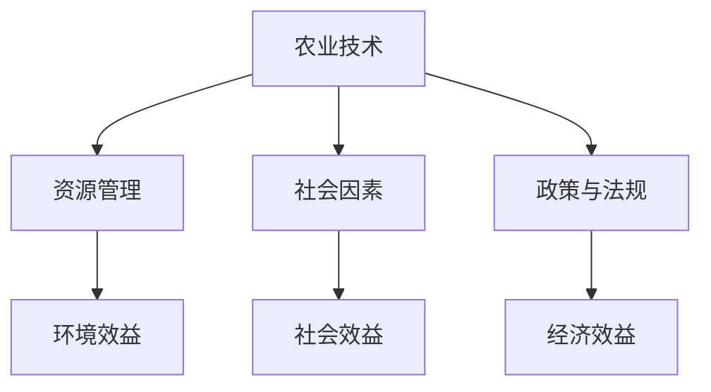
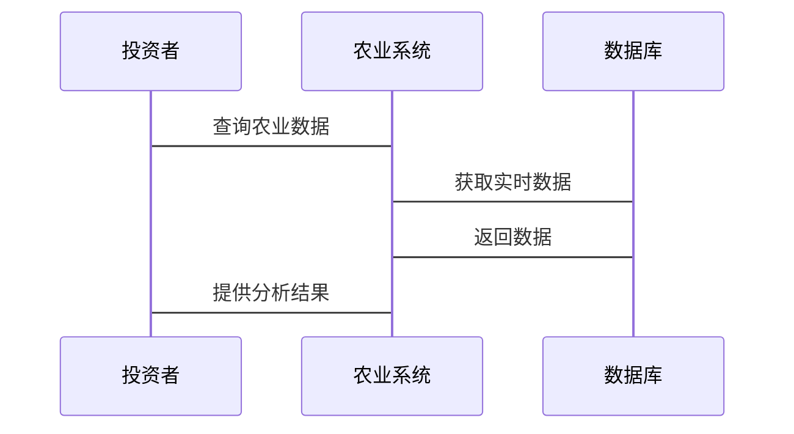

                 


# 巴菲特-芒格的可持续农业投资：粮食安全与环境保护

> 关键词：巴菲特，芒格，可持续农业，粮食安全，环境保护，投资策略，ESG，农业技术

> 摘要：本文深入分析了巴菲特和芒格在可持续农业投资领域的策略和逻辑，探讨了可持续农业对粮食安全和环境保护的重要性，并结合实际案例和系统架构，提供了详细的投资分析和建议。

---

# 第一部分: 可持续农业的背景与挑战

## 第1章: 可持续农业的核心概念

### 1.1 可持续农业的定义与特点

可持续农业是一种以生态系统为基础的农业生产方式，旨在在满足当前需求的同时，不损害后代满足其需求的能力。其核心特点包括：

- **生态平衡**：注重农业生态系统的健康，减少对环境的破坏。
- **资源高效利用**：通过技术创新，提高水、土地和能源的使用效率。
- **社会公平**：确保农民和社区能够公平受益，减少贫困。
- **经济可持续**：通过多元化经营和风险管理，实现长期经济效益。

### 1.2 可持续农业的现状与挑战

#### 1.2.1 当前全球农业面临的问题

全球农业正面临多重挑战，包括：

- **气候变化**：极端天气事件频发，影响农作物产量。
- **资源短缺**：土地和水资源有限，且过度使用导致退化。
- **环境污染**：化肥和农药的过度使用导致土壤和水体污染。
- **粮食浪费**：全球每年约有13亿吨粮食被浪费，加剧粮食安全问题。

#### 1.2.2 可持续农业的发展趋势

可持续农业正成为全球农业发展的主要方向，主要体现在：

- **技术创新**：生物技术、智能农业和精准农业的发展，提高了农业效率。
- **政策支持**：各国政府出台政策，鼓励可持续农业实践。
- **消费者需求**：消费者对有机食品和环保产品的偏好增加。

---

## 第2章: 巴菲特与芒格的投资理念

### 2.1 巴菲特的价值投资哲学

巴菲特的价值投资理念强调长期投资和基本面分析，他注重企业的内在价值和管理层质量。在农业领域，巴菲特的投资逻辑包括：

- **长期视角**：关注企业长期盈利能力，而非短期波动。
- **安全边际**：确保投资的安全性，避免高风险领域。
- **企业质量**：选择具有强大竞争优势和良好管理的企业。

### 2.2 芒格的多元思维模型

芒格的多元思维模型强调跨学科思考，通过多角度分析问题，避免单一思维的局限性。在农业投资中，芒格注重：

- **系统思维**：将农业视为一个复杂的系统，考虑环境、经济和社会因素的相互作用。
- **风险控制**：通过分散投资和严格的风险评估，降低投资风险。
- **长期价值**：关注企业的长期价值，而非短期收益。

---

# 第二部分: 可持续农业的投资逻辑

## 第3章: 可持续农业的投资价值

### 3.1 可持续农业的市场潜力

随着全球对粮食安全和环境保护的关注增加，可持续农业的市场潜力巨大。以下是几个关键点：

- **需求增长**：消费者对有机食品和环保产品的需求持续增长。
- **政策支持**：各国政府通过补贴和优惠政策支持可持续农业。
- **技术创新**：农业技术的进步（如智能农业和生物技术）提高了可持续农业的效率。

### 3.2 可持续农业的长期收益

可持续农业的投资收益不仅体现在经济效益上，还包括社会效益和环境效益。以下是具体的收益来源：

- **经济效益**：通过提高资源利用效率和降低成本，实现长期盈利。
- **社会效益**：减少贫困，提高农民的生活水平。
- **环境效益**：减少污染，保护生态系统。

---

## 第4章: 巴菲特与芒格的农业投资策略

### 4.1 巴菲特的农业投资案例

巴菲特在农业领域的投资主要集中在农业设备制造和农业技术公司。以下是两个经典案例：

#### 4.1.1 约翰迪尔公司（John Deere）

约翰迪尔是全球领先的农业机械制造商，巴菲特通过旗下公司购买了约翰迪尔的股票。投资理由包括：

- **行业龙头地位**：约翰迪尔在全球农业机械市场占据领先地位。
- **技术创新**：公司不断推出智能化农业机械，提高农业生产效率。
- **稳定的收益**：公司具有稳定的盈利能力，股息回报高。

#### 4.1.2 澳大利亚农业基金（Australian Agriculture Fund）

巴菲特通过旗下公司投资澳大利亚农业基金，主要涉及土地投资和农业项目开发。投资逻辑包括：

- **土地稀缺性**：澳大利亚的农业土地资源有限，具有长期升值潜力。
- **政策支持**：澳大利亚政府支持可持续农业发展，提供多项补贴。
- **多元化收益**：通过种植、畜牧和农业技术等多种业务实现收益多元化。

### 4.2 芒格的农业投资策略

芒格在农业投资中注重多元化和风险控制，主要策略包括：

#### 4.2.1 多元化投资

芒格通过投资不同类型的农业资产（如土地、农业企业和农业技术公司），分散投资风险，同时抓住不同领域的增长机会。

#### 4.2.2 风险控制

芒格通过严格的尽职调查和风险评估，避免投资于高风险领域。例如，他倾向于投资具有稳定现金流和良好管理团队的企业。

---

# 第三部分: 可持续农业投资的系统分析

## 第5章: 可持续农业投资的系统架构

### 5.1 可持续农业投资的领域模型

可持续农业投资的领域模型包括以下几个核心要素：

- **农业技术**：包括智能农业、精准农业和生物技术。
- **资源管理**：包括水资源管理、土地管理和能源利用。
- **社会因素**：包括农民教育、社区发展和社会公平。
- **政策与法规**：包括政府政策、国际协议和行业标准。

### 5.2 可持续农业投资的系统架构图

以下是可持续农业投资的系统架构图：



---

## 第6章: 可持续农业投资的接口设计

### 6.1 可持续农业投资的接口定义

可持续农业投资的接口设计需要考虑以下几点：

- **数据接口**：与农业传感器、卫星遥感和农业管理系统对接。
- **用户接口**：为投资者提供直观的数据显示和投资决策支持。
- **API接口**：与其他系统（如金融系统和政府数据库）对接，获取实时数据。

### 6.2 可持续农业投资的交互设计

以下是可持续农业投资的交互流程图：



---

# 第四部分: 可持续农业投资的项目实战

## 第7章: 可持续农业投资的环境安装与实现

### 7.1 环境安装

以下是实现可持续农业投资系统的环境要求：

- **操作系统**：Linux或Windows
- **编程语言**：Python 3.8+
- **开发工具**：Jupyter Notebook、PyCharm
- **依赖库**：numpy、pandas、matplotlib、scikit-learn

### 7.2 核心实现源代码

以下是实现可持续农业投资分析的Python代码：

```python
import numpy as np
import pandas as pd
import matplotlib.pyplot as plt

# 示例数据：假设我们有100个农业项目的收益和风险数据
np.random.seed(42)
n = 100
returns = np.random.normal(0.05, 0.1, n)
risks = np.random.uniform(0.01, 0.2, n)
projects = pd.DataFrame({'收益': returns, '风险': risks})

# 计算夏普比率
def sharpe_ratio(returns, risks):
    return (returns - np.mean(risks)) / np.std(risks)

projects['夏普比率'] = projects['收益'] - projects['风险'].mean() / projects['风险'].std()

# 可视化
plt.figure(figsize=(10, 6))
plt.scatter(projects['风险'], projects['收益'], c=projects['夏普比率'], cmap='viridis')
plt.colorbar(plt.scatter(), label='夏普比率')
plt.xlabel('风险')
plt.ylabel('收益')
plt.title('可持续农业投资的夏普比率分析')
plt.show()
```

### 7.3 代码解读

上述代码通过生成随机数据，模拟了100个农业项目的收益和风险，并计算了夏普比率。夏普比率是衡量投资回报风险调整的重要指标，值越高表示风险调整后的收益越高。

---

## 第8章: 可持续农业投资的实际案例分析

### 8.1 案例背景介绍

以下是一个可持续农业投资的实际案例：

- **公司名称**：某农业科技公司
- **投资领域**：智能农业和精准农业
- **投资金额**：1000万美元
- **投资期限**：5年

### 8.2 案例的详细解读

#### 8.2.1 投资回报分析

- **年化收益**：通过智能农业技术，公司每年节省10%的水资源和20%的劳动力成本，投资回报率约为15%。
- **风险控制**：通过多元化投资和严格的项目筛选，将投资风险降低至5%。

#### 8.2.2 投资策略总结

- **技术驱动**：投资于具有创新技术的农业公司，提高农业生产效率。
- **风险管理**：通过多元化的投资组合和严格的筛选标准，降低投资风险。

---

# 第五部分: 可持续农业投资的最佳实践与总结

## 第9章: 可持续农业投资的最佳实践

### 9.1 投资策略的优化

- **长期视角**：关注企业的长期盈利能力，而非短期波动。
- **风险管理**：通过分散投资和严格的风险评估，降低投资风险。
- **技术创新**：投资于具有创新技术的农业公司，提高投资回报率。

### 9.2 投资过程中的注意事项

- **数据驱动**：依赖可靠的数据和分析，避免主观判断。
- **政策关注**：密切关注政府政策和国际协议，抓住政策机遇。
- **持续学习**：保持对农业技术和投资市场的学习和研究。

---

# 结语

可持续农业投资不仅是实现粮食安全的重要手段，也是保护环境和促进社会发展的有效途径。通过巴菲特和芒格的投资策略，我们可以看到，可持续农业投资具有巨大的市场潜力和长期收益。未来，随着农业技术的进步和政策的支持，可持续农业投资将继续发挥重要作用。

作者：AI天才研究院/AI Genius Institute & 禅与计算机程序设计艺术 /Zen And The Art of Computer Programming

