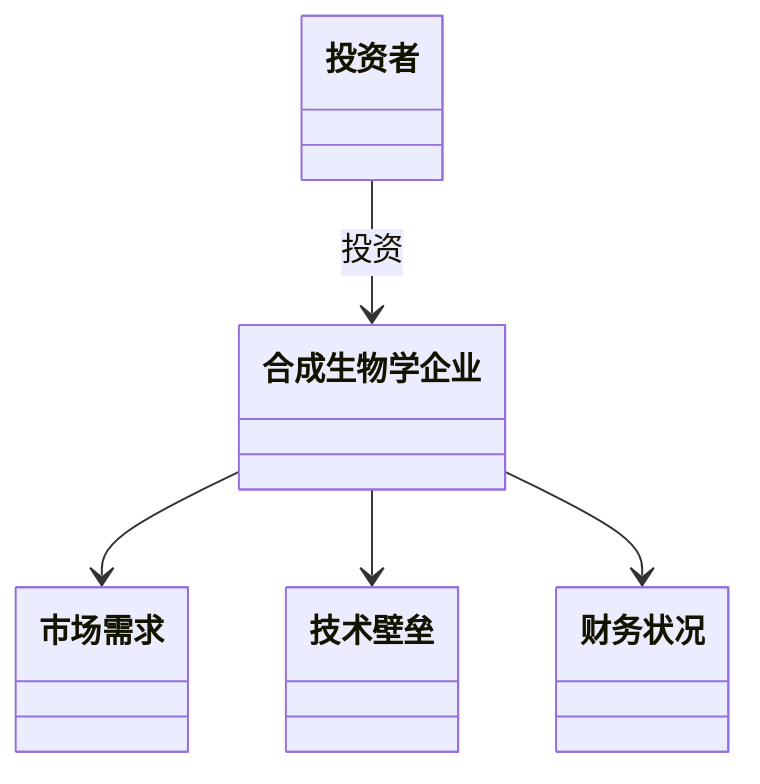

                 

# 巴菲特-芒格的合成生物学投资：生命编程的产业化

> 关键词：合成生物学，巴菲特，芒格，投资策略，产业应用，风险管理

> 摘要：本文探讨了巴菲特和芒格的投资理念如何应用于合成生物学的产业化，分析了合成生物学的核心概念、投资机会、策略及风险管理，通过案例分析展示了如何将生命科学与投资策略相结合。

---

## 第1章：合成生物学与巴菲特-芒格投资理念的背景

### 1.1 合成生物学的核心概念

#### 1.1.1 合成生物学的定义
合成生物学是通过工程学原则设计和构建新的生物系统，或对现有生物系统进行重新设计，以实现特定功能。它结合了基因工程、系统生物学和生物信息学，旨在解决复杂的现实问题。

#### 1.1.2 合成生物学的核心要素
- **模块化设计**：将生物系统分解为功能模块，便于重新组合和优化。
- **标准化组件**：使用标准生物模块，如基因电路，促进组件的互操作性。
- **自动化工具**：利用自动化技术进行设计、合成和测试，提高效率。

#### 1.1.3 合成生物学的演进历程
合成生物学起源于20世纪末，经历了从基础研究到应用开发的演变，近年来随着技术进步，应用领域不断扩展。

### 1.2 巴菲特与芒格的投资理念

#### 1.2.1 巴菲特的价值投资原则
巴菲特倡导寻找具有持续竞争优势和良好治理的企业，长期投资，注重企业的内在价值。

#### 1.2.2 芒格的多元思维模型
芒格强调跨学科思维，将多个领域的知识结合起来，形成决策依据，避免单一思维的局限性。

#### 1.2.3 投资理念的结合
巴菲特和芒格的理念强调长期价值和跨学科分析，适用于合成生物学的投资评估。

---

## 第2章：合成生物学的核心概念与技术

### 2.1 合成生物学的关键技术

#### 2.1.1 基因编辑技术
- **CRISPR-Cas9**：用于精确修改基因组，是合成生物学的重要工具。
- **Homology-directed repair (HDR)**：另一种基因编辑方法，用于复杂修复。

#### 2.1.2 合成基因回路
- **逻辑门**：如与门、或门，用于构建复杂的基因调控网络。
- **振荡器**：用于动态基因表达控制。

#### 2.1.3 自动化合成平台
- **DNA合成**：高通量合成技术，降低成本，提高效率。
- **AI辅助设计**：利用机器学习优化生物设计。

### 2.2 合成生物学的应用领域

#### 2.2.1 医药与健康
- **药物开发**：合成生物用于生产复杂药物分子，如抗癌药。
- **生物诊断**：开发新型诊断工具，如COVID-19检测。

#### 2.2.2 化工与材料
- **生物基材料**：生产可降解塑料，减少环境影响。
- **化学品合成**：利用合成菌株生产高附加值化学品。

#### 2.2.3 能源与环保
- **生物燃料**：生产可持续能源，如乙醇和生物柴油。
- **污染治理**：利用合成生物降解污染物。

---

## 第3章：巴菲特-芒格投资理念在合成生物学中的应用

### 3.1 投资理念的核心要素

#### 3.1.1 长期价值投资
关注企业的长期潜力，而非短期波动。

#### 3.1.2 股东价值最大化
投资那些能持续为股东创造价值的企业。

#### 3.1.3 风险管理
分散投资，避免过度集中风险。

### 3.2 合成生物学企业的投资评估

#### 3.2.1 企业的技术壁垒
评估企业的技术专利、研发团队和创新能力。

#### 3.2.2 市场需求
分析合成产品的市场规模和增长潜力。

#### 3.2.3 财务状况
考察企业的盈利能力、现金流和资本结构。

---

## 第4章：合成生物学投资的系统分析与架构设计

### 4.1 系统分析

#### 4.1.1 问题场景
合成生物学投资涉及技术、市场和政策多重因素，需系统性分析。

#### 4.1.2 系统功能设计
- **需求分析模块**：识别投资机会。
- **风险评估模块**：量化潜在风险。
- **决策支持模块**：提供投资建议。

#### 4.1.3 领域模型（Mermaid类图）

### 4.2 系统架构设计

#### 4.2.1 架构设计（Mermaid架构图）

#### 4.2.2 关键接口
- **数据接口**：获取企业数据和市场信息。
- **决策接口**：输出投资建议。

---

## 第5章：合成生物学投资策略与风险管理

### 5.1 投资策略

#### 5.1.1 核心策略
- **价值投资**：寻找具有长期竞争优势的企业。
- **分散投资**：降低行业风险。

#### 5.1.2 投资模型
- **现金流分析**：评估企业的盈利能力和成长性。
- **情景分析**：预测不同市场条件下的表现。

### 5.2 风险管理

#### 5.2.1 风险识别
- **技术风险**：技术失败或被替代的风险。
- **市场风险**：市场需求变化的风险。

#### 5.2.2 风险量化
- **VaR模型**：计算潜在损失。
- **压力测试**：评估极端情况下的表现。

---

## 第6章：合成生物学投资的实战案例

### 6.1 案例分析

#### 6.1.1 案例选择
选择一家合成生物学企业，分析其投资价值。

#### 6.1.2 数据分析
使用财务指标和市场数据进行评估。

#### 6.1.3 投资决策
基于分析结果，制定投资策略。

### 6.2 投资总结

#### 6.2.1 成功经验
长期价值投资和风险管理的重要性。

#### 6.2.2 展望
合成生物学的未来潜力和投资机会。

---

## 作者信息

作者：AI天才研究院/AI Genius Institute & 禅与计算机程序设计艺术 /Zen And The Art of Computer Programming

---

**本文版权归作者所有，未经授权不得转载。**

