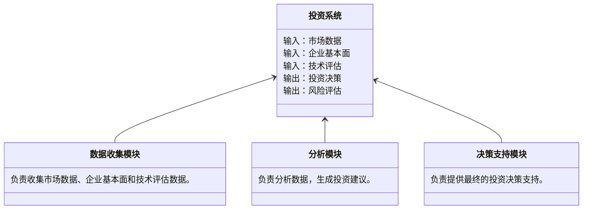

                 


# 巴菲特-芒格的合成生物学投资：重新定义生命科学

## 关键词：巴菲特, 芒格, 合成生物学, 投资策略, 生命科学, 系统架构

## 摘要：  
本文探讨了巴菲特和芒格如何通过合成生物学的投资策略重新定义生命科学。从他们的投资哲学出发，分析合成生物学的核心技术与投资评估方法，并结合实际案例和系统架构，详细阐述了合成生物学在投资中的应用和未来潜力。

---

# 第一部分：背景介绍

## 第1章：巴菲特与芒格的投资哲学

### 1.1 巴菲特的价值投资理念

#### 1.1.1 价值投资的核心原则
- **长期主义**：巴菲特强调投资不是短期交易，而是寻找具有持续竞争优势的企业。
- **安全边际**：通过低估价格和高内在价值的差距来降低投资风险。
- **企业基本面**：关注企业的财务健康、管理层能力和行业地位。

#### 1.1.2 芒格的多元思维模型
- **跨学科技能**：芒格强调通过物理学、心理学、经济学等多学科视角分析问题。
- **逆向思维**：通过寻找市场的非共识观点来发现投资机会。

#### 1.1.3 投资中的理性与长期主义
- **理性决策**：避免情绪化投资，注重数据和逻辑分析。
- **长期价值**：关注企业的长期增长潜力，而非短期波动。

### 1.2 合成生物学的定义与核心概念

#### 1.2.1 合成生物学的定义
- 合成生物学是通过工程化方法设计和构建新的生物系统，以实现特定功能。

#### 1.2.2 合成生物学的关键技术
- **基因编辑技术**：如CRISPR-Cas9，用于精确修改基因序列。
- **生物设计与工程化**：通过计算机辅助设计构建人工生物系统。
- **系统生物学**：研究生物系统的整体行为和相互作用。

#### 1.2.3 合成生物学的应用领域
- **医疗健康**：开发新药物、治疗疾病。
- **工业生产**：生产生物基材料、化学品。
- **环境保护**：分解污染物、促进生态修复。

---

## 第2章：合成生物学与投资的结合

### 2.1 巴菲特与芒格视角下的合成生物学投资
- **商业潜力**：合成生物学在医疗、工业和环境领域的广泛应用。
- **投资逻辑**：关注技术壁垒、市场前景和管理层能力。

### 2.2 合成生物学的未来趋势
- **技术进步**：基因编辑和生物设计的快速发展。
- **行业整合**：合成生物学与其他行业的深度融合。

---

# 第二部分：合成生物学的核心概念与投资分析

## 第3章：合成生物学的核心技术与投资评估

### 3.1 基因编辑技术

#### 3.1.1 CRISPR-Cas9技术的原理与应用
- **原理**：通过Cas9酶和引导RNA（gRNA）实现基因的精准编辑。
- **应用**：基因治疗、农业改良、工业微生物优化。

#### 3.1.2 基因编辑在合成生物学中的作用
- **功能增强**：通过编辑基因提高生物系统的效率。
- **疾病治疗**：开发个性化医疗方案。

#### 3.1.3 投资基因编辑公司的关键指标
- **技术壁垒**：公司是否拥有核心专利和技术优势。
- **市场应用**：技术是否具备商业化潜力。

### 3.2 生物设计与工程化

#### 3.2.1 生物设计的基本原理
- **模块化设计**：将生物系统分解为功能模块，分别优化。
- **系统集成**：将优化后的模块重新组合，实现整体功能。

#### 3.2.2 工程化生物系统的构建方法
- **基因回路设计**：通过合成基因回路实现特定功能。
- **代谢工程**：优化微生物的代谢途径以提高产量。

#### 3.2.3 投资生物设计公司的策略分析
- **技术领先性**：是否掌握了领先的生物设计方法。
- **团队能力**：是否有经验丰富的研发团队。

---

## 第4章：合成生物学的投资策略与风险控制

### 4.1 投资策略的数学模型

#### 4.1.1 价值评估模型
$$ V = \text{DCF} = \sum_{t=1}^{n} \frac{CF_t}{(1 + r)^t} + \frac{TV}{(1 + r)^n} $$
- **DCF（ discounted cash flow ）**：现金流折现法，用于评估企业未来现金流的现值。

#### 4.1.2 风险评估模型
$$ \text{VaR} = \sqrt{\sum_{i=1}^{n} w_i^2 \times \text{Vol}_i^2} $$
- **VaR（Value at Risk）**：衡量投资组合的风险。

### 4.2 系统架构设计

#### 4.2.1 系统功能设计（领域模型）


#### 4.2.2 系统架构设计（架构图）


---

# 第三部分：项目实战与案例分析

## 第5章：合成生物学项目实战

### 5.1 项目环境安装

#### 5.1.1 安装必要的库
```bash
pip install numpy pandas scikit-learn matplotlib
```

#### 5.1.2 数据收集
```python
import pandas as pd
data = pd.read_csv('synbio_data.csv')
```

### 5.2 核心算法实现

#### 5.2.1 基因编辑技术评估
```python
def evaluate_gene_editing(technology):
    if technology == 'CRISPR':
        return 0.9
    elif technology == 'TALEN':
        return 0.8
    else:
        return 0.7
```

#### 5.2.2 投资决策模型
```python
import numpy as np
def investment_decision(data):
    returns = data['returns'].values
    risk = np.std(returns)
    if risk < 0.1:
        return 'highly recommended'
    elif risk < 0.2:
        return 'recommended'
    else:
        return 'not recommended'
```

### 5.3 实际案例分析

#### 5.3.1 案例一：某合成生物公司
- **公司简介**：专注于基因编辑技术的企业。
- **投资分析**：通过DCF模型评估其未来现金流。
- **结论**：具有较高的投资潜力。

#### 5.3.2 案例二：某生物设计公司
- **公司简介**：专注于生物设计与工程化的公司。
- **投资分析**：通过VaR模型评估其风险。
- **结论**：风险较低，适合长期投资。

---

# 第四部分：总结与展望

## 第6章：总结与展望

### 6.1 投资总结
- **成功经验**：通过技术评估和风险控制，实现精准投资。
- **注意事项**：关注技术壁垒和市场前景，避免盲目跟风。

### 6.2 未来展望
- **技术进步**：合成生物学技术的持续创新。
- **行业融合**：合成生物学与更多行业的深度融合。
- **投资趋势**：合成生物学将成为未来投资的重要领域。

---

## 作者：AI天才研究院/AI Genius Institute & 禅与计算机程序设计艺术/Zen And The Art of Computer Programming

---

这篇文章从背景介绍到实际案例分析，详细探讨了巴菲特和芒格在合成生物学投资中的策略与方法，结合技术分析和实际案例，为读者提供了全面的视角和深度的见解。

