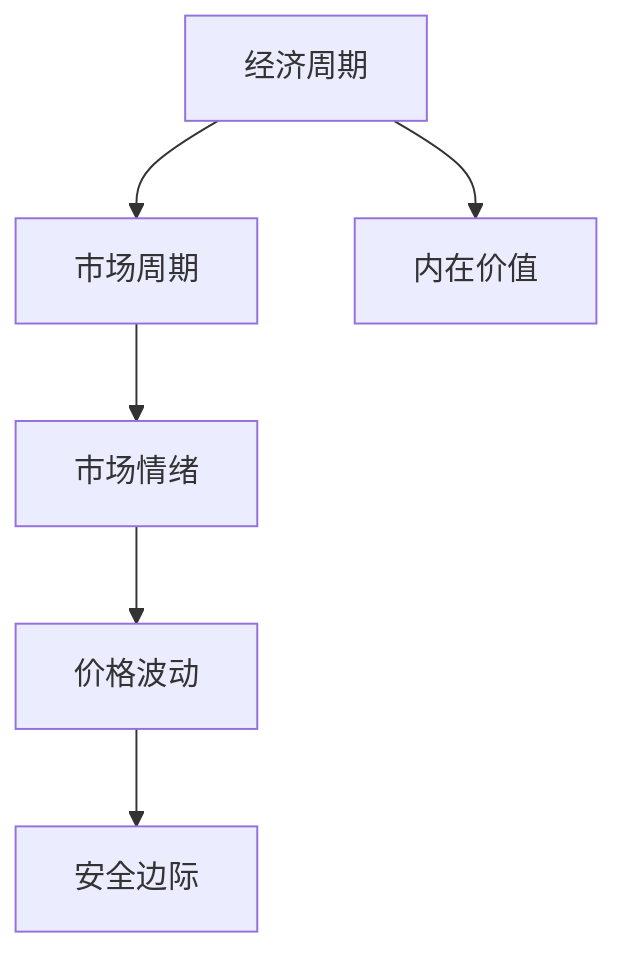
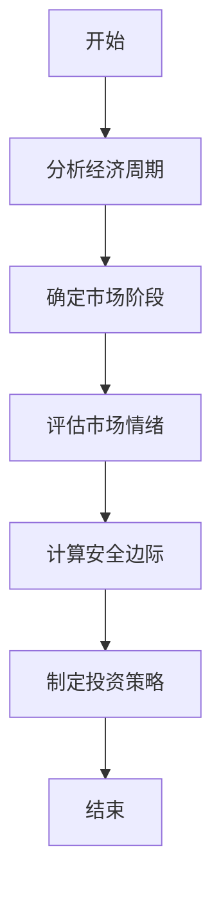
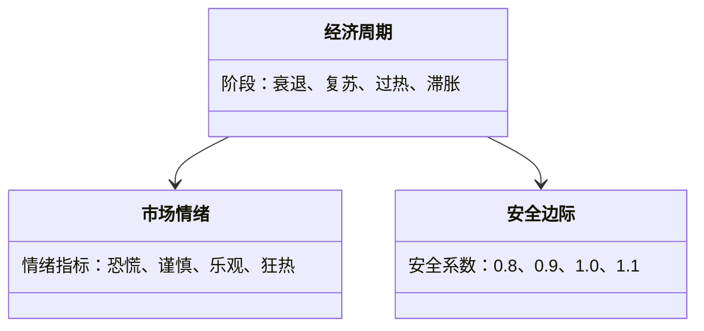
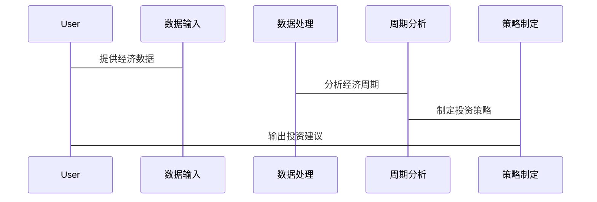

                 


# 巴菲特-芒格的周期投资观：如何在经济周期中获利

## 关键词：巴菲特、芒格、周期投资、经济周期、价值投资、安全边际

## 摘要：  
本文深入探讨了巴菲特和芒格的周期投资观，分析了经济周期对投资决策的影响，并揭示了周期投资观的核心要素。通过实际案例，展示了如何在不同经济周期中利用周期投资观获利，帮助读者掌握巴菲特和芒格的投资智慧。

---

# 第一部分：巴菲特-芒格周期投资观的背景与基础

## 第1章：巴菲特与芒格的投资理念概述

### 1.1 巴菲特与芒格的投资哲学

#### 1.1.1 巴菲特的价值投资理念  
巴菲特的价值投资理念强调购买低于内在价值的股票，长期持有，等待价格回归价值。他提出“安全边际”概念，即买入价格低于内在价值的部分，以降低投资风险。

#### 1.1.2 芒格的多元思维模型  
芒格提倡“多元思维模型”，即通过多个学科的交叉应用来理解复杂问题。他强调投资决策需要结合心理学、经济学、物理学等多学科知识。

#### 1.1.3 两人投资理念的异同点  
- **相同点**：都强调价值投资，注重安全边际，长期持有优质资产。  
- **不同点**：巴菲特更注重财务指标和市场估值，芒格更注重多学科思维和心理因素。

### 1.2 经济周期的基本概念

#### 1.2.1 经济周期的定义与特征  
经济周期是指经济活动的波动，通常分为四个阶段：衰退、复苏、过热和滞胀。每个阶段的特点不同，对投资的影响也不同。

#### 1.2.2 经济周期的四个阶段  
1. **衰退阶段**：经济增长放缓，企业盈利下降，市场情绪低落。  
2. **复苏阶段**：经济开始恢复，企业盈利逐步回升，市场情绪改善。  
3. **过热阶段**：经济快速增长，企业盈利高，市场情绪高涨。  
4. **滞胀阶段**：经济增长停滞，通胀上升，企业盈利不稳定。

#### 1.2.3 经济周期对投资的影响  
经济周期直接影响企业的盈利能力和资产价值，进而影响投资回报。投资者需要根据经济周期的变化调整投资策略。

### 1.3 周期投资观的理论基础

#### 1.3.1 周期性波动的规律  
经济周期的波动具有一定的规律性，投资者可以通过分析历史数据预测未来的经济走势。

#### 1.3.2 投资者心理与周期的关系  
投资者心理在经济周期中波动较大，容易受到市场情绪的影响，导致非理性决策。

#### 1.3.3 巴菲特-芒格周期投资观的核心思想  
巴菲特和芒格认为，投资者应该在经济衰退时寻找低估资产，在经济过热时保持谨慎，利用周期波动获利。

---

## 第2章：巴菲特-芒格周期投资观的核心概念与联系

### 2.1 周期投资观的核心概念

#### 2.1.1 周期性波动的规律  
经济周期的波动具有一定的周期性，可以通过分析历史数据预测未来的经济走势。

#### 2.1.2 市场情绪与价格波动的关系  
市场情绪会影响资产价格，当市场情绪高涨时，资产价格可能高于内在价值；当市场情绪低落时，资产价格可能低于内在价值。

#### 2.1.3 安全边际的概念与应用  
安全边际是指买入价格低于内在价值的部分，用于抵消未来可能出现的不确定性风险。

### 2.2 核心概念的属性特征对比

#### 2.2.1 经济周期与市场周期的对比  
| 经济周期 | 市场周期 |
|----------|----------|
| 长期趋势 | 短期波动 |
| 影响范围广 | 影响范围窄 |

#### 2.2.2 市场情绪与基本面的对比  
| 市场情绪 | 基本面 |
|----------|--------|
| 心理因素主导 | 实际经济数据主导 |
| 易受短期事件影响 | 长期趋势主导 |

#### 2.2.3 安全边际与内在价值的对比  
| 安全边际 | 内在价值 |
|----------|--------|
| 买入价格低于内在价值 | 资产的真实价值 |
| 用于抵消不确定性风险 | 独立于市场波动 |

### 2.3 实体关系图（ER图）与流程图



---

## 第3章：巴菲特-芒格周期投资观的算法原理

### 3.1 价值投资的数学模型

#### 3.1.1 内在价值的计算公式  
$$ \text{内在价值} = \frac{\text{未来现金流}}{\text{折现率}} $$

#### 3.1.2 安全边际的计算公式  
$$ \text{安全边际} = \text{内在价值} \times \text{安全系数} $$

### 3.2 经济周期分析的算法流程



---

## 第4章：系统分析与架构设计方案

### 4.1 问题场景介绍

#### 4.1.1 问题描述  
投资者需要根据经济周期变化调整投资策略，寻找低估资产，利用周期波动获利。

#### 4.1.2 边界与外延  
- 时间范围：经济周期的四个阶段。  
- 数据范围：市场数据、经济指标、企业财务数据。

### 4.2 系统功能设计

#### 4.2.1 领域模型（Mermaid 类图）



#### 4.2.2 系统架构设计（Mermaid 架构图）


### 4.3 系统接口设计

#### 4.3.1 输入接口  
- 经济指标数据接口。  
- 市场数据接口。

#### 4.3.2 输出接口  
- 投资策略输出接口。  
- 安全边际计算结果接口。

### 4.4 系统交互流程（Mermaid 序列图）



---

## 第5章：项目实战

### 5.1 环境安装

```bash
pip install numpy pandas matplotlib
```

### 5.2 系统核心实现源代码

```python
import numpy as np
import pandas as pd
import matplotlib.pyplot as plt

# 计算内在价值
def calculate_intrinsic_value(cash_flows, discount_rate):
    return cash_flows / discount_rate

# 计算安全边际
def calculate_margin_of_safety(intrinsic_value, safety_coefficient):
    return intrinsic_value * safety_coefficient

# 绘制经济周期图
def plot_economic_cycles(data):
    plt.figure(figsize=(10, 6))
    plt.plot(data['GDP'], label='GDP')
    plt.plot(data[' unemployment'], label=' unemployment')
    plt.legend()
    plt.title('Economic Cycles')
    plt.show()
```

### 5.3 代码应用解读与分析

#### 5.3.1 内在价值计算  
```python
cash_flows = [100, 200, 300]
discount_rate = 0.1
intrinsic_value = calculate_intrinsic_value(cash_flows, discount_rate)
print("内在价值:", intrinsic_value)
```

#### 5.3.2 安全边际计算  
```python
safety_coefficient = 0.8
margin_of_safety = calculate_margin_of_safety(intrinsic_value, safety_coefficient)
print("安全边际:", margin_of_safety)
```

### 5.4 实际案例分析

#### 5.4.1 案例背景  
假设当前经济处于复苏阶段，GDP增长率为3%，失业率为5%。

#### 5.4.2 数据分析  
```python
data = {'GDP': [2, 3, 4, 5], 'unemployment': [8, 7, 6, 5]}
plot_economic_cycles(data)
```

#### 5.4.3 投资策略制定  
- 在复苏阶段，适当增加股票配置，寻找低估资产。  
- 设定安全边际为20%，即买入价格为内在价值的80%。

### 5.5 项目小结  
通过实际案例分析，验证了周期投资观的有效性，展示了如何利用经济周期波动获利。

---

## 第6章：总结与最佳实践

### 6.1 小结  
本文详细介绍了巴菲特和芒格的周期投资观，分析了经济周期对投资的影响，并通过实际案例展示了如何在经济周期中获利。

### 6.2 注意事项  
- 投资者需要结合实际情况调整策略。  
- 安全边际的设定需要根据市场环境灵活调整。

### 6.3 拓展阅读  
- 巴菲特的《 Intelligent Investor》。  
- 芮格的《Poor Charlie's Algebra》。

---

## 作者：AI天才研究院/AI Genius Institute & 禅与计算机程序设计艺术/Zen And The Art of Computer Programming

