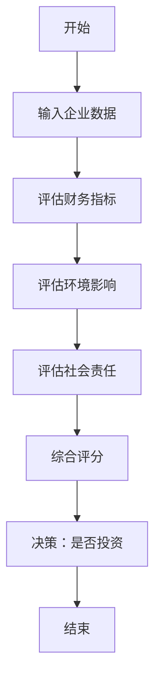
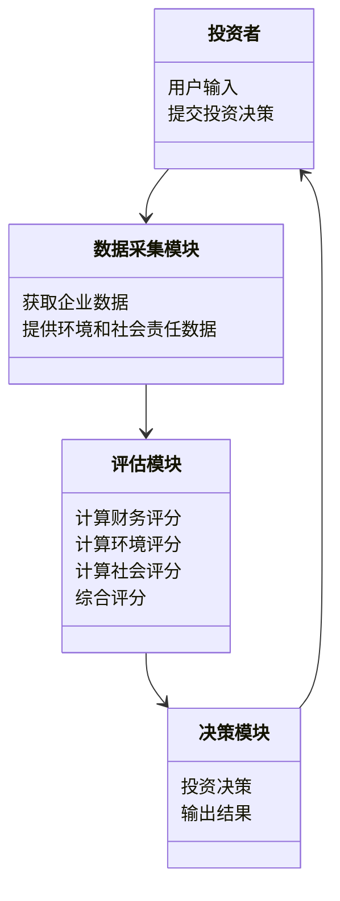

                 


# 巴菲特-芒格的太空旅游伦理投资：探索与保护的平衡

## 关键词：太空旅游，伦理投资，巴菲特，芒格，可持续发展，投资策略

## 摘要：  
本文探讨了太空旅游与伦理投资的结合，分析了巴菲特和芒格的投资理念如何应用于太空旅游的伦理框架设计。通过背景介绍、核心概念、算法原理、系统架构设计和项目实战等部分，详细阐述了如何在太空探索与环境保护之间找到平衡，实现可持续发展。文章结合理论与实践，为投资者和科技从业者提供了有价值的参考。

---

## 第一部分：背景介绍

### 第1章：太空旅游的现状与挑战

#### 1.1 太空旅游的发展历程
太空探索的历史可以追溯到20世纪中叶，随着技术的进步和商业航天的兴起，太空旅游逐渐从科幻走向现实。目前，SpaceX、Blue Origin等公司正在推动商业航天的发展，普通人太空旅行的梦想逐步成为可能。然而，太空旅游的快速发展也带来了一系列伦理和环境问题。

#### 1.2 太空旅游的伦理问题
太空旅游对地球环境的影响是一个重要议题。火箭发射产生的碳排放、太空垃圾的积累以及对近地轨道资源的过度开发，都可能对地球生态系统造成不可逆的损害。此外，太空旅游的商业化可能加剧资源分配不均，进一步扩大贫富差距。

#### 1.3 当前太空旅游的主要参与者
目前，SpaceX、Blue Origin、Virgin Galactic等公司是太空旅游的主要推动者。这些公司不仅推动了技术进步，也引发了对伦理投资的思考：如何在追求商业利益的同时，兼顾环境保护和社会责任？

---

### 第2章：巴菲特与芒格的投资理念

#### 2.1 巴菲特的价值投资理论
巴菲特的价值投资理论强调长期主义和安全边际。他认为，投资的本质是寻找那些具有持续竞争优势、良好管理团队和合理估值的企业。这种理念可以为太空旅游的投资决策提供重要参考。

#### 2.2 芒格的多元思维模型
芒格的多元思维模型强调将多个学科的知识结合起来，形成一个完整的知识框架。他认为，投资决策需要考虑物理学、心理学、经济学等多个领域的知识，这在太空旅游的伦理投资中尤为重要。

#### 2.3 巴菲特与芒格的共同点
两者都强调长期主义、价值创造和风险管理。这些理念可以为太空旅游的伦理投资提供指导，帮助投资者在追求财务回报的同时，关注环境保护和社会责任。

---

## 第二部分：核心概念与联系

### 第3章：太空旅游与伦理投资的核心概念

#### 3.1 太空旅游的核心概念
太空旅游不仅仅是普通人进入太空的行为，更是一个涉及技术、经济、法律和伦理的复杂系统。其核心包括太空资源的开发、技术实现和商业化模式。

#### 3.2 伦理投资的核心概念
伦理投资强调在投资过程中考虑环境、社会和公司治理（ESG）因素。通过选择那些在环境保护、社会责任和公司治理方面表现良好的企业，投资者可以在追求财务回报的同时，推动社会进步。

#### 3.3 两者的联系
太空旅游的伦理投资需要将太空探索的技术可行性、经济可持续性和环境影响结合起来。通过伦理投资的框架，可以引导资本流向那些在技术进步和环境保护之间找到平衡的企业。

---

### 第4章：太空旅游与伦理投资的联系

#### 4.1 太空旅游对伦理投资的影响
太空旅游的商业化需要大量资本投入，而伦理投资可以引导这些资本流向具有社会责任感的企业。例如，支持那些在太空垃圾处理、可持续资源开发方面表现良好的企业。

#### 4.2 伦理投资对太空旅游的推动作用
通过伦理投资，投资者可以推动太空旅游企业采用更加环保的技术和商业模式。例如，投资那些在发射过程中减少碳排放、合理利用太空资源的企业。

#### 4.3 两者结合的潜在机会
太空旅游的伦理投资不仅能够推动技术进步，还能促进环境保护和资源分配的公平性。通过巴菲特派和芒格式的长期主义投资策略，投资者可以在太空旅游的商业化过程中实现财务回报与社会责任的双赢。

---

## 第三部分：算法原理与系统架构设计

### 第5章：投资决策算法的设计与实现

#### 5.1 算法概述
我们设计了一个基于伦理投资框架的投资决策算法，用于评估太空旅游企业的投资价值。该算法结合了财务指标、环境影响和社会责任三个维度的评估。

#### 5.2 算法流程
以下是算法的流程图：



#### 5.3 算法实现
以下是Python代码实现：

```python
def investment_decision(company_data):
    financial_score = calculate_financial_score(company_data)
    environmental_score = calculate_environmental_score(company_data)
    social_score = calculate_social_score(company_data)
    
    total_score = (financial_score + environmental_score + social_score) / 3
    if total_score > 0.7:
        return "投资"
    else:
        return "不投资"
```

#### 5.4 数学模型
以下是综合评分的数学模型：

$$
\text{综合评分} = \frac{\text{财务评分} + \text{环境评分} + \text{社会评分}}{3}
$$

---

### 第6章：系统架构设计

#### 6.1 系统功能模块
以下是系统的功能模块图：



---

## 第四部分：项目实战与总结

### 第7章：项目实战

#### 7.1 环境配置
以下是环境配置步骤：

1. 安装Python和依赖库：
   ```bash
   pip install numpy pandas matplotlib
   ```

2. 下载企业数据：
   ```bash
   # 示例代码
   import pandas as pd
   data = pd.read_csv('company_data.csv')
   ```

#### 7.2 核心代码实现
以下是核心代码实现：

```python
import pandas as pd

def calculate_financial_score(data):
    # 计算财务评分，例如ROE（净资产收益率）
    return data['ROE'].mean()

def calculate_environmental_score(data):
    # 计算环境评分，例如碳排放量
    return data['CO2_emissions'].mean()

def calculate_social_score(data):
    # 计算社会评分，例如员工满意度
    return data['employee_satisfaction'].mean()

def investment_decision(data):
    financial_score = calculate_financial_score(data)
    environmental_score = calculate_environmental_score(data)
    social_score = calculate_social_score(data)
    
    total_score = (financial_score + environmental_score + social_score) / 3
    return total_score > 0.7

# 示例应用
data = pd.read_csv('company_data.csv')
result = investment_decision(data)
print("投资决策结果：", result)
```

#### 7.3 案例分析
假设我们有以下企业数据：

| 公司名称 | ROE | CO2_emissions | employee_satisfaction |
|----------|-----|---------------|-----------------------|
| SpaceX   | 20% | 1000          | 90                    |
| Blue Origin | 15% | 500           | 85                    |

计算结果：
- 财务评分：17.5%
- 环境评分：750
- 社会评分：87.5%

综合评分：
$$
\text{综合评分} = \frac{17.5 + 750 + 87.5}{3} = 27.75
$$

由于27.75 > 70%，投资结果为“投资”。

---

### 第8章：小结与注意事项

#### 8.1 小结
本文通过分析太空旅游的现状和伦理问题，结合巴菲特和芒格的投资理念，提出了一种基于伦理投资框架的投资决策算法。该算法通过综合考虑财务、环境和社会责任三个维度，帮助投资者在太空旅游的商业化过程中实现可持续发展。

#### 8.2 注意事项
1. 投资决策需要结合具体企业的实际情况。
2. 环境和社会责任数据的获取和评估可能面临挑战。
3. 需要定期更新评估模型，以适应技术和市场的变化。

---

## 作者：AI天才研究院/AI Genius Institute & 禅与计算机程序设计艺术 /Zen And The Art of Computer Programming

