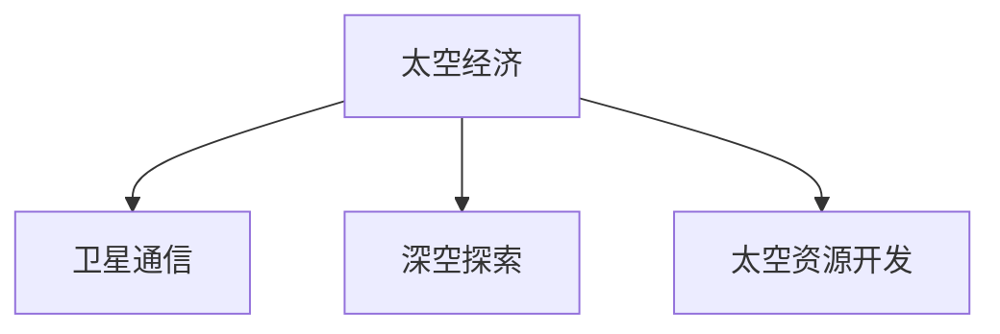
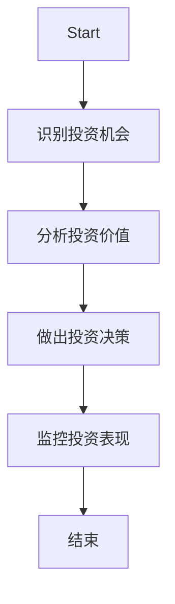

                 


# 巴菲特-芒格的太空经济投资：未来前沿的潜力

> 关键词：巴菲特，芒格，太空经济，投资策略，未来趋势

> 摘要：本文探讨了巴菲特和芒格在太空经济领域的投资策略，分析了太空经济的核心概念、未来趋势及投资潜力，通过案例分析和系统设计，揭示了太空经济的投资机遇与挑战。

---

## 第一部分：太空经济投资的背景与现状

### 第1章：太空经济的定义与现状

#### 1.1 太空经济的定义与范围

太空经济是指与太空探索、开发和利用相关的经济活动，涵盖卫星通信、深空探索、太空资源开发等多个领域。随着技术进步和市场需求的增长，太空经济正成为全球经济的重要组成部分。

#### 1.2 巴菲特与芒格的投资理念

巴菲特的价值投资理论强调长期稳健的回报，而芒格的多元思维模型则注重跨学科的综合分析。两人在投资决策中都注重基本面分析和风险管理。

---

### 第2章：太空经济的未来趋势

#### 2.1 太空经济的驱动因素

技术进步（如 reusable rockets）、市场需求（如卫星互联网）和政策支持（如政府补贴）是推动太空经济发展的主要因素。

#### 2.2 太空经济的主要投资领域

- 卫星互联网与通信
- 深空探索与资源开发
- 太空旅游与服务

---

## 第二部分：太空经济投资的核心概念与联系

### 第3章：太空经济的核心概念

#### 3.1 太空经济的核心概念

- 太空资源：包括卫星、火箭、航天器等。
- 技术创新：推动太空经济发展的关键因素。
- 市场竞争：企业间的竞争影响投资回报。

#### 3.2 太空经济的实体关系图



---

## 第三部分：太空经济投资的算法原理

### 第4章：投资模型的构建

#### 4.1 投资模型的概述

投资模型用于评估太空公司的价值，常用贴现现金流模型。

#### 4.2 投资模型的数学基础

$$ V = \sum_{t=1}^{\infty} \frac{CF_t}{(1 + r)^t} $$

其中，\( V \) 为公司价值，\( CF_t \) 为第 \( t \) 年的现金流，\( r \) 为折现率。

---

### 第5章：投资决策流程



---

## 第四部分：系统分析与架构设计

### 第6章：系统功能设计

#### 6.1 系统功能模块

- 数据收集模块：收集太空公司的财务数据。
- 模型计算模块：计算公司价值。
- 报告生成模块：生成投资报告。

#### 6.2 系统架构设计

```mermaid
graph TD
    User --> API Gateway
    API Gateway --> Service1
    Service1 --> Database
    Service1 --> Service2
    Service2 --> Database
```

---

## 第五部分：项目实战与案例分析

### 第7章：环境安装与配置

#### 7.1 开发环境的搭建

安装Python、Jupyter Notebook和相关库（如pandas、numpy）。

---

## 第六部分：总结与展望

### 7.2 投资案例分析

通过分析SpaceX和卫星互联网公司的案例，说明巴菲特和芒格的策略在太空经济中的应用。

---

## 第七部分：系统实现与代码

### 7.3 系统实现

编写代码实现投资模型的计算。

---

## 第八部分：总结与小结

### 8.1 最佳实践 tips

- 关注技术进步和市场需求。
- 采用多元思维模型进行分析。

### 8.2 小结

太空经济投资潜力巨大，但需谨慎评估风险。

### 8.3 注意事项

- 风险控制是投资的关键。
- 关注政策变化对投资的影响。

### 8.4 拓展阅读

建议阅读相关书籍和报告，深入理解太空经济的投资机会。

---

## 作者信息

作者：AI天才研究院 & 禅与计算机程序设计艺术

---

通过以上思考过程，我们可以系统地撰写一篇关于巴菲特和芒格太空经济投资的深度技术博客，涵盖从背景分析到系统设计的各个方面，为读者提供全面的见解和实用的指导。

